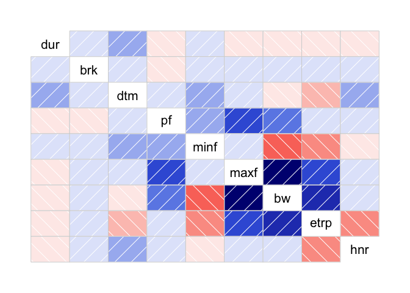
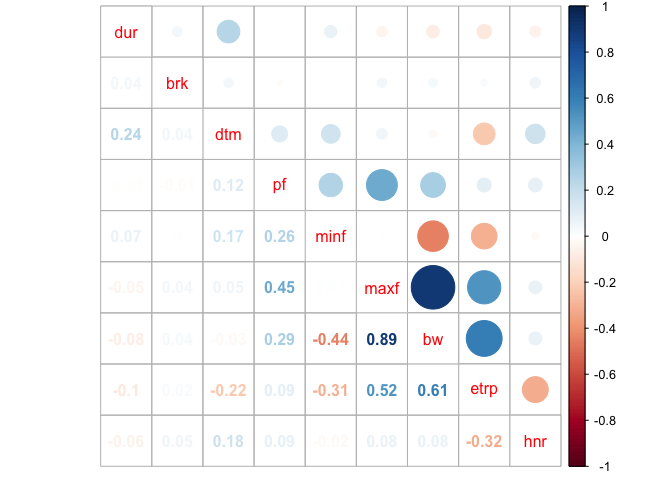
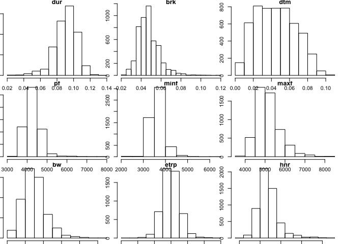
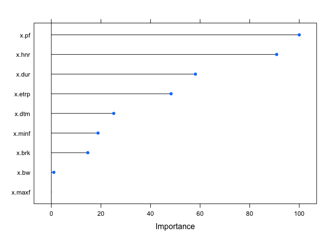
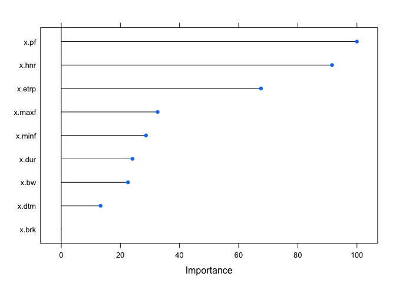
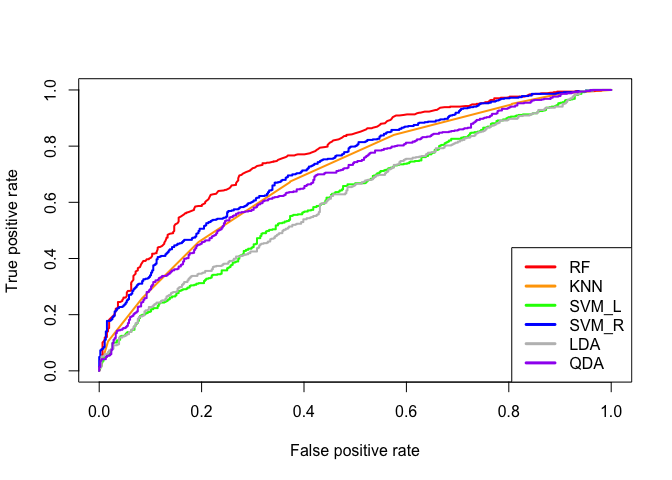
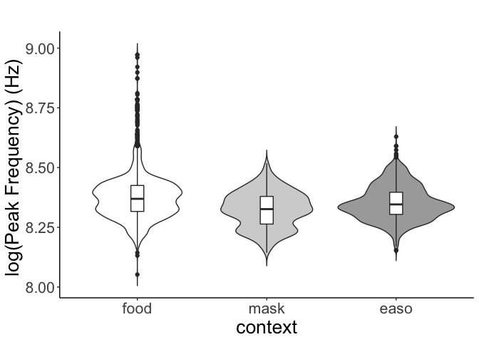
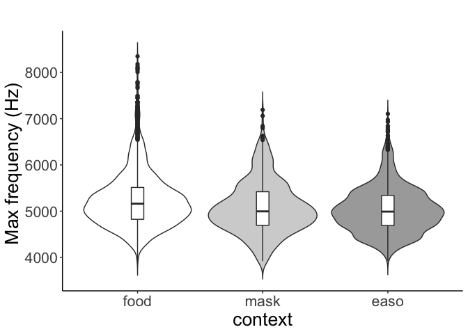
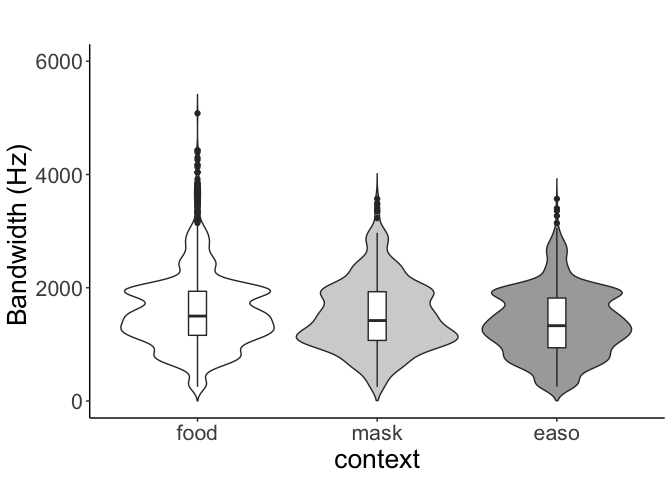

study1\_20200827
================

FIRST PART OF STUDY 1: Graded acoustic properties variation in D
notes

``` r
rdat=read.csv("~/Google Drive/UT/papers/Dissertation/study 1/analyses/graded D notes/graded_20200403.csv",header=T) #this is the one I fixed the site name problem

dat=rdat[,c(6,9:17,2,1)]

#changing non-numeric values into NAs and drop NAs
for(i in 1:10){
  dat[,i]=as.numeric(as.character(dat[,i]))
}
```

    ## Warning: NAs introduced by coercion

``` r
library(na.tools)
dat.omit=na.rm(dat)
unique(dat.omit$site)#checking all sites names
```

    ##  [1] AR1       AR2       C         ecabin    edam      esam      etea     
    ##  [8] F         I         J         K         N         O         UV1      
    ## [15] UV2       UV3       W1        WAR       wburries  wcabin    WCAMPING 
    ## [22] wchuck    wdump     wexercise ecamping 
    ## 25 Levels: AR1 AR2 C ecabin ecamping edam esam etea F I J K N O ... wexercise

``` r
#changing column names
names(dat.omit)[2]="dur"
names(dat.omit)[3]="brk"
names(dat.omit)[4]="dtm"
names(dat.omit)[5]="pf"
names(dat.omit)[6]="minf"
names(dat.omit)[7]="maxf"
names(dat.omit)[8]="bw"
names(dat.omit)[9]="etrp"
names(dat.omit)[10]="hnr"
```

1.2. Explore correlation between variables

``` r
dim(dat.omit)
```

    ## [1] 4851   12

``` r
library(corrplot)
```

    ## corrplot 0.84 loaded

``` r
library(corrgram)
```

    ## Registered S3 method overwritten by 'seriation':
    ##   method         from 
    ##   reorder.hclust gclus

``` r
corrplot.mixed(corrgram(dat.omit[,c(2:10)]))
```

<!-- --><!-- -->

``` r
cor(dat.omit[,c(2:10)])
```

    ##              dur          brk         dtm          pf         minf
    ## dur   1.00000000  0.043590856  0.24166888 -0.00812986  0.070888886
    ## brk   0.04359086  1.000000000  0.04027891 -0.01452259  0.000524669
    ## dtm   0.24166888  0.040278912  1.00000000  0.11953737  0.165242036
    ## pf   -0.00812986 -0.014522588  0.11953737  1.00000000  0.258613978
    ## minf  0.07088889  0.000524669  0.16524204  0.25861398  1.000000000
    ## maxf -0.04953671  0.041112488  0.05437065  0.44907835  0.006102067
    ## bw   -0.07573808  0.036142263 -0.02517418  0.28780251 -0.441053285
    ## etrp -0.09776880  0.020969843 -0.22328580  0.09227243 -0.309652999
    ## hnr  -0.05818169  0.052036861  0.17771654  0.08820366 -0.020497589
    ##              maxf          bw        etrp         hnr
    ## dur  -0.049536709 -0.07573808 -0.09776880 -0.05818169
    ## brk   0.041112488  0.03614226  0.02096984  0.05203686
    ## dtm   0.054370654 -0.02517418 -0.22328580  0.17771654
    ## pf    0.449078354  0.28780251  0.09227243  0.08820366
    ## minf  0.006102067 -0.44105328 -0.30965300 -0.02049759
    ## maxf  1.000000000  0.89474478  0.52026124  0.07797958
    ## bw    0.894744784  1.00000000  0.60508136  0.07927051
    ## etrp  0.520261240  0.60508136  1.00000000 -0.31556540
    ## hnr   0.077979580  0.07927051 -0.31556540  1.00000000

Histogram

``` r
cn=colnames(dat.omit[,2:10])
par(mfrow=c(3,3),mar=c(0.5,0.5,0.5,0.5))

for(i in 2:10){
  hist(dat[,i],main=cn[i-1])
}
```

<!-- -->

1.3 Classification: 3 contexts (food, mask, easo)

``` r
x=dat.omit[,c(2:10)]
y=dat.omit[,11]
head(x)
```

    ##     dur   brk   dtm   pf minf maxf   bw  etrp   hnr
    ## 1 0.111 0.063 0.018 4649 4134 4823  689 0.471 12.71
    ## 2 0.098 0.043 0.008 4571 4435 4780  344 0.455  8.32
    ## 3 0.111 0.058 0.014 4577 4091 6029 1938 0.571  8.60
    ## 4 0.100 0.052 0.068 4464 4349 7106 2756 0.528 12.45
    ## 5 0.108 0.078 0.031 4653 4134 6201 2067 0.526 12.43
    ## 6 0.111 0.055 0.017 4656 3703 6632 2928 0.581 13.20

``` r
dim(x)
```

    ## [1] 4851    9

``` r
#standardizing data
sx=scale(x,center=T, scale=T)
  


library(caret)  
```

    ## Loading required package: lattice

    ## 
    ## Attaching package: 'lattice'

    ## The following object is masked from 'package:corrgram':
    ## 
    ##     panel.fill

    ## Loading required package: ggplot2

``` r
library(MLeval)

#dividing training vs test data
set.seed(123)
test=sample(1:nrow(sx),0.2*nrow(sx)) #making train index
train=(-test)

traindat=data.frame(x=sx[train,],y=y[train])
testdat=data.frame(x=sx[test,],y=y[test])

#Cross validation (learned from https://stackoverflow.com/questions/33470373/applying-k-fold-cross-validation-model-using-caret-package)

# KNN
set.seed(123)
train_ctrl=trainControl(method="cv",number=10)
knn.cv=train(y~., data=traindat,trControl=train_ctrl,method="knn")
print(knn.cv)
```

    ## k-Nearest Neighbors 
    ## 
    ## 3881 samples
    ##    9 predictor
    ##    3 classes: 'easo', 'food', 'mask' 
    ## 
    ## No pre-processing
    ## Resampling: Cross-Validated (10 fold) 
    ## Summary of sample sizes: 3493, 3493, 3492, 3492, 3493, 3493, ... 
    ## Resampling results across tuning parameters:
    ## 
    ##   k  Accuracy   Kappa    
    ##   5  0.5668593  0.2776635
    ##   7  0.5807848  0.2901004
    ##   9  0.5869618  0.2981443
    ## 
    ## Accuracy was used to select the optimal model using the largest value.
    ## The final value used for the model was k = 9.

``` r
# Random Forest
set.seed(123)
train_ctrl=trainControl(method="cv",number=10)
rf.cv=train(y~., data=traindat,trControl=train_ctrl,method="rf")
print(rf.cv)
```

    ## Random Forest 
    ## 
    ## 3881 samples
    ##    9 predictor
    ##    3 classes: 'easo', 'food', 'mask' 
    ## 
    ## No pre-processing
    ## Resampling: Cross-Validated (10 fold) 
    ## Summary of sample sizes: 3493, 3493, 3492, 3492, 3493, 3493, ... 
    ## Resampling results across tuning parameters:
    ## 
    ##   mtry  Accuracy   Kappa    
    ##   2     0.6186470  0.3436492
    ##   5     0.6207095  0.3498375
    ##   9     0.6219962  0.3534278
    ## 
    ## Accuracy was used to select the optimal model using the largest value.
    ## The final value used for the model was mtry = 9.

``` r
plot(varImp(object=rf.cv)) #variable importance plot
```

<!-- -->

``` r
# SVM(Linear kernel)
set.seed(123)
svml.cv=train(y~., data=traindat,trControl=train_ctrl,method="svmLinear") #Q: Do I need to set a tune grid???
print(svml.cv)
```

    ## Support Vector Machines with Linear Kernel 
    ## 
    ## 3881 samples
    ##    9 predictor
    ##    3 classes: 'easo', 'food', 'mask' 
    ## 
    ## No pre-processing
    ## Resampling: Cross-Validated (10 fold) 
    ## Summary of sample sizes: 3493, 3493, 3492, 3492, 3493, 3493, ... 
    ## Resampling results:
    ## 
    ##   Accuracy   Kappa    
    ##   0.5093916  0.1122427
    ## 
    ## Tuning parameter 'C' was held constant at a value of 1

``` r
svml.pred=predict(svml.cv,testdat)

# SVM(radial kernel)
set.seed(123)
svmr.cv=train(y~., data=traindat,trControl=train_ctrl,method="svmRadial") #Q: Do I need to set a tune grid???
print(svmr.cv)
```

    ## Support Vector Machines with Radial Basis Function Kernel 
    ## 
    ## 3881 samples
    ##    9 predictor
    ##    3 classes: 'easo', 'food', 'mask' 
    ## 
    ## No pre-processing
    ## Resampling: Cross-Validated (10 fold) 
    ## Summary of sample sizes: 3493, 3493, 3492, 3492, 3493, 3493, ... 
    ## Resampling results across tuning parameters:
    ## 
    ##   C     Accuracy   Kappa    
    ##   0.25  0.5617014  0.2118962
    ##   0.50  0.5799924  0.2511376
    ##   1.00  0.5882372  0.2704485
    ## 
    ## Tuning parameter 'sigma' was held constant at a value of 0.1015378
    ## Accuracy was used to select the optimal model using the largest value.
    ## The final values used for the model were sigma = 0.1015378 and C = 1.

``` r
# LDA
set.seed(123)
lda.cv=train(y~., data=traindat,trControl=train_ctrl,method="lda") #Q: Do I need to set a tune grid???
print(lda.cv)
```

    ## Linear Discriminant Analysis 
    ## 
    ## 3881 samples
    ##    9 predictor
    ##    3 classes: 'easo', 'food', 'mask' 
    ## 
    ## No pre-processing
    ## Resampling: Cross-Validated (10 fold) 
    ## Summary of sample sizes: 3493, 3493, 3492, 3492, 3493, 3493, ... 
    ## Resampling results:
    ## 
    ##   Accuracy   Kappa    
    ##   0.5099131  0.1295403

``` r
#1.3.3 QDA
set.seed(123)
qda.cv=train(y~., data=traindat,trControl=train_ctrl,method="qda") #Q: Do I need to set a tune grid???
print(qda.cv)
```

    ## Quadratic Discriminant Analysis 
    ## 
    ## 3881 samples
    ##    9 predictor
    ##    3 classes: 'easo', 'food', 'mask' 
    ## 
    ## No pre-processing
    ## Resampling: Cross-Validated (10 fold) 
    ## Summary of sample sizes: 3493, 3493, 3492, 3492, 3493, 3493, ... 
    ## Resampling results:
    ## 
    ##   Accuracy   Kappa    
    ##   0.5356731  0.2148752

Classifying 2 contexts: Pred (Lumping easo and mask together) vs Food

``` r
y=gsub("easo","pred",y)
y=gsub("mask","pred",y)

traindat$y=gsub("easo","pred",traindat$y)
traindat$y=gsub("mask","pred",traindat$y)
testdat$y=gsub("easo","pred",testdat$y)
testdat$y=gsub("mask","pred",testdat$y)
two_context_dat=rbind(testdat,traindat)
```

``` r
set.seed(123)
#dividing training vs test data
test=sample(1:nrow(sx),0.2*nrow(sx)) #making train index. Spliltting training and testdata to 80% and 20% ratio, respectively.
train=(-test)

traindat=data.frame(x=sx[train,],y=y[train])
testdat=data.frame(x=sx[test,],y=y[test])

#Cross validation (copied from https://stackoverflow.com/questions/33470373/applying-k-fold-cross-validation-model-using-caret-package)

# KNN
set.seed(123)
train_ctrl=trainControl(method="cv",number=10)
knn.cv=train(y~., data=traindat,trControl=train_ctrl,method="knn")
print(knn.cv)
```

    ## k-Nearest Neighbors 
    ## 
    ## 3881 samples
    ##    9 predictor
    ##    2 classes: 'food', 'pred' 
    ## 
    ## No pre-processing
    ## Resampling: Cross-Validated (10 fold) 
    ## Summary of sample sizes: 3492, 3493, 3493, 3494, 3493, 3494, ... 
    ## Resampling results across tuning parameters:
    ## 
    ##   k  Accuracy   Kappa    
    ##   5  0.6289444  0.2554449
    ##   7  0.6335803  0.2651871
    ##   9  0.6305061  0.2586532
    ## 
    ## Accuracy was used to select the optimal model using the largest value.
    ## The final value used for the model was k = 7.

``` r
knn.pred=predict(knn.cv,testdat)
confusionMatrix(as.factor(knn.pred),as.factor(y[test]))
```

    ## Confusion Matrix and Statistics
    ## 
    ##           Reference
    ## Prediction food pred
    ##       food  291  166
    ##       pred  173  340
    ##                                           
    ##                Accuracy : 0.6505          
    ##                  95% CI : (0.6196, 0.6805)
    ##     No Information Rate : 0.5216          
    ##     P-Value [Acc > NIR] : 3.308e-16       
    ##                                           
    ##                   Kappa : 0.2993          
    ##                                           
    ##  Mcnemar's Test P-Value : 0.7445          
    ##                                           
    ##             Sensitivity : 0.6272          
    ##             Specificity : 0.6719          
    ##          Pos Pred Value : 0.6368          
    ##          Neg Pred Value : 0.6628          
    ##              Prevalence : 0.4784          
    ##          Detection Rate : 0.3000          
    ##    Detection Prevalence : 0.4711          
    ##       Balanced Accuracy : 0.6495          
    ##                                           
    ##        'Positive' Class : food            
    ## 

``` r
# Random Forest
set.seed(123)
train_ctrl=trainControl(method="cv",number=10)
rf.cv=train(y~., data=traindat,trControl=train_ctrl,method="rf")
print(rf.cv)
```

    ## Random Forest 
    ## 
    ## 3881 samples
    ##    9 predictor
    ##    2 classes: 'food', 'pred' 
    ## 
    ## No pre-processing
    ## Resampling: Cross-Validated (10 fold) 
    ## Summary of sample sizes: 3492, 3493, 3493, 3494, 3493, 3494, ... 
    ## Resampling results across tuning parameters:
    ## 
    ##   mtry  Accuracy   Kappa    
    ##   2     0.6727783  0.3412457
    ##   5     0.6709735  0.3381713
    ##   9     0.6717487  0.3397074
    ## 
    ## Accuracy was used to select the optimal model using the largest value.
    ## The final value used for the model was mtry = 2.

``` r
rf.pred=predict(rf.cv,testdat)
confusionMatrix(as.factor(rf.pred),as.factor(y[test]))
```

    ## Confusion Matrix and Statistics
    ## 
    ##           Reference
    ## Prediction food pred
    ##       food  315  132
    ##       pred  149  374
    ##                                           
    ##                Accuracy : 0.7103          
    ##                  95% CI : (0.6806, 0.7387)
    ##     No Information Rate : 0.5216          
    ##     P-Value [Acc > NIR] : <2e-16          
    ##                                           
    ##                   Kappa : 0.4186          
    ##                                           
    ##  Mcnemar's Test P-Value : 0.3398          
    ##                                           
    ##             Sensitivity : 0.6789          
    ##             Specificity : 0.7391          
    ##          Pos Pred Value : 0.7047          
    ##          Neg Pred Value : 0.7151          
    ##              Prevalence : 0.4784          
    ##          Detection Rate : 0.3247          
    ##    Detection Prevalence : 0.4608          
    ##       Balanced Accuracy : 0.7090          
    ##                                           
    ##        'Positive' Class : food            
    ## 

``` r
plot(varImp(object=rf.cv))
```

<!-- -->

``` r
# SVM(Linear)
set.seed(123)
train_ctrl=trainControl(method="cv",number=10,classProbs=TRUE)
svml.cv=train(y~., data=traindat,trControl=train_ctrl,method="svmLinear") 
svml.pred=predict(svml.cv,testdat)
print(svml.cv)
```

    ## Support Vector Machines with Linear Kernel 
    ## 
    ## 3881 samples
    ##    9 predictor
    ##    2 classes: 'food', 'pred' 
    ## 
    ## No pre-processing
    ## Resampling: Cross-Validated (10 fold) 
    ## Summary of sample sizes: 3492, 3493, 3493, 3494, 3493, 3494, ... 
    ## Resampling results:
    ## 
    ##   Accuracy   Kappa    
    ##   0.5877132  0.1596923
    ## 
    ## Tuning parameter 'C' was held constant at a value of 1

``` r
confusionMatrix(as.factor(svml.pred),as.factor(y[test]))
```

    ## Confusion Matrix and Statistics
    ## 
    ##           Reference
    ## Prediction food pred
    ##       food  203  144
    ##       pred  261  362
    ##                                           
    ##                Accuracy : 0.5825          
    ##                  95% CI : (0.5507, 0.6137)
    ##     No Information Rate : 0.5216          
    ##     P-Value [Acc > NIR] : 8.143e-05       
    ##                                           
    ##                   Kappa : 0.1545          
    ##                                           
    ##  Mcnemar's Test P-Value : 8.210e-09       
    ##                                           
    ##             Sensitivity : 0.4375          
    ##             Specificity : 0.7154          
    ##          Pos Pred Value : 0.5850          
    ##          Neg Pred Value : 0.5811          
    ##              Prevalence : 0.4784          
    ##          Detection Rate : 0.2093          
    ##    Detection Prevalence : 0.3577          
    ##       Balanced Accuracy : 0.5765          
    ##                                           
    ##        'Positive' Class : food            
    ## 

``` r
# SVM(radial)
set.seed(123)
train_ctrl=trainControl(method="cv",number=10,classProbs=TRUE)
svmr.cv=train(y~., data=traindat,trControl=train_ctrl,method="svmRadial") 
print(svmr.cv)
```

    ## Support Vector Machines with Radial Basis Function Kernel 
    ## 
    ## 3881 samples
    ##    9 predictor
    ##    2 classes: 'food', 'pred' 
    ## 
    ## No pre-processing
    ## Resampling: Cross-Validated (10 fold) 
    ## Summary of sample sizes: 3492, 3493, 3493, 3494, 3493, 3494, ... 
    ## Resampling results across tuning parameters:
    ## 
    ##   C     Accuracy   Kappa    
    ##   0.25  0.6330874  0.2624166
    ##   0.50  0.6410864  0.2797586
    ##   1.00  0.6449431  0.2884197
    ## 
    ## Tuning parameter 'sigma' was held constant at a value of 0.1015378
    ## Accuracy was used to select the optimal model using the largest value.
    ## The final values used for the model were sigma = 0.1015378 and C = 1.

``` r
svmr.pred=predict(svmr.cv,testdat)
confusionMatrix(as.factor(svmr.pred),as.factor(y[test]))
```

    ## Confusion Matrix and Statistics
    ## 
    ##           Reference
    ## Prediction food pred
    ##       food  293  156
    ##       pred  171  350
    ##                                           
    ##                Accuracy : 0.6629          
    ##                  95% CI : (0.6322, 0.6926)
    ##     No Information Rate : 0.5216          
    ##     P-Value [Acc > NIR] : <2e-16          
    ##                                           
    ##                   Kappa : 0.3236          
    ##                                           
    ##  Mcnemar's Test P-Value : 0.4388          
    ##                                           
    ##             Sensitivity : 0.6315          
    ##             Specificity : 0.6917          
    ##          Pos Pred Value : 0.6526          
    ##          Neg Pred Value : 0.6718          
    ##              Prevalence : 0.4784          
    ##          Detection Rate : 0.3021          
    ##    Detection Prevalence : 0.4629          
    ##       Balanced Accuracy : 0.6616          
    ##                                           
    ##        'Positive' Class : food            
    ## 

``` r
# LDA
set.seed(123)
lda.cv=train(y~., data=traindat,trControl=train_ctrl,method="lda")
print(lda.cv)
```

    ## Linear Discriminant Analysis 
    ## 
    ## 3881 samples
    ##    9 predictor
    ##    2 classes: 'food', 'pred' 
    ## 
    ## No pre-processing
    ## Resampling: Cross-Validated (10 fold) 
    ## Summary of sample sizes: 3492, 3493, 3493, 3494, 3493, 3494, ... 
    ## Resampling results:
    ## 
    ##   Accuracy   Kappa    
    ##   0.5848788  0.1539434

``` r
lda.pred=predict(lda.cv,testdat)
confusionMatrix(as.factor(lda.pred),as.factor(y[test]))
```

    ## Confusion Matrix and Statistics
    ## 
    ##           Reference
    ## Prediction food pred
    ##       food  197  140
    ##       pred  267  366
    ##                                           
    ##                Accuracy : 0.5804          
    ##                  95% CI : (0.5486, 0.6117)
    ##     No Information Rate : 0.5216          
    ##     P-Value [Acc > NIR] : 0.0001357       
    ##                                           
    ##                   Kappa : 0.1496          
    ##                                           
    ##  Mcnemar's Test P-Value : 4.222e-10       
    ##                                           
    ##             Sensitivity : 0.4246          
    ##             Specificity : 0.7233          
    ##          Pos Pred Value : 0.5846          
    ##          Neg Pred Value : 0.5782          
    ##              Prevalence : 0.4784          
    ##          Detection Rate : 0.2031          
    ##    Detection Prevalence : 0.3474          
    ##       Balanced Accuracy : 0.5739          
    ##                                           
    ##        'Positive' Class : food            
    ## 

``` r
# QDA
set.seed(123)
qda.cv=train(y~., data=traindat,trControl=train_ctrl,method="qda") 
print(qda.cv)
```

    ## Quadratic Discriminant Analysis 
    ## 
    ## 3881 samples
    ##    9 predictor
    ##    2 classes: 'food', 'pred' 
    ## 
    ## No pre-processing
    ## Resampling: Cross-Validated (10 fold) 
    ## Summary of sample sizes: 3492, 3493, 3493, 3494, 3493, 3494, ... 
    ## Resampling results:
    ## 
    ##   Accuracy   Kappa    
    ##   0.6078316  0.2039154

``` r
qda.pred=predict(qda.cv,testdat)
confusionMatrix(as.factor(qda.pred),as.factor(y[test]))
```

    ## Confusion Matrix and Statistics
    ## 
    ##           Reference
    ## Prediction food pred
    ##       food  230  130
    ##       pred  234  376
    ##                                           
    ##                Accuracy : 0.6247          
    ##                  95% CI : (0.5934, 0.6553)
    ##     No Information Rate : 0.5216          
    ##     P-Value [Acc > NIR] : 6.099e-11       
    ##                                           
    ##                   Kappa : 0.241           
    ##                                           
    ##  Mcnemar's Test P-Value : 6.714e-08       
    ##                                           
    ##             Sensitivity : 0.4957          
    ##             Specificity : 0.7431          
    ##          Pos Pred Value : 0.6389          
    ##          Neg Pred Value : 0.6164          
    ##              Prevalence : 0.4784          
    ##          Detection Rate : 0.2371          
    ##    Detection Prevalence : 0.3711          
    ##       Balanced Accuracy : 0.6194          
    ##                                           
    ##        'Positive' Class : food            
    ## 

``` r
#ROC curve

library(ROCR)
```

    ## Loading required package: gplots

    ## 
    ## Attaching package: 'gplots'

    ## The following object is masked from 'package:stats':
    ## 
    ##     lowess

``` r
pred.knn=predict(knn.cv,testdat,type='prob')
pred.rf=predict(rf.cv,testdat,type="prob")
pred.svml=predict(svml.cv,testdat,type='prob')
pred.svmr=predict(svmr.cv,testdat,type="prob")
pred.lda=predict(lda.cv,testdat,type="prob")
pred.qda=predict(qda.cv,testdat,type="prob")

pred.knn1=prediction(pred.knn[,2],testdat$y)
pred.rf1=prediction(pred.rf[,2],testdat$y)
pred.svml1=prediction(pred.svml[,2],testdat$y)
pred.svmr1=prediction(pred.svmr[,2],testdat$y)
pred.lda1=prediction(pred.lda[,2],testdat$y)
pred.qda1=prediction(pred.qda[,2],testdat$y)


roc.knn=performance(pred.knn1,"tpr","fpr")
roc.rf=performance(pred.rf1,"tpr","fpr")
roc.svml=performance(pred.svml1,"tpr","fpr")
roc.svmr=performance(pred.svmr1,"tpr","fpr")
roc.lda=performance(pred.lda1,"tpr","fpr")
roc.qda=performance(pred.qda1,"tpr","fpr")


plot(roc.knn,col="orange",lwd=2)
plot(roc.rf,add = T,col="red",lwd=2)
plot(roc.svml,add=T,col="green",lwd=2)
plot(roc.svmr,add=T,col="blue",lwd=2)
plot(roc.lda,add=T,col="grey",lwd=2)
plot(roc.qda,add=T,col="purple",lwd=2)
legend("bottomright",legend=c("RF","KNN","SVM_L","SVM_R","LDA","QDA"),col=c("red","orange","green","blue","grey","purple"),lty=1,lwd=3,cex=1)
```

<!-- -->

Linear mixed models

``` r
#####   lmerTest for 3 contexts
library(lmerTest)
```

    ## Loading required package: lme4

    ## Loading required package: Matrix

    ## 
    ## Attaching package: 'lmerTest'

    ## The following object is masked from 'package:lme4':
    ## 
    ##     lmer

    ## The following object is masked from 'package:stats':
    ## 
    ##     step

``` r
library(emmeans)
```

    ## Welcome to emmeans.
    ## NOTE -- Important change from versions <= 1.41:
    ##     Indicator predictors are now treated as 2-level factors by default.
    ##     To revert to old behavior, use emm_options(cov.keep = character(0))

``` r
# Testing if "duration" of D notes are associated with contexts (3 levels: food and 2 predators)
m1 = lmer(dur~context+(1|site/context),data=dat.omit)

# Testing if "break" (i.e. inter-note interval) of D notes are associated with contexts (3 levels: food and 2 predators)
m2 = lmer(brk~context+(1|site/context),data=dat.omit)

# Testing if "break" (i.e. inter-note interval) of D notes are associated with contexts (3 levels: food and 2 predators)
# m3 <- lmer(dtm~context+(1|site/context),data=dat.omit)#convergence error
m3 <- lmer(dtm~context+(1|site/context),data=dat.omit,control = lmerControl(optimizer = "Nelder_Mead"))#solved: convergence warning)

#Testing if "peak frequency" of D notes are associated with contexts (3 levels: food and 2 predators)
m4 = lmer(pf~context+(1|site/context),data=dat.omit)

# Testing if "minimum frequency" of D notes are associated with contexts (3 levels: food and 2 predators)
m5 = lmer(minf~context+(1|site/context),data=dat.omit)

# Testing if "maximum frequency" of D notes are associated with contexts (3 levels: food and 2 predators)
#m6 <- lmer(maxf~context+(1|site/context),data=dat.omit) #x converge
m6 <- lmer(maxf~context+(1|site/context),data=dat.omit,control = lmerControl(optimizer = "Nelder_Mead"))

# Testing if "bandwidth" of D notes are associated with contexts (3 levels: food and 2 predators)
m7 = lmer(bw~context+(1|site/context),data=dat.omit)

# Testing if "entropy" of D notes are associated with contexts (3 levels: food and 2 predators)
m8 = lmer(etrp~context+(1|site/context),data=dat.omit)

# Testing if "harmonic-to-noise ratio" of D notes are associated with contexts (3 levels: food and 2 predators)
m9 = lmer(hnr~context+(1|site/context),data=dat.omit)

#Testing Assumption of lmer 1: residual normality in lmer models
shapiro.test(resid(m1))
```

    ## 
    ##  Shapiro-Wilk normality test
    ## 
    ## data:  resid(m1)
    ## W = 0.97305, p-value < 2.2e-16

``` r
shapiro.test(resid(m2))
```

    ## 
    ##  Shapiro-Wilk normality test
    ## 
    ## data:  resid(m2)
    ## W = 0.94062, p-value < 2.2e-16

``` r
shapiro.test(resid(m3))
```

    ## 
    ##  Shapiro-Wilk normality test
    ## 
    ## data:  resid(m3)
    ## W = 0.99321, p-value = 1.938e-14

``` r
shapiro.test(resid(m4))
```

    ## 
    ##  Shapiro-Wilk normality test
    ## 
    ## data:  resid(m4)
    ## W = 0.87196, p-value < 2.2e-16

``` r
shapiro.test(resid(m5))
```

    ## 
    ##  Shapiro-Wilk normality test
    ## 
    ## data:  resid(m5)
    ## W = 0.9446, p-value < 2.2e-16

``` r
shapiro.test(resid(m6))
```

    ## 
    ##  Shapiro-Wilk normality test
    ## 
    ## data:  resid(m6)
    ## W = 0.95412, p-value < 2.2e-16

``` r
shapiro.test(resid(m7))
```

    ## 
    ##  Shapiro-Wilk normality test
    ## 
    ## data:  resid(m7)
    ## W = 0.97745, p-value < 2.2e-16

``` r
shapiro.test(resid(m8))
```

    ## 
    ##  Shapiro-Wilk normality test
    ## 
    ## data:  resid(m8)
    ## W = 0.99043, p-value < 2.2e-16

``` r
shapiro.test(resid(m9))
```

    ## 
    ##  Shapiro-Wilk normality test
    ## 
    ## data:  resid(m9)
    ## W = 0.95541, p-value < 2.2e-16

``` r
#except W = 0.87196 in m4, all exceeds >0.9.
#log transformed pf in m4, and now W > 0.9.
m4_1 = lmer(log(pf)~context+(1|site/context),data=dat.omit)
shapiro.test(resid(m4_1))
```

    ## 
    ##  Shapiro-Wilk normality test
    ## 
    ## data:  resid(m4_1)
    ## W = 0.93196, p-value < 2.2e-16

``` r
#seeign all results
anova(m1) #NS
```

    ## Type III Analysis of Variance Table with Satterthwaite's method
    ##            Sum Sq    Mean Sq NumDF  DenDF F value Pr(>F)
    ## context 0.0003349 0.00016745     2 40.199   1.926 0.1589

``` r
anova(m2) #NS
```

    ## Type III Analysis of Variance Table with Satterthwaite's method
    ##             Sum Sq    Mean Sq NumDF  DenDF F value Pr(>F)
    ## context 4.5097e-05 2.2548e-05     2 38.141  0.2549 0.7763

``` r
anova(m3) #NS
```

    ## Type III Analysis of Variance Table with Satterthwaite's method
    ##             Sum Sq   Mean Sq NumDF  DenDF F value Pr(>F)
    ## context 2.3441e-05 1.172e-05     2 37.833  0.0313 0.9692

``` r
anova(m4_1)#significant => run emmans() for post-hoc test
```

    ## Type III Analysis of Variance Table with Satterthwaite's method
    ##           Sum Sq Mean Sq NumDF  DenDF F value  Pr(>F)  
    ## context 0.029159 0.01458     2 40.252  2.6596 0.08225 .
    ## ---
    ## Signif. codes:  0 '***' 0.001 '**' 0.01 '*' 0.05 '.' 0.1 ' ' 1

``` r
anova(m5)#NS
```

    ## Type III Analysis of Variance Table with Satterthwaite's method
    ##         Sum Sq Mean Sq NumDF  DenDF F value Pr(>F)
    ## context  91905   45953     2 41.324  0.7241 0.4908

``` r
anova(m6)#significant => run emmans() for post-hoc test
```

    ## Type III Analysis of Variance Table with Satterthwaite's method
    ##          Sum Sq Mean Sq NumDF  DenDF F value   Pr(>F)   
    ## context 2997437 1498719     2 34.233  6.0317 0.005702 **
    ## ---
    ## Signif. codes:  0 '***' 0.001 '**' 0.01 '*' 0.05 '.' 0.1 ' ' 1

``` r
anova(m7)#significant => run emmans() for post-hoc test
```

    ## Type III Analysis of Variance Table with Satterthwaite's method
    ##          Sum Sq Mean Sq NumDF  DenDF F value   Pr(>F)   
    ## context 3571757 1785879     2 34.545  5.5248 0.008283 **
    ## ---
    ## Signif. codes:  0 '***' 0.001 '**' 0.01 '*' 0.05 '.' 0.1 ' ' 1

``` r
anova(m8)#significant => run emmans() for post-hoc test
```

    ## Type III Analysis of Variance Table with Satterthwaite's method
    ##            Sum Sq   Mean Sq NumDF  DenDF F value Pr(>F)
    ## context 0.0094616 0.0047308     2 42.447  2.4107 0.1019

``` r
anova(m9) #NS
```

    ## Type III Analysis of Variance Table with Satterthwaite's method
    ##          Sum Sq Mean Sq NumDF  DenDF F value Pr(>F)
    ## context 0.75382 0.37691     2 46.121  0.0946 0.9099

``` r
#post-hoc tests
emm4=emmeans(m4_1,specs=pairwise~context,adjust="none") 
```

    ## Note: D.f. calculations have been disabled because the number of observations exceeds 3000.
    ## To enable adjustments, add the argument 'pbkrtest.limit = 4851' (or larger)
    ## [or, globally, 'set emm_options(pbkrtest.limit = 4851)' or larger];
    ## but be warned that this may result in large computation time and memory use.

    ## Note: D.f. calculations have been disabled because the number of observations exceeds 3000.
    ## To enable adjustments, add the argument 'lmerTest.limit = 4851' (or larger)
    ## [or, globally, 'set emm_options(lmerTest.limit = 4851)' or larger];
    ## but be warned that this may result in large computation time and memory use.

``` r
emm4
```

    ## $emmeans
    ##  context emmean       SE  df asymp.LCL asymp.UCL
    ##  easo     8.352 0.008882 Inf     8.334     8.369
    ##  food     8.368 0.009068 Inf     8.351     8.386
    ##  mask     8.346 0.010169 Inf     8.326     8.366
    ## 
    ## Degrees-of-freedom method: asymptotic 
    ## Results are given on the log (not the response) scale. 
    ## Confidence level used: 0.95 
    ## 
    ## $contrasts
    ##  contrast    estimate     SE  df z.ratio p.value
    ##  easo - food -0.01662 0.0095 Inf -1.749  0.0802 
    ##  easo - mask  0.00595 0.0105 Inf  0.569  0.5694 
    ##  food - mask  0.02257 0.0106 Inf  2.139  0.0325 
    ## 
    ## Degrees-of-freedom method: asymptotic 
    ## Results are given on the log (not the response) scale.

``` r
emm6=emmeans(m6,specs=pairwise~context,adjust="none") 
```

    ## Note: D.f. calculations have been disabled because the number of observations exceeds 3000.
    ## To enable adjustments, add the argument 'pbkrtest.limit = 4851' (or larger)
    ## [or, globally, 'set emm_options(pbkrtest.limit = 4851)' or larger];
    ## but be warned that this may result in large computation time and memory use.
    ## Note: D.f. calculations have been disabled because the number of observations exceeds 3000.
    ## To enable adjustments, add the argument 'lmerTest.limit = 4851' (or larger)
    ## [or, globally, 'set emm_options(lmerTest.limit = 4851)' or larger];
    ## but be warned that this may result in large computation time and memory use.

``` r
emm6
```

    ## $emmeans
    ##  context emmean   SE  df asymp.LCL asymp.UCL
    ##  easo      5051 59.3 Inf      4935      5167
    ##  food      5231 60.0 Inf      5114      5349
    ##  mask      5180 66.1 Inf      5051      5310
    ## 
    ## Degrees-of-freedom method: asymptotic 
    ## Confidence level used: 0.95 
    ## 
    ## $contrasts
    ##  contrast    estimate   SE  df z.ratio p.value
    ##  easo - food   -180.0 53.1 Inf -3.390  0.0007 
    ##  easo - mask   -129.1 59.2 Inf -2.181  0.0292 
    ##  food - mask     50.9 59.4 Inf  0.856  0.3919 
    ## 
    ## Degrees-of-freedom method: asymptotic

``` r
emm7=emmeans(m7,specs=pairwise~context,adjust="none") 
```

    ## Note: D.f. calculations have been disabled because the number of observations exceeds 3000.
    ## To enable adjustments, add the argument 'pbkrtest.limit = 4851' (or larger)
    ## [or, globally, 'set emm_options(pbkrtest.limit = 4851)' or larger];
    ## but be warned that this may result in large computation time and memory use.
    ## Note: D.f. calculations have been disabled because the number of observations exceeds 3000.
    ## To enable adjustments, add the argument 'lmerTest.limit = 4851' (or larger)
    ## [or, globally, 'set emm_options(lmerTest.limit = 4851)' or larger];
    ## but be warned that this may result in large computation time and memory use.

``` r
emm7
```

    ## $emmeans
    ##  context emmean   SE  df asymp.LCL asymp.UCL
    ##  easo      1405 61.4 Inf      1285      1526
    ##  food      1606 62.5 Inf      1484      1729
    ##  mask      1581 70.5 Inf      1443      1719
    ## 
    ## Degrees-of-freedom method: asymptotic 
    ## Confidence level used: 0.95 
    ## 
    ## $contrasts
    ##  contrast    estimate   SE  df z.ratio p.value
    ##  easo - food   -201.0 64.7 Inf -3.105  0.0019 
    ##  easo - mask   -175.4 71.9 Inf -2.441  0.0147 
    ##  food - mask     25.7 72.3 Inf  0.355  0.7226 
    ## 
    ## Degrees-of-freedom method: asymptotic

``` r
emm8=emmeans(m8,specs=pairwise~context,adjust="none") 
```

    ## Note: D.f. calculations have been disabled because the number of observations exceeds 3000.
    ## To enable adjustments, add the argument 'pbkrtest.limit = 4851' (or larger)
    ## [or, globally, 'set emm_options(pbkrtest.limit = 4851)' or larger];
    ## but be warned that this may result in large computation time and memory use.
    ## Note: D.f. calculations have been disabled because the number of observations exceeds 3000.
    ## To enable adjustments, add the argument 'lmerTest.limit = 4851' (or larger)
    ## [or, globally, 'set emm_options(lmerTest.limit = 4851)' or larger];
    ## but be warned that this may result in large computation time and memory use.

``` r
emm8
```

    ## $emmeans
    ##  context emmean      SE  df asymp.LCL asymp.UCL
    ##  easo     0.494 0.00520 Inf     0.484     0.504
    ##  food     0.505 0.00532 Inf     0.495     0.515
    ##  mask     0.506 0.00602 Inf     0.494     0.518
    ## 
    ## Degrees-of-freedom method: asymptotic 
    ## Confidence level used: 0.95 
    ## 
    ## $contrasts
    ##  contrast    estimate      SE  df z.ratio p.value
    ##  easo - food -0.01098 0.00592 Inf -1.856  0.0635 
    ##  easo - mask -0.01221 0.00650 Inf -1.877  0.0606 
    ##  food - mask -0.00122 0.00657 Inf -0.186  0.8523 
    ## 
    ## Degrees-of-freedom method: asymptotic

``` r
dat.omit$context = factor(dat.omit$context,levels(dat.omit$context)[c(2,3,1)])

library(ggplot2)
  p=ggplot(dat.omit,aes(x=context,y=log(pf),fill=context))+
  geom_violin(trim=F)+
  geom_boxplot(width=0.1,fill="white")+
  theme_classic()+
  labs(title="",x="context", y = "log(Peak Frequency) (Hz) ") +
  theme(legend.position="none")+
  theme(text = element_text(size=20))
  cp=p+scale_fill_manual(values=c("white", "lightgrey", "darkgrey"))
cp
```

<!-- -->

``` r
library(ggplot2)
  p=ggplot(dat.omit,aes(x=context,y=maxf,fill=context))+
  geom_violin(trim=F)+
  geom_boxplot(width=0.1,fill="white")+
  theme_classic()+
  labs(title="",x="context", y = "Max frequency (Hz) ") +
  theme(legend.position="none")+
  theme(text = element_text(size=20))
  cp=p+scale_fill_manual(values=c("white", "lightgrey", "darkgrey"))
cp
```

<!-- -->

``` r
  p=ggplot(dat.omit,aes(x=context,y=bw,fill=context))+
  geom_violin(trim=F)+
  geom_boxplot(width=0.1,fill="white")+
  theme_classic()+
  labs(title="",x="context", y = "Bandwidth (Hz) ") +
  theme(legend.position="none")+
  theme(text = element_text(size=20))+
  ylim(0,6000)
  cp=p+scale_fill_manual(values=c("white", "lightgrey", "darkgrey"))
cp
```

    ## Warning: Removed 46 rows containing missing values (geom_violin).

<!-- -->

``` r
dat=read.csv("~/Google Drive/UT/papers/Dissertation/study 1/analyses/number of D notes/Dcounts.csv",header=T)

unique(dat$site)
```

    ##  [1] AR1      AR2      C        ecabin   esam     etea     F       
    ##  [8] I        J        K        O        UV1      UV3      W1      
    ## [15] WAR      Wcamping wchuck  
    ## 17 Levels: AR1 AR2 C ecabin esam etea F I J K O UV1 UV3 W1 ... wchuck

``` r
dat$context=reorder(dat$context,new.order=c("food","mask","easo")) 
```

SECOND PART OF STUDY 1: The number of D notes (Repetition rate analyses)

I was recommended to use either lmerTest and glmmTMB rather than using
glmer.nb. They compared AIC/BIC in lmerTest and glmmTMB results but
there was no big differences.

I used glmmTMB with (1|site/contexts) as a random effect
(1|site/context) is the same as this one (1|site)+(1|site:context)

``` r
library("glmmTMB")
library("emmeans")
```

For random effects, I used 1/sites instead of 1|site/contexts because
replicates are taken in “sites”, not in the “contexts in sites”.
(i.e. Only 1 measurement in a site and context) I don’t have sampling
in the context, unlike in the graded D notes analyses. If I measured \#
of D notes in AR1 at EASO contexts for 10 times, then it will be
replicates and would have required (1|site/contexts)

Note to myself: How to choose the correct error term? Search the folder
in google drive, “choosing\_correct\_error\_term”.
Since

``` r
glmer.nb.fit=glmmTMB(Dnotes~context+offset(log(time))+(1|site),family=nbinom2(link = "log"),data=dat,verbose=TRUE)
```

    ## Constructing atomic invpd
    ## Constructing atomic log_dnbinom_robust
    ## Constructing atomic invpd
    ## Constructing atomic log_dnbinom_robust
    ## Constructing atomic invpd
    ## Constructing atomic log_dnbinom_robust
    ## Optimizing tape... Done
    ## iter: 1  value: 697.6334 mgc: 163.172 ustep: 1 
    ## iter: 2  value: 469.0182 mgc: 54.56751 ustep: 1 
    ## iter: 3  value: 421.2858 mgc: 18.02004 ustep: 1 
    ## iter: 4  value: 416.1769 mgc: 5.040624 ustep: 1 
    ## iter: 5  value: 416.0461 mgc: 0.8448461 ustep: 1 
    ## iter: 6  value: 416.0459 mgc: 0.03682471 ustep: 1 
    ## iter: 7  value: 416.0459 mgc: 7.806697e-05 ustep: 1 
    ## iter: 8  mgc: 3.527485e-10 
    ## iter: 1  mgc: 3.527485e-10 
    ## Matching hessian patterns... Done
    ## outer mgc:  111.3051 
    ## iter: 1  value: 366.6351 mgc: 0.6123481 ustep: 1 
    ## iter: 2  value: 366.6334 mgc: 0.06931828 ustep: 1 
    ## iter: 3  value: 366.6334 mgc: 0.0006659778 ustep: 1 
    ## iter: 4  value: 366.6334 mgc: 6.307664e-08 ustep: 1 
    ## iter: 5  mgc: 1.305622e-13 
    ## iter: 1  mgc: 1.305622e-13 
    ## outer mgc:  12.11657 
    ## iter: 1  value: 355.7398 mgc: 3.212005 ustep: 1 
    ## iter: 2  value: 350.3892 mgc: 3.787666 ustep: 1 
    ## iter: 3  value: 350.2544 mgc: 0.6819464 ustep: 1 
    ## iter: 4  value: 350.2542 mgc: 0.03667549 ustep: 1 
    ## iter: 5  value: 350.2542 mgc: 0.0001226484 ustep: 1 
    ## iter: 6  mgc: 1.383787e-09 
    ## iter: 1  value: 445.1575 mgc: 10.79044 ustep: 1 
    ## iter: 2  value: 360.1867 mgc: 39.23485 ustep: 1 
    ## iter: 3  value: 352.5257 mgc: 10.78782 ustep: 1 
    ## iter: 4  value: 352.3251 mgc: 1.953191 ustep: 1 
    ## iter: 5  value: 352.3246 mgc: 0.1091085 ustep: 1 
    ## iter: 6  value: 352.3246 mgc: 0.0003976445 ustep: 1 
    ## iter: 7  mgc: 5.334172e-09 
    ## iter: 1  mgc: 1.383787e-09 
    ## outer mgc:  8.771255 
    ## iter: 1  value: 351.6732 mgc: 4.026493 ustep: 1 
    ## iter: 2  value: 338.6236 mgc: 5.503578 ustep: 1 
    ## iter: 3  value: 338.1026 mgc: 1.097627 ustep: 1 
    ## iter: 4  value: 338.1009 mgc: 0.07610858 ustep: 1 
    ## iter: 5  value: 338.1009 mgc: 0.0004405977 ustep: 1 
    ## iter: 6  value: 338.1009 mgc: 1.499129e-08 ustep: 1 
    ## mgc: 1.063039e-13 
    ## iter: 1  value: 494.1765 mgc: 9.336946 ustep: 0.8994163 
    ## iter: 2  value: 383.2416 mgc: 26.11328 ustep: 0.9483808 
    ## iter: 3  value: 368.3319 mgc: 7.885914 ustep: 0.973851 
    ## iter: 4  value: 367.7565 mgc: 1.611904 ustep: 0.9868402 
    ## iter: 5  value: 367.7546 mgc: 0.1133578 ustep: 0.993399 
    ## iter: 6  value: 367.7546 mgc: 0.0007457691 ustep: 0.9966944 
    ## iter: 7  value: 367.7546 mgc: 3.579041e-07 ustep: 0.998346 
    ## iter: 8  mgc: 7.908829e-11 
    ## iter: 1  mgc: 1.063039e-13 
    ## outer mgc:  8.3115 
    ## iter: 1  value: 328.9437 mgc: 5.453243 ustep: 1 
    ## iter: 2  value: 325.4013 mgc: 3.203026 ustep: 1 
    ## iter: 3  value: 325.3684 mgc: 0.3419818 ustep: 1 
    ## iter: 4  value: 325.3684 mgc: 0.005115137 ustep: 1 
    ## iter: 5  value: 325.3684 mgc: 1.187347e-06 ustep: 1 
    ## iter: 6  mgc: 1.432188e-13 
    ## iter: 1  value: 388.0146 mgc: 19.39457 ustep: 1 
    ## iter: 2  value: 387.6185 mgc: 2.149491 ustep: 1 
    ## iter: 3  value: 387.6185 mgc: 0.0339772 ustep: 1 
    ## iter: 4  value: 387.6185 mgc: 8.416404e-06 ustep: 1 
    ## iter: 5  mgc: 7.491785e-13 
    ## iter: 1  mgc: 1.432188e-13 
    ## outer mgc:  7.283486 
    ## iter: 1  value: 325.3794 mgc: 5.889314 ustep: 1 
    ## iter: 2  value: 324.8069 mgc: 1.405906 ustep: 1 
    ## iter: 3  value: 324.8063 mgc: 0.05304672 ustep: 1 
    ## iter: 4  value: 324.8063 mgc: 8.116507e-05 ustep: 1 
    ## iter: 5  mgc: 1.905824e-10 
    ## iter: 1  mgc: 1.905824e-10 
    ## outer mgc:  13.01016 
    ## iter: 1  value: 320.9929 mgc: 3.848728 ustep: 1 
    ## iter: 2  value: 320.9518 mgc: 0.357374 ustep: 1 
    ## iter: 3  value: 320.9518 mgc: 0.003697251 ustep: 1 
    ## iter: 4  value: 320.9518 mgc: 4.034696e-07 ustep: 1 
    ## iter: 5  mgc: 2.025047e-13 
    ## iter: 1  mgc: 2.025047e-13 
    ## outer mgc:  5.058852 
    ## iter: 1  value: 321.3508 mgc: 1.688824 ustep: 1 
    ## iter: 2  value: 321.3487 mgc: 0.1032418 ustep: 1 
    ## iter: 3  value: 321.3487 mgc: 0.0003435467 ustep: 1 
    ## iter: 4  mgc: 3.828874e-09 
    ## iter: 1  value: 320.0498 mgc: 1.166493 ustep: 1 
    ## iter: 2  value: 320.0494 mgc: 0.03940016 ustep: 1 
    ## iter: 3  value: 320.0494 mgc: 4.217525e-05 ustep: 1 
    ## iter: 4  mgc: 4.855583e-11 
    ## iter: 1  mgc: 4.855583e-11 
    ## outer mgc:  1.520352 
    ## iter: 1  value: 318.6612 mgc: 0.7055602 ustep: 1 
    ## iter: 2  value: 318.6612 mgc: 0.01047362 ustep: 1 
    ## iter: 3  value: 318.6612 mgc: 2.390147e-06 ustep: 1 
    ## iter: 4  mgc: 1.223154e-13 
    ## iter: 1  mgc: 1.223154e-13 
    ## outer mgc:  2.971392 
    ## iter: 1  value: 317.7525 mgc: 1.14111 ustep: 1 
    ## iter: 2  value: 317.7524 mgc: 0.02454334 ustep: 1 
    ## iter: 3  value: 317.7524 mgc: 1.096704e-05 ustep: 1 
    ## iter: 4  mgc: 2.337686e-12 
    ## iter: 1  mgc: 2.337686e-12 
    ## outer mgc:  1.443006 
    ## iter: 1  value: 318.1932 mgc: 0.6622546 ustep: 1 
    ## iter: 2  value: 318.1932 mgc: 0.008229541 ustep: 1 
    ## iter: 3  value: 318.1932 mgc: 1.247337e-06 ustep: 1 
    ## iter: 4  mgc: 1.927347e-13 
    ## iter: 1  value: 317.9423 mgc: 0.2210553 ustep: 1 
    ## iter: 2  value: 317.9423 mgc: 0.0009219946 ustep: 1 
    ## iter: 3  value: 317.9423 mgc: 1.593195e-08 ustep: 1 
    ## mgc: 1.887379e-13 
    ## iter: 1  mgc: 1.887379e-13 
    ## outer mgc:  0.1769715 
    ## iter: 1  value: 317.8529 mgc: 0.2079479 ustep: 1 
    ## iter: 2  value: 317.8529 mgc: 0.0005674356 ustep: 1 
    ## iter: 3  mgc: 4.209545e-09 
    ## iter: 1  value: 317.9525 mgc: 0.05774615 ustep: 1 
    ## iter: 2  value: 317.9525 mgc: 6.26342e-05 ustep: 1 
    ## iter: 3  mgc: 7.382983e-11 
    ## iter: 1  mgc: 7.382983e-11 
    ## outer mgc:  0.1495782 
    ## iter: 1  value: 318.0055 mgc: 0.0313519 ustep: 1 
    ## iter: 2  value: 318.0055 mgc: 1.866499e-05 ustep: 1 
    ## iter: 3  mgc: 6.657341e-12 
    ## iter: 1  mgc: 6.657341e-12 
    ## outer mgc:  0.0682972 
    ## iter: 1  value: 318.0355 mgc: 0.04413008 ustep: 1 
    ## iter: 2  value: 318.0355 mgc: 3.71199e-05 ustep: 1 
    ## iter: 3  mgc: 2.633982e-11 
    ## iter: 1  mgc: 2.633982e-11 
    ## outer mgc:  0.01871534 
    ## iter: 1  value: 318.0107 mgc: 0.02211761 ustep: 1 
    ## iter: 2  value: 318.0107 mgc: 7.049249e-06 ustep: 1 
    ## iter: 3  mgc: 6.932233e-13 
    ## iter: 1  value: 318.026 mgc: 0.008115122 ustep: 1 
    ## iter: 2  value: 318.026 mgc: 9.547447e-07 ustep: 1 
    ## iter: 3  mgc: 9.470202e-14 
    ## iter: 1  mgc: 9.470202e-14 
    ## outer mgc:  0.01587217 
    ## iter: 1  value: 318.0273 mgc: 0.002028937 ustep: 1 
    ## iter: 2  value: 318.0273 mgc: 7.873935e-08 ustep: 1 
    ## iter: 3  mgc: 1.134648e-13 
    ## iter: 1  mgc: 1.134648e-13 
    ## outer mgc:  0.0009853227 
    ## iter: 1  value: 318.0265 mgc: 0.0007502107 ustep: 1 
    ## iter: 2  mgc: 8.158403e-09 
    ## iter: 1  mgc: 8.158403e-09 
    ## outer mgc:  0.0002034885 
    ## iter: 1  value: 318.0266 mgc: 0.0001956542 ustep: 1 
    ## iter: 2  mgc: 5.549428e-10 
    ## iter: 1  mgc: 5.549428e-10 
    ## outer mgc:  1.289014e-05 
    ## iter: 1  mgc: 5.549428e-10 
    ## iter: 1  mgc: 5.549428e-10 
    ## outer mgc:  1.289014e-05 
    ## iter: 1  value: 318.0287 mgc: 0.008037552 ustep: 1 
    ## iter: 2  value: 318.0287 mgc: 1.231337e-06 ustep: 1 
    ## iter: 3  mgc: 1.04361e-13 
    ## outer mgc:  0.04884944 
    ## iter: 1  value: 318.0247 mgc: 0.00804551 ustep: 1 
    ## iter: 2  value: 318.0247 mgc: 1.233026e-06 ustep: 1 
    ## iter: 3  mgc: 1.216804e-13 
    ## outer mgc:  0.04888892 
    ## iter: 1  value: 318.0273 mgc: 0.004371161 ustep: 1 
    ## iter: 2  value: 318.0273 mgc: 3.654483e-07 ustep: 1 
    ## iter: 3  mgc: 1.04361e-13 
    ## outer mgc:  0.02479228 
    ## iter: 1  value: 318.026 mgc: 0.004375435 ustep: 1 
    ## iter: 2  value: 318.026 mgc: 3.660605e-07 ustep: 1 
    ## iter: 3  mgc: 8.548717e-14 
    ## outer mgc:  0.02481435 
    ## iter: 1  value: 318.0273 mgc: 0.003986138 ustep: 1 
    ## iter: 2  value: 318.0273 mgc: 3.033641e-07 ustep: 1 
    ## iter: 3  mgc: 7.771561e-14 
    ## outer mgc:  0.02497711 
    ## iter: 1  value: 318.026 mgc: 0.003990085 ustep: 1 
    ## iter: 2  value: 318.026 mgc: 3.038767e-07 ustep: 1 
    ## iter: 3  mgc: 1.723066e-13 
    ## outer mgc:  0.02500671 
    ## iter: 1  value: 318.0229 mgc: 0.00330026 ustep: 1 
    ## iter: 2  value: 318.0229 mgc: 1.579858e-07 ustep: 1 
    ## iter: 3  mgc: 2.118306e-13 
    ## outer mgc:  0.02292791 
    ## iter: 1  value: 318.0304 mgc: 0.003297066 ustep: 1 
    ## iter: 2  value: 318.0304 mgc: 1.574995e-07 ustep: 1 
    ## iter: 3  mgc: 1.303402e-13 
    ## outer mgc:  0.02290885 
    ## iter: 1  value: 318.036 mgc: 0.006696374 ustep: 1 
    ## iter: 2  value: 318.036 mgc: 6.521461e-07 ustep: 1 
    ## iter: 3  mgc: 9.4591e-14 
    ## outer mgc:  0.005287347 
    ## iter: 1  value: 318.0173 mgc: 0.006709782 ustep: 1 
    ## iter: 2  value: 318.0173 mgc: 6.505738e-07 ustep: 1 
    ## iter: 3  mgc: 1.098011e-13 
    ## outer mgc:  0.005269278

``` r
emm1=emmeans(glmer.nb.fit,specs=pairwise~context,offset=log(dat$time),adjust="none") #none means fisher's lsd
```

    ## NOTE: A nesting structure was detected in the fitted model:
    ##     context %in% time

``` r
emm1
```

    ## $emmeans
    ##  context time emmean    SE df lower.CL upper.CL
    ##  mask       5   4.91 0.212 46     4.48     5.33
    ##  easo       5   5.53 0.215 46     5.09     5.96
    ##  food      30   3.77 0.209 46     3.35     4.19
    ## 
    ## Results are given on the log (not the response) scale. 
    ## Confidence level used: 0.95 
    ## 
    ## $contrasts
    ##  contrast         estimate    SE df t.ratio p.value
    ##  mask,5 - easo,5    -0.618 0.262 46 -2.363  0.0572 
    ##  mask,5 - food,30    1.135 0.263 46  4.316  0.0002 
    ##  easo,5 - food,30    1.753 0.263 46  6.677  <.0001 
    ## 
    ## Results are given on the log (not the response) scale. 
    ## P value adjustment: tukey method for comparing a family of 3 estimates
