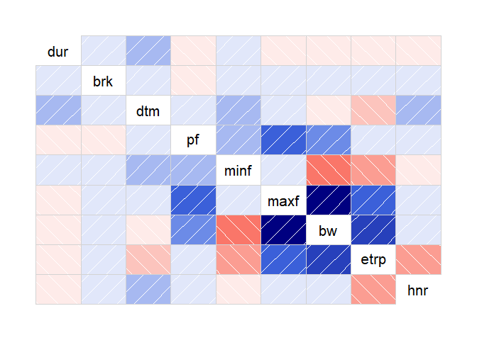
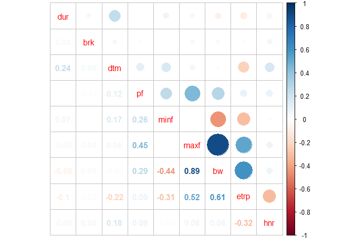
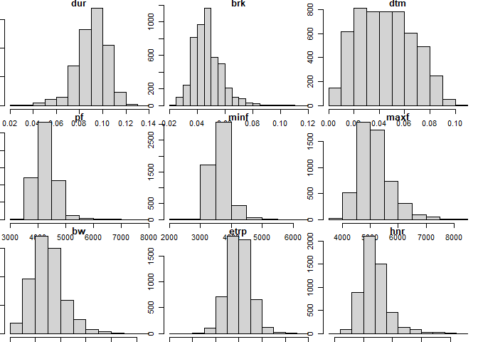
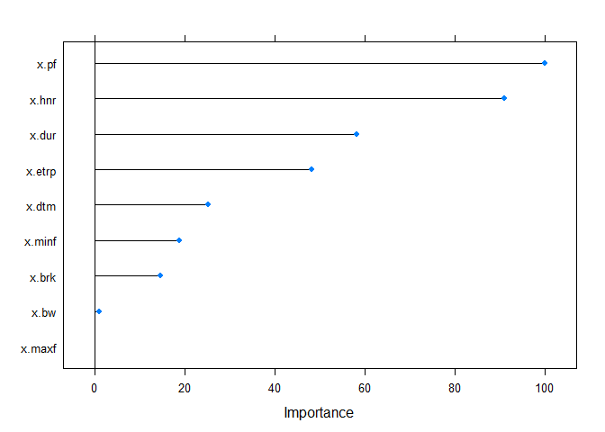
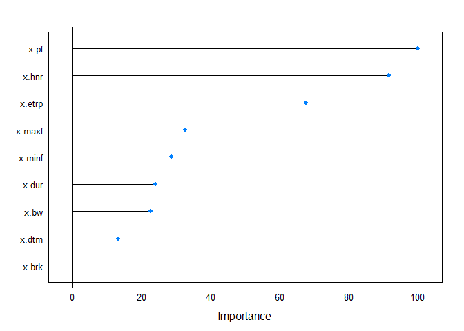
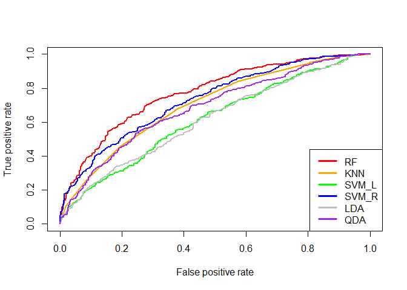
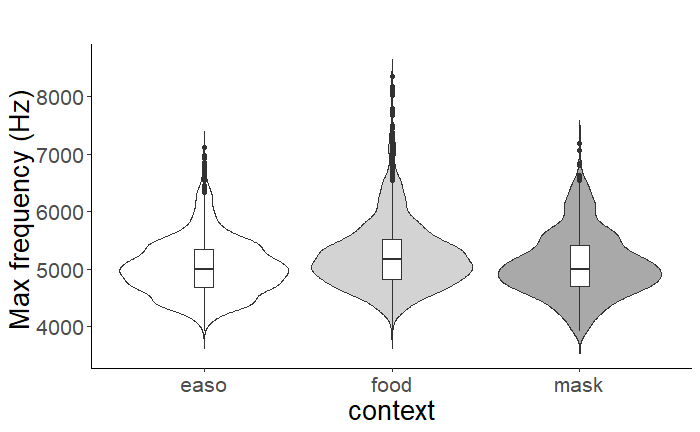
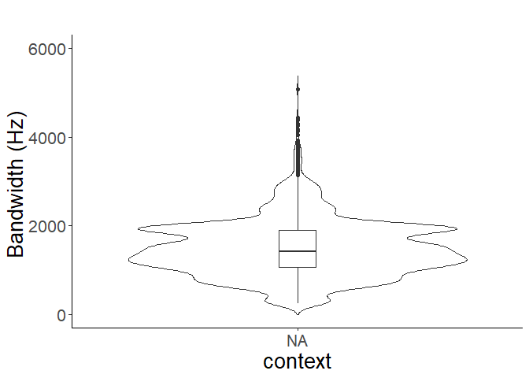

study 1
================
Hwayoung Jung

``` r
#rdat=read.csv("~/Google Drive/UT/papers/Dissertation/study 1/analyses/graded D notes/graded_20200403.csv",header=T) #this is the one I fixed #the site name problem

rdat=read.csv("C:/Users/selly/Downloads/graded_20200403.csv",header=T)


dat=rdat[,c(6,9:17,2,1)]

#changing non-numeric values into NAs and drop NAs
for(i in 1:10){
  dat[,i]=as.numeric(as.character(dat[,i]))
}
```

    ## Warning: NAs introduced by coercion

``` r
library(na.tools)
dat.omit=na.rm(dat)
unique(dat.omit$site)#checking all sites names
```

    ##  [1] "AR1"       "AR2"       "C"         "ecabin"    "edam"      "esam"     
    ##  [7] "etea"      "F"         "I"         "J"         "K"         "N"        
    ## [13] "O"         "UV1"       "UV2"       "UV3"       "W1"        "WAR"      
    ## [19] "wburries"  "wcabin"    "WCAMPING"  "wchuck"    "wdump"     "wexercise"
    ## [25] "ecamping"

``` r
#changing column names
names(dat.omit)[2]="dur"
names(dat.omit)[3]="brk"
names(dat.omit)[4]="dtm"
names(dat.omit)[5]="pf"
names(dat.omit)[6]="minf"
names(dat.omit)[7]="maxf"
names(dat.omit)[8]="bw"
names(dat.omit)[9]="etrp"
names(dat.omit)[10]="hnr"
```

1.2. Explore correlation between variables

``` r
dim(dat.omit)
```

    ## [1] 4851   12

``` r
library(corrplot)
```

    ## corrplot 0.84 loaded

``` r
library(corrgram)
corrplot.mixed(corrgram(dat.omit[,c(2:10)]))
```

<!-- --><!-- -->

``` r
cor(dat.omit[,c(2:10)])
```

    ##              dur          brk         dtm          pf         minf         maxf
    ## dur   1.00000000  0.043590856  0.24166888 -0.00812986  0.070888886 -0.049536709
    ## brk   0.04359086  1.000000000  0.04027891 -0.01452259  0.000524669  0.041112488
    ## dtm   0.24166888  0.040278912  1.00000000  0.11953737  0.165242036  0.054370654
    ## pf   -0.00812986 -0.014522588  0.11953737  1.00000000  0.258613978  0.449078354
    ## minf  0.07088889  0.000524669  0.16524204  0.25861398  1.000000000  0.006102067
    ## maxf -0.04953671  0.041112488  0.05437065  0.44907835  0.006102067  1.000000000
    ## bw   -0.07573808  0.036142263 -0.02517418  0.28780251 -0.441053285  0.894744784
    ## etrp -0.09776880  0.020969843 -0.22328580  0.09227243 -0.309652999  0.520261240
    ## hnr  -0.05818169  0.052036861  0.17771654  0.08820366 -0.020497589  0.077979580
    ##               bw        etrp         hnr
    ## dur  -0.07573808 -0.09776880 -0.05818169
    ## brk   0.03614226  0.02096984  0.05203686
    ## dtm  -0.02517418 -0.22328580  0.17771654
    ## pf    0.28780251  0.09227243  0.08820366
    ## minf -0.44105328 -0.30965300 -0.02049759
    ## maxf  0.89474478  0.52026124  0.07797958
    ## bw    1.00000000  0.60508136  0.07927051
    ## etrp  0.60508136  1.00000000 -0.31556540
    ## hnr   0.07927051 -0.31556540  1.00000000

Histogram

``` r
cn=colnames(dat.omit[,2:10])
par(mfrow=c(3,3),mar=c(0.5,0.5,0.5,0.5))

for(i in 2:10){
  hist(dat[,i],main=cn[i-1])
}
```

<!-- -->

1.3 Classification: 3 contexts (food, mask, easo)

``` r
x=dat.omit[,c(2:10)]
y=dat.omit[,11]
head(x)
```

    ##     dur   brk   dtm   pf minf maxf   bw  etrp   hnr
    ## 1 0.111 0.063 0.018 4649 4134 4823  689 0.471 12.71
    ## 2 0.098 0.043 0.008 4571 4435 4780  344 0.455  8.32
    ## 3 0.111 0.058 0.014 4577 4091 6029 1938 0.571  8.60
    ## 4 0.100 0.052 0.068 4464 4349 7106 2756 0.528 12.45
    ## 5 0.108 0.078 0.031 4653 4134 6201 2067 0.526 12.43
    ## 6 0.111 0.055 0.017 4656 3703 6632 2928 0.581 13.20

``` r
dim(x)
```

    ## [1] 4851    9

``` r
#standardizing data
sx=scale(x,center=T, scale=T)
  


library(caret)  
```

    ## Loading required package: lattice

    ## 
    ## Attaching package: 'lattice'

    ## The following object is masked from 'package:corrgram':
    ## 
    ##     panel.fill

    ## Loading required package: ggplot2

``` r
library(MLeval)

#dividing training vs test data
set.seed(123)
test=sample(1:nrow(sx),0.2*nrow(sx)) #making train index
train=(-test)

traindat=data.frame(x=sx[train,],y=y[train])
testdat=data.frame(x=sx[test,],y=y[test])

#Cross validation (learned from https://stackoverflow.com/questions/33470373/applying-k-fold-cross-validation-model-using-caret-package)

# KNN
set.seed(123)
train_ctrl=trainControl(method="cv",number=10)
knn.cv=train(y~., data=traindat,trControl=train_ctrl,method="knn")
print(knn.cv)
```

    ## k-Nearest Neighbors 
    ## 
    ## 3881 samples
    ##    9 predictor
    ##    3 classes: 'easo', 'food', 'mask' 
    ## 
    ## No pre-processing
    ## Resampling: Cross-Validated (10 fold) 
    ## Summary of sample sizes: 3493, 3493, 3492, 3492, 3493, 3493, ... 
    ## Resampling results across tuning parameters:
    ## 
    ##   k  Accuracy   Kappa    
    ##   5  0.5668593  0.2776635
    ##   7  0.5807848  0.2901004
    ##   9  0.5869618  0.2981443
    ## 
    ## Accuracy was used to select the optimal model using the largest value.
    ## The final value used for the model was k = 9.

``` r
# Random Forest
set.seed(123)
train_ctrl=trainControl(method="cv",number=10)
rf.cv=train(y~., data=traindat,trControl=train_ctrl,method="rf")
print(rf.cv)
```

    ## Random Forest 
    ## 
    ## 3881 samples
    ##    9 predictor
    ##    3 classes: 'easo', 'food', 'mask' 
    ## 
    ## No pre-processing
    ## Resampling: Cross-Validated (10 fold) 
    ## Summary of sample sizes: 3493, 3493, 3492, 3492, 3493, 3493, ... 
    ## Resampling results across tuning parameters:
    ## 
    ##   mtry  Accuracy   Kappa    
    ##   2     0.6186470  0.3436492
    ##   5     0.6207095  0.3498375
    ##   9     0.6219962  0.3534278
    ## 
    ## Accuracy was used to select the optimal model using the largest value.
    ## The final value used for the model was mtry = 9.

``` r
plot(varImp(object=rf.cv)) #variable importance plot
```

<!-- -->

``` r
# SVM(Linear kernel)
set.seed(123)
svml.cv=train(y~., data=traindat,trControl=train_ctrl,method="svmLinear") #Q: Do I need to set a tune grid???
print(svml.cv)
```

    ## Support Vector Machines with Linear Kernel 
    ## 
    ## 3881 samples
    ##    9 predictor
    ##    3 classes: 'easo', 'food', 'mask' 
    ## 
    ## No pre-processing
    ## Resampling: Cross-Validated (10 fold) 
    ## Summary of sample sizes: 3493, 3493, 3492, 3492, 3493, 3493, ... 
    ## Resampling results:
    ## 
    ##   Accuracy   Kappa    
    ##   0.5093916  0.1122427
    ## 
    ## Tuning parameter 'C' was held constant at a value of 1

``` r
svml.pred=predict(svml.cv,testdat)

# SVM(radial kernel)
set.seed(123)
svmr.cv=train(y~., data=traindat,trControl=train_ctrl,method="svmRadial") #Q: Do I need to set a tune grid???
print(svmr.cv)
```

    ## Support Vector Machines with Radial Basis Function Kernel 
    ## 
    ## 3881 samples
    ##    9 predictor
    ##    3 classes: 'easo', 'food', 'mask' 
    ## 
    ## No pre-processing
    ## Resampling: Cross-Validated (10 fold) 
    ## Summary of sample sizes: 3493, 3493, 3492, 3492, 3493, 3493, ... 
    ## Resampling results across tuning parameters:
    ## 
    ##   C     Accuracy   Kappa    
    ##   0.25  0.5617014  0.2118962
    ##   0.50  0.5799924  0.2511376
    ##   1.00  0.5882372  0.2704485
    ## 
    ## Tuning parameter 'sigma' was held constant at a value of 0.1015378
    ## Accuracy was used to select the optimal model using the largest value.
    ## The final values used for the model were sigma = 0.1015378 and C = 1.

``` r
# LDA
set.seed(123)
lda.cv=train(y~., data=traindat,trControl=train_ctrl,method="lda") #Q: Do I need to set a tune grid???
print(lda.cv)
```

    ## Linear Discriminant Analysis 
    ## 
    ## 3881 samples
    ##    9 predictor
    ##    3 classes: 'easo', 'food', 'mask' 
    ## 
    ## No pre-processing
    ## Resampling: Cross-Validated (10 fold) 
    ## Summary of sample sizes: 3493, 3493, 3492, 3492, 3493, 3493, ... 
    ## Resampling results:
    ## 
    ##   Accuracy   Kappa    
    ##   0.5099131  0.1295403

``` r
#1.3.3 QDA
set.seed(123)
qda.cv=train(y~., data=traindat,trControl=train_ctrl,method="qda") #Q: Do I need to set a tune grid???
print(qda.cv)
```

    ## Quadratic Discriminant Analysis 
    ## 
    ## 3881 samples
    ##    9 predictor
    ##    3 classes: 'easo', 'food', 'mask' 
    ## 
    ## No pre-processing
    ## Resampling: Cross-Validated (10 fold) 
    ## Summary of sample sizes: 3493, 3493, 3492, 3492, 3493, 3493, ... 
    ## Resampling results:
    ## 
    ##   Accuracy   Kappa    
    ##   0.5356731  0.2148752

Classifying 2 contexts: Pred (Lumping easo and mask together) vs Food

``` r
y=gsub("easo","pred",y)
y=gsub("mask","pred",y)

traindat$y=gsub("easo","pred",traindat$y)
traindat$y=gsub("mask","pred",traindat$y)
testdat$y=gsub("easo","pred",testdat$y)
testdat$y=gsub("mask","pred",testdat$y)
two_context_dat=rbind(testdat,traindat)
```

``` r
set.seed(123)
#dividing training vs test data
test=sample(1:nrow(sx),0.2*nrow(sx)) #making train index. Spliltting training and testdata to 80% and 20% ratio, respectively.
train=(-test)

traindat=data.frame(x=sx[train,],y=y[train])
testdat=data.frame(x=sx[test,],y=y[test])

#Cross validation (copied from https://stackoverflow.com/questions/33470373/applying-k-fold-cross-validation-model-using-caret-package)

# KNN
set.seed(123)
train_ctrl=trainControl(method="cv",number=10)
knn.cv=train(y~., data=traindat,trControl=train_ctrl,method="knn")
print(knn.cv)
```

    ## k-Nearest Neighbors 
    ## 
    ## 3881 samples
    ##    9 predictor
    ##    2 classes: 'food', 'pred' 
    ## 
    ## No pre-processing
    ## Resampling: Cross-Validated (10 fold) 
    ## Summary of sample sizes: 3492, 3493, 3493, 3494, 3493, 3494, ... 
    ## Resampling results across tuning parameters:
    ## 
    ##   k  Accuracy   Kappa    
    ##   5  0.6289444  0.2554449
    ##   7  0.6335803  0.2651871
    ##   9  0.6305061  0.2586532
    ## 
    ## Accuracy was used to select the optimal model using the largest value.
    ## The final value used for the model was k = 7.

``` r
knn.pred=predict(knn.cv,testdat)
confusionMatrix(as.factor(knn.pred),as.factor(y[test]))
```

    ## Confusion Matrix and Statistics
    ## 
    ##           Reference
    ## Prediction food pred
    ##       food  291  166
    ##       pred  173  340
    ##                                           
    ##                Accuracy : 0.6505          
    ##                  95% CI : (0.6196, 0.6805)
    ##     No Information Rate : 0.5216          
    ##     P-Value [Acc > NIR] : 3.308e-16       
    ##                                           
    ##                   Kappa : 0.2993          
    ##                                           
    ##  Mcnemar's Test P-Value : 0.7445          
    ##                                           
    ##             Sensitivity : 0.6272          
    ##             Specificity : 0.6719          
    ##          Pos Pred Value : 0.6368          
    ##          Neg Pred Value : 0.6628          
    ##              Prevalence : 0.4784          
    ##          Detection Rate : 0.3000          
    ##    Detection Prevalence : 0.4711          
    ##       Balanced Accuracy : 0.6495          
    ##                                           
    ##        'Positive' Class : food            
    ## 

``` r
# Random Forest
set.seed(123)
train_ctrl=trainControl(method="cv",number=10)
rf.cv=train(y~., data=traindat,trControl=train_ctrl,method="rf")
print(rf.cv)
```

    ## Random Forest 
    ## 
    ## 3881 samples
    ##    9 predictor
    ##    2 classes: 'food', 'pred' 
    ## 
    ## No pre-processing
    ## Resampling: Cross-Validated (10 fold) 
    ## Summary of sample sizes: 3492, 3493, 3493, 3494, 3493, 3494, ... 
    ## Resampling results across tuning parameters:
    ## 
    ##   mtry  Accuracy   Kappa    
    ##   2     0.6727783  0.3412457
    ##   5     0.6709735  0.3381713
    ##   9     0.6717487  0.3397074
    ## 
    ## Accuracy was used to select the optimal model using the largest value.
    ## The final value used for the model was mtry = 2.

``` r
rf.pred=predict(rf.cv,testdat)
confusionMatrix(as.factor(rf.pred),as.factor(y[test]))
```

    ## Confusion Matrix and Statistics
    ## 
    ##           Reference
    ## Prediction food pred
    ##       food  315  132
    ##       pred  149  374
    ##                                           
    ##                Accuracy : 0.7103          
    ##                  95% CI : (0.6806, 0.7387)
    ##     No Information Rate : 0.5216          
    ##     P-Value [Acc > NIR] : <2e-16          
    ##                                           
    ##                   Kappa : 0.4186          
    ##                                           
    ##  Mcnemar's Test P-Value : 0.3398          
    ##                                           
    ##             Sensitivity : 0.6789          
    ##             Specificity : 0.7391          
    ##          Pos Pred Value : 0.7047          
    ##          Neg Pred Value : 0.7151          
    ##              Prevalence : 0.4784          
    ##          Detection Rate : 0.3247          
    ##    Detection Prevalence : 0.4608          
    ##       Balanced Accuracy : 0.7090          
    ##                                           
    ##        'Positive' Class : food            
    ## 

``` r
plot(varImp(object=rf.cv))
```

<!-- -->

``` r
# SVM(Linear)
set.seed(123)
train_ctrl=trainControl(method="cv",number=10,classProbs=TRUE)
svml.cv=train(y~., data=traindat,trControl=train_ctrl,method="svmLinear") 
svml.pred=predict(svml.cv,testdat)
print(svml.cv)
```

    ## Support Vector Machines with Linear Kernel 
    ## 
    ## 3881 samples
    ##    9 predictor
    ##    2 classes: 'food', 'pred' 
    ## 
    ## No pre-processing
    ## Resampling: Cross-Validated (10 fold) 
    ## Summary of sample sizes: 3492, 3493, 3493, 3494, 3493, 3494, ... 
    ## Resampling results:
    ## 
    ##   Accuracy   Kappa    
    ##   0.5877132  0.1596923
    ## 
    ## Tuning parameter 'C' was held constant at a value of 1

``` r
confusionMatrix(as.factor(svml.pred),as.factor(y[test]))
```

    ## Confusion Matrix and Statistics
    ## 
    ##           Reference
    ## Prediction food pred
    ##       food  203  144
    ##       pred  261  362
    ##                                           
    ##                Accuracy : 0.5825          
    ##                  95% CI : (0.5507, 0.6137)
    ##     No Information Rate : 0.5216          
    ##     P-Value [Acc > NIR] : 8.143e-05       
    ##                                           
    ##                   Kappa : 0.1545          
    ##                                           
    ##  Mcnemar's Test P-Value : 8.210e-09       
    ##                                           
    ##             Sensitivity : 0.4375          
    ##             Specificity : 0.7154          
    ##          Pos Pred Value : 0.5850          
    ##          Neg Pred Value : 0.5811          
    ##              Prevalence : 0.4784          
    ##          Detection Rate : 0.2093          
    ##    Detection Prevalence : 0.3577          
    ##       Balanced Accuracy : 0.5765          
    ##                                           
    ##        'Positive' Class : food            
    ## 

``` r
# SVM(radial)
set.seed(123)
train_ctrl=trainControl(method="cv",number=10,classProbs=TRUE)
svmr.cv=train(y~., data=traindat,trControl=train_ctrl,method="svmRadial") 
print(svmr.cv)
```

    ## Support Vector Machines with Radial Basis Function Kernel 
    ## 
    ## 3881 samples
    ##    9 predictor
    ##    2 classes: 'food', 'pred' 
    ## 
    ## No pre-processing
    ## Resampling: Cross-Validated (10 fold) 
    ## Summary of sample sizes: 3492, 3493, 3493, 3494, 3493, 3494, ... 
    ## Resampling results across tuning parameters:
    ## 
    ##   C     Accuracy   Kappa    
    ##   0.25  0.6330874  0.2624166
    ##   0.50  0.6410864  0.2797586
    ##   1.00  0.6449431  0.2884197
    ## 
    ## Tuning parameter 'sigma' was held constant at a value of 0.1015378
    ## Accuracy was used to select the optimal model using the largest value.
    ## The final values used for the model were sigma = 0.1015378 and C = 1.

``` r
svmr.pred=predict(svmr.cv,testdat)
confusionMatrix(as.factor(svmr.pred),as.factor(y[test]))
```

    ## Confusion Matrix and Statistics
    ## 
    ##           Reference
    ## Prediction food pred
    ##       food  293  156
    ##       pred  171  350
    ##                                           
    ##                Accuracy : 0.6629          
    ##                  95% CI : (0.6322, 0.6926)
    ##     No Information Rate : 0.5216          
    ##     P-Value [Acc > NIR] : <2e-16          
    ##                                           
    ##                   Kappa : 0.3236          
    ##                                           
    ##  Mcnemar's Test P-Value : 0.4388          
    ##                                           
    ##             Sensitivity : 0.6315          
    ##             Specificity : 0.6917          
    ##          Pos Pred Value : 0.6526          
    ##          Neg Pred Value : 0.6718          
    ##              Prevalence : 0.4784          
    ##          Detection Rate : 0.3021          
    ##    Detection Prevalence : 0.4629          
    ##       Balanced Accuracy : 0.6616          
    ##                                           
    ##        'Positive' Class : food            
    ## 

``` r
# LDA
set.seed(123)
lda.cv=train(y~., data=traindat,trControl=train_ctrl,method="lda")
print(lda.cv)
```

    ## Linear Discriminant Analysis 
    ## 
    ## 3881 samples
    ##    9 predictor
    ##    2 classes: 'food', 'pred' 
    ## 
    ## No pre-processing
    ## Resampling: Cross-Validated (10 fold) 
    ## Summary of sample sizes: 3492, 3493, 3493, 3494, 3493, 3494, ... 
    ## Resampling results:
    ## 
    ##   Accuracy   Kappa    
    ##   0.5848788  0.1539434

``` r
lda.pred=predict(lda.cv,testdat)
confusionMatrix(as.factor(lda.pred),as.factor(y[test]))
```

    ## Confusion Matrix and Statistics
    ## 
    ##           Reference
    ## Prediction food pred
    ##       food  197  140
    ##       pred  267  366
    ##                                           
    ##                Accuracy : 0.5804          
    ##                  95% CI : (0.5486, 0.6117)
    ##     No Information Rate : 0.5216          
    ##     P-Value [Acc > NIR] : 0.0001357       
    ##                                           
    ##                   Kappa : 0.1496          
    ##                                           
    ##  Mcnemar's Test P-Value : 4.222e-10       
    ##                                           
    ##             Sensitivity : 0.4246          
    ##             Specificity : 0.7233          
    ##          Pos Pred Value : 0.5846          
    ##          Neg Pred Value : 0.5782          
    ##              Prevalence : 0.4784          
    ##          Detection Rate : 0.2031          
    ##    Detection Prevalence : 0.3474          
    ##       Balanced Accuracy : 0.5739          
    ##                                           
    ##        'Positive' Class : food            
    ## 

``` r
# QDA
set.seed(123)
qda.cv=train(y~., data=traindat,trControl=train_ctrl,method="qda") 
print(qda.cv)
```

    ## Quadratic Discriminant Analysis 
    ## 
    ## 3881 samples
    ##    9 predictor
    ##    2 classes: 'food', 'pred' 
    ## 
    ## No pre-processing
    ## Resampling: Cross-Validated (10 fold) 
    ## Summary of sample sizes: 3492, 3493, 3493, 3494, 3493, 3494, ... 
    ## Resampling results:
    ## 
    ##   Accuracy   Kappa    
    ##   0.6078316  0.2039154

``` r
qda.pred=predict(qda.cv,testdat)
confusionMatrix(as.factor(qda.pred),as.factor(y[test]))
```

    ## Confusion Matrix and Statistics
    ## 
    ##           Reference
    ## Prediction food pred
    ##       food  230  130
    ##       pred  234  376
    ##                                           
    ##                Accuracy : 0.6247          
    ##                  95% CI : (0.5934, 0.6553)
    ##     No Information Rate : 0.5216          
    ##     P-Value [Acc > NIR] : 6.099e-11       
    ##                                           
    ##                   Kappa : 0.241           
    ##                                           
    ##  Mcnemar's Test P-Value : 6.714e-08       
    ##                                           
    ##             Sensitivity : 0.4957          
    ##             Specificity : 0.7431          
    ##          Pos Pred Value : 0.6389          
    ##          Neg Pred Value : 0.6164          
    ##              Prevalence : 0.4784          
    ##          Detection Rate : 0.2371          
    ##    Detection Prevalence : 0.3711          
    ##       Balanced Accuracy : 0.6194          
    ##                                           
    ##        'Positive' Class : food            
    ## 

``` r
#ROC curve

library(ROCR)
pred.knn=predict(knn.cv,testdat,type='prob')
pred.rf=predict(rf.cv,testdat,type="prob")
pred.svml=predict(svml.cv,testdat,type='prob')
pred.svmr=predict(svmr.cv,testdat,type="prob")
pred.lda=predict(lda.cv,testdat,type="prob")
pred.qda=predict(qda.cv,testdat,type="prob")

pred.knn1=prediction(pred.knn[,2],testdat$y)
pred.rf1=prediction(pred.rf[,2],testdat$y)
pred.svml1=prediction(pred.svml[,2],testdat$y)
pred.svmr1=prediction(pred.svmr[,2],testdat$y)
pred.lda1=prediction(pred.lda[,2],testdat$y)
pred.qda1=prediction(pred.qda[,2],testdat$y)


roc.knn=performance(pred.knn1,"tpr","fpr")
roc.rf=performance(pred.rf1,"tpr","fpr")
roc.svml=performance(pred.svml1,"tpr","fpr")
roc.svmr=performance(pred.svmr1,"tpr","fpr")
roc.lda=performance(pred.lda1,"tpr","fpr")
roc.qda=performance(pred.qda1,"tpr","fpr")


plot(roc.knn,col="orange",lwd=2)
plot(roc.rf,add = T,col="red",lwd=2)
plot(roc.svml,add=T,col="green",lwd=2)
plot(roc.svmr,add=T,col="blue",lwd=2)
plot(roc.lda,add=T,col="grey",lwd=2)
plot(roc.qda,add=T,col="purple",lwd=2)
legend("bottomright",legend=c("RF","KNN","SVM_L","SVM_R","LDA","QDA"),col=c("red","orange","green","blue","grey","purple"),lty=1,lwd=3,cex=1)
```

<!-- -->

Linear mixed models

``` r
#####   lmerTest for 3 contexts
library(lmerTest)
```

    ## Loading required package: lme4

    ## Loading required package: Matrix

    ## 
    ## Attaching package: 'lmerTest'

    ## The following object is masked from 'package:lme4':
    ## 
    ##     lmer

    ## The following object is masked from 'package:stats':
    ## 
    ##     step

``` r
library(emmeans)

# Testing if "duration" of D notes are associated with contexts (3 levels: food and 2 predators)
m1 = lmer(dur~context+(1|site/context),data=dat.omit)

# Testing if "break" (i.e. inter-note interval) of D notes are associated with contexts (3 levels: food and 2 predators)
m2 = lmer(brk~context+(1|site/context),data=dat.omit)

# Testing if "break" (i.e. inter-note interval) of D notes are associated with contexts (3 levels: food and 2 predators)
# m3 <- lmer(dtm~context+(1|site/context),data=dat.omit)#convergence error
m3 <- lmer(dtm~context+(1|site/context),data=dat.omit,control = lmerControl(optimizer = "Nelder_Mead"))#solved: convergence warning)

#Testing if "peak frequency" of D notes are associated with contexts (3 levels: food and 2 predators)
m4 = lmer(pf~context+(1|site/context),data=dat.omit)

# Testing if "minimum frequency" of D notes are associated with contexts (3 levels: food and 2 predators)
m5 = lmer(minf~context+(1|site/context),data=dat.omit)

# Testing if "maximum frequency" of D notes are associated with contexts (3 levels: food and 2 predators)
#m6 <- lmer(maxf~context+(1|site/context),data=dat.omit) #x converge
m6 <- lmer(maxf~context+(1|site/context),data=dat.omit,control = lmerControl(optimizer = "Nelder_Mead"))

# Testing if "bandwidth" of D notes are associated with contexts (3 levels: food and 2 predators)
m7 = lmer(bw~context+(1|site/context),data=dat.omit)

# Testing if "entropy" of D notes are associated with contexts (3 levels: food and 2 predators)
m8 = lmer(etrp~context+(1|site/context),data=dat.omit)

# Testing if "harmonic-to-noise ratio" of D notes are associated with contexts (3 levels: food and 2 predators)
m9 = lmer(hnr~context+(1|site/context),data=dat.omit)

#Testing Assumption of lmer 1: residual normality in lmer models
shapiro.test(resid(m1))
```

    ## 
    ##  Shapiro-Wilk normality test
    ## 
    ## data:  resid(m1)
    ## W = 0.97305, p-value < 2.2e-16

``` r
shapiro.test(resid(m2))
```

    ## 
    ##  Shapiro-Wilk normality test
    ## 
    ## data:  resid(m2)
    ## W = 0.94062, p-value < 2.2e-16

``` r
shapiro.test(resid(m3))
```

    ## 
    ##  Shapiro-Wilk normality test
    ## 
    ## data:  resid(m3)
    ## W = 0.99321, p-value = 1.938e-14

``` r
shapiro.test(resid(m4))
```

    ## 
    ##  Shapiro-Wilk normality test
    ## 
    ## data:  resid(m4)
    ## W = 0.87196, p-value < 2.2e-16

``` r
shapiro.test(resid(m5))
```

    ## 
    ##  Shapiro-Wilk normality test
    ## 
    ## data:  resid(m5)
    ## W = 0.9446, p-value < 2.2e-16

``` r
shapiro.test(resid(m6))
```

    ## 
    ##  Shapiro-Wilk normality test
    ## 
    ## data:  resid(m6)
    ## W = 0.95412, p-value < 2.2e-16

``` r
shapiro.test(resid(m7))
```

    ## 
    ##  Shapiro-Wilk normality test
    ## 
    ## data:  resid(m7)
    ## W = 0.97745, p-value < 2.2e-16

``` r
shapiro.test(resid(m8))
```

    ## 
    ##  Shapiro-Wilk normality test
    ## 
    ## data:  resid(m8)
    ## W = 0.99043, p-value < 2.2e-16

``` r
shapiro.test(resid(m9))
```

    ## 
    ##  Shapiro-Wilk normality test
    ## 
    ## data:  resid(m9)
    ## W = 0.95541, p-value < 2.2e-16

``` r
#except W = 0.87196 in m4, all exceeds >0.9.
#log transformed pf in m4, and now W > 0.9.
m4_1 = lmer(log(pf)~context+(1|site/context),data=dat.omit)
shapiro.test(resid(m4_1))
```

    ## 
    ##  Shapiro-Wilk normality test
    ## 
    ## data:  resid(m4_1)
    ## W = 0.93196, p-value < 2.2e-16

``` r
#seeign all results
anova(m1) #NS
```

    ## Type III Analysis of Variance Table with Satterthwaite's method
    ##             Sum Sq    Mean Sq NumDF  DenDF F value Pr(>F)
    ## context 0.00033489 0.00016745     2 40.197  1.9259  0.159

``` r
anova(m2) #NS
```

    ## Type III Analysis of Variance Table with Satterthwaite's method
    ##             Sum Sq    Mean Sq NumDF  DenDF F value Pr(>F)
    ## context 4.5097e-05 2.2548e-05     2 38.141  0.2549 0.7763

``` r
anova(m3) #NS
```

    ## Type III Analysis of Variance Table with Satterthwaite's method
    ##             Sum Sq   Mean Sq NumDF  DenDF F value Pr(>F)
    ## context 2.3441e-05 1.172e-05     2 37.833  0.0313 0.9692

``` r
anova(m4_1)#NS
```

    ## Type III Analysis of Variance Table with Satterthwaite's method
    ##           Sum Sq  Mean Sq NumDF  DenDF F value  Pr(>F)  
    ## context 0.029161 0.014581     2 40.257  2.6599 0.08223 .
    ## ---
    ## Signif. codes:  0 '***' 0.001 '**' 0.01 '*' 0.05 '.' 0.1 ' ' 1

``` r
anova(m5)#NS
```

    ## Type III Analysis of Variance Table with Satterthwaite's method
    ##         Sum Sq Mean Sq NumDF  DenDF F value Pr(>F)
    ## context  91905   45953     2 41.324  0.7241 0.4908

``` r
anova(m6)#significant => run emmans() for post-hoc test
```

    ## Type III Analysis of Variance Table with Satterthwaite's method
    ##          Sum Sq Mean Sq NumDF  DenDF F value   Pr(>F)   
    ## context 2997437 1498719     2 34.233  6.0317 0.005702 **
    ## ---
    ## Signif. codes:  0 '***' 0.001 '**' 0.01 '*' 0.05 '.' 0.1 ' ' 1

``` r
anova(m7)#significant => run emmans() for post-hoc test
```

    ## Type III Analysis of Variance Table with Satterthwaite's method
    ##          Sum Sq Mean Sq NumDF  DenDF F value   Pr(>F)   
    ## context 3572357 1786179     2 34.551  5.5257 0.008276 **
    ## ---
    ## Signif. codes:  0 '***' 0.001 '**' 0.01 '*' 0.05 '.' 0.1 ' ' 1

``` r
anova(m8)#NS
```

    ## Type III Analysis of Variance Table with Satterthwaite's method
    ##            Sum Sq   Mean Sq NumDF  DenDF F value Pr(>F)
    ## context 0.0094616 0.0047308     2 42.447  2.4107 0.1019

``` r
anova(m9) #NS
```

    ## Type III Analysis of Variance Table with Satterthwaite's method
    ##         Sum Sq Mean Sq NumDF  DenDF F value Pr(>F)
    ## context 0.7538  0.3769     2 46.123  0.0946 0.9099

``` r
#post-hoc tests


emm6=emmeans(m6,specs=pairwise~context,adjust="none") 
```

    ## Note: D.f. calculations have been disabled because the number of observations exceeds 3000.
    ## To enable adjustments, add the argument 'pbkrtest.limit = 4851' (or larger)
    ## [or, globally, 'set emm_options(pbkrtest.limit = 4851)' or larger];
    ## but be warned that this may result in large computation time and memory use.

    ## Note: D.f. calculations have been disabled because the number of observations exceeds 3000.
    ## To enable adjustments, add the argument 'lmerTest.limit = 4851' (or larger)
    ## [or, globally, 'set emm_options(lmerTest.limit = 4851)' or larger];
    ## but be warned that this may result in large computation time and memory use.

``` r
emm6
```

    ## $emmeans
    ##  context emmean   SE  df asymp.LCL asymp.UCL
    ##  easo      5051 59.3 Inf      4935      5167
    ##  food      5231 60.0 Inf      5114      5349
    ##  mask      5180 66.1 Inf      5051      5310
    ## 
    ## Degrees-of-freedom method: asymptotic 
    ## Confidence level used: 0.95 
    ## 
    ## $contrasts
    ##  contrast    estimate   SE  df z.ratio p.value
    ##  easo - food   -180.0 53.1 Inf -3.390  0.0007 
    ##  easo - mask   -129.1 59.2 Inf -2.181  0.0292 
    ##  food - mask     50.9 59.4 Inf  0.856  0.3919 
    ## 
    ## Degrees-of-freedom method: asymptotic

``` r
emm7=emmeans(m7,specs=pairwise~context,adjust="none") 
```

    ## Note: D.f. calculations have been disabled because the number of observations exceeds 3000.
    ## To enable adjustments, add the argument 'pbkrtest.limit = 4851' (or larger)
    ## [or, globally, 'set emm_options(pbkrtest.limit = 4851)' or larger];
    ## but be warned that this may result in large computation time and memory use.
    ## Note: D.f. calculations have been disabled because the number of observations exceeds 3000.
    ## To enable adjustments, add the argument 'lmerTest.limit = 4851' (or larger)
    ## [or, globally, 'set emm_options(lmerTest.limit = 4851)' or larger];
    ## but be warned that this may result in large computation time and memory use.

``` r
emm7
```

    ## $emmeans
    ##  context emmean   SE  df asymp.LCL asymp.UCL
    ##  easo      1405 61.4 Inf      1285      1526
    ##  food      1606 62.4 Inf      1484      1729
    ##  mask      1581 70.5 Inf      1443      1719
    ## 
    ## Degrees-of-freedom method: asymptotic 
    ## Confidence level used: 0.95 
    ## 
    ## $contrasts
    ##  contrast    estimate   SE  df z.ratio p.value
    ##  easo - food   -201.0 64.7 Inf -3.105  0.0019 
    ##  easo - mask   -175.4 71.8 Inf -2.441  0.0146 
    ##  food - mask     25.7 72.3 Inf  0.355  0.7226 
    ## 
    ## Degrees-of-freedom method: asymptotic

``` r
dat.omit$context = factor(dat.omit$context,levels(dat.omit$context)[c(2,3,1)])


library(ggplot2)
  p=ggplot(dat.omit,aes(x=context,y=maxf,fill=context))+
  geom_violin(trim=F)+
  geom_boxplot(width=0.1,fill="white")+
  theme_classic()+
  labs(title="",x="context", y = "Max frequency (Hz) ") +
  theme(legend.position="none")+
  theme(text = element_text(size=20))
  cp=p+scale_fill_manual(values=c("white", "lightgrey", "darkgrey"))
cp
```

<!-- -->

``` r
  p=ggplot(dat.omit,aes(x=context,y=bw,fill=context))+
  geom_violin(trim=F)+
  geom_boxplot(width=0.1,fill="white")+
  theme_classic()+
  labs(title="",x="context", y = "Bandwidth (Hz) ") +
  theme(legend.position="none")+
  theme(text = element_text(size=20))+
  ylim(0,6000)
  cp=p+scale_fill_manual(values=c("white", "lightgrey", "darkgrey"))
cp
```

    ## Warning: Removed 6 rows containing missing values (geom_violin).

<!-- -->

Tracking back classification results

``` r
  #tracking back correct classification
write.csv(dat.omit,file="dat.omit.csv")
  track_100=array(NA,c(length(test),4,100))
  for(k in 1:2){
    #split data training/test
    test=sample(1:nrow(sx),0.2*nrow(sx)) #making train index
    train=(-test)

    traindat=data.frame(x=sx[train,],y=y[train])
    testdat=data.frame(x=sx[test,],y=y[test])

    #CV
    rf.cv=train(y~., data=traindat,trControl=train_ctrl,method="rf")
   #prediction
    rf.pred=predict(rf.cv,testdat)
    correct=matrix(0,nrow(testdat),1)
    track=cbind(test,as.character(y[test]),as.character(rf.pred),correct) 
    for(i in 1:nrow(testdat)){
      if(track[i,2]==track[i,3]){
        track[i,4]=1
      }
    }
  }
    
    for(i in 1:nrow(testdat)){
      for(j in 1:4){
        track_100[i,j,k]=track[i,j] #storing tracking results in each permutation
      }
    }
  write.csv(track,file="track_store.csv")

  track
```

    ##        test                    
    ##   [1,] "3904" "pred" "food" "0"
    ##   [2,] "1818" "food" "food" "1"
    ##   [3,] "1506" "pred" "food" "0"
    ##   [4,] "1436" "pred" "pred" "1"
    ##   [5,] "96"   "pred" "food" "0"
    ##   [6,] "3291" "pred" "pred" "1"
    ##   [7,] "3566" "food" "food" "1"
    ##   [8,] "377"  "pred" "food" "0"
    ##   [9,] "597"  "food" "pred" "0"
    ##  [10,] "1992" "food" "pred" "0"
    ##  [11,] "4354" "food" "food" "1"
    ##  [12,] "3835" "pred" "food" "0"
    ##  [13,] "2466" "pred" "food" "0"
    ##  [14,] "4266" "food" "pred" "0"
    ##  [15,] "1018" "pred" "pred" "1"
    ##  [16,] "2334" "food" "food" "1"
    ##  [17,] "272"  "food" "food" "1"
    ##  [18,] "674"  "pred" "pred" "1"
    ##  [19,] "1455" "pred" "food" "0"
    ##  [20,] "3387" "food" "pred" "0"
    ##  [21,] "645"  "pred" "pred" "1"
    ##  [22,] "2826" "pred" "food" "0"
    ##  [23,] "403"  "pred" "food" "0"
    ##  [24,] "1411" "pred" "pred" "1"
    ##  [25,] "4201" "food" "pred" "0"
    ##  [26,] "897"  "food" "food" "1"
    ##  [27,] "1382" "pred" "pred" "1"
    ##  [28,] "4092" "food" "pred" "0"
    ##  [29,] "239"  "food" "pred" "0"
    ##  [30,] "3690" "pred" "pred" "1"
    ##  [31,] "3635" "pred" "pred" "1"
    ##  [32,] "1280" "pred" "pred" "1"
    ##  [33,] "3534" "food" "food" "1"
    ##  [34,] "3665" "pred" "food" "0"
    ##  [35,] "4033" "food" "pred" "0"
    ##  [36,] "559"  "food" "pred" "0"
    ##  [37,] "4083" "food" "food" "1"
    ##  [38,] "1050" "food" "pred" "0"
    ##  [39,] "2172" "pred" "food" "0"
    ##  [40,] "941"  "pred" "pred" "1"
    ##  [41,] "3656" "pred" "pred" "1"
    ##  [42,] "1548" "pred" "pred" "1"
    ##  [43,] "4032" "food" "food" "1"
    ##  [44,] "3026" "pred" "food" "0"
    ##  [45,] "3386" "food" "pred" "0"
    ##  [46,] "2989" "pred" "food" "0"
    ##  [47,] "4267" "food" "pred" "0"
    ##  [48,] "2391" "pred" "pred" "1"
    ##  [49,] "2797" "pred" "pred" "1"
    ##  [50,] "557"  "food" "food" "1"
    ##  [51,] "2269" "food" "food" "1"
    ##  [52,] "375"  "pred" "food" "0"
    ##  [53,] "215"  "food" "pred" "0"
    ##  [54,] "4039" "food" "food" "1"
    ##  [55,] "4060" "food" "food" "1"
    ##  [56,] "4579" "food" "food" "1"
    ##  [57,] "525"  "food" "food" "1"
    ##  [58,] "521"  "food" "pred" "0"
    ##  [59,] "2906" "pred" "pred" "1"
    ##  [60,] "1123" "pred" "pred" "1"
    ##  [61,] "1188" "pred" "pred" "1"
    ##  [62,] "1416" "pred" "food" "0"
    ##  [63,] "1861" "food" "pred" "0"
    ##  [64,] "1231" "pred" "pred" "1"
    ##  [65,] "2872" "food" "food" "1"
    ##  [66,] "206"  "food" "pred" "0"
    ##  [67,] "4236" "food" "pred" "0"
    ##  [68,] "2291" "food" "food" "1"
    ##  [69,] "3729" "food" "food" "1"
    ##  [70,] "213"  "food" "food" "1"
    ##  [71,] "1561" "pred" "pred" "1"
    ##  [72,] "898"  "pred" "food" "0"
    ##  [73,] "2354" "food" "food" "1"
    ##  [74,] "2497" "pred" "pred" "1"
    ##  [75,] "270"  "food" "food" "1"
    ##  [76,] "1585" "food" "pred" "0"
    ##  [77,] "730"  "pred" "food" "0"
    ##  [78,] "4654" "food" "food" "1"
    ##  [79,] "3657" "pred" "food" "0"
    ##  [80,] "2759" "pred" "pred" "1"
    ##  [81,] "281"  "food" "food" "1"
    ##  [82,] "2108" "pred" "pred" "1"
    ##  [83,] "2142" "pred" "pred" "1"
    ##  [84,] "3836" "pred" "pred" "1"
    ##  [85,] "1094" "food" "food" "1"
    ##  [86,] "4002" "food" "food" "1"
    ##  [87,] "948"  "pred" "pred" "1"
    ##  [88,] "279"  "food" "food" "1"
    ##  [89,] "2177" "pred" "food" "0"
    ##  [90,] "530"  "food" "food" "1"
    ##  [91,] "4278" "food" "food" "1"
    ##  [92,] "3721" "food" "food" "1"
    ##  [93,] "4776" "food" "food" "1"
    ##  [94,] "3830" "pred" "pred" "1"
    ##  [95,] "1210" "pred" "pred" "1"
    ##  [96,] "1794" "food" "food" "1"
    ##  [97,] "1413" "pred" "food" "0"
    ##  [98,] "1842" "food" "food" "1"
    ##  [99,] "4793" "food" "food" "1"
    ## [100,] "2676" "food" "pred" "0"
    ## [101,] "4837" "food" "food" "1"
    ## [102,] "1037" "pred" "pred" "1"
    ## [103,] "2261" "food" "food" "1"
    ## [104,] "2990" "pred" "food" "0"
    ## [105,] "3044" "pred" "food" "0"
    ## [106,] "2198" "pred" "food" "0"
    ## [107,] "3630" "pred" "pred" "1"
    ## [108,] "4407" "pred" "food" "0"
    ## [109,] "3658" "pred" "food" "0"
    ## [110,] "4006" "food" "food" "1"
    ## [111,] "3048" "pred" "food" "0"
    ## [112,] "1545" "pred" "pred" "1"
    ## [113,] "2059" "pred" "pred" "1"
    ## [114,] "363"  "pred" "pred" "1"
    ## [115,] "1595" "pred" "food" "0"
    ## [116,] "3670" "pred" "food" "0"
    ## [117,] "415"  "food" "food" "1"
    ## [118,] "1035" "pred" "pred" "1"
    ## [119,] "1972" "food" "pred" "0"
    ## [120,] "1944" "food" "food" "1"
    ## [121,] "4048" "food" "food" "1"
    ## [122,] "2666" "food" "food" "1"
    ## [123,] "3882" "pred" "food" "0"
    ## [124,] "430"  "pred" "pred" "1"
    ## [125,] "2356" "food" "food" "1"
    ## [126,] "641"  "pred" "pred" "1"
    ## [127,] "1909" "food" "food" "1"
    ## [128,] "1620" "pred" "food" "0"
    ## [129,] "1489" "pred" "food" "0"
    ## [130,] "1054" "food" "pred" "0"
    ## [131,] "2064" "pred" "pred" "1"
    ## [132,] "4194" "food" "food" "1"
    ## [133,] "3349" "food" "food" "1"
    ## [134,] "3045" "pred" "pred" "1"
    ## [135,] "1538" "pred" "food" "0"
    ## [136,] "2467" "pred" "pred" "1"
    ## [137,] "3581" "food" "pred" "0"
    ## [138,] "3683" "pred" "food" "0"
    ## [139,] "1293" "pred" "pred" "1"
    ## [140,] "3726" "food" "food" "1"
    ## [141,] "3946" "pred" "food" "0"
    ## [142,] "2015" "food" "food" "1"
    ## [143,] "4386" "pred" "pred" "1"
    ## [144,] "2662" "food" "food" "1"
    ## [145,] "2917" "pred" "pred" "1"
    ## [146,] "862"  "food" "food" "1"
    ## [147,] "899"  "pred" "pred" "1"
    ## [148,] "3342" "food" "food" "1"
    ## [149,] "3380" "food" "food" "1"
    ## [150,] "1276" "pred" "pred" "1"
    ## [151,] "4717" "pred" "pred" "1"
    ## [152,] "1139" "pred" "food" "0"
    ## [153,] "3317" "food" "food" "1"
    ## [154,] "3100" "pred" "food" "0"
    ## [155,] "3186" "pred" "pred" "1"
    ## [156,] "4404" "pred" "pred" "1"
    ## [157,] "2130" "pred" "pred" "1"
    ## [158,] "858"  "food" "food" "1"
    ## [159,] "145"  "pred" "food" "0"
    ## [160,] "1705" "pred" "pred" "1"
    ## [161,] "1283" "pred" "pred" "1"
    ## [162,] "1600" "pred" "pred" "1"
    ## [163,] "249"  "food" "pred" "0"
    ## [164,] "349"  "pred" "pred" "1"
    ## [165,] "4684" "pred" "food" "0"
    ## [166,] "2124" "pred" "pred" "1"
    ## [167,] "1712" "pred" "pred" "1"
    ## [168,] "78"   "food" "pred" "0"
    ## [169,] "1078" "food" "food" "1"
    ## [170,] "3651" "pred" "pred" "1"
    ## [171,] "4740" "pred" "pred" "1"
    ## [172,] "3449" "food" "food" "1"
    ## [173,] "739"  "pred" "pred" "1"
    ## [174,] "2764" "pred" "pred" "1"
    ## [175,] "923"  "pred" "food" "0"
    ## [176,] "1716" "pred" "pred" "1"
    ## [177,] "2292" "food" "food" "1"
    ## [178,] "1961" "food" "food" "1"
    ## [179,] "3919" "pred" "pred" "1"
    ## [180,] "877"  "food" "food" "1"
    ## [181,] "1664" "pred" "pred" "1"
    ## [182,] "2774" "pred" "pred" "1"
    ## [183,] "376"  "pred" "pred" "1"
    ## [184,] "959"  "pred" "pred" "1"
    ## [185,] "5"    "pred" "pred" "1"
    ## [186,] "2349" "food" "pred" "0"
    ## [187,] "2835" "food" "food" "1"
    ## [188,] "2511" "food" "pred" "0"
    ## [189,] "786"  "food" "food" "1"
    ## [190,] "2438" "pred" "pred" "1"
    ## [191,] "1988" "food" "pred" "0"
    ## [192,] "2068" "pred" "pred" "1"
    ## [193,] "3077" "pred" "food" "0"
    ## [194,] "1583" "food" "food" "1"
    ## [195,] "4617" "food" "pred" "0"
    ## [196,] "664"  "pred" "pred" "1"
    ## [197,] "3571" "food" "food" "1"
    ## [198,] "269"  "food" "food" "1"
    ## [199,] "3323" "food" "food" "1"
    ## [200,] "3422" "food" "food" "1"
    ## [201,] "710"  "pred" "pred" "1"
    ## [202,] "4281" "food" "food" "1"
    ## [203,] "3336" "food" "food" "1"
    ## [204,] "357"  "pred" "food" "0"
    ## [205,] "3271" "pred" "pred" "1"
    ## [206,] "3890" "pred" "pred" "1"
    ## [207,] "326"  "food" "food" "1"
    ## [208,] "4595" "food" "pred" "0"
    ## [209,] "4447" "pred" "pred" "1"
    ## [210,] "3227" "pred" "pred" "1"
    ## [211,] "1010" "pred" "pred" "1"
    ## [212,] "1501" "pred" "pred" "1"
    ## [213,] "1813" "food" "food" "1"
    ## [214,] "419"  "food" "food" "1"
    ## [215,] "359"  "pred" "pred" "1"
    ## [216,] "3741" "food" "food" "1"
    ## [217,] "1059" "food" "pred" "0"
    ## [218,] "4478" "pred" "pred" "1"
    ## [219,] "4641" "food" "food" "1"
    ## [220,] "789"  "food" "pred" "0"
    ## [221,] "1228" "pred" "pred" "1"
    ## [222,] "2133" "pred" "pred" "1"
    ## [223,] "3773" "food" "pred" "0"
    ## [224,] "1897" "food" "food" "1"
    ## [225,] "1777" "food" "food" "1"
    ## [226,] "228"  "food" "food" "1"
    ## [227,] "3829" "pred" "pred" "1"
    ## [228,] "971"  "pred" "pred" "1"
    ## [229,] "1178" "pred" "pred" "1"
    ## [230,] "4202" "food" "food" "1"
    ## [231,] "2128" "pred" "pred" "1"
    ## [232,] "595"  "food" "food" "1"
    ## [233,] "1173" "food" "food" "1"
    ## [234,] "4178" "food" "food" "1"
    ## [235,] "572"  "food" "food" "1"
    ## [236,] "2892" "food" "food" "1"
    ## [237,] "3218" "pred" "pred" "1"
    ## [238,] "638"  "pred" "food" "0"
    ## [239,] "2020" "food" "food" "1"
    ## [240,] "522"  "food" "pred" "0"
    ## [241,] "1154" "food" "pred" "0"
    ## [242,] "686"  "pred" "pred" "1"
    ## [243,] "2542" "food" "food" "1"
    ## [244,] "1330" "pred" "food" "0"
    ## [245,] "2735" "pred" "pred" "1"
    ## [246,] "3595" "food" "food" "1"
    ## [247,] "4047" "food" "food" "1"
    ## [248,] "1881" "food" "food" "1"
    ## [249,] "2178" "pred" "food" "0"
    ## [250,] "2139" "pred" "food" "0"
    ## [251,] "3151" "pred" "pred" "1"
    ## [252,] "2484" "pred" "pred" "1"
    ## [253,] "648"  "pred" "food" "0"
    ## [254,] "747"  "food" "food" "1"
    ## [255,] "1743" "pred" "pred" "1"
    ## [256,] "254"  "food" "pred" "0"
    ## [257,] "72"   "food" "pred" "0"
    ## [258,] "523"  "food" "food" "1"
    ## [259,] "257"  "food" "food" "1"
    ## [260,] "2444" "pred" "pred" "1"
    ## [261,] "4187" "food" "pred" "0"
    ## [262,] "210"  "food" "pred" "0"
    ## [263,] "1432" "pred" "pred" "1"
    ## [264,] "2914" "pred" "food" "0"
    ## [265,] "3578" "food" "food" "1"
    ## [266,] "2503" "food" "pred" "0"
    ## [267,] "3910" "pred" "food" "0"
    ## [268,] "4603" "food" "food" "1"
    ## [269,] "1275" "pred" "pred" "1"
    ## [270,] "761"  "food" "food" "1"
    ## [271,] "1720" "pred" "pred" "1"
    ## [272,] "4276" "food" "food" "1"
    ## [273,] "3166" "pred" "pred" "1"
    ## [274,] "2270" "food" "food" "1"
    ## [275,] "3024" "pred" "pred" "1"
    ## [276,] "3270" "pred" "food" "0"
    ## [277,] "4272" "food" "food" "1"
    ## [278,] "4528" "pred" "pred" "1"
    ## [279,] "114"  "pred" "food" "0"
    ## [280,] "3161" "pred" "pred" "1"
    ## [281,] "2778" "pred" "pred" "1"
    ## [282,] "3295" "pred" "pred" "1"
    ## [283,] "2426" "pred" "pred" "1"
    ## [284,] "1482" "pred" "pred" "1"
    ## [285,] "2383" "pred" "food" "0"
    ## [286,] "1950" "food" "food" "1"
    ## [287,] "4551" "pred" "pred" "1"
    ## [288,] "1948" "food" "pred" "0"
    ## [289,] "3966" "pred" "food" "0"
    ## [290,] "1913" "food" "pred" "0"
    ## [291,] "2719" "pred" "pred" "1"
    ## [292,] "4367" "pred" "pred" "1"
    ## [293,] "4848" "food" "food" "1"
    ## [294,] "1856" "food" "food" "1"
    ## [295,] "227"  "food" "food" "1"
    ## [296,] "421"  "food" "food" "1"
    ## [297,] "2897" "food" "pred" "0"
    ## [298,] "702"  "pred" "pred" "1"
    ## [299,] "16"   "pred" "pred" "1"
    ## [300,] "3860" "pred" "pred" "1"
    ## [301,] "4113" "food" "food" "1"
    ## [302,] "1247" "pred" "pred" "1"
    ## [303,] "52"   "pred" "food" "0"
    ## [304,] "3885" "pred" "pred" "1"
    ## [305,] "905"  "pred" "food" "0"
    ## [306,] "3365" "food" "pred" "0"
    ## [307,] "4297" "food" "food" "1"
    ## [308,] "1939" "food" "pred" "0"
    ## [309,] "590"  "food" "food" "1"
    ## [310,] "3427" "food" "food" "1"
    ## [311,] "3848" "pred" "pred" "1"
    ## [312,] "3334" "food" "food" "1"
    ## [313,] "1346" "pred" "pred" "1"
    ## [314,] "2858" "food" "food" "1"
    ## [315,] "3948" "pred" "food" "0"
    ## [316,] "97"   "pred" "food" "0"
    ## [317,] "4474" "pred" "pred" "1"
    ## [318,] "397"  "pred" "food" "0"
    ## [319,] "1041" "pred" "pred" "1"
    ## [320,] "3122" "pred" "pred" "1"
    ## [321,] "3523" "food" "food" "1"
    ## [322,] "4671" "pred" "pred" "1"
    ## [323,] "324"  "food" "pred" "0"
    ## [324,] "2709" "food" "pred" "0"
    ## [325,] "412"  "food" "food" "1"
    ## [326,] "2894" "food" "food" "1"
    ## [327,] "1684" "pred" "pred" "1"
    ## [328,] "4614" "food" "pred" "0"
    ## [329,] "3812" "food" "food" "1"
    ## [330,] "4483" "pred" "pred" "1"
    ## [331,] "543"  "food" "pred" "0"
    ## [332,] "464"  "pred" "pred" "1"
    ## [333,] "1981" "food" "food" "1"
    ## [334,] "4220" "food" "food" "1"
    ## [335,] "4211" "food" "food" "1"
    ## [336,] "1057" "food" "pred" "0"
    ## [337,] "991"  "pred" "pred" "1"
    ## [338,] "3509" "food" "pred" "0"
    ## [339,] "256"  "food" "food" "1"
    ## [340,] "217"  "food" "pred" "0"
    ## [341,] "3991" "food" "food" "1"
    ## [342,] "37"   "pred" "pred" "1"
    ## [343,] "12"   "pred" "food" "0"
    ## [344,] "4395" "pred" "food" "0"
    ## [345,] "1685" "pred" "pred" "1"
    ## [346,] "439"  "pred" "pred" "1"
    ## [347,] "338"  "pred" "pred" "1"
    ## [348,] "837"  "food" "pred" "0"
    ## [349,] "563"  "food" "food" "1"
    ## [350,] "3549" "food" "food" "1"
    ## [351,] "1028" "pred" "pred" "1"
    ## [352,] "1019" "pred" "pred" "1"
    ## [353,] "4362" "pred" "pred" "1"
    ## [354,] "1723" "pred" "pred" "1"
    ## [355,] "401"  "pred" "food" "0"
    ## [356,] "3327" "food" "food" "1"
    ## [357,] "1370" "pred" "pred" "1"
    ## [358,] "188"  "pred" "food" "0"
    ## [359,] "330"  "pred" "pred" "1"
    ## [360,] "1819" "food" "food" "1"
    ## [361,] "2641" "food" "pred" "0"
    ## [362,] "1892" "food" "food" "1"
    ## [363,] "780"  "food" "pred" "0"
    ## [364,] "9"    "pred" "food" "0"
    ## [365,] "3681" "pred" "pred" "1"
    ## [366,] "333"  "pred" "pred" "1"
    ## [367,] "4752" "food" "food" "1"
    ## [368,] "182"  "pred" "pred" "1"
    ## [369,] "4279" "food" "food" "1"
    ## [370,] "4436" "pred" "food" "0"
    ## [371,] "651"  "pred" "pred" "1"
    ## [372,] "871"  "food" "food" "1"
    ## [373,] "1533" "pred" "food" "0"
    ## [374,] "844"  "food" "pred" "0"
    ## [375,] "635"  "pred" "food" "0"
    ## [376,] "1086" "food" "food" "1"
    ## [377,] "4173" "food" "food" "1"
    ## [378,] "3663" "pred" "food" "0"
    ## [379,] "108"  "pred" "food" "0"
    ## [380,] "4832" "food" "food" "1"
    ## [381,] "2406" "pred" "pred" "1"
    ## [382,] "4391" "pred" "food" "0"
    ## [383,] "1863" "food" "food" "1"
    ## [384,] "4134" "food" "food" "1"
    ## [385,] "2746" "pred" "pred" "1"
    ## [386,] "585"  "food" "pred" "0"
    ## [387,] "4445" "pred" "pred" "1"
    ## [388,] "616"  "food" "food" "1"
    ## [389,] "3070" "pred" "pred" "1"
    ## [390,] "1486" "pred" "food" "0"
    ## [391,] "4077" "food" "pred" "0"
    ## [392,] "138"  "pred" "pred" "1"
    ## [393,] "3837" "pred" "food" "0"
    ## [394,] "3732" "food" "food" "1"
    ## [395,] "1875" "food" "pred" "0"
    ## [396,] "4374" "pred" "food" "0"
    ## [397,] "2194" "pred" "food" "0"
    ## [398,] "4274" "food" "food" "1"
    ## [399,] "1625" "pred" "pred" "1"
    ## [400,] "3641" "pred" "pred" "1"
    ## [401,] "705"  "pred" "food" "0"
    ## [402,] "3580" "food" "food" "1"
    ## [403,] "601"  "food" "pred" "0"
    ## [404,] "988"  "pred" "food" "0"
    ## [405,] "2171" "pred" "pred" "1"
    ## [406,] "2771" "pred" "food" "0"
    ## [407,] "1525" "pred" "food" "0"
    ## [408,] "2418" "pred" "pred" "1"
    ## [409,] "2067" "pred" "pred" "1"
    ## [410,] "282"  "food" "food" "1"
    ## [411,] "3417" "food" "food" "1"
    ## [412,] "1302" "pred" "pred" "1"
    ## [413,] "1674" "pred" "food" "0"
    ## [414,] "3393" "food" "food" "1"
    ## [415,] "2306" "food" "pred" "0"
    ## [416,] "1927" "food" "food" "1"
    ## [417,] "1449" "pred" "pred" "1"
    ## [418,] "491"  "pred" "food" "0"
    ## [419,] "3193" "pred" "pred" "1"
    ## [420,] "264"  "food" "pred" "0"
    ## [421,] "4359" "pred" "pred" "1"
    ## [422,] "4179" "food" "pred" "0"
    ## [423,] "851"  "food" "food" "1"
    ## [424,] "4300" "food" "pred" "0"
    ## [425,] "1158" "food" "food" "1"
    ## [426,] "3781" "food" "food" "1"
    ## [427,] "4663" "food" "pred" "0"
    ## [428,] "4741" "pred" "food" "0"
    ## [429,] "2749" "pred" "pred" "1"
    ## [430,] "4695" "pred" "pred" "1"
    ## [431,] "2117" "pred" "pred" "1"
    ## [432,] "3843" "pred" "pred" "1"
    ## [433,] "3420" "food" "food" "1"
    ## [434,] "4686" "pred" "pred" "1"
    ## [435,] "422"  "food" "food" "1"
    ## [436,] "2340" "food" "food" "1"
    ## [437,] "2164" "pred" "pred" "1"
    ## [438,] "952"  "pred" "pred" "1"
    ## [439,] "4626" "food" "pred" "0"
    ## [440,] "4628" "food" "food" "1"
    ## [441,] "2555" "food" "food" "1"
    ## [442,] "1565" "pred" "food" "0"
    ## [443,] "441"  "pred" "pred" "1"
    ## [444,] "2776" "pred" "food" "0"
    ## [445,] "3104" "pred" "pred" "1"
    ## [446,] "1966" "food" "pred" "0"
    ## [447,] "2498" "pred" "pred" "1"
    ## [448,] "2961" "pred" "pred" "1"
    ## [449,] "2450" "pred" "pred" "1"
    ## [450,] "3321" "food" "food" "1"
    ## [451,] "1665" "pred" "food" "0"
    ## [452,] "473"  "pred" "pred" "1"
    ## [453,] "1702" "pred" "food" "0"
    ## [454,] "3410" "food" "food" "1"
    ## [455,] "3654" "pred" "food" "0"
    ## [456,] "3863" "pred" "pred" "1"
    ## [457,] "2358" "food" "food" "1"
    ## [458,] "443"  "pred" "pred" "1"
    ## [459,] "510"  "pred" "food" "0"
    ## [460,] "36"   "pred" "food" "0"
    ## [461,] "4165" "food" "food" "1"
    ## [462,] "2853" "food" "food" "1"
    ## [463,] "2283" "food" "food" "1"
    ## [464,] "4375" "pred" "pred" "1"
    ## [465,] "814"  "food" "food" "1"
    ## [466,] "2146" "pred" "pred" "1"
    ## [467,] "596"  "food" "food" "1"
    ## [468,] "484"  "pred" "food" "0"
    ## [469,] "3416" "food" "food" "1"
    ## [470,] "2501" "pred" "pred" "1"
    ## [471,] "4348" "food" "pred" "0"
    ## [472,] "3791" "food" "food" "1"
    ## [473,] "2060" "pred" "pred" "1"
    ## [474,] "1901" "food" "pred" "0"
    ## [475,] "938"  "pred" "pred" "1"
    ## [476,] "4353" "food" "pred" "0"
    ## [477,] "2363" "food" "pred" "0"
    ## [478,] "4574" "food" "pred" "0"
    ## [479,] "73"   "food" "pred" "0"
    ## [480,] "48"   "pred" "food" "0"
    ## [481,] "360"  "pred" "food" "0"
    ## [482,] "115"  "pred" "pred" "1"
    ## [483,] "1096" "food" "pred" "0"
    ## [484,] "3001" "food" "food" "1"
    ## [485,] "687"  "pred" "pred" "1"
    ## [486,] "1660" "pred" "food" "0"
    ## [487,] "2593" "pred" "food" "0"
    ## [488,] "2546" "food" "food" "1"
    ## [489,] "4011" "food" "food" "1"
    ## [490,] "4398" "pred" "pred" "1"
    ## [491,] "2524" "food" "pred" "0"
    ## [492,] "4476" "pred" "pred" "1"
    ## [493,] "209"  "food" "pred" "0"
    ## [494,] "4771" "food" "food" "1"
    ## [495,] "1648" "food" "pred" "0"
    ## [496,] "2153" "pred" "food" "0"
    ## [497,] "4399" "pred" "pred" "1"
    ## [498,] "1007" "pred" "food" "0"
    ## [499,] "2616" "pred" "pred" "1"
    ## [500,] "4682" "pred" "pred" "1"
    ## [501,] "2235" "pred" "pred" "1"
    ## [502,] "62"   "food" "food" "1"
    ## [503,] "1470" "pred" "pred" "1"
    ## [504,] "2335" "food" "pred" "0"
    ## [505,] "3049" "pred" "pred" "1"
    ## [506,] "3175" "pred" "pred" "1"
    ## [507,] "2571" "pred" "pred" "1"
    ## [508,] "3551" "food" "pred" "0"
    ## [509,] "312"  "food" "food" "1"
    ## [510,] "2825" "pred" "food" "0"
    ## [511,] "4282" "food" "food" "1"
    ## [512,] "830"  "food" "food" "1"
    ## [513,] "623"  "food" "pred" "0"
    ## [514,] "3955" "pred" "food" "0"
    ## [515,] "4623" "food" "pred" "0"
    ## [516,] "1146" "food" "pred" "0"
    ## [517,] "1532" "pred" "food" "0"
    ## [518,] "3735" "food" "food" "1"
    ## [519,] "791"  "food" "food" "1"
    ## [520,] "3280" "pred" "pred" "1"
    ## [521,] "2911" "pred" "pred" "1"
    ## [522,] "2208" "pred" "pred" "1"
    ## [523,] "1331" "pred" "pred" "1"
    ## [524,] "1947" "food" "pred" "0"
    ## [525,] "1522" "pred" "pred" "1"
    ## [526,] "1584" "food" "pred" "0"
    ## [527,] "1379" "pred" "pred" "1"
    ## [528,] "1911" "food" "pred" "0"
    ## [529,] "3469" "food" "food" "1"
    ## [530,] "509"  "pred" "pred" "1"
    ## [531,] "2163" "pred" "pred" "1"
    ## [532,] "825"  "food" "food" "1"
    ## [533,] "2222" "pred" "food" "0"
    ## [534,] "1484" "pred" "pred" "1"
    ## [535,] "1015" "pred" "pred" "1"
    ## [536,] "101"  "pred" "food" "0"
    ## [537,] "3839" "pred" "pred" "1"
    ## [538,] "1213" "pred" "pred" "1"
    ## [539,] "2479" "pred" "pred" "1"
    ## [540,] "2864" "food" "pred" "0"
    ## [541,] "3096" "pred" "pred" "1"
    ## [542,] "391"  "pred" "food" "0"
    ## [543,] "4358" "food" "pred" "0"
    ## [544,] "3932" "pred" "pred" "1"
    ## [545,] "1694" "pred" "pred" "1"
    ## [546,] "3204" "pred" "pred" "1"
    ## [547,] "1281" "pred" "pred" "1"
    ## [548,] "684"  "pred" "pred" "1"
    ## [549,] "3087" "pred" "food" "0"
    ## [550,] "4335" "food" "food" "1"
    ## [551,] "2277" "food" "food" "1"
    ## [552,] "1690" "pred" "pred" "1"
    ## [553,] "2943" "food" "pred" "0"
    ## [554,] "1602" "pred" "pred" "1"
    ## [555,] "2322" "food" "food" "1"
    ## [556,] "4687" "pred" "food" "0"
    ## [557,] "570"  "food" "pred" "0"
    ## [558,] "3700" "food" "food" "1"
    ## [559,] "3786" "food" "food" "1"
    ## [560,] "3702" "food" "food" "1"
    ## [561,] "4824" "food" "food" "1"
    ## [562,] "4522" "pred" "pred" "1"
    ## [563,] "2780" "pred" "pred" "1"
    ## [564,] "2103" "pred" "pred" "1"
    ## [565,] "2031" "pred" "food" "0"
    ## [566,] "4380" "pred" "food" "0"
    ## [567,] "2882" "food" "pred" "0"
    ## [568,] "1224" "pred" "pred" "1"
    ## [569,] "2867" "food" "pred" "0"
    ## [570,] "3143" "pred" "pred" "1"
    ## [571,] "3714" "food" "pred" "0"
    ## [572,] "1148" "food" "pred" "0"
    ## [573,] "1407" "pred" "food" "0"
    ## [574,] "423"  "food" "pred" "0"
    ## [575,] "496"  "pred" "pred" "1"
    ## [576,] "3915" "pred" "food" "0"
    ## [577,] "1474" "pred" "pred" "1"
    ## [578,] "4615" "food" "pred" "0"
    ## [579,] "21"   "pred" "pred" "1"
    ## [580,] "486"  "pred" "pred" "1"
    ## [581,] "287"  "food" "pred" "0"
    ## [582,] "301"  "food" "food" "1"
    ## [583,] "818"  "food" "food" "1"
    ## [584,] "4488" "pred" "pred" "1"
    ## [585,] "1341" "pred" "pred" "1"
    ## [586,] "1212" "pred" "pred" "1"
    ## [587,] "4057" "food" "food" "1"
    ## [588,] "994"  "pred" "pred" "1"
    ## [589,] "4835" "food" "food" "1"
    ## [590,] "2821" "pred" "pred" "1"
    ## [591,] "966"  "pred" "pred" "1"
    ## [592,] "4065" "food" "food" "1"
    ## [593,] "174"  "pred" "pred" "1"
    ## [594,] "1250" "pred" "pred" "1"
    ## [595,] "4063" "food" "food" "1"
    ## [596,] "669"  "pred" "pred" "1"
    ## [597,] "993"  "pred" "pred" "1"
    ## [598,] "2036" "pred" "food" "0"
    ## [599,] "2580" "pred" "food" "0"
    ## [600,] "4311" "food" "pred" "0"
    ## [601,] "4000" "food" "food" "1"
    ## [602,] "2596" "pred" "pred" "1"
    ## [603,] "1618" "pred" "food" "0"
    ## [604,] "3990" "food" "food" "1"
    ## [605,] "31"   "pred" "food" "0"
    ## [606,] "2683" "food" "pred" "0"
    ## [607,] "3032" "pred" "pred" "1"
    ## [608,] "3272" "pred" "food" "0"
    ## [609,] "2279" "food" "food" "1"
    ## [610,] "2954" "food" "food" "1"
    ## [611,] "1066" "food" "food" "1"
    ## [612,] "2595" "pred" "food" "0"
    ## [613,] "1014" "pred" "pred" "1"
    ## [614,] "3883" "pred" "food" "0"
    ## [615,] "2361" "food" "pred" "0"
    ## [616,] "3445" "food" "pred" "0"
    ## [617,] "356"  "pred" "food" "0"
    ## [618,] "3766" "food" "food" "1"
    ## [619,] "4259" "food" "pred" "0"
    ## [620,] "1518" "pred" "food" "0"
    ## [621,] "2252" "food" "food" "1"
    ## [622,] "3621" "pred" "food" "0"
    ## [623,] "3529" "food" "pred" "0"
    ## [624,] "3772" "food" "pred" "0"
    ## [625,] "4737" "pred" "pred" "1"
    ## [626,] "1680" "pred" "food" "0"
    ## [627,] "973"  "pred" "pred" "1"
    ## [628,] "1508" "pred" "pred" "1"
    ## [629,] "4120" "food" "food" "1"
    ## [630,] "1128" "pred" "pred" "1"
    ## [631,] "3174" "pred" "pred" "1"
    ## [632,] "974"  "pred" "pred" "1"
    ## [633,] "4560" "food" "pred" "0"
    ## [634,] "1009" "pred" "pred" "1"
    ## [635,] "2635" "pred" "pred" "1"
    ## [636,] "3820" "pred" "pred" "1"
    ## [637,] "3090" "pred" "pred" "1"
    ## [638,] "1851" "food" "food" "1"
    ## [639,] "4495" "pred" "pred" "1"
    ## [640,] "935"  "pred" "food" "0"
    ## [641,] "1612" "pred" "pred" "1"
    ## [642,] "1160" "food" "pred" "0"
    ## [643,] "4003" "food" "food" "1"
    ## [644,] "3074" "pred" "food" "0"
    ## [645,] "4245" "food" "food" "1"
    ## [646,] "4547" "pred" "food" "0"
    ## [647,] "2353" "food" "food" "1"
    ## [648,] "2653" "food" "pred" "0"
    ## [649,] "2602" "pred" "pred" "1"
    ## [650,] "4142" "food" "food" "1"
    ## [651,] "32"   "pred" "food" "0"
    ## [652,] "2233" "pred" "pred" "1"
    ## [653,] "4108" "food" "food" "1"
    ## [654,] "2688" "food" "food" "1"
    ## [655,] "382"  "pred" "pred" "1"
    ## [656,] "94"   "food" "pred" "0"
    ## [657,] "1326" "pred" "pred" "1"
    ## [658,] "2115" "pred" "pred" "1"
    ## [659,] "3886" "pred" "food" "0"
    ## [660,] "3199" "pred" "pred" "1"
    ## [661,] "1521" "pred" "food" "0"
    ## [662,] "3406" "food" "food" "1"
    ## [663,] "1866" "food" "food" "1"
    ## [664,] "2382" "pred" "food" "0"
    ## [665,] "1183" "pred" "pred" "1"
    ## [666,] "1130" "pred" "pred" "1"
    ## [667,] "3601" "food" "pred" "0"
    ## [668,] "4621" "food" "food" "1"
    ## [669,] "2411" "pred" "pred" "1"
    ## [670,] "940"  "pred" "food" "0"
    ## [671,] "4198" "food" "food" "1"
    ## [672,] "1091" "food" "food" "1"
    ## [673,] "2238" "pred" "food" "0"
    ## [674,] "4475" "pred" "pred" "1"
    ## [675,] "4026" "food" "food" "1"
    ## [676,] "2022" "food" "food" "1"
    ## [677,] "81"   "food" "food" "1"
    ## [678,] "2074" "pred" "pred" "1"
    ## [679,] "2370" "food" "food" "1"
    ## [680,] "3803" "food" "food" "1"
    ## [681,] "1753" "food" "food" "1"
    ## [682,] "309"  "food" "food" "1"
    ## [683,] "1577" "food" "food" "1"
    ## [684,] "1454" "pred" "pred" "1"
    ## [685,] "2680" "food" "pred" "0"
    ## [686,] "4664" "pred" "pred" "1"
    ## [687,] "2132" "pred" "pred" "1"
    ## [688,] "1473" "pred" "pred" "1"
    ## [689,] "2837" "food" "food" "1"
    ## [690,] "4290" "food" "pred" "0"
    ## [691,] "2195" "pred" "food" "0"
    ## [692,] "3623" "pred" "pred" "1"
    ## [693,] "2922" "food" "food" "1"
    ## [694,] "843"  "food" "food" "1"
    ## [695,] "3371" "food" "food" "1"
    ## [696,] "4336" "food" "food" "1"
    ## [697,] "794"  "food" "food" "1"
    ## [698,] "732"  "pred" "pred" "1"
    ## [699,] "3167" "pred" "pred" "1"
    ## [700,] "4457" "pred" "pred" "1"
    ## [701,] "2188" "pred" "pred" "1"
    ## [702,] "3923" "pred" "food" "0"
    ## [703,] "1644" "food" "food" "1"
    ## [704,] "1087" "food" "pred" "0"
    ## [705,] "4592" "food" "pred" "0"
    ## [706,] "1408" "pred" "pred" "1"
    ## [707,] "2433" "pred" "pred" "1"
    ## [708,] "3785" "food" "food" "1"
    ## [709,] "727"  "pred" "pred" "1"
    ## [710,] "1426" "pred" "pred" "1"
    ## [711,] "2028" "food" "pred" "0"
    ## [712,] "1149" "food" "food" "1"
    ## [713,] "1868" "food" "food" "1"
    ## [714,] "3498" "food" "pred" "0"
    ## [715,] "3172" "pred" "pred" "1"
    ## [716,] "3021" "pred" "pred" "1"
    ## [717,] "4191" "food" "pred" "0"
    ## [718,] "3696" "food" "pred" "0"
    ## [719,] "295"  "food" "food" "1"
    ## [720,] "2332" "food" "food" "1"
    ## [721,] "2400" "pred" "pred" "1"
    ## [722,] "2023" "food" "food" "1"
    ## [723,] "4518" "pred" "pred" "1"
    ## [724,] "1882" "food" "food" "1"
    ## [725,] "4693" "pred" "pred" "1"
    ## [726,] "2545" "food" "food" "1"
    ## [727,] "260"  "food" "food" "1"
    ## [728,] "2562" "food" "pred" "0"
    ## [729,] "1356" "pred" "pred" "1"
    ## [730,] "1137" "pred" "food" "0"
    ## [731,] "2180" "pred" "pred" "1"
    ## [732,] "2302" "food" "pred" "0"
    ## [733,] "154"  "pred" "pred" "1"
    ## [734,] "1274" "pred" "pred" "1"
    ## [735,] "3711" "food" "food" "1"
    ## [736,] "4346" "food" "food" "1"
    ## [737,] "4396" "pred" "pred" "1"
    ## [738,] "804"  "food" "food" "1"
    ## [739,] "4176" "food" "food" "1"
    ## [740,] "891"  "food" "food" "1"
    ## [741,] "4772" "food" "food" "1"
    ## [742,] "4286" "food" "food" "1"
    ## [743,] "869"  "food" "food" "1"
    ## [744,] "3296" "pred" "food" "0"
    ## [745,] "2763" "pred" "food" "0"
    ## [746,] "2919" "food" "pred" "0"
    ## [747,] "1687" "pred" "pred" "1"
    ## [748,] "4500" "pred" "pred" "1"
    ## [749,] "1570" "food" "food" "1"
    ## [750,] "2201" "pred" "pred" "1"
    ## [751,] "4183" "food" "food" "1"
    ## [752,] "3989" "food" "food" "1"
    ## [753,] "398"  "pred" "pred" "1"
    ## [754,] "4098" "food" "food" "1"
    ## [755,] "355"  "pred" "food" "0"
    ## [756,] "2135" "pred" "pred" "1"
    ## [757,] "4084" "food" "food" "1"
    ## [758,] "200"  "pred" "food" "0"
    ## [759,] "4803" "food" "pred" "0"
    ## [760,] "2264" "food" "pred" "0"
    ## [761,] "1498" "pred" "pred" "1"
    ## [762,] "2362" "food" "food" "1"
    ## [763,] "1539" "pred" "food" "0"
    ## [764,] "1338" "pred" "pred" "1"
    ## [765,] "3752" "food" "food" "1"
    ## [766,] "4678" "pred" "pred" "1"
    ## [767,] "3597" "food" "food" "1"
    ## [768,] "630"  "food" "food" "1"
    ## [769,] "1369" "pred" "pred" "1"
    ## [770,] "313"  "food" "food" "1"
    ## [771,] "3239" "pred" "pred" "1"
    ## [772,] "3117" "pred" "pred" "1"
    ## [773,] "123"  "pred" "food" "0"
    ## [774,] "1046" "pred" "pred" "1"
    ## [775,] "1255" "pred" "pred" "1"
    ## [776,] "1617" "pred" "food" "0"
    ## [777,] "3662" "pred" "pred" "1"
    ## [778,] "3341" "food" "food" "1"
    ## [779,] "888"  "food" "food" "1"
    ## [780,] "4622" "food" "pred" "0"
    ## [781,] "3346" "food" "food" "1"
    ## [782,] "1375" "pred" "pred" "1"
    ## [783,] "4114" "food" "food" "1"
    ## [784,] "4484" "pred" "pred" "1"
    ## [785,] "2621" "pred" "pred" "1"
    ## [786,] "741"  "pred" "pred" "1"
    ## [787,] "1085" "food" "pred" "0"
    ## [788,] "4819" "food" "food" "1"
    ## [789,] "4572" "food" "pred" "0"
    ## [790,] "2523" "food" "food" "1"
    ## [791,] "3254" "pred" "pred" "1"
    ## [792,] "3810" "food" "food" "1"
    ## [793,] "497"  "pred" "pred" "1"
    ## [794,] "2462" "pred" "pred" "1"
    ## [795,] "116"  "pred" "food" "0"
    ## [796,] "3325" "food" "food" "1"
    ## [797,] "3833" "pred" "food" "0"
    ## [798,] "2933" "food" "food" "1"
    ## [799,] "4504" "pred" "pred" "1"
    ## [800,] "2033" "pred" "pred" "1"
    ## [801,] "1497" "pred" "pred" "1"
    ## [802,] "428"  "pred" "pred" "1"
    ## [803,] "311"  "food" "pred" "0"
    ## [804,] "4516" "pred" "pred" "1"
    ## [805,] "4624" "food" "food" "1"
    ## [806,] "476"  "pred" "pred" "1"
    ## [807,] "2590" "pred" "food" "0"
    ## [808,] "3339" "food" "pred" "0"
    ## [809,] "4322" "food" "food" "1"
    ## [810,] "4328" "food" "food" "1"
    ## [811,] "743"  "pred" "pred" "1"
    ## [812,] "1792" "food" "food" "1"
    ## [813,] "64"   "food" "pred" "0"
    ## [814,] "3821" "pred" "food" "0"
    ## [815,] "2265" "food" "food" "1"
    ## [816,] "2789" "pred" "pred" "1"
    ## [817,] "3473" "food" "pred" "0"
    ## [818,] "4422" "pred" "pred" "1"
    ## [819,] "658"  "pred" "pred" "1"
    ## [820,] "2063" "pred" "pred" "1"
    ## [821,] "2728" "pred" "pred" "1"
    ## [822,] "1632" "food" "pred" "0"
    ## [823,] "4310" "food" "pred" "0"
    ## [824,] "1691" "pred" "pred" "1"
    ## [825,] "186"  "pred" "food" "0"
    ## [826,] "176"  "pred" "food" "0"
    ## [827,] "390"  "pred" "pred" "1"
    ## [828,] "4264" "food" "food" "1"
    ## [829,] "2158" "pred" "pred" "1"
    ## [830,] "3515" "food" "food" "1"
    ## [831,] "1802" "food" "food" "1"
    ## [832,] "2319" "food" "food" "1"
    ## [833,] "2937" "food" "food" "1"
    ## [834,] "1409" "pred" "pred" "1"
    ## [835,] "3742" "food" "pred" "0"
    ## [836,] "1443" "pred" "pred" "1"
    ## [837,] "4498" "pred" "pred" "1"
    ## [838,] "2840" "food" "pred" "0"
    ## [839,] "1764" "food" "food" "1"
    ## [840,] "460"  "pred" "pred" "1"
    ## [841,] "2874" "food" "food" "1"
    ## [842,] "782"  "food" "food" "1"
    ## [843,] "1806" "food" "food" "1"
    ## [844,] "3411" "food" "food" "1"
    ## [845,] "1502" "pred" "pred" "1"
    ## [846,] "4050" "food" "food" "1"
    ## [847,] "4701" "pred" "food" "0"
    ## [848,] "2257" "food" "food" "1"
    ## [849,] "4643" "food" "pred" "0"
    ## [850,] "520"  "food" "pred" "0"
    ## [851,] "2199" "pred" "food" "0"
    ## [852,] "2640" "food" "pred" "0"
    ## [853,] "2603" "pred" "pred" "1"
    ## [854,] "3996" "food" "food" "1"
    ## [855,] "984"  "pred" "pred" "1"
    ## [856,] "4154" "food" "food" "1"
    ## [857,] "1196" "pred" "pred" "1"
    ## [858,] "4459" "pred" "pred" "1"
    ## [859,] "35"   "pred" "pred" "1"
    ## [860,] "3505" "food" "food" "1"
    ## [861,] "1350" "pred" "pred" "1"
    ## [862,] "3576" "food" "food" "1"
    ## [863,] "112"  "pred" "pred" "1"
    ## [864,] "579"  "food" "food" "1"
    ## [865,] "1991" "food" "food" "1"
    ## [866,] "1039" "pred" "pred" "1"
    ## [867,] "2475" "pred" "pred" "1"
    ## [868,] "93"   "food" "pred" "0"
    ## [869,] "3612" "pred" "pred" "1"
    ## [870,] "58"   "food" "food" "1"
    ## [871,] "3968" "pred" "pred" "1"
    ## [872,] "3868" "pred" "food" "0"
    ## [873,] "2772" "pred" "food" "0"
    ## [874,] "2796" "pred" "pred" "1"
    ## [875,] "3720" "food" "pred" "0"
    ## [876,] "1184" "pred" "pred" "1"
    ## [877,] "2047" "pred" "pred" "1"
    ## [878,] "1512" "pred" "pred" "1"
    ## [879,] "1706" "pred" "pred" "1"
    ## [880,] "4729" "pred" "food" "0"
    ## [881,] "235"  "food" "food" "1"
    ## [882,] "4600" "food" "food" "1"
    ## [883,] "4087" "food" "pred" "0"
    ## [884,] "3740" "food" "food" "1"
    ## [885,] "1692" "pred" "pred" "1"
    ## [886,] "173"  "pred" "food" "0"
    ## [887,] "1542" "pred" "pred" "1"
    ## [888,] "1977" "food" "pred" "0"
    ## [889,] "2744" "pred" "pred" "1"
    ## [890,] "1434" "pred" "pred" "1"
    ## [891,] "4747" "pred" "pred" "1"
    ## [892,] "1811" "food" "food" "1"
    ## [893,] "3561" "food" "food" "1"
    ## [894,] "690"  "pred" "pred" "1"
    ## [895,] "626"  "food" "pred" "0"
    ## [896,] "2014" "food" "food" "1"
    ## [897,] "2076" "pred" "pred" "1"
    ## [898,] "4721" "pred" "pred" "1"
    ## [899,] "4373" "pred" "pred" "1"
    ## [900,] "4164" "food" "food" "1"
    ## [901,] "2040" "pred" "food" "0"
    ## [902,] "4545" "pred" "food" "0"
    ## [903,] "4491" "pred" "pred" "1"
    ## [904,] "245"  "food" "food" "1"
    ## [905,] "4068" "food" "food" "1"
    ## [906,] "2921" "food" "pred" "0"
    ## [907,] "4301" "food" "pred" "0"
    ## [908,] "3884" "pred" "food" "0"
    ## [909,] "2541" "food" "food" "1"
    ## [910,] "2054" "pred" "pred" "1"
    ## [911,] "4368" "pred" "pred" "1"
    ## [912,] "1404" "pred" "food" "0"
    ## [913,] "2879" "food" "food" "1"
    ## [914,] "4242" "food" "food" "1"
    ## [915,] "2030" "food" "pred" "0"
    ## [916,] "4257" "food" "food" "1"
    ## [917,] "4285" "food" "food" "1"
    ## [918,] "3938" "pred" "pred" "1"
    ## [919,] "4759" "food" "food" "1"
    ## [920,] "2236" "pred" "food" "0"
    ## [921,] "3743" "food" "food" "1"
    ## [922,] "1151" "food" "food" "1"
    ## [923,] "2009" "food" "pred" "0"
    ## [924,] "1904" "food" "food" "1"
    ## [925,] "4145" "food" "food" "1"
    ## [926,] "3927" "pred" "pred" "1"
    ## [927,] "4268" "food" "pred" "0"
    ## [928,] "3705" "food" "food" "1"
    ## [929,] "4277" "food" "pred" "0"
    ## [930,] "2751" "pred" "food" "0"
    ## [931,] "1559" "pred" "food" "0"
    ## [932,] "3564" "food" "pred" "0"
    ## [933,] "1218" "pred" "pred" "1"
    ## [934,] "1782" "food" "food" "1"
    ## [935,] "3467" "food" "food" "1"
    ## [936,] "192"  "pred" "pred" "1"
    ## [937,] "3288" "pred" "pred" "1"
    ## [938,] "175"  "pred" "food" "0"
    ## [939,] "234"  "food" "food" "1"
    ## [940,] "4317" "food" "pred" "0"
    ## [941,] "4675" "pred" "pred" "1"
    ## [942,] "222"  "food" "food" "1"
    ## [943,] "1590" "food" "food" "1"
    ## [944,] "3211" "pred" "pred" "1"
    ## [945,] "1187" "pred" "pred" "1"
    ## [946,] "7"    "pred" "food" "0"
    ## [947,] "2599" "pred" "pred" "1"
    ## [948,] "4023" "food" "food" "1"
    ## [949,] "3079" "pred" "pred" "1"
    ## [950,] "2699" "food" "food" "1"
    ## [951,] "2788" "pred" "pred" "1"
    ## [952,] "3575" "food" "pred" "0"
    ## [953,] "3205" "pred" "pred" "1"
    ## [954,] "4494" "pred" "pred" "1"
    ## [955,] "1243" "pred" "pred" "1"
    ## [956,] "4099" "food" "pred" "0"
    ## [957,] "3602" "food" "food" "1"
    ## [958,] "4419" "pred" "food" "0"
    ## [959,] "1299" "pred" "pred" "1"
    ## [960,] "3617" "pred" "food" "0"
    ## [961,] "1134" "pred" "pred" "1"
    ## [962,] "1412" "pred" "pred" "1"
    ## [963,] "1200" "pred" "pred" "1"
    ## [964,] "1414" "pred" "food" "0"
    ## [965,] "4733" "pred" "food" "0"
    ## [966,] "4610" "food" "pred" "0"
    ## [967,] "274"  "food" "pred" "0"
    ## [968,] "4337" "food" "food" "1"
    ## [969,] "378"  "pred" "food" "0"
    ## [970,] "3309" "pred" "pred" "1"

Originally it was

track=cbind(test,as.integer(y\[test\]),as.integer(rf.pred),correct)

But for unknown reason, it sometimes makes errors, (all NAs in
as.integer(y\[test\])) So modified it to

track=cbind(test,as.character(y\[test\]),as.character(rf.pred),correct)

first column: the index number of the D note Second column: actual class
third column: predicted class fourth column: 0: when second & third
colomn don’t match, 1: when second & third column match

meant to extract D notes that marked 1 on the fourth column which means
correct classification.
