study2\_gh
================

Response variable: count data. \# of D, \# of H, \# of C, \# of I, \# of
seed taking. Independent variable: treatment with 5 levels (PP, PF, FP,
FF), CACH (\# of cach), pre-stimulus (as a covariate) Random effect:
(1|site)

``` r
playback_dat1=read.csv("~/Google Drive/UT/papers/Dissertation/study 2/coded_data/study_2_pre_post_order.csv",header=T)
unique(playback_dat1$site)
```

    ##  [1] Aplus     AR1       AR2       AR3       B         ecamping  edam     
    ##  [8] esam      etea      F         J         K         M         N        
    ## [15] O         UV1       UV2       W1        wburries  wcabin    wcamp    
    ## [22] wdump     wexersize C        
    ## 24 Levels: Aplus AR1 AR2 AR3 B C ecamping edam esam etea F J K M N ... wexersize

``` r
nlevels(playback_dat1$site)
```

    ## [1] 24

``` r
head(playback_dat1)
```

    ##    site concatenated pre_D pre_H pre_C pre_I pre_seed treatment_4 order_4
    ## 1 Aplus      AplusFF    13     0    17    18        6          FF     3rd
    ## 2 Aplus      AplusFP    13     0    17    18        6          FP     4th
    ## 3 Aplus      AplusPF    13     0    17    18        6          PF     1st
    ## 4 Aplus      AplusPP    13     0    17    18        6          PP     2nd
    ## 5   AR1        AR1FF     9     1     0     2        6          FF     2nd
    ## 6   AR1        AR1FP     9     1     0     2        6          FP     4th
    ##   graded_context callrate_context  D H  C  I seed cach tuti wbnu
    ## 1              F                F 11 0  0  1    9    2    2    2
    ## 2              F                P 12 1  1  3   17    2    2    2
    ## 3              P                F 44 3 19 23    9    2    2    2
    ## 4              P                P  0 0  2 21    8    2    2    2
    ## 5              F                F 35 0  0 15    4    2    3    1
    ## 6              F                P  6 0  3  6    5    2    3    1
    ##   contain.err
    ## 1            
    ## 2            
    ## 3            
    ## 4            
    ## 5           y
    ## 6           y

``` r
library(lmerTest)
```

    ## Loading required package: lme4

    ## Loading required package: Matrix

    ## 
    ## Attaching package: 'lmerTest'

    ## The following object is masked from 'package:lme4':
    ## 
    ##     lmer

    ## The following object is masked from 'package:stats':
    ## 
    ##     step

``` r
library(glmmTMB)

D_m1=lmer(D~treatment_4*cach+log(pre_D+1)+(1|site),data=playback_dat1)
```

    ## boundary (singular) fit: see ?isSingular

``` r
shapiro.test(resid(D_m1)) 
```

    ## 
    ##  Shapiro-Wilk normality test
    ## 
    ## data:  resid(D_m1)
    ## W = 0.90684, p-value = 4.491e-06

``` r
H_m1=glmmTMB(H~treatment_4*cach+log(pre_H+1)+(1|site),data=playback_dat1)
shapiro.test(resid(H_m1)) 
```

    ## 
    ##  Shapiro-Wilk normality test
    ## 
    ## data:  resid(H_m1)
    ## W = 0.78147, p-value = 1.246e-10

``` r
C_m1=glmmTMB(C~treatment_4*cach+log(pre_C+1)+(1|site),data=playback_dat1)
shapiro.test(resid(C_m1))
```

    ## 
    ##  Shapiro-Wilk normality test
    ## 
    ## data:  resid(C_m1)
    ## W = 0.72269, p-value = 3.57e-12

``` r
I_m1=glmmTMB(I~treatment_4*cach+log(pre_I+1)+(1|site),data=playback_dat1)
shapiro.test(resid(I_m1))
```

    ## 
    ##  Shapiro-Wilk normality test
    ## 
    ## data:  resid(I_m1)
    ## W = 0.63636, p-value = 4.505e-14

Since normality assuptions are not satisfied, perform glmm.

``` r
library(glmmTMB)
library(car)
```

    ## Loading required package: carData

    ## Registered S3 methods overwritten by 'car':
    ##   method                          from
    ##   influence.merMod                lme4
    ##   cooks.distance.influence.merMod lme4
    ##   dfbeta.influence.merMod         lme4
    ##   dfbetas.influence.merMod        lme4

``` r
D_m1=glmmTMB(D~treatment_4*cach+log(pre_D+1)+(1|site),family=nbinom2(link = "log"),data=playback_dat1)
```


``` r
Anova(D_m1,type=3)# Report this result
```

    ## Analysis of Deviance Table (Type III Wald chisquare tests)
    ## 
    ## Response: D
    ##                   Chisq Df Pr(>Chisq)  
    ## (Intercept)      3.3368  1    0.06775 .
    ## treatment_4      2.3766  3    0.49801  
    ## cach             0.4791  1    0.48884  
    ## log(pre_D + 1)   6.2610  1    0.01234 *
    ## treatment_4:cach 2.5268  3    0.47047  
    ## ---
    ## Signif. codes:  0 '***' 0.001 '**' 0.01 '*' 0.05 '.' 0.1 ' ' 1

``` r
H_m1=glmmTMB(H~treatment_4*cach+log(pre_H+1)+(1|site),family=nbinom2(link = "log"),data=playback_dat1)

```


``` r
Anova(H_m1,type=3)
```

    ## Analysis of Deviance Table (Type III Wald chisquare tests)
    ## 
    ## Response: H
    ##                   Chisq Df Pr(>Chisq)  
    ## (Intercept)      0.0233  1    0.87859  
    ## treatment_4      0.2398  3    0.97092  
    ## cach             0.7111  1    0.39906  
    ## log(pre_H + 1)   6.1810  1    0.01291 *
    ## treatment_4:cach 0.0450  3    0.99749  
    ## ---
    ## Signif. codes:  0 '***' 0.001 '**' 0.01 '*' 0.05 '.' 0.1 ' ' 1

``` r
C_m1=glmmTMB(C~treatment_4*cach+log(pre_C+1)+(1|site),family=nbinom2(link = "log"), data=playback_dat1)
```


``` r
Anova(C_m1,type=3)
```

    ## Analysis of Deviance Table (Type III Wald chisquare tests)
    ## 
    ## Response: C
    ##                   Chisq Df Pr(>Chisq)
    ## (Intercept)      0.0714  1     0.7894
    ## treatment_4      0.1815  3     0.9805
    ## cach             0.0053  1     0.9418
    ## log(pre_C + 1)   2.3074  1     0.1288
    ## treatment_4:cach 0.1037  3     0.9914

``` r
I_m1=glmmTMB(I~treatment_4*cach+log(pre_I+1)+(1|site),family=nbinom2(link = "log"), data=playback_dat1)
```


``` r
Anova(I_m1,type=3)
```

    ## Analysis of Deviance Table (Type III Wald chisquare tests)
    ## 
    ## Response: I
    ##                   Chisq Df Pr(>Chisq)
    ## (Intercept)      0.0279  1     0.8672
    ## treatment_4      1.1732  3     0.7594
    ## cach             0.8642  1     0.3526
    ## log(pre_I + 1)   0.5229  1     0.4696
    ## treatment_4:cach 2.0877  3     0.5544

``` r
seed=lmer(seed~treatment_4*cach+pre_seed+(1|site),data=playback_dat1)


shapiro.test(resid(seed)) # Normality assumption is satisfied. Keep using linear mixed model for seed taking.
```

    ## 
    ##  Shapiro-Wilk normality test
    ## 
    ## data:  resid(seed)
    ## W = 0.98628, p-value = 0.4206

``` r
Anova(seed, type=3)#Sig pre_seed effect. but x meaningful.
```

    ## Analysis of Deviance Table (Type III Wald chisquare tests)
    ## 
    ## Response: seed
    ##                    Chisq Df Pr(>Chisq)    
    ## (Intercept)       0.0579  1     0.8098    
    ## treatment_4       3.8680  3     0.2761    
    ## cach              0.8826  1     0.3475    
    ## pre_seed         23.1827  1  1.473e-06 ***
    ## treatment_4:cach  4.3207  3     0.2289    
    ## ---
    ## Signif. codes:  0 '***' 0.001 '**' 0.01 '*' 0.05 '.' 0.1 ' ' 1

plot results

``` r
#change the order of levels in treatment
playback_dat1$treatment=factor(playback_dat1$treatment_4, levels=c("FF","FP","PF","PP"))
library(ggplot2)
  D_plot=ggplot(playback_dat1,aes(x=treatment_4,y=D))+
  #geom_violin(trim=F)+
  geom_boxplot(width=0.7,fill="white")+
  theme_classic()+
  ylim(0,80)+
  labs(title="",x="treatment", y = "# of D notes") +
  theme(legend.position="none")+
  theme(text = element_text(size=20))
  
  I_plot=ggplot(playback_dat1,aes(x=treatment_4,y=I))+
  #geom_violin(trim=F)+
  geom_boxplot(width=0.7,fill="white")+
  theme_classic()+
  ylim(0,300)+
  labs(title="",x="treatment", y = "# of I notes") +
  theme(legend.position="none")+
  theme(text = element_text(size=20))
  
  C_plot=ggplot(playback_dat1,aes(x=treatment_4,y=C))+
  #geom_violin(trim=F)+
  geom_boxplot(width=0.7,fill="white")+
  theme_classic()+
  ylim(0,80)+
  labs(title="",x="treatment", y = "# of C notes") +
  theme(legend.position="none")+
  theme(text = element_text(size=20))

  H_plot=ggplot(playback_dat1,aes(x=treatment_4,y=H))+
  #geom_violin(trim=F)+
  geom_boxplot(width=0.7,fill="white")+
  theme_classic()+
  ylim(0,8)+
  labs(title="",x="treatment", y = "# of H notes") +
  theme(legend.position="none")+
  theme(text = element_text(size=20))
  
  seed_plot=ggplot(playback_dat1,aes(x=treatment_4,y=seed))+
  #geom_violin(trim=F)+
  geom_boxplot(width=0.7,fill="white")+
  theme_classic()+
  ylim(0,30)+
  labs(title="",x="treatment", y = "# of succesful feeder visit") +
  theme(legend.position="none")+
  theme(text = element_text(size=20))
  
  I_plot
```

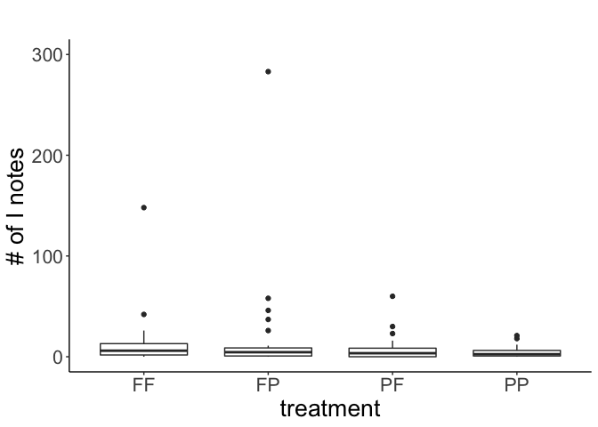<!-- -->

``` r
  C_plot
```

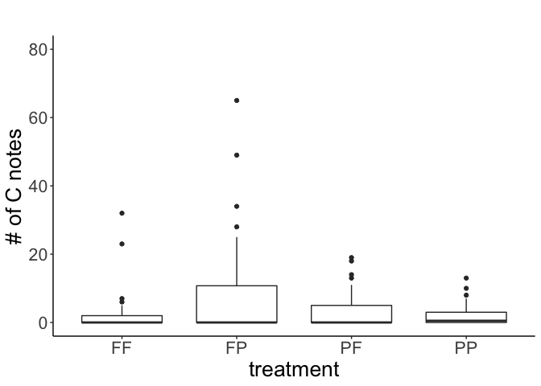<!-- -->

``` r
  H_plot
```

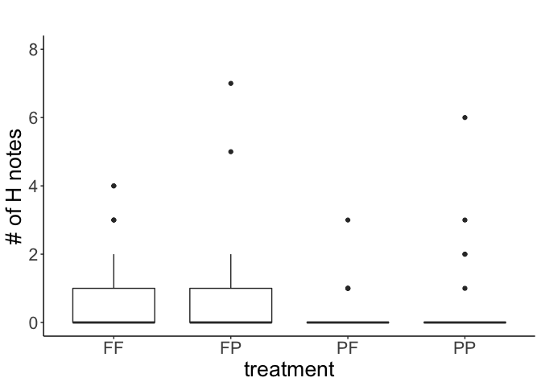<!-- -->

``` r
  D_plot
```

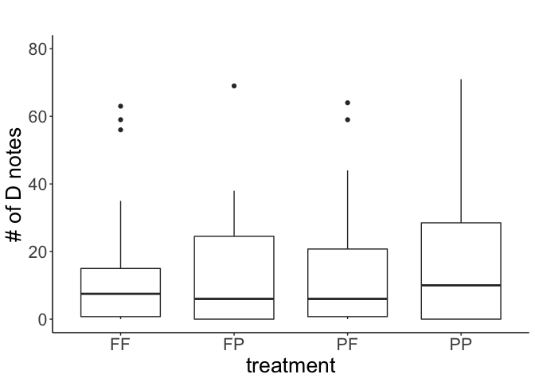<!-- -->

``` r
  seed_plot
```

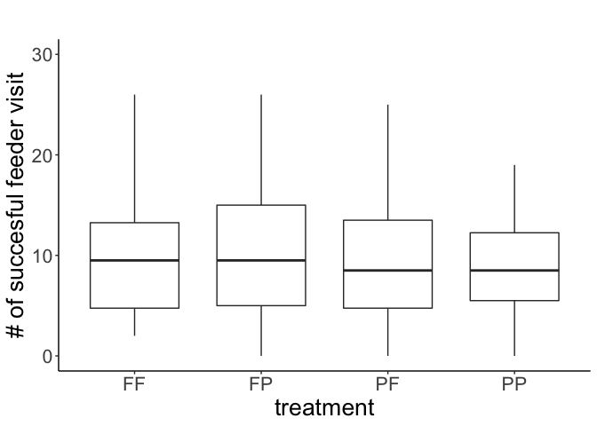<!-- -->

Testing if only order of treatment (regardless FF,FP,PF,PP)
mattered

``` r
D_m1=lmer(D~order_4*cach+pre_D+(1|site),data=playback_dat1)# x converge
```

    ## boundary (singular) fit: see ?isSingular

``` r
D_m1=glmmTMB(D~order_4*cach+log(pre_D+1)+(1|site),family=nbinom2(link = "log"), data=playback_dat1) 
Anova(D_m1,type=3)
```

    ## Analysis of Deviance Table (Type III Wald chisquare tests)
    ## 
    ## Response: D
    ##                 Chisq Df Pr(>Chisq)  
    ## (Intercept)    2.9015  1    0.08850 .
    ## order_4        1.5692  3    0.66640  
    ## cach           0.1672  1    0.68265  
    ## log(pre_D + 1) 5.3871  1    0.02029 *
    ## order_4:cach   1.1795  3    0.75793  
    ## ---
    ## Signif. codes:  0 '***' 0.001 '**' 0.01 '*' 0.05 '.' 0.1 ' ' 1

``` r
H_m1=glmmTMB(H~order_4*cach+log(pre_H+1)+(1|site),family=nbinom2(link = "log"), data=playback_dat1)
Anova(H_m1,type=3)
```

    ## Analysis of Deviance Table (Type III Wald chisquare tests)
    ## 
    ## Response: H
    ##                 Chisq Df Pr(>Chisq)  
    ## (Intercept)    0.1110  1    0.73905  
    ## order_4        1.4430  3    0.69548  
    ## cach           1.0044  1    0.31624  
    ## log(pre_H + 1) 6.5795  1    0.01032 *
    ## order_4:cach   1.1492  3    0.76521  
    ## ---
    ## Signif. codes:  0 '***' 0.001 '**' 0.01 '*' 0.05 '.' 0.1 ' ' 1

``` r
C_m1=glmmTMB(C~order_4*cach+log(pre_C+1)+(1|site),family=nbinom2(link = "log"), data=playback_dat1) 
Anova(C_m1,type=3)
```

    ## Analysis of Deviance Table (Type III Wald chisquare tests)
    ## 
    ## Response: C
    ##                  Chisq Df Pr(>Chisq)   
    ## (Intercept)     0.2483  1   0.618307   
    ## order_4        11.6922  3   0.008516 **
    ## cach            0.1183  1   0.730857   
    ## log(pre_C + 1)  7.2310  1   0.007165 **
    ## order_4:cach    9.6489  3   0.021799 * 
    ## ---
    ## Signif. codes:  0 '***' 0.001 '**' 0.01 '*' 0.05 '.' 0.1 ' ' 1

``` r
I_m1=glmmTMB(I~order_4*cach+log(pre_I+1)+(1|site),family=nbinom2(link = "log"), data=playback_dat1) 
Anova(I_m1,type=3)
```

    ## Analysis of Deviance Table (Type III Wald chisquare tests)
    ## 
    ## Response: I
    ##                 Chisq Df Pr(>Chisq)
    ## (Intercept)    0.4465  1     0.5040
    ## order_4        3.5498  3     0.3144
    ## cach           0.1830  1     0.6688
    ## log(pre_I + 1) 0.5322  1     0.4657
    ## order_4:cach   3.9029  3     0.2721

``` r
seed=lmer(seed~order_4*cach+pre_seed+(1|site),data=playback_dat1)
Anova(seed,type=3) 
```

    ## Analysis of Deviance Table (Type III Wald chisquare tests)
    ## 
    ## Response: seed
    ##                Chisq Df Pr(>Chisq)    
    ## (Intercept)   0.0023  1     0.9614    
    ## order_4       3.1489  3     0.3692    
    ## cach          0.3496  1     0.5543    
    ## pre_seed     23.6618  1  1.148e-06 ***
    ## order_4:cach  4.3971  3     0.2217    
    ## ---
    ## Signif. codes:  0 '***' 0.001 '**' 0.01 '*' 0.05 '.' 0.1 ' ' 1

plot results

``` r
#change the order of levels in treatment
#playback_dat$treatment=factor(playback_dat$treatment, levels=c("Pre","FF","FP","PF","PP"))
library(ggplot2)
  D_plot=ggplot(playback_dat1,aes(x=order_4,y=D))+
  #geom_violin(trim=F)+
  geom_boxplot(width=0.7,fill="white")+
  theme_classic()+
  ylim(0,80)+
  labs(title="",x="treatment order", y = "# of D notes") +
  theme(legend.position="none")+
  theme(text = element_text(size=20))
  
  I_plot=ggplot(playback_dat1,aes(x=order_4,y=I))+
  #geom_violin(trim=F)+
  geom_boxplot(width=0.7,fill="white")+
  theme_classic()+
  ylim(0,300)+
  labs(title="",x="treatment order", y = "# of I notes") +
  theme(legend.position="none")+
  theme(text = element_text(size=20))
  
  C_plot=ggplot(playback_dat1,aes(x=order_4,y=C))+
  geom_boxplot(width=0.7)+
  scale_fill_manual(values=c("white","gray"))+
  theme_classic()+
  ylim(0,80)+
  labs(title="",x="treatment order", y = "# of C notes") +
  theme(legend.position="none")+
  theme(text = element_text(size=20))
 

  H_plot=ggplot(playback_dat1,aes(x=order_4,y=H))+
  geom_boxplot(width=0.7,fill="white")+
  theme_classic()+
  ylim(0,8)+
  labs(title="",x="treatment order", y = "# of H notes") +
  theme(legend.position="none")+
  theme(text = element_text(size=20))
  
  seed_plot=ggplot(playback_dat1,aes(x=order_4,y=seed))+
  geom_boxplot(width=0.7,fill="white")+
  theme_classic()+
  ylim(0,30)+
  labs(title="",x="treatment order", y = "# of succesful feeder visit") +
  theme(legend.position="none")+
  theme(text = element_text(size=20))
  
  plot(playback_dat1$seed~playback_dat1$pre_seed)
```

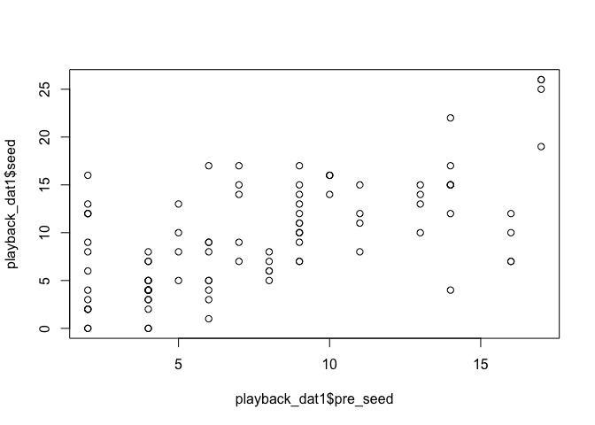<!-- -->

``` r
  I_plot
```

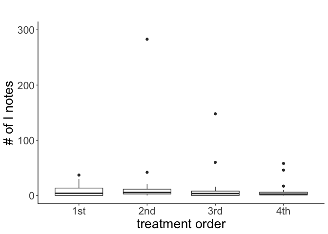<!-- -->

``` r
  C_plot
```

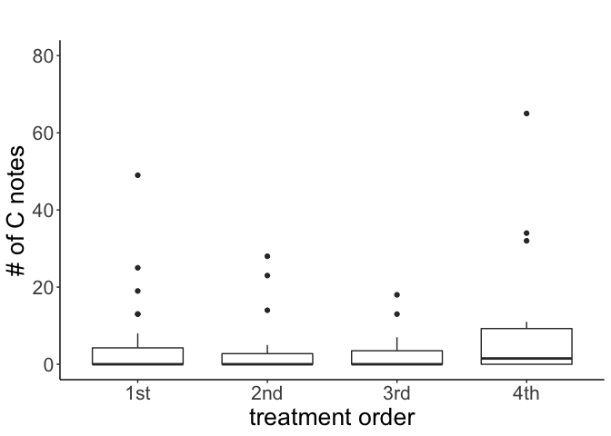<!-- -->

``` r
  H_plot
```

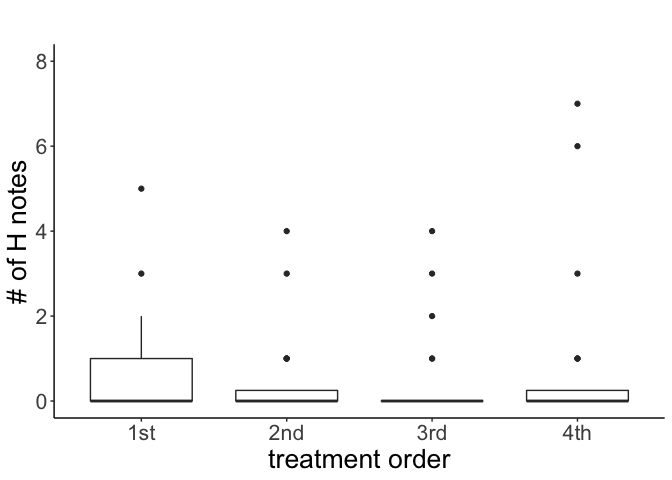<!-- -->

``` r
  D_plot
```

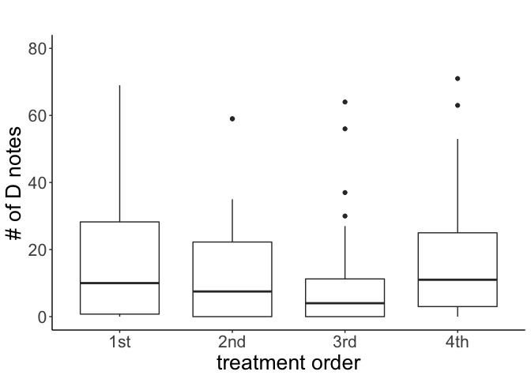<!-- -->

``` r
  seed_plot
```

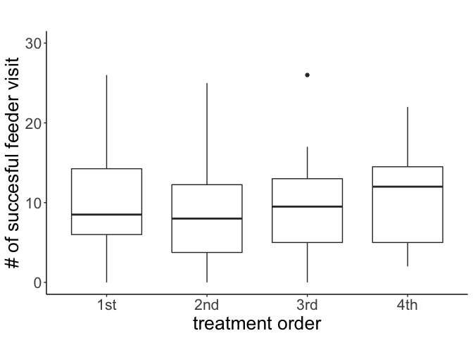<!-- --> IOR
(Inter-obsever
Reliability)

``` r
ior1=read.csv("~/Google Drive/UT/papers/Dissertation/study 2/coded_data/study2_IOR/study2_IOR_C_update.csv",header=T)
head(ior1)
```

    ##   site treatment concatenated I_TF C_TF H_TF D_TF I_HJ C_HJ H_HJ D_HJ
    ## 1  Ar1       1st       Ar11st    3    0    0   12    0    0    0    0
    ## 2  Ar1       3rd       Ar13rd   18    0    0   26    8    0    0   12
    ## 3  Ar1       pre       Ar1pre    8    3    1   13    2    0    1    9
    ## 4  Ar2       1st       Ar21st    8    0    0   13    8    0    0   13
    ## 5  Ar2       4th       Ar24th    5    0    0   33    3    1    0   32
    ## 6  Ar3       1st       Ar31st    1    0    0    1    0    0    0    0

``` r
library(Hmisc)
```

    ## Warning: package 'Hmisc' was built under R version 3.6.2

    ## Loading required package: lattice

    ## Loading required package: survival

    ## Warning: package 'survival' was built under R version 3.6.2

    ## Loading required package: Formula

    ## 
    ## Attaching package: 'Hmisc'

    ## The following objects are masked from 'package:base':
    ## 
    ##     format.pval, units

``` r
original1=ior1[,8:11]
iordata1=ior1[,4:7]

cormat1=matrix(data=NA,nrow=1,ncol=4)


for(i in 1:4){
  res1=cor.test(original1[,i],iordata1[,i])
  cormat1[,i]=res1$estimate #extracting correlation coefficient
}
cormat1
```

    ##           [,1]      [,2]      [,3]      [,4]
    ## [1,] 0.9348573 0.8763006 0.9397297 0.7544849

``` r
#I C H D
#I: 0.9349
#C: 0.8763
#H: 0.9397
#D: 0.7544
  

ior2=read.csv("~/Google Drive/UT/papers/Dissertation/study 2/coded_data/study2_IOR/study2_1_seed_IOR.csv",header=T)
head(ior2)
```

    ##    site treatment concatenated order graded_context callrate_context
    ## 1 Aplus        FP      AplusFP   4th              F                P
    ## 2 Aplus        PF      AplusPF   1st              P                F
    ## 3   AR1        PP        AR1PP   1st              P                P
    ## 4   AR1       Pre       AR1Pre   pre                                
    ## 5   AR3        PP        AR3PP   1st              P                P
    ## 6     B        FP          BFP   4th              F                P
    ##   seed_HJ seed_TF
    ## 1      17      17
    ## 2       9       9
    ## 3       3       3
    ## 4       6       5
    ## 5       9       9
    ## 6      16      16

``` r
original2=ior2[,7]
iordata2=ior2[,8]

res2=cor.test(original2,iordata2)
res2$estimate #extracting correlation coefficient
```

    ##       cor 
    ## 0.9476541

``` r
# seed taking IOR: 0.9476541
```
