study 3
================

1.  File opening and standardizing independent
variables

<!-- end list -->

``` r
#olddat=read.csv("~/Google Drive/UT/papers/Dissertation/study 3/dat.omit_20200317.csv",header=T) #this is old data with 11 incorrect values
rdat=read.csv("~/Google Drive/UT/papers/Dissertation/study 1/analyses/graded D notes/graded_20200416_1.csv",header=T)

dat=rdat[,c(6,9:18,2,1,30,4,7,8,3,31,5)]
#changing non-numeric values into NAs
for(i in 2:10){
  dat[,i]=as.numeric(as.character(dat[,i]))
}
```

    ## Warning: NAs introduced by coercion

``` r
library(na.tools)
dat=na.rm(dat)
unique(dat$site)#checking all sites names
```

    ##  [1] AR1       AR2       C         ecabin    edam      esam      etea     
    ##  [8] F         I         J         K         N         O         UV1      
    ## [15] UV2       UV3       W1        WAR       wburries  wcabin    WCAMPING 
    ## [22] wchuck    wdump     wexercise ecamping 
    ## 25 Levels: AR1 AR2 C ecabin ecamping edam esam etea F I J K N O ... wexercise

``` r
#changing column names
names(dat)[3]="dur"
names(dat)[4]="brk"
names(dat)[5]="dtm"
names(dat)[6]="pf"
names(dat)[7]="minf"
names(dat)[8]="maxf"
names(dat)[9]="bw"
names(dat)[10]="etrp"
names(dat)[11]="hnr"

#changing column names
names(rdat)[10]="dur"
names(rdat)[11]="brk"
names(rdat)[12]="dtm"
names(rdat)[13]="pf"
names(rdat)[14]="minf"
names(rdat)[15]="maxf"
names(rdat)[16]="bw"
names(rdat)[17]="etrp"
names(rdat)[18]="hnr"


#subsetting

food=dat[dat$context=="food",]
easo=dat[dat$context=="easo",]
mask=dat[dat$context=="mask",]


#standardizing each dataset
sfood=scale(food[,3:11], center=T, scale=T)
seaso=scale(easo[,3:11], center=T, scale=T)
smask=scale(mask[,3:11], center=T, scale=T)
sdat=scale(dat[,3:11],center=T, scale=T)
```

1.  Geographic variation 1.1 Classifying 2 locations (UTFRREC and NDSP)
    regardless of contexts, controlling contexts (easo, food, mask,
    respectively)

<!-- end list -->

``` r
library(caret)  
```

    ## Loading required package: lattice

    ## Loading required package: ggplot2

``` r
library(MLeval)
#dividing training vs test data
set.seed(123)
ftest=sample(1:nrow(sfood),0.2*nrow(sfood)) #making train index
ftrain=(-ftest)
#dim(sx[train,])
#dim(sx[test,])
#length(y[train])
#length(y[test])
fy=food[,19]
ftraindat=data.frame(x=sfood[ftrain,],y=fy[ftrain])
ftestdat=data.frame(x=sfood[ftest,],y=fy[ftest])
```

1.1.1 Food context only- 6 ML
parts

``` r
#Cross validation (copied from https://stackoverflow.com/questions/33470373/applying-k-fold-cross-validation-model-using-caret-package)

#1.3.1 KNN
train_ctrl=trainControl(method="cv",number=10)
set.seed(123)
f.knn.cv=train(y~., data=ftraindat,trControl=train_ctrl,method="knn")
print(f.knn.cv)# to see accuracy
```

    ## k-Nearest Neighbors 
    ## 
    ## 1832 samples
    ##    9 predictor
    ##    2 classes: 'NDSP', 'UTFRREC' 
    ## 
    ## No pre-processing
    ## Resampling: Cross-Validated (10 fold) 
    ## Summary of sample sizes: 1648, 1649, 1649, 1650, 1648, 1649, ... 
    ## Resampling results across tuning parameters:
    ## 
    ##   k  Accuracy   Kappa    
    ##   5  0.7281181  0.4498528
    ##   7  0.7357268  0.4644477
    ##   9  0.7460975  0.4860081
    ## 
    ## Accuracy was used to select the optimal model using the largest value.
    ## The final value used for the model was k = 9.

``` r
f.knn.pred=predict(f.knn.cv,ftestdat)
confusionMatrix(f.knn.pred,fy[ftest])
```

    ## Confusion Matrix and Statistics
    ## 
    ##           Reference
    ## Prediction NDSP UTFRREC
    ##    NDSP     191      50
    ##    UTFRREC   63     153
    ##                                           
    ##                Accuracy : 0.7527          
    ##                  95% CI : (0.7105, 0.7916)
    ##     No Information Rate : 0.5558          
    ##     P-Value [Acc > NIR] : <2e-16          
    ##                                           
    ##                   Kappa : 0.5024          
    ##                                           
    ##  Mcnemar's Test P-Value : 0.259           
    ##                                           
    ##             Sensitivity : 0.7520          
    ##             Specificity : 0.7537          
    ##          Pos Pred Value : 0.7925          
    ##          Neg Pred Value : 0.7083          
    ##              Prevalence : 0.5558          
    ##          Detection Rate : 0.4179          
    ##    Detection Prevalence : 0.5274          
    ##       Balanced Accuracy : 0.7528          
    ##                                           
    ##        'Positive' Class : NDSP            
    ## 

``` r
#1.3.2 Random Forest
train_ctrl=trainControl(method="cv",number=10)
set.seed(123)
f.rf.cv=train(y~., data=ftraindat,trControl=train_ctrl,method="rf")
print(f.rf.cv)
```

    ## Random Forest 
    ## 
    ## 1832 samples
    ##    9 predictor
    ##    2 classes: 'NDSP', 'UTFRREC' 
    ## 
    ## No pre-processing
    ## Resampling: Cross-Validated (10 fold) 
    ## Summary of sample sizes: 1648, 1649, 1649, 1650, 1648, 1649, ... 
    ## Resampling results across tuning parameters:
    ## 
    ##   mtry  Accuracy   Kappa    
    ##   2     0.7826892  0.5566120
    ##   5     0.7832387  0.5589178
    ##   9     0.7777979  0.5484601
    ## 
    ## Accuracy was used to select the optimal model using the largest value.
    ## The final value used for the model was mtry = 5.

``` r
f.rf.pred=predict(f.rf.cv,ftestdat)
confusionMatrix(f.rf.pred,fy[ftest])
```

    ## Confusion Matrix and Statistics
    ## 
    ##           Reference
    ## Prediction NDSP UTFRREC
    ##    NDSP     203      43
    ##    UTFRREC   51     160
    ##                                           
    ##                Accuracy : 0.7943          
    ##                  95% CI : (0.7543, 0.8305)
    ##     No Information Rate : 0.5558          
    ##     P-Value [Acc > NIR] : <2e-16          
    ##                                           
    ##                   Kappa : 0.5851          
    ##                                           
    ##  Mcnemar's Test P-Value : 0.4703          
    ##                                           
    ##             Sensitivity : 0.7992          
    ##             Specificity : 0.7882          
    ##          Pos Pred Value : 0.8252          
    ##          Neg Pred Value : 0.7583          
    ##              Prevalence : 0.5558          
    ##          Detection Rate : 0.4442          
    ##    Detection Prevalence : 0.5383          
    ##       Balanced Accuracy : 0.7937          
    ##                                           
    ##        'Positive' Class : NDSP            
    ## 

``` r
plot(varImp(object=f.rf.cv))
```

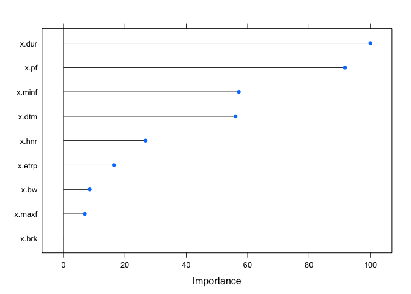<!-- -->

``` r
#1.3.3 SVM(Linear)
train_ctrl=trainControl(method="cv",number=10,classProbs=TRUE)
set.seed(123)
f.svml.cv=train(y~., data=ftraindat,trControl=train_ctrl,method="svmLinear") 
print(f.svml.cv)
```

    ## Support Vector Machines with Linear Kernel 
    ## 
    ## 1832 samples
    ##    9 predictor
    ##    2 classes: 'NDSP', 'UTFRREC' 
    ## 
    ## No pre-processing
    ## Resampling: Cross-Validated (10 fold) 
    ## Summary of sample sizes: 1648, 1649, 1649, 1650, 1648, 1649, ... 
    ## Resampling results:
    ## 
    ##   Accuracy   Kappa    
    ##   0.6528082  0.2820988
    ## 
    ## Tuning parameter 'C' was held constant at a value of 1

``` r
f.svml.pred=predict(f.svml.cv,ftestdat)
confusionMatrix(f.svml.pred,fy[ftest])
```

    ## Confusion Matrix and Statistics
    ## 
    ##           Reference
    ## Prediction NDSP UTFRREC
    ##    NDSP     200     102
    ##    UTFRREC   54     101
    ##                                           
    ##                Accuracy : 0.6586          
    ##                  95% CI : (0.6132, 0.7021)
    ##     No Information Rate : 0.5558          
    ##     P-Value [Acc > NIR] : 4.808e-06       
    ##                                           
    ##                   Kappa : 0.2919          
    ##                                           
    ##  Mcnemar's Test P-Value : 0.0001679       
    ##                                           
    ##             Sensitivity : 0.7874          
    ##             Specificity : 0.4975          
    ##          Pos Pred Value : 0.6623          
    ##          Neg Pred Value : 0.6516          
    ##              Prevalence : 0.5558          
    ##          Detection Rate : 0.4376          
    ##    Detection Prevalence : 0.6608          
    ##       Balanced Accuracy : 0.6425          
    ##                                           
    ##        'Positive' Class : NDSP            
    ## 

``` r
#1.3.3 SVM(radial)
train_ctrl=trainControl(method="cv",number=10,classProbs=TRUE)
set.seed(123)
f.svmr.cv=train(y~., data=ftraindat,trControl=train_ctrl,method="svmRadial") 
print(f.svmr.cv)
```

    ## Support Vector Machines with Radial Basis Function Kernel 
    ## 
    ## 1832 samples
    ##    9 predictor
    ##    2 classes: 'NDSP', 'UTFRREC' 
    ## 
    ## No pre-processing
    ## Resampling: Cross-Validated (10 fold) 
    ## Summary of sample sizes: 1648, 1649, 1649, 1650, 1648, 1649, ... 
    ## Resampling results across tuning parameters:
    ## 
    ##   C     Accuracy   Kappa    
    ##   0.25  0.7029898  0.3918041
    ##   0.50  0.7160988  0.4212019
    ##   1.00  0.7259021  0.4427173
    ## 
    ## Tuning parameter 'sigma' was held constant at a value of 0.1109634
    ## Accuracy was used to select the optimal model using the largest value.
    ## The final values used for the model were sigma = 0.1109634 and C = 1.

``` r
f.svmr.pred=predict(f.svmr.cv,ftestdat)
confusionMatrix(f.svmr.pred,fy[ftest])
```

    ## Confusion Matrix and Statistics
    ## 
    ##           Reference
    ## Prediction NDSP UTFRREC
    ##    NDSP     204      62
    ##    UTFRREC   50     141
    ##                                           
    ##                Accuracy : 0.7549          
    ##                  95% CI : (0.7128, 0.7937)
    ##     No Information Rate : 0.5558          
    ##     P-Value [Acc > NIR] : <2e-16          
    ##                                           
    ##                   Kappa : 0.5007          
    ##                                           
    ##  Mcnemar's Test P-Value : 0.2986          
    ##                                           
    ##             Sensitivity : 0.8031          
    ##             Specificity : 0.6946          
    ##          Pos Pred Value : 0.7669          
    ##          Neg Pred Value : 0.7382          
    ##              Prevalence : 0.5558          
    ##          Detection Rate : 0.4464          
    ##    Detection Prevalence : 0.5821          
    ##       Balanced Accuracy : 0.7489          
    ##                                           
    ##        'Positive' Class : NDSP            
    ## 

``` r
#1.3.3 LDA
train_ctrl=trainControl(method="cv",number=10)
set.seed(123)
f.lda.cv=train(y~., data=ftraindat,trControl=train_ctrl,method="lda") 
print(f.lda.cv)
```

    ## Linear Discriminant Analysis 
    ## 
    ## 1832 samples
    ##    9 predictor
    ##    2 classes: 'NDSP', 'UTFRREC' 
    ## 
    ## No pre-processing
    ## Resampling: Cross-Validated (10 fold) 
    ## Summary of sample sizes: 1648, 1649, 1649, 1650, 1648, 1649, ... 
    ## Resampling results:
    ## 
    ##   Accuracy   Kappa    
    ##   0.6505985  0.2814766

``` r
f.lda.pred=predict(f.lda.cv,ftestdat)
confusionMatrix(f.lda.pred,fy[ftest])
```

    ## Confusion Matrix and Statistics
    ## 
    ##           Reference
    ## Prediction NDSP UTFRREC
    ##    NDSP     188      93
    ##    UTFRREC   66     110
    ##                                           
    ##                Accuracy : 0.6521          
    ##                  95% CI : (0.6064, 0.6957)
    ##     No Information Rate : 0.5558          
    ##     P-Value [Acc > NIR] : 1.768e-05       
    ##                                           
    ##                   Kappa : 0.2858          
    ##                                           
    ##  Mcnemar's Test P-Value : 0.03921         
    ##                                           
    ##             Sensitivity : 0.7402          
    ##             Specificity : 0.5419          
    ##          Pos Pred Value : 0.6690          
    ##          Neg Pred Value : 0.6250          
    ##              Prevalence : 0.5558          
    ##          Detection Rate : 0.4114          
    ##    Detection Prevalence : 0.6149          
    ##       Balanced Accuracy : 0.6410          
    ##                                           
    ##        'Positive' Class : NDSP            
    ## 

``` r
#1.3.3 QDA
train_ctrl=trainControl(method="cv",number=10)
set.seed(123)
f.qda.cv=train(y~., data=ftraindat,trControl=train_ctrl,method="qda") 
print(f.qda.cv)
```

    ## Quadratic Discriminant Analysis 
    ## 
    ## 1832 samples
    ##    9 predictor
    ##    2 classes: 'NDSP', 'UTFRREC' 
    ## 
    ## No pre-processing
    ## Resampling: Cross-Validated (10 fold) 
    ## Summary of sample sizes: 1648, 1649, 1649, 1650, 1648, 1649, ... 
    ## Resampling results:
    ## 
    ##   Accuracy   Kappa    
    ##   0.6948319  0.3951558

``` r
f.qda.pred=predict(f.qda.cv,ftestdat)
confusionMatrix(f.qda.pred,fy[ftest])
```

    ## Confusion Matrix and Statistics
    ## 
    ##           Reference
    ## Prediction NDSP UTFRREC
    ##    NDSP     164      44
    ##    UTFRREC   90     159
    ##                                           
    ##                Accuracy : 0.7068          
    ##                  95% CI : (0.6627, 0.7482)
    ##     No Information Rate : 0.5558          
    ##     P-Value [Acc > NIR] : 2.428e-11       
    ##                                           
    ##                   Kappa : 0.4194          
    ##                                           
    ##  Mcnemar's Test P-Value : 0.0001013       
    ##                                           
    ##             Sensitivity : 0.6457          
    ##             Specificity : 0.7833          
    ##          Pos Pred Value : 0.7885          
    ##          Neg Pred Value : 0.6386          
    ##              Prevalence : 0.5558          
    ##          Detection Rate : 0.3589          
    ##    Detection Prevalence : 0.4551          
    ##       Balanced Accuracy : 0.7145          
    ##                                           
    ##        'Positive' Class : NDSP            
    ## 

``` r
#ROC curve 
library(ROCR)
```

    ## Loading required package: gplots

    ## 
    ## Attaching package: 'gplots'

    ## The following object is masked from 'package:stats':
    ## 
    ##     lowess

``` r
f.pred.knn=predict(f.knn.cv,ftestdat,type='prob')
f.pred.rf=predict(f.rf.cv,ftestdat,type="prob")
f.pred.svml=predict(f.svml.cv,ftestdat,type="prob")
f.pred.svmr=predict(f.svmr.cv,ftestdat,type="prob")
f.pred.lda=predict(f.lda.cv,ftestdat,type="prob")
f.pred.qda=predict(f.qda.cv,ftestdat,type="prob")

f.pred.knn1=prediction(f.pred.knn[,2],ftestdat$y)
f.pred.rf1=prediction(f.pred.rf[,2],ftestdat$y)
f.pred.svml1=prediction(f.pred.svml[,2],ftestdat$y)
f.pred.svmr1=prediction(f.pred.svmr[,2],ftestdat$y)
f.pred.lda1=prediction(f.pred.lda[,2],ftestdat$y)
f.pred.qda1=prediction(f.pred.qda[,2],ftestdat$y)

f.roc.knn=performance(f.pred.knn1,"tpr","fpr")
f.roc.rf=performance(f.pred.rf1,"tpr","fpr")
f.roc.svml=performance(f.pred.svml1,"tpr","fpr")
f.roc.svmr=performance(f.pred.svmr1,"tpr","fpr")
f.roc.lda=performance(f.pred.lda1,"tpr","fpr")
f.roc.qda=performance(f.pred.qda1,"tpr","fpr")

plot(f.roc.knn,col="orange",lwd=2)
plot(f.roc.rf,add=T,col="red",lwd=2)
plot(f.roc.svml,add=T,col="green",lwd=2)
plot(f.roc.svmr,add=T,col="blue",lwd=2)
plot(f.roc.lda,add=T,col="grey",lwd=2)
plot(f.roc.qda,add=T,col="purple",lwd=2)
legend("bottomright",legend=c("RF","KNN","SVM_L","SVM_R","LDA","QDA"),col=c("red","orange","green","blue","grey","purple"),lty=1,lwd=3,cex=0.7)
```

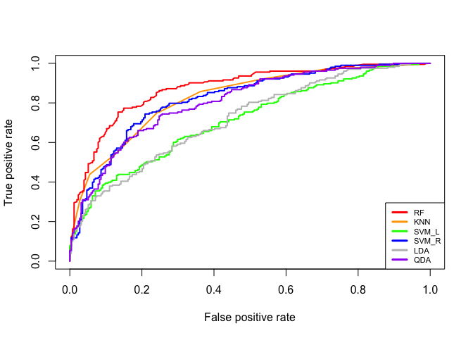<!-- --> 1.1.2.
Mask context only- 6 ML parts

``` r
set.seed(123)
mtest=sample(1:nrow(smask),0.2*nrow(smask)) #making train index
mtrain=(-mtest)

my=mask[,19]
mtraindat=data.frame(x=smask[mtrain,],y=my[mtrain])
mtestdat=data.frame(x=smask[mtest,],y=my[mtest])

#1.3.1 KNN
train_ctrl=trainControl(method="cv",number=10)
set.seed(123)
m.knn.cv=train(y~., data=mtraindat,trControl=train_ctrl,method="knn")
print(m.knn.cv)
```

    ## k-Nearest Neighbors 
    ## 
    ## 610 samples
    ##   9 predictor
    ##   2 classes: 'NDSP', 'UTFRREC' 
    ## 
    ## No pre-processing
    ## Resampling: Cross-Validated (10 fold) 
    ## Summary of sample sizes: 549, 549, 550, 549, 549, 550, ... 
    ## Resampling results across tuning parameters:
    ## 
    ##   k  Accuracy   Kappa    
    ##   5  0.7964710  0.5919705
    ##   7  0.7901534  0.5791499
    ##   9  0.7884338  0.5758652
    ## 
    ## Accuracy was used to select the optimal model using the largest value.
    ## The final value used for the model was k = 5.

``` r
m.knn.pred=predict(m.knn.cv,mtestdat)
confusionMatrix(m.knn.pred,my[mtest])
```

    ## Confusion Matrix and Statistics
    ## 
    ##           Reference
    ## Prediction NDSP UTFRREC
    ##    NDSP      55      20
    ##    UTFRREC   17      60
    ##                                           
    ##                Accuracy : 0.7566          
    ##                  95% CI : (0.6804, 0.8225)
    ##     No Information Rate : 0.5263          
    ##     P-Value [Acc > NIR] : 4.315e-09       
    ##                                           
    ##                   Kappa : 0.5128          
    ##                                           
    ##  Mcnemar's Test P-Value : 0.7423          
    ##                                           
    ##             Sensitivity : 0.7639          
    ##             Specificity : 0.7500          
    ##          Pos Pred Value : 0.7333          
    ##          Neg Pred Value : 0.7792          
    ##              Prevalence : 0.4737          
    ##          Detection Rate : 0.3618          
    ##    Detection Prevalence : 0.4934          
    ##       Balanced Accuracy : 0.7569          
    ##                                           
    ##        'Positive' Class : NDSP            
    ## 

``` r
#1.3.2 Random Forest
train_ctrl=trainControl(method="cv",number=10)
set.seed(123)
m.rf.cv=train(y~., data=mtraindat,trControl=train_ctrl,method="rf")
print(m.rf.cv)
```

    ## Random Forest 
    ## 
    ## 610 samples
    ##   9 predictor
    ##   2 classes: 'NDSP', 'UTFRREC' 
    ## 
    ## No pre-processing
    ## Resampling: Cross-Validated (10 fold) 
    ## Summary of sample sizes: 549, 549, 550, 549, 549, 550, ... 
    ## Resampling results across tuning parameters:
    ## 
    ##   mtry  Accuracy   Kappa    
    ##   2     0.8227049  0.6435930
    ##   5     0.8245056  0.6469679
    ##   9     0.8196148  0.6366956
    ## 
    ## Accuracy was used to select the optimal model using the largest value.
    ## The final value used for the model was mtry = 5.

``` r
m.rf.pred=predict(m.rf.cv,mtestdat)
confusionMatrix(m.rf.pred,my[mtest])
```

    ## Confusion Matrix and Statistics
    ## 
    ##           Reference
    ## Prediction NDSP UTFRREC
    ##    NDSP      50       9
    ##    UTFRREC   22      71
    ##                                          
    ##                Accuracy : 0.7961         
    ##                  95% CI : (0.7232, 0.857)
    ##     No Information Rate : 0.5263         
    ##     P-Value [Acc > NIR] : 4.436e-12      
    ##                                          
    ##                   Kappa : 0.5872         
    ##                                          
    ##  Mcnemar's Test P-Value : 0.03114        
    ##                                          
    ##             Sensitivity : 0.6944         
    ##             Specificity : 0.8875         
    ##          Pos Pred Value : 0.8475         
    ##          Neg Pred Value : 0.7634         
    ##              Prevalence : 0.4737         
    ##          Detection Rate : 0.3289         
    ##    Detection Prevalence : 0.3882         
    ##       Balanced Accuracy : 0.7910         
    ##                                          
    ##        'Positive' Class : NDSP           
    ## 

``` r
plot(varImp(object=m.rf.cv))
```

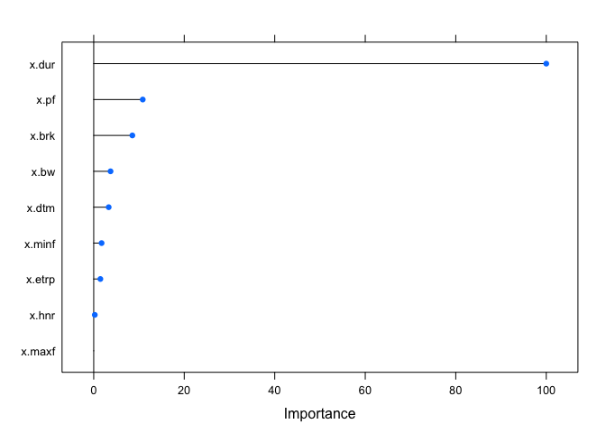<!-- -->

``` r
#1.3.3 SVM(Linear)
train_ctrl=trainControl(method="cv",number=10,classProbs=TRUE)
set.seed(123)
m.svml.cv=train(y~., data=mtraindat,trControl=train_ctrl,method="svmLinear") 
print(m.svml.cv)
```

    ## Support Vector Machines with Linear Kernel 
    ## 
    ## 610 samples
    ##   9 predictor
    ##   2 classes: 'NDSP', 'UTFRREC' 
    ## 
    ## No pre-processing
    ## Resampling: Cross-Validated (10 fold) 
    ## Summary of sample sizes: 549, 549, 550, 549, 549, 550, ... 
    ## Resampling results:
    ## 
    ##   Accuracy   Kappa    
    ##   0.5832179  0.1539644
    ## 
    ## Tuning parameter 'C' was held constant at a value of 1

``` r
m.svml.pred=predict(m.svml.cv,mtestdat)
confusionMatrix(m.svml.pred,my[mtest])
```

    ## Confusion Matrix and Statistics
    ## 
    ##           Reference
    ## Prediction NDSP UTFRREC
    ##    NDSP      28      24
    ##    UTFRREC   44      56
    ##                                           
    ##                Accuracy : 0.5526          
    ##                  95% CI : (0.4699, 0.6332)
    ##     No Information Rate : 0.5263          
    ##     P-Value [Acc > NIR] : 0.28523         
    ##                                           
    ##                   Kappa : 0.0901          
    ##                                           
    ##  Mcnemar's Test P-Value : 0.02122         
    ##                                           
    ##             Sensitivity : 0.3889          
    ##             Specificity : 0.7000          
    ##          Pos Pred Value : 0.5385          
    ##          Neg Pred Value : 0.5600          
    ##              Prevalence : 0.4737          
    ##          Detection Rate : 0.1842          
    ##    Detection Prevalence : 0.3421          
    ##       Balanced Accuracy : 0.5444          
    ##                                           
    ##        'Positive' Class : NDSP            
    ## 

``` r
#1.3.3 SVM(radial)
train_ctrl=trainControl(method="cv",number=10,classProbs=TRUE)
set.seed(123)
m.svmr.cv=train(y~., data=mtraindat,trControl=train_ctrl,method="svmRadial") 
print(m.svmr.cv)
```

    ## Support Vector Machines with Radial Basis Function Kernel 
    ## 
    ## 610 samples
    ##   9 predictor
    ##   2 classes: 'NDSP', 'UTFRREC' 
    ## 
    ## No pre-processing
    ## Resampling: Cross-Validated (10 fold) 
    ## Summary of sample sizes: 549, 549, 550, 549, 549, 550, ... 
    ## Resampling results across tuning parameters:
    ## 
    ##   C     Accuracy   Kappa    
    ##   0.25  0.7601833  0.5180276
    ##   0.50  0.7669038  0.5312803
    ##   1.00  0.7634902  0.5251880
    ## 
    ## Tuning parameter 'sigma' was held constant at a value of 0.09113168
    ## Accuracy was used to select the optimal model using the largest value.
    ## The final values used for the model were sigma = 0.09113168 and C = 0.5.

``` r
m.svmr.pred=predict(m.svmr.cv,mtestdat)
confusionMatrix(m.svmr.pred,my[mtest])
```

    ## Confusion Matrix and Statistics
    ## 
    ##           Reference
    ## Prediction NDSP UTFRREC
    ##    NDSP      55      13
    ##    UTFRREC   17      67
    ##                                           
    ##                Accuracy : 0.8026          
    ##                  95% CI : (0.7304, 0.8627)
    ##     No Information Rate : 0.5263          
    ##     P-Value [Acc > NIR] : 1.234e-12       
    ##                                           
    ##                   Kappa : 0.6031          
    ##                                           
    ##  Mcnemar's Test P-Value : 0.5839          
    ##                                           
    ##             Sensitivity : 0.7639          
    ##             Specificity : 0.8375          
    ##          Pos Pred Value : 0.8088          
    ##          Neg Pred Value : 0.7976          
    ##              Prevalence : 0.4737          
    ##          Detection Rate : 0.3618          
    ##    Detection Prevalence : 0.4474          
    ##       Balanced Accuracy : 0.8007          
    ##                                           
    ##        'Positive' Class : NDSP            
    ## 

``` r
#1.3.3 LDA
train_ctrl=trainControl(method="cv",number=10)
set.seed(123)
m.lda.cv=train(y~., data=mtraindat,trControl=train_ctrl,method="lda") #Q: Do I need to set a tune grid???
print(m.lda.cv)
```

    ## Linear Discriminant Analysis 
    ## 
    ## 610 samples
    ##   9 predictor
    ##   2 classes: 'NDSP', 'UTFRREC' 
    ## 
    ## No pre-processing
    ## Resampling: Cross-Validated (10 fold) 
    ## Summary of sample sizes: 549, 549, 550, 549, 549, 550, ... 
    ## Resampling results:
    ## 
    ##   Accuracy   Kappa    
    ##   0.5816579  0.1539004

``` r
m.lda.pred=predict(m.lda.cv,mtestdat)
confusionMatrix(m.lda.pred,my[mtest])
```

    ## Confusion Matrix and Statistics
    ## 
    ##           Reference
    ## Prediction NDSP UTFRREC
    ##    NDSP      32      26
    ##    UTFRREC   40      54
    ##                                           
    ##                Accuracy : 0.5658          
    ##                  95% CI : (0.4831, 0.6459)
    ##     No Information Rate : 0.5263          
    ##     P-Value [Acc > NIR] : 0.1859          
    ##                                           
    ##                   Kappa : 0.1206          
    ##                                           
    ##  Mcnemar's Test P-Value : 0.1096          
    ##                                           
    ##             Sensitivity : 0.4444          
    ##             Specificity : 0.6750          
    ##          Pos Pred Value : 0.5517          
    ##          Neg Pred Value : 0.5745          
    ##              Prevalence : 0.4737          
    ##          Detection Rate : 0.2105          
    ##    Detection Prevalence : 0.3816          
    ##       Balanced Accuracy : 0.5597          
    ##                                           
    ##        'Positive' Class : NDSP            
    ## 

``` r
#1.3.3 QDA
train_ctrl=trainControl(method="cv",number=10)
set.seed(123)
m.qda.cv=train(y~., data=mtraindat,trControl=train_ctrl,method="qda") #Q: Do I need to set a tune grid???
print(m.qda.cv)
```

    ## Quadratic Discriminant Analysis 
    ## 
    ## 610 samples
    ##   9 predictor
    ##   2 classes: 'NDSP', 'UTFRREC' 
    ## 
    ## No pre-processing
    ## Resampling: Cross-Validated (10 fold) 
    ## Summary of sample sizes: 549, 549, 550, 549, 549, 550, ... 
    ## Resampling results:
    ## 
    ##   Accuracy   Kappa    
    ##   0.7272616  0.4560978

``` r
m.qda.pred=predict(m.qda.cv,mtestdat)
confusionMatrix(m.qda.pred,my[mtest])
```

    ## Confusion Matrix and Statistics
    ## 
    ##           Reference
    ## Prediction NDSP UTFRREC
    ##    NDSP      55      29
    ##    UTFRREC   17      51
    ##                                           
    ##                Accuracy : 0.6974          
    ##                  95% CI : (0.6177, 0.7692)
    ##     No Information Rate : 0.5263          
    ##     P-Value [Acc > NIR] : 1.302e-05       
    ##                                           
    ##                   Kappa : 0.3981          
    ##                                           
    ##  Mcnemar's Test P-Value : 0.1048          
    ##                                           
    ##             Sensitivity : 0.7639          
    ##             Specificity : 0.6375          
    ##          Pos Pred Value : 0.6548          
    ##          Neg Pred Value : 0.7500          
    ##              Prevalence : 0.4737          
    ##          Detection Rate : 0.3618          
    ##    Detection Prevalence : 0.5526          
    ##       Balanced Accuracy : 0.7007          
    ##                                           
    ##        'Positive' Class : NDSP            
    ## 

``` r
#ROC curve 
library(ROCR)
m.pred.knn=predict(m.knn.cv,mtestdat,type='prob')
m.pred.rf=predict(m.rf.cv,mtestdat,type="prob")
m.pred.svml=predict(m.svml.cv,mtestdat,type="prob")
m.pred.svmr=predict(m.svmr.cv,mtestdat,type="prob")
m.pred.lda=predict(m.lda.cv,mtestdat,type="prob")
m.pred.qda=predict(m.qda.cv,mtestdat,type="prob")

m.pred.knn1=prediction(m.pred.knn[,2],mtestdat$y)
m.pred.rf1=prediction(m.pred.rf[,2],mtestdat$y)
m.pred.svml1=prediction(m.pred.svml[,2],mtestdat$y)
m.pred.svmr1=prediction(m.pred.svmr[,2],mtestdat$y)
m.pred.lda1=prediction(m.pred.lda[,2],mtestdat$y)
m.pred.qda1=prediction(m.pred.qda[,2],mtestdat$y)

m.roc.knn=performance(m.pred.knn1,"tpr","fpr")
m.roc.rf=performance(m.pred.rf1,"tpr","fpr")
m.roc.svml=performance(m.pred.svml1,"tpr","fpr")
m.roc.svmr=performance(m.pred.svmr1,"tpr","fpr")
m.roc.lda=performance(m.pred.lda1,"tpr","fpr")
m.roc.qda=performance(m.pred.qda1,"tpr","fpr")

plot(m.roc.knn,col="orange",lwd=2)
plot(m.roc.rf,add=T,col="red",lwd=2)
plot(m.roc.svml,add=T,col="green",lwd=2)
plot(m.roc.svmr,add=T,col="blue",lwd=2)
plot(m.roc.lda,add=T,col="grey",lwd=2)
plot(m.roc.qda,add=T,col="purple",lwd=2)
legend("bottomright",legend=c("RF","KNN","SVM_L","SVM_R","LDA","QDA"),col=c("red","orange","green","blue","grey","purple"),lty=1,lwd=3,cex=0.7)
```

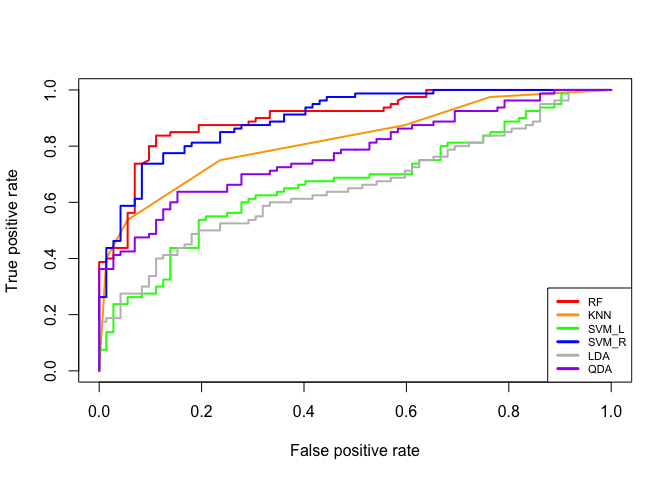<!-- -->

1.1.3. Classifying 2 locations in Easo context only- 6 ML parts

``` r
set.seed(123)
etest=sample(1:nrow(seaso),0.2*nrow(seaso)) #making train index
etrain=(-etest)

ey=easo[,19]
etraindat=data.frame(x=seaso[etrain,],y=ey[etrain])
etestdat=data.frame(x=seaso[etest,],y=ey[etest])

#1.3.1 KNN

train_ctrl=trainControl(method="cv",number=10)
set.seed(123)
e.knn.cv=train(y~., data=etraindat,trControl=train_ctrl,method="knn")
print(e.knn.cv)
```

    ## k-Nearest Neighbors 
    ## 
    ## 1440 samples
    ##    9 predictor
    ##    2 classes: 'NDSP', 'UTFRREC' 
    ## 
    ## No pre-processing
    ## Resampling: Cross-Validated (10 fold) 
    ## Summary of sample sizes: 1296, 1295, 1296, 1296, 1296, 1296, ... 
    ## Resampling results across tuning parameters:
    ## 
    ##   k  Accuracy   Kappa    
    ##   5  0.7416591  0.4460869
    ##   7  0.7437137  0.4470926
    ##   9  0.7339817  0.4260840
    ## 
    ## Accuracy was used to select the optimal model using the largest value.
    ## The final value used for the model was k = 7.

``` r
e.knn.pred=predict(e.knn.cv,etestdat)
confusionMatrix(e.knn.pred,ey[etest])
```

    ## Confusion Matrix and Statistics
    ## 
    ##           Reference
    ## Prediction NDSP UTFRREC
    ##    NDSP     192      48
    ##    UTFRREC   26      94
    ##                                         
    ##                Accuracy : 0.7944        
    ##                  95% CI : (0.749, 0.835)
    ##     No Information Rate : 0.6056        
    ##     P-Value [Acc > NIR] : 1.431e-14     
    ##                                         
    ##                   Kappa : 0.5578        
    ##                                         
    ##  Mcnemar's Test P-Value : 0.01464       
    ##                                         
    ##             Sensitivity : 0.8807        
    ##             Specificity : 0.6620        
    ##          Pos Pred Value : 0.8000        
    ##          Neg Pred Value : 0.7833        
    ##              Prevalence : 0.6056        
    ##          Detection Rate : 0.5333        
    ##    Detection Prevalence : 0.6667        
    ##       Balanced Accuracy : 0.7714        
    ##                                         
    ##        'Positive' Class : NDSP          
    ## 

``` r
#1.3.2 Random Forest
train_ctrl=trainControl(method="cv",number=10)
set.seed(123)
e.rf.cv=train(y~., data=etraindat,trControl=train_ctrl,method="rf")
print(e.rf.cv)
```

    ## Random Forest 
    ## 
    ## 1440 samples
    ##    9 predictor
    ##    2 classes: 'NDSP', 'UTFRREC' 
    ## 
    ## No pre-processing
    ## Resampling: Cross-Validated (10 fold) 
    ## Summary of sample sizes: 1296, 1295, 1296, 1296, 1296, 1296, ... 
    ## Resampling results across tuning parameters:
    ## 
    ##   mtry  Accuracy   Kappa    
    ##   2     0.7944425  0.5573348
    ##   5     0.7874788  0.5428102
    ##   9     0.7777611  0.5221634
    ## 
    ## Accuracy was used to select the optimal model using the largest value.
    ## The final value used for the model was mtry = 2.

``` r
e.rf.pred=predict(e.rf.cv,etestdat)
confusionMatrix(e.rf.pred,ey[etest])
```

    ## Confusion Matrix and Statistics
    ## 
    ##           Reference
    ## Prediction NDSP UTFRREC
    ##    NDSP     195      48
    ##    UTFRREC   23      94
    ##                                           
    ##                Accuracy : 0.8028          
    ##                  95% CI : (0.7579, 0.8426)
    ##     No Information Rate : 0.6056          
    ##     P-Value [Acc > NIR] : 8.168e-16       
    ##                                           
    ##                   Kappa : 0.5741          
    ##                                           
    ##  Mcnemar's Test P-Value : 0.004396        
    ##                                           
    ##             Sensitivity : 0.8945          
    ##             Specificity : 0.6620          
    ##          Pos Pred Value : 0.8025          
    ##          Neg Pred Value : 0.8034          
    ##              Prevalence : 0.6056          
    ##          Detection Rate : 0.5417          
    ##    Detection Prevalence : 0.6750          
    ##       Balanced Accuracy : 0.7782          
    ##                                           
    ##        'Positive' Class : NDSP            
    ## 

``` r
plot(varImp(object=e.rf.cv))
```

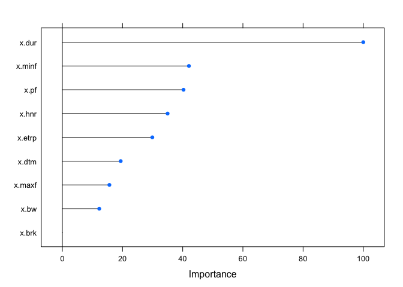<!-- -->

``` r
#1.3.3 SVM(Linear)
train_ctrl=trainControl(method="cv",number=10,classProbs=TRUE)
set.seed(123)
e.svml.cv=train(y~., data=etraindat,trControl=train_ctrl,method="svmLinear") 
print(e.svml.cv)
```

    ## Support Vector Machines with Linear Kernel 
    ## 
    ## 1440 samples
    ##    9 predictor
    ##    2 classes: 'NDSP', 'UTFRREC' 
    ## 
    ## No pre-processing
    ## Resampling: Cross-Validated (10 fold) 
    ## Summary of sample sizes: 1296, 1295, 1296, 1296, 1296, 1296, ... 
    ## Resampling results:
    ## 
    ##   Accuracy   Kappa   
    ##   0.7153134  0.375063
    ## 
    ## Tuning parameter 'C' was held constant at a value of 1

``` r
e.svml.pred=predict(e.svml.cv,etestdat)
confusionMatrix(e.svml.pred,ey[etest])
```

    ## Confusion Matrix and Statistics
    ## 
    ##           Reference
    ## Prediction NDSP UTFRREC
    ##    NDSP     197      75
    ##    UTFRREC   21      67
    ##                                           
    ##                Accuracy : 0.7333          
    ##                  95% CI : (0.6845, 0.7783)
    ##     No Information Rate : 0.6056          
    ##     P-Value [Acc > NIR] : 2.463e-07       
    ##                                           
    ##                   Kappa : 0.4022          
    ##                                           
    ##  Mcnemar's Test P-Value : 6.328e-08       
    ##                                           
    ##             Sensitivity : 0.9037          
    ##             Specificity : 0.4718          
    ##          Pos Pred Value : 0.7243          
    ##          Neg Pred Value : 0.7614          
    ##              Prevalence : 0.6056          
    ##          Detection Rate : 0.5472          
    ##    Detection Prevalence : 0.7556          
    ##       Balanced Accuracy : 0.6878          
    ##                                           
    ##        'Positive' Class : NDSP            
    ## 

``` r
#1.3.3 SVM(radial)
train_ctrl=trainControl(method="cv",number=10,classProbs=TRUE)
set.seed(123)
e.svmr.cv=train(y~., data=etraindat,trControl=train_ctrl,method="svmRadial") 
print(e.svmr.cv)
```

    ## Support Vector Machines with Radial Basis Function Kernel 
    ## 
    ## 1440 samples
    ##    9 predictor
    ##    2 classes: 'NDSP', 'UTFRREC' 
    ## 
    ## No pre-processing
    ## Resampling: Cross-Validated (10 fold) 
    ## Summary of sample sizes: 1296, 1295, 1296, 1296, 1296, 1296, ... 
    ## Resampling results across tuning parameters:
    ## 
    ##   C     Accuracy   Kappa    
    ##   0.25  0.7493127  0.4528264
    ##   0.50  0.7590062  0.4737050
    ##   1.00  0.7624738  0.4825698
    ## 
    ## Tuning parameter 'sigma' was held constant at a value of 0.08762406
    ## Accuracy was used to select the optimal model using the largest value.
    ## The final values used for the model were sigma = 0.08762406 and C = 1.

``` r
e.svmr.pred=predict(e.svmr.cv,etestdat)
confusionMatrix(e.svmr.pred,ey[etest])
```

    ## Confusion Matrix and Statistics
    ## 
    ##           Reference
    ## Prediction NDSP UTFRREC
    ##    NDSP     194      53
    ##    UTFRREC   24      89
    ##                                           
    ##                Accuracy : 0.7861          
    ##                  95% CI : (0.7401, 0.8274)
    ##     No Information Rate : 0.6056          
    ##     P-Value [Acc > NIR] : 2.157e-13       
    ##                                           
    ##                   Kappa : 0.5357          
    ##                                           
    ##  Mcnemar's Test P-Value : 0.001418        
    ##                                           
    ##             Sensitivity : 0.8899          
    ##             Specificity : 0.6268          
    ##          Pos Pred Value : 0.7854          
    ##          Neg Pred Value : 0.7876          
    ##              Prevalence : 0.6056          
    ##          Detection Rate : 0.5389          
    ##    Detection Prevalence : 0.6861          
    ##       Balanced Accuracy : 0.7583          
    ##                                           
    ##        'Positive' Class : NDSP            
    ## 

``` r
#1.3.3 LDA
train_ctrl=trainControl(method="cv",number=10)
set.seed(123)
e.lda.cv=train(y~., data=etraindat,trControl=train_ctrl,method="lda") 
print(e.lda.cv)
```

    ## Linear Discriminant Analysis 
    ## 
    ## 1440 samples
    ##    9 predictor
    ##    2 classes: 'NDSP', 'UTFRREC' 
    ## 
    ## No pre-processing
    ## Resampling: Cross-Validated (10 fold) 
    ## Summary of sample sizes: 1296, 1295, 1296, 1296, 1296, 1296, ... 
    ## Resampling results:
    ## 
    ##   Accuracy   Kappa    
    ##   0.7035221  0.3548159

``` r
e.lda.pred=predict(e.lda.cv,etestdat)
confusionMatrix(e.lda.pred,ey[etest])
```

    ## Confusion Matrix and Statistics
    ## 
    ##           Reference
    ## Prediction NDSP UTFRREC
    ##    NDSP     192      71
    ##    UTFRREC   26      71
    ##                                           
    ##                Accuracy : 0.7306          
    ##                  95% CI : (0.6816, 0.7757)
    ##     No Information Rate : 0.6056          
    ##     P-Value [Acc > NIR] : 4.440e-07       
    ##                                           
    ##                   Kappa : 0.403           
    ##                                           
    ##  Mcnemar's Test P-Value : 7.913e-06       
    ##                                           
    ##             Sensitivity : 0.8807          
    ##             Specificity : 0.5000          
    ##          Pos Pred Value : 0.7300          
    ##          Neg Pred Value : 0.7320          
    ##              Prevalence : 0.6056          
    ##          Detection Rate : 0.5333          
    ##    Detection Prevalence : 0.7306          
    ##       Balanced Accuracy : 0.6904          
    ##                                           
    ##        'Positive' Class : NDSP            
    ## 

``` r
#1.3.3 QDA
train_ctrl=trainControl(method="cv",number=10)
set.seed(123)
e.qda.cv=train(y~., data=etraindat,trControl=train_ctrl,method="qda") #Q: Do I need to set a tune grid???
print(e.qda.cv)
```

    ## Quadratic Discriminant Analysis 
    ## 
    ## 1440 samples
    ##    9 predictor
    ##    2 classes: 'NDSP', 'UTFRREC' 
    ## 
    ## No pre-processing
    ## Resampling: Cross-Validated (10 fold) 
    ## Summary of sample sizes: 1296, 1295, 1296, 1296, 1296, 1296, ... 
    ## Resampling results:
    ## 
    ##   Accuracy   Kappa    
    ##   0.7353851  0.4462885

``` r
e.qda.pred=predict(e.qda.cv,etestdat)
confusionMatrix(e.qda.pred,ey[etest])
```

    ## Confusion Matrix and Statistics
    ## 
    ##           Reference
    ## Prediction NDSP UTFRREC
    ##    NDSP     177      47
    ##    UTFRREC   41      95
    ##                                           
    ##                Accuracy : 0.7556          
    ##                  95% CI : (0.7078, 0.7991)
    ##     No Information Rate : 0.6056          
    ##     P-Value [Acc > NIR] : 1.331e-09       
    ##                                           
    ##                   Kappa : 0.4845          
    ##                                           
    ##  Mcnemar's Test P-Value : 0.594           
    ##                                           
    ##             Sensitivity : 0.8119          
    ##             Specificity : 0.6690          
    ##          Pos Pred Value : 0.7902          
    ##          Neg Pred Value : 0.6985          
    ##              Prevalence : 0.6056          
    ##          Detection Rate : 0.4917          
    ##    Detection Prevalence : 0.6222          
    ##       Balanced Accuracy : 0.7405          
    ##                                           
    ##        'Positive' Class : NDSP            
    ## 

``` r
library(ROCR)
e.pred.knn=predict(e.knn.cv,etestdat,type='prob')
e.pred.rf=predict(e.rf.cv,etestdat,type="prob")
e.pred.svml=predict(e.svml.cv,etestdat,type="prob")
e.pred.svmr=predict(e.svmr.cv,etestdat,type="prob")
e.pred.lda=predict(e.lda.cv,etestdat,type="prob")
e.pred.qda=predict(e.qda.cv,etestdat,type="prob")

e.pred.knn1=prediction(e.pred.knn[,2],etestdat$y)
e.pred.rf1=prediction(e.pred.rf[,2],etestdat$y)
e.pred.svml1=prediction(e.pred.svml[,2],etestdat$y)
e.pred.svmr1=prediction(e.pred.svmr[,2],etestdat$y)
e.pred.lda1=prediction(e.pred.lda[,2],etestdat$y)
e.pred.qda1=prediction(e.pred.qda[,2],etestdat$y)

e.roc.knn=performance(e.pred.knn1,"tpr","fpr")
e.roc.rf=performance(e.pred.rf1,"tpr","fpr")
e.roc.svml=performance(e.pred.svml1,"tpr","fpr")
e.roc.svmr=performance(e.pred.svmr1,"tpr","fpr")
e.roc.lda=performance(e.pred.lda1,"tpr","fpr")
e.roc.qda=performance(e.pred.qda1,"tpr","fpr")

plot(e.roc.knn,col="orange",lwd=2)
plot(e.roc.rf,add=T,col="red",lwd=2)
plot(e.roc.svml,add=T,col="green",lwd=2)
plot(e.roc.svmr,add=T,col="blue",lwd=2)
plot(e.roc.lda,add=T,col="grey",lwd=2)
plot(e.roc.qda,add=T,col="purple",lwd=2)
legend("bottomright",legend=c("RF","KNN","SVM_L","SVM_R","LDA","QDA"),col=c("red","orange","green","blue","grey","purple"),lty=1,lwd=3,cex=0.7)
```

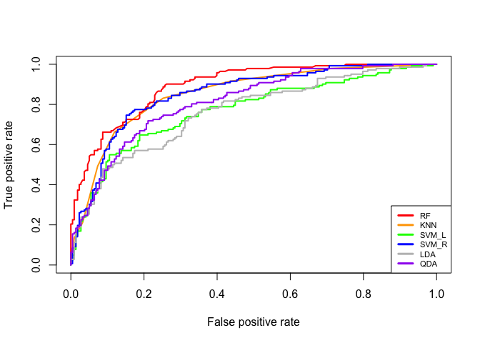<!-- --> 1.1.4.
UTFRREC vs NDSP disregarding context diff (all 3 contexts together)

``` r
set.seed(123)
test=sample(1:nrow(sdat),0.2*nrow(sdat)) 
train=(-test)

y=dat[,19]
traindat=data.frame(x=sdat[train,],y=y[train])
testdat=data.frame(x=sdat[test,],y=y[test])

#1.3.1 KNN
train_ctrl=trainControl(method="cv",number=10)
set.seed(123)
knn.cv=train(y~., data=traindat,trControl=train_ctrl,method="knn")
print(knn.cv)
```

    ## k-Nearest Neighbors 
    ## 
    ## 3881 samples
    ##    9 predictor
    ##    2 classes: 'NDSP', 'UTFRREC' 
    ## 
    ## No pre-processing
    ## Resampling: Cross-Validated (10 fold) 
    ## Summary of sample sizes: 3492, 3493, 3493, 3493, 3493, 3493, ... 
    ## Resampling results across tuning parameters:
    ## 
    ##   k  Accuracy   Kappa    
    ##   5  0.7108976  0.4126030
    ##   7  0.7191464  0.4280168
    ##   9  0.7204370  0.4299706
    ## 
    ## Accuracy was used to select the optimal model using the largest value.
    ## The final value used for the model was k = 9.

``` r
knn.pred=predict(knn.cv,testdat)
confusionMatrix(knn.pred,y[test])
```

    ## Confusion Matrix and Statistics
    ## 
    ##           Reference
    ## Prediction NDSP UTFRREC
    ##    NDSP     420     148
    ##    UTFRREC  134     268
    ##                                           
    ##                Accuracy : 0.7093          
    ##                  95% CI : (0.6796, 0.7377)
    ##     No Information Rate : 0.5711          
    ##     P-Value [Acc > NIR] : <2e-16          
    ##                                           
    ##                   Kappa : 0.404           
    ##                                           
    ##  Mcnemar's Test P-Value : 0.4388          
    ##                                           
    ##             Sensitivity : 0.7581          
    ##             Specificity : 0.6442          
    ##          Pos Pred Value : 0.7394          
    ##          Neg Pred Value : 0.6667          
    ##              Prevalence : 0.5711          
    ##          Detection Rate : 0.4330          
    ##    Detection Prevalence : 0.5856          
    ##       Balanced Accuracy : 0.7012          
    ##                                           
    ##        'Positive' Class : NDSP            
    ## 

``` r
#1.3.2 Random Forest
train_ctrl=trainControl(method="cv",number=10)
set.seed(123)
rf.cv=train(y~., data=traindat,trControl=train_ctrl,method="rf")
print(rf.cv)
```

    ## Random Forest 
    ## 
    ## 3881 samples
    ##    9 predictor
    ##    2 classes: 'NDSP', 'UTFRREC' 
    ## 
    ## No pre-processing
    ## Resampling: Cross-Validated (10 fold) 
    ## Summary of sample sizes: 3492, 3493, 3493, 3493, 3493, 3493, ... 
    ## Resampling results across tuning parameters:
    ## 
    ##   mtry  Accuracy   Kappa    
    ##   2     0.7567633  0.5004108
    ##   5     0.7577956  0.5036466
    ##   9     0.7536699  0.4953787
    ## 
    ## Accuracy was used to select the optimal model using the largest value.
    ## The final value used for the model was mtry = 5.

``` r
rf.pred=predict(rf.cv,testdat)
confusionMatrix(rf.pred,y[test])
```

    ## Confusion Matrix and Statistics
    ## 
    ##           Reference
    ## Prediction NDSP UTFRREC
    ##    NDSP     462     133
    ##    UTFRREC   92     283
    ##                                           
    ##                Accuracy : 0.768           
    ##                  95% CI : (0.7402, 0.7943)
    ##     No Information Rate : 0.5711          
    ##     P-Value [Acc > NIR] : < 2.2e-16       
    ##                                           
    ##                   Kappa : 0.5206          
    ##                                           
    ##  Mcnemar's Test P-Value : 0.007661        
    ##                                           
    ##             Sensitivity : 0.8339          
    ##             Specificity : 0.6803          
    ##          Pos Pred Value : 0.7765          
    ##          Neg Pred Value : 0.7547          
    ##              Prevalence : 0.5711          
    ##          Detection Rate : 0.4763          
    ##    Detection Prevalence : 0.6134          
    ##       Balanced Accuracy : 0.7571          
    ##                                           
    ##        'Positive' Class : NDSP            
    ## 

``` r
plot(varImp(object=rf.cv))
```

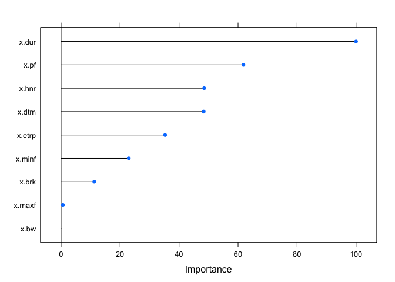<!-- -->

``` r
#1.3.3 SVM(Linear)
train_ctrl=trainControl(method="cv",number=10,classProbs=TRUE)
set.seed(123)
svml.cv=train(y~., data=traindat,trControl=train_ctrl,method="svmLinear") 
print(svml.cv)
```

    ## Support Vector Machines with Linear Kernel 
    ## 
    ## 3881 samples
    ##    9 predictor
    ##    2 classes: 'NDSP', 'UTFRREC' 
    ## 
    ## No pre-processing
    ## Resampling: Cross-Validated (10 fold) 
    ## Summary of sample sizes: 3492, 3493, 3493, 3493, 3493, 3493, ... 
    ## Resampling results:
    ## 
    ##   Accuracy  Kappa    
    ##   0.664266  0.3004665
    ## 
    ## Tuning parameter 'C' was held constant at a value of 1

``` r
svml.pred=predict(svml.cv,testdat)
confusionMatrix(svml.pred,y[test])
```

    ## Confusion Matrix and Statistics
    ## 
    ##           Reference
    ## Prediction NDSP UTFRREC
    ##    NDSP     455     208
    ##    UTFRREC   99     208
    ##                                           
    ##                Accuracy : 0.6835          
    ##                  95% CI : (0.6532, 0.7127)
    ##     No Information Rate : 0.5711          
    ##     P-Value [Acc > NIR] : 4.404e-13       
    ##                                           
    ##                   Kappa : 0.3321          
    ##                                           
    ##  Mcnemar's Test P-Value : 7.098e-10       
    ##                                           
    ##             Sensitivity : 0.8213          
    ##             Specificity : 0.5000          
    ##          Pos Pred Value : 0.6863          
    ##          Neg Pred Value : 0.6775          
    ##              Prevalence : 0.5711          
    ##          Detection Rate : 0.4691          
    ##    Detection Prevalence : 0.6835          
    ##       Balanced Accuracy : 0.6606          
    ##                                           
    ##        'Positive' Class : NDSP            
    ## 

``` r
#1.3.3 SVM(radial)
train_ctrl=trainControl(method="cv",number=10,classProbs=TRUE)
set.seed(123)
svmr.cv=train(y~., data=traindat,trControl=train_ctrl,method="svmRadial") 
print(svmr.cv)
```

    ## Support Vector Machines with Radial Basis Function Kernel 
    ## 
    ## 3881 samples
    ##    9 predictor
    ##    2 classes: 'NDSP', 'UTFRREC' 
    ## 
    ## No pre-processing
    ## Resampling: Cross-Validated (10 fold) 
    ## Summary of sample sizes: 3492, 3493, 3493, 3493, 3493, 3493, ... 
    ## Resampling results across tuning parameters:
    ## 
    ##   C     Accuracy   Kappa    
    ##   0.25  0.7003386  0.3792347
    ##   0.50  0.7072960  0.3950896
    ##   1.00  0.7145132  0.4111007
    ## 
    ## Tuning parameter 'sigma' was held constant at a value of 0.1015378
    ## Accuracy was used to select the optimal model using the largest value.
    ## The final values used for the model were sigma = 0.1015378 and C = 1.

``` r
svmr.pred=predict(svmr.cv,testdat)
confusionMatrix(svmr.pred,y[test])
```

    ## Confusion Matrix and Statistics
    ## 
    ##           Reference
    ## Prediction NDSP UTFRREC
    ##    NDSP     468     172
    ##    UTFRREC   86     244
    ##                                          
    ##                Accuracy : 0.734          
    ##                  95% CI : (0.705, 0.7616)
    ##     No Information Rate : 0.5711         
    ##     P-Value [Acc > NIR] : < 2.2e-16      
    ##                                          
    ##                   Kappa : 0.4427         
    ##                                          
    ##  Mcnemar's Test P-Value : 1.211e-07      
    ##                                          
    ##             Sensitivity : 0.8448         
    ##             Specificity : 0.5865         
    ##          Pos Pred Value : 0.7313         
    ##          Neg Pred Value : 0.7394         
    ##              Prevalence : 0.5711         
    ##          Detection Rate : 0.4825         
    ##    Detection Prevalence : 0.6598         
    ##       Balanced Accuracy : 0.7157         
    ##                                          
    ##        'Positive' Class : NDSP           
    ## 

``` r
#1.3.3 LDA
train_ctrl=trainControl(method="cv",number=10)
set.seed(123)
lda.cv=train(y~., data=traindat,trControl=train_ctrl,method="lda") 
print(lda.cv)
```

    ## Linear Discriminant Analysis 
    ## 
    ## 3881 samples
    ##    9 predictor
    ##    2 classes: 'NDSP', 'UTFRREC' 
    ## 
    ## No pre-processing
    ## Resampling: Cross-Validated (10 fold) 
    ## Summary of sample sizes: 3492, 3493, 3493, 3493, 3493, 3493, ... 
    ## Resampling results:
    ## 
    ##   Accuracy   Kappa    
    ##   0.6544702  0.2820111

``` r
lda.pred=predict(lda.cv,testdat)
confusionMatrix(lda.pred,y[test])
```

    ## Confusion Matrix and Statistics
    ## 
    ##           Reference
    ## Prediction NDSP UTFRREC
    ##    NDSP     437     198
    ##    UTFRREC  117     218
    ##                                           
    ##                Accuracy : 0.6753          
    ##                  95% CI : (0.6448, 0.7047)
    ##     No Information Rate : 0.5711          
    ##     P-Value [Acc > NIR] : 1.911e-11       
    ##                                           
    ##                   Kappa : 0.3206          
    ##                                           
    ##  Mcnemar's Test P-Value : 6.560e-06       
    ##                                           
    ##             Sensitivity : 0.7888          
    ##             Specificity : 0.5240          
    ##          Pos Pred Value : 0.6882          
    ##          Neg Pred Value : 0.6507          
    ##              Prevalence : 0.5711          
    ##          Detection Rate : 0.4505          
    ##    Detection Prevalence : 0.6546          
    ##       Balanced Accuracy : 0.6564          
    ##                                           
    ##        'Positive' Class : NDSP            
    ## 

``` r
#1.3.3 QDA
train_ctrl=trainControl(method="cv",number=10)
set.seed(123)
qda.cv=train(y~., data=traindat,trControl=train_ctrl,method="qda") 
print(qda.cv)
```

    ## Quadratic Discriminant Analysis 
    ## 
    ## 3881 samples
    ##    9 predictor
    ##    2 classes: 'NDSP', 'UTFRREC' 
    ## 
    ## No pre-processing
    ## Resampling: Cross-Validated (10 fold) 
    ## Summary of sample sizes: 3492, 3493, 3493, 3493, 3493, 3493, ... 
    ## Resampling results:
    ## 
    ##   Accuracy   Kappa    
    ##   0.6828128  0.3669603

``` r
qda.pred=predict(qda.cv,testdat)
confusionMatrix(qda.pred,y[test])
```

    ## Confusion Matrix and Statistics
    ## 
    ##           Reference
    ## Prediction NDSP UTFRREC
    ##    NDSP     365     119
    ##    UTFRREC  189     297
    ##                                           
    ##                Accuracy : 0.6825          
    ##                  95% CI : (0.6521, 0.7117)
    ##     No Information Rate : 0.5711          
    ##     P-Value [Acc > NIR] : 7.171e-13       
    ##                                           
    ##                   Kappa : 0.3651          
    ##                                           
    ##  Mcnemar's Test P-Value : 8.437e-05       
    ##                                           
    ##             Sensitivity : 0.6588          
    ##             Specificity : 0.7139          
    ##          Pos Pred Value : 0.7541          
    ##          Neg Pred Value : 0.6111          
    ##              Prevalence : 0.5711          
    ##          Detection Rate : 0.3763          
    ##    Detection Prevalence : 0.4990          
    ##       Balanced Accuracy : 0.6864          
    ##                                           
    ##        'Positive' Class : NDSP            
    ## 

``` r
library(ROCR)
pred.knn=predict(knn.cv,testdat,type='prob')
pred.rf=predict(rf.cv,testdat,type="prob")
pred.svml=predict(svml.cv,testdat,type="prob")
pred.svmr=predict(svmr.cv,testdat,type="prob")
pred.lda=predict(lda.cv,testdat,type="prob")
pred.qda=predict(qda.cv,testdat,type="prob")

pred.knn1=prediction(pred.knn[,2],testdat$y)
pred.rf1=prediction(pred.rf[,2],testdat$y)
pred.svml1=prediction(pred.svml[,2],testdat$y)
pred.svmr1=prediction(pred.svmr[,2],testdat$y)
pred.lda1=prediction(pred.lda[,2],testdat$y)
pred.qda1=prediction(pred.qda[,2],testdat$y)

roc.knn=performance(pred.knn1,"tpr","fpr")
roc.rf=performance(pred.rf1,"tpr","fpr")
roc.svml=performance(pred.svml1,"tpr","fpr")
roc.svmr=performance(pred.svmr1,"tpr","fpr")
roc.lda=performance(pred.lda1,"tpr","fpr")
roc.qda=performance(pred.qda1,"tpr","fpr")

plot(roc.knn,col="orange",lwd=2)
plot(roc.rf,add=T,col="red",lwd=2)
plot(roc.svml,add=T,col="green",lwd=2)
plot(roc.svmr,add=T,col="blue",lwd=2)
plot(roc.lda,add=T,col="grey",lwd=2)
plot(roc.qda,add=T,col="purple",lwd=2)
legend("bottomright",legend=c("RF","KNN","SVM_L","SVM_R","LDA","QDA"),col=c("red","orange","green","blue","grey","purple"),lty=1,lwd=3,cex=0.7)
```

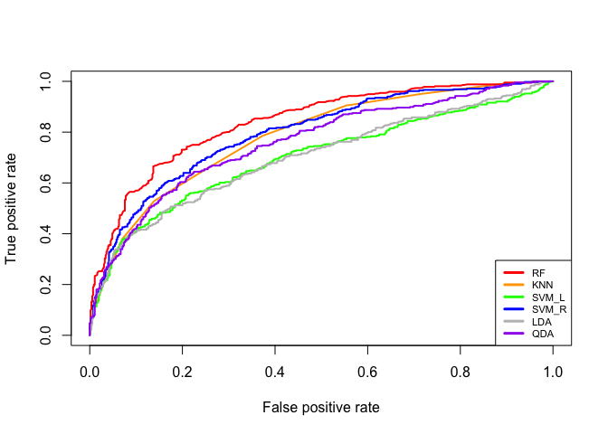<!-- --> 1.2
Classifying 3 contexts in a separate location

``` r
#subsetting

utfrrec=dat[dat$Location=="UTFRREC",]
ndsp=dat[dat$Location=="NDSP",]


#standardizing each dataset
sutfrrec=scale(utfrrec[,3:11],center=T, scale=T)
sndsp= scale(ndsp[,3:11],center=T, scale=T)
```

1.2.1 UTFRREC only

``` r
set.seed(123)
utest=sample(1:nrow(sutfrrec),0.2*nrow(sutfrrec)) #making train index
utrain=(-utest)

uy=utfrrec[,18]
utraindat=data.frame(x=sutfrrec[utrain,],y=uy[utrain])
utestdat=data.frame(x=sutfrrec[utest,],y=uy[utest])

#1.3.1 KNN
train_ctrl=trainControl(method="cv",number=10)
set.seed(123)
u.knn.cv=train(y~., data=utraindat,trControl=train_ctrl,method="knn")
print(u.knn.cv)
```

    ## k-Nearest Neighbors 
    ## 
    ## 1701 samples
    ##    9 predictor
    ##    3 classes: 'easo', 'food', 'mask' 
    ## 
    ## No pre-processing
    ## Resampling: Cross-Validated (10 fold) 
    ## Summary of sample sizes: 1530, 1530, 1531, 1531, 1532, 1531, ... 
    ## Resampling results across tuning parameters:
    ## 
    ##   k  Accuracy   Kappa    
    ##   5  0.6013806  0.3446342
    ##   7  0.6043704  0.3443288
    ##   9  0.6078582  0.3475063
    ## 
    ## Accuracy was used to select the optimal model using the largest value.
    ## The final value used for the model was k = 9.

``` r
u.knn.pred=predict(u.knn.cv,utestdat)
confusionMatrix(u.knn.pred,uy[utest],mode="prec_recall")
```

    ## Confusion Matrix and Statistics
    ## 
    ##           Reference
    ## Prediction easo food mask
    ##       easo   69   27   17
    ##       food   74  166   28
    ##       mask    6   12   26
    ## 
    ## Overall Statistics
    ##                                          
    ##                Accuracy : 0.6141         
    ##                  95% CI : (0.566, 0.6606)
    ##     No Information Rate : 0.4824         
    ##     P-Value [Acc > NIR] : 3.304e-08      
    ##                                          
    ##                   Kappa : 0.3407         
    ##                                          
    ##  Mcnemar's Test P-Value : 2.487e-07      
    ## 
    ## Statistics by Class:
    ## 
    ##                      Class: easo Class: food Class: mask
    ## Precision                 0.6106      0.6194     0.59091
    ## Recall                    0.4631      0.8098     0.36620
    ## F1                        0.5267      0.7019     0.45217
    ## Prevalence                0.3506      0.4824     0.16706
    ## Detection Rate            0.1624      0.3906     0.06118
    ## Detection Prevalence      0.2659      0.6306     0.10353
    ## Balanced Accuracy         0.6518      0.6731     0.65767

``` r
#1.3.2 Random Forest
train_ctrl=trainControl(method="cv",number=10)
set.seed(123)
u.rf.cv=train(y~., data=utraindat,trControl=train_ctrl,method="rf")
print(u.rf.cv)
```

    ## Random Forest 
    ## 
    ## 1701 samples
    ##    9 predictor
    ##    3 classes: 'easo', 'food', 'mask' 
    ## 
    ## No pre-processing
    ## Resampling: Cross-Validated (10 fold) 
    ## Summary of sample sizes: 1530, 1530, 1531, 1531, 1532, 1531, ... 
    ## Resampling results across tuning parameters:
    ## 
    ##   mtry  Accuracy   Kappa    
    ##   2     0.6467622  0.4067102
    ##   5     0.6614301  0.4340352
    ##   9     0.6549698  0.4255275
    ## 
    ## Accuracy was used to select the optimal model using the largest value.
    ## The final value used for the model was mtry = 5.

``` r
u.rf.pred=predict(u.rf.cv,utestdat)
confusionMatrix(u.rf.pred,uy[utest],mode="prec_recall")
```

    ## Confusion Matrix and Statistics
    ## 
    ##           Reference
    ## Prediction easo food mask
    ##       easo   72   23   18
    ##       food   70  168   25
    ##       mask    7   14   28
    ## 
    ## Overall Statistics
    ##                                           
    ##                Accuracy : 0.6306          
    ##                  95% CI : (0.5827, 0.6766)
    ##     No Information Rate : 0.4824          
    ##     P-Value [Acc > NIR] : 5.648e-10       
    ##                                           
    ##                   Kappa : 0.3728          
    ##                                           
    ##  Mcnemar's Test P-Value : 6.067e-07       
    ## 
    ## Statistics by Class:
    ## 
    ##                      Class: easo Class: food Class: mask
    ## Precision                 0.6372      0.6388     0.57143
    ## Recall                    0.4832      0.8195     0.39437
    ## F1                        0.5496      0.7179     0.46667
    ## Prevalence                0.3506      0.4824     0.16706
    ## Detection Rate            0.1694      0.3953     0.06588
    ## Detection Prevalence      0.2659      0.6188     0.11529
    ## Balanced Accuracy         0.6673      0.6938     0.66752

``` r
plot(varImp(object=u.rf.cv))
```

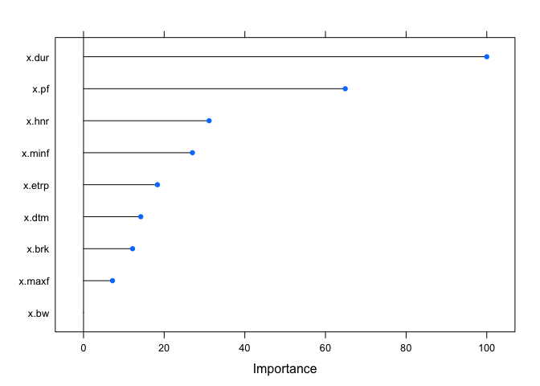<!-- -->

``` r
#1.3.3 SVM(Linear)
train_ctrl=trainControl(method="cv",number=10,classProbs=TRUE)
set.seed(123)
u.svml.cv=train(y~., data=utraindat,trControl=train_ctrl,method="svmLinear") 
```

    ## maximum number of iterations reached 0.003713792 0.003617232maximum number of iterations reached 0.002665676 0.002620555maximum number of iterations reached 0.002624233 0.002583345maximum number of iterations reached 0.002971402 0.002918784maximum number of iterations reached 0.002274338 0.00224675maximum number of iterations reached 0.002651044 0.002615366maximum number of iterations reached 0.001910498 0.001893863maximum number of iterations reached 0.0007420117 0.0007376545maximum number of iterations reached 0.001520101 0.001509046maximum number of iterations reached 0.002859096 0.002783938maximum number of iterations reached 0.004773904 0.004658061

``` r
print(u.svml.cv)
```

    ## Support Vector Machines with Linear Kernel 
    ## 
    ## 1701 samples
    ##    9 predictor
    ##    3 classes: 'easo', 'food', 'mask' 
    ## 
    ## No pre-processing
    ## Resampling: Cross-Validated (10 fold) 
    ## Summary of sample sizes: 1530, 1530, 1531, 1531, 1532, 1531, ... 
    ## Resampling results:
    ## 
    ##   Accuracy   Kappa    
    ##   0.5155798  0.1155946
    ## 
    ## Tuning parameter 'C' was held constant at a value of 1

``` r
u.svml.pred=predict(u.svml.cv,utestdat)
confusionMatrix(u.svml.pred,uy[utest],mode="prec_recall")
```

    ## Confusion Matrix and Statistics
    ## 
    ##           Reference
    ## Prediction easo food mask
    ##       easo   48   23   15
    ##       food  101  182   56
    ##       mask    0    0    0
    ## 
    ## Overall Statistics
    ##                                           
    ##                Accuracy : 0.5412          
    ##                  95% CI : (0.4925, 0.5893)
    ##     No Information Rate : 0.4824          
    ##     P-Value [Acc > NIR] : 0.008707        
    ##                                           
    ##                   Kappa : 0.1571          
    ##                                           
    ##  Mcnemar's Test P-Value : < 2.2e-16       
    ## 
    ## Statistics by Class:
    ## 
    ##                      Class: easo Class: food Class: mask
    ## Precision                 0.5581      0.5369          NA
    ## Recall                    0.3221      0.8878      0.0000
    ## F1                        0.4085      0.6691          NA
    ## Prevalence                0.3506      0.4824      0.1671
    ## Detection Rate            0.1129      0.4282      0.0000
    ## Detection Prevalence      0.2024      0.7976      0.0000
    ## Balanced Accuracy         0.5922      0.5871      0.5000

``` r
#1.3.3 SVM(radial)
train_ctrl=trainControl(method="cv",number=10,classProbs=TRUE)
set.seed(123)
u.svmr.cv=train(y~., data=utraindat,trControl=train_ctrl,method="svmRadial") 
print(u.svmr.cv)
```

    ## Support Vector Machines with Radial Basis Function Kernel 
    ## 
    ## 1701 samples
    ##    9 predictor
    ##    3 classes: 'easo', 'food', 'mask' 
    ## 
    ## No pre-processing
    ## Resampling: Cross-Validated (10 fold) 
    ## Summary of sample sizes: 1530, 1530, 1531, 1531, 1532, 1531, ... 
    ## Resampling results across tuning parameters:
    ## 
    ##   C     Accuracy   Kappa    
    ##   0.25  0.6167583  0.3499265
    ##   0.50  0.6208758  0.3545170
    ##   1.00  0.6273291  0.3676196
    ## 
    ## Tuning parameter 'sigma' was held constant at a value of 0.09295057
    ## Accuracy was used to select the optimal model using the largest value.
    ## The final values used for the model were sigma = 0.09295057 and C = 1.

``` r
u.svmr.pred=predict(u.svmr.cv,utestdat)
confusionMatrix(u.svmr.pred,uy[utest],mode="prec_recall")
```

    ## Confusion Matrix and Statistics
    ## 
    ##           Reference
    ## Prediction easo food mask
    ##       easo   62   21    8
    ##       food   84  178   34
    ##       mask    3    6   29
    ## 
    ## Overall Statistics
    ##                                           
    ##                Accuracy : 0.6329          
    ##                  95% CI : (0.5851, 0.6789)
    ##     No Information Rate : 0.4824          
    ##     P-Value [Acc > NIR] : 3.037e-10       
    ##                                           
    ##                   Kappa : 0.3606          
    ##                                           
    ##  Mcnemar's Test P-Value : 6.905e-13       
    ## 
    ## Statistics by Class:
    ## 
    ##                      Class: easo Class: food Class: mask
    ## Precision                 0.6813      0.6014     0.76316
    ## Recall                    0.4161      0.8683     0.40845
    ## F1                        0.5167      0.7106     0.53211
    ## Prevalence                0.3506      0.4824     0.16706
    ## Detection Rate            0.1459      0.4188     0.06824
    ## Detection Prevalence      0.2141      0.6965     0.08941
    ## Balanced Accuracy         0.6555      0.6660     0.69151

``` r
#1.3.3 LDA
train_ctrl=trainControl(method="cv",number=10)
set.seed(123)
u.lda.cv=train(y~., data=utraindat,trControl=train_ctrl,method="lda") 
print(u.lda.cv)
```

    ## Linear Discriminant Analysis 
    ## 
    ## 1701 samples
    ##    9 predictor
    ##    3 classes: 'easo', 'food', 'mask' 
    ## 
    ## No pre-processing
    ## Resampling: Cross-Validated (10 fold) 
    ## Summary of sample sizes: 1530, 1530, 1531, 1531, 1532, 1531, ... 
    ## Resampling results:
    ## 
    ##   Accuracy   Kappa   
    ##   0.5179675  0.140667

``` r
u.lda.pred=predict(u.lda.cv,utestdat)
confusionMatrix(u.lda.pred,uy[utest],mode="prec_recall")
```

    ## Confusion Matrix and Statistics
    ## 
    ##           Reference
    ## Prediction easo food mask
    ##       easo   43   21   14
    ##       food  102  183   49
    ##       mask    4    1    8
    ## 
    ## Overall Statistics
    ##                                           
    ##                Accuracy : 0.5506          
    ##                  95% CI : (0.5019, 0.5986)
    ##     No Information Rate : 0.4824          
    ##     P-Value [Acc > NIR] : 0.002834        
    ##                                           
    ##                   Kappa : 0.1851          
    ##                                           
    ##  Mcnemar's Test P-Value : < 2.2e-16       
    ## 
    ## Statistics by Class:
    ## 
    ##                      Class: easo Class: food Class: mask
    ## Precision                 0.5513      0.5479     0.61538
    ## Recall                    0.2886      0.8927     0.11268
    ## F1                        0.3789      0.6790     0.19048
    ## Prevalence                0.3506      0.4824     0.16706
    ## Detection Rate            0.1012      0.4306     0.01882
    ## Detection Prevalence      0.1835      0.7859     0.03059
    ## Balanced Accuracy         0.5809      0.6032     0.54928

``` r
#1.3.3 QDA
train_ctrl=trainControl(method="cv",number=10)
set.seed(123)
u.qda.cv=train(y~., data=utraindat,trControl=train_ctrl,method="qda")
print(u.qda.cv)
```

    ## Quadratic Discriminant Analysis 
    ## 
    ## 1701 samples
    ##    9 predictor
    ##    3 classes: 'easo', 'food', 'mask' 
    ## 
    ## No pre-processing
    ## Resampling: Cross-Validated (10 fold) 
    ## Summary of sample sizes: 1530, 1530, 1531, 1531, 1532, 1531, ... 
    ## Resampling results:
    ## 
    ##   Accuracy   Kappa    
    ##   0.5867228  0.3026865

``` r
u.qda.pred=predict(u.qda.cv,utestdat)
confusionMatrix(u.qda.pred,uy[utest],mode="prec_recall")
```

    ## Confusion Matrix and Statistics
    ## 
    ##           Reference
    ## Prediction easo food mask
    ##       easo   53   24   12
    ##       food   90  170   32
    ##       mask    6   11   27
    ## 
    ## Overall Statistics
    ##                                           
    ##                Accuracy : 0.5882          
    ##                  95% CI : (0.5398, 0.6354)
    ##     No Information Rate : 0.4824          
    ##     P-Value [Acc > NIR] : 7.635e-06       
    ##                                           
    ##                   Kappa : 0.2875          
    ##                                           
    ##  Mcnemar's Test P-Value : 6.356e-11       
    ## 
    ## Statistics by Class:
    ## 
    ##                      Class: easo Class: food Class: mask
    ## Precision                 0.5955      0.5822     0.61364
    ## Recall                    0.3557      0.8293     0.38028
    ## F1                        0.4454      0.6841     0.46957
    ## Prevalence                0.3506      0.4824     0.16706
    ## Detection Rate            0.1247      0.4000     0.06353
    ## Detection Prevalence      0.2094      0.6871     0.10353
    ## Balanced Accuracy         0.6126      0.6374     0.66613

1.2.2 NDSP only

``` r
set.seed(123)
ntest=sample(1:nrow(sndsp),0.2*nrow(sndsp))
ntrain=(-ntest)
ny=ndsp[,18] #this column represents context
ntraindat=data.frame(x=sndsp[ntrain,],y=ny[ntrain])
ntestdat=data.frame(x=sndsp[ntest,],y=ny[ntest])

#1.3.1 KNN

train_ctrl=trainControl(method="cv",number=10)
set.seed(123)
n.knn.cv=train(y~., data=ntraindat,trControl=train_ctrl,method="knn")
print(n.knn.cv)
```

    ## k-Nearest Neighbors 
    ## 
    ## 2180 samples
    ##    9 predictor
    ##    3 classes: 'easo', 'food', 'mask' 
    ## 
    ## No pre-processing
    ## Resampling: Cross-Validated (10 fold) 
    ## Summary of sample sizes: 1961, 1961, 1963, 1963, 1962, 1963, ... 
    ## Resampling results across tuning parameters:
    ## 
    ##   k  Accuracy   Kappa    
    ##   5  0.6054643  0.3329852
    ##   7  0.6197668  0.3538729
    ##   9  0.6238553  0.3562365
    ## 
    ## Accuracy was used to select the optimal model using the largest value.
    ## The final value used for the model was k = 9.

``` r
n.knn.pred=predict(n.knn.cv,ntestdat)
confusionMatrix(n.knn.pred,ny[ntest])
```

    ## Confusion Matrix and Statistics
    ## 
    ##           Reference
    ## Prediction easo food mask
    ##       easo  133   72   22
    ##       food   71  187   22
    ##       mask    7   16   15
    ## 
    ## Overall Statistics
    ##                                           
    ##                Accuracy : 0.6147          
    ##                  95% CI : (0.5724, 0.6557)
    ##     No Information Rate : 0.5046          
    ##     P-Value [Acc > NIR] : 1.521e-07       
    ##                                           
    ##                   Kappa : 0.3263          
    ##                                           
    ##  Mcnemar's Test P-Value : 0.03336         
    ## 
    ## Statistics by Class:
    ## 
    ##                      Class: easo Class: food Class: mask
    ## Sensitivity               0.6303      0.6800     0.25424
    ## Specificity               0.7186      0.6556     0.95267
    ## Pos Pred Value            0.5859      0.6679     0.39474
    ## Neg Pred Value            0.7547      0.6679     0.91321
    ## Prevalence                0.3872      0.5046     0.10826
    ## Detection Rate            0.2440      0.3431     0.02752
    ## Detection Prevalence      0.4165      0.5138     0.06972
    ## Balanced Accuracy         0.6744      0.6678     0.60346

``` r
#1.3.2 Random Forest
train_ctrl=trainControl(method="cv",number=10)
set.seed(123)
n.rf.cv=train(y~., data=ntraindat,trControl=train_ctrl,method="rf")
print(n.rf.cv)
```

    ## Random Forest 
    ## 
    ## 2180 samples
    ##    9 predictor
    ##    3 classes: 'easo', 'food', 'mask' 
    ## 
    ## No pre-processing
    ## Resampling: Cross-Validated (10 fold) 
    ## Summary of sample sizes: 1961, 1961, 1963, 1963, 1962, 1963, ... 
    ## Resampling results across tuning parameters:
    ## 
    ##   mtry  Accuracy   Kappa    
    ##   2     0.6688712  0.4282517
    ##   5     0.6619798  0.4191046
    ##   9     0.6633412  0.4217258
    ## 
    ## Accuracy was used to select the optimal model using the largest value.
    ## The final value used for the model was mtry = 2.

``` r
n.rf.pred=predict(n.rf.cv,ntestdat)
confusionMatrix(n.rf.pred,ny[ntest])
```

    ## Confusion Matrix and Statistics
    ## 
    ##           Reference
    ## Prediction easo food mask
    ##       easo  150   65   22
    ##       food   57  205   28
    ##       mask    4    5    9
    ## 
    ## Overall Statistics
    ##                                           
    ##                Accuracy : 0.6679          
    ##                  95% CI : (0.6266, 0.7073)
    ##     No Information Rate : 0.5046          
    ##     P-Value [Acc > NIR] : 9.432e-15       
    ##                                           
    ##                   Kappa : 0.4065          
    ##                                           
    ##  Mcnemar's Test P-Value : 2.222e-06       
    ## 
    ## Statistics by Class:
    ## 
    ##                      Class: easo Class: food Class: mask
    ## Sensitivity               0.7109      0.7455     0.15254
    ## Specificity               0.7395      0.6852     0.98148
    ## Pos Pred Value            0.6329      0.7069     0.50000
    ## Neg Pred Value            0.8019      0.7255     0.90512
    ## Prevalence                0.3872      0.5046     0.10826
    ## Detection Rate            0.2752      0.3761     0.01651
    ## Detection Prevalence      0.4349      0.5321     0.03303
    ## Balanced Accuracy         0.7252      0.7153     0.56701

``` r
plot(varImp(object=n.rf.cv))
```

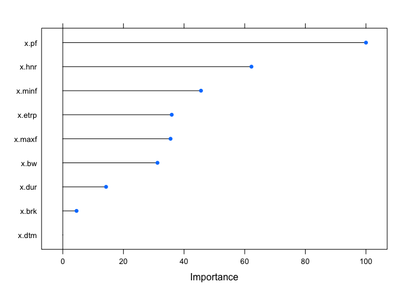<!-- -->

``` r
#1.3.3 SVM(Linear)
train_ctrl=trainControl(method="cv",number=10,classProbs=TRUE)
set.seed(123)
n.svml.cv=train(y~., data=ntraindat,trControl=train_ctrl,method="svmLinear")
```

    ## maximum number of iterations reached 0.006130077 0.005851301maximum number of iterations reached 0.004418969 0.004235278maximum number of iterations reached 0.005608834 0.005332871maximum number of iterations reached 0.006046252 0.005755274maximum number of iterations reached 0.005231995 0.004996732maximum number of iterations reached 0.003973047 0.003810831maximum number of iterations reached 0.006457743 0.006136547maximum number of iterations reached 0.004071332 0.003935829maximum number of iterations reached 0.00643645 0.006085134maximum number of iterations reached 0.004602455 0.00440932maximum number of iterations reached 0.00415559 0.004007694maximum number of iterations reached 0.002355566 0.002298483maximum number of iterations reached 0.005210904 0.00497648maximum number of iterations reached 0.004776132 0.004538583maximum number of iterations reached 0.005389798 0.005112503maximum number of iterations reached 0.003387029 0.003289715maximum number of iterations reached 0.006022638 0.005710741maximum number of iterations reached 0.004732859 0.004506303maximum number of iterations reached 0.005724655 0.005479576maximum number of iterations reached 0.002960892 0.002870798maximum number of iterations reached 0.006060421 0.005787616maximum number of iterations reached 0.0039343 0.003776747

``` r
print(n.svml.cv)
```

    ## Support Vector Machines with Linear Kernel 
    ## 
    ## 2180 samples
    ##    9 predictor
    ##    3 classes: 'easo', 'food', 'mask' 
    ## 
    ## No pre-processing
    ## Resampling: Cross-Validated (10 fold) 
    ## Summary of sample sizes: 1961, 1961, 1963, 1963, 1962, 1963, ... 
    ## Resampling results:
    ## 
    ##   Accuracy   Kappa    
    ##   0.5399152  0.1881039
    ## 
    ## Tuning parameter 'C' was held constant at a value of 1

``` r
n.svml.pred=predict(n.svml.cv,ntestdat)
confusionMatrix(n.svml.pred,ny[ntest])
```

    ## Confusion Matrix and Statistics
    ## 
    ##           Reference
    ## Prediction easo food mask
    ##       easo  114   95   36
    ##       food   97  180   23
    ##       mask    0    0    0
    ## 
    ## Overall Statistics
    ##                                           
    ##                Accuracy : 0.5394          
    ##                  95% CI : (0.4966, 0.5819)
    ##     No Information Rate : 0.5046          
    ##     P-Value [Acc > NIR] : 0.05642         
    ##                                           
    ##                   Kappa : 0.1599          
    ##                                           
    ##  Mcnemar's Test P-Value : 9.515e-13       
    ## 
    ## Statistics by Class:
    ## 
    ##                      Class: easo Class: food Class: mask
    ## Sensitivity               0.5403      0.6545      0.0000
    ## Specificity               0.6078      0.5556      1.0000
    ## Pos Pred Value            0.4653      0.6000         NaN
    ## Neg Pred Value            0.6767      0.6122      0.8917
    ## Prevalence                0.3872      0.5046      0.1083
    ## Detection Rate            0.2092      0.3303      0.0000
    ## Detection Prevalence      0.4495      0.5505      0.0000
    ## Balanced Accuracy         0.5740      0.6051      0.5000

``` r
#1.3.3 SVM(radial)
train_ctrl=trainControl(method="cv",number=10,classProbs=TRUE)
set.seed(123)
n.svmr.cv=train(y~., data=ntraindat,trControl=train_ctrl,method="svmRadial") 
print(n.svmr.cv)
```

    ## Support Vector Machines with Radial Basis Function Kernel 
    ## 
    ## 2180 samples
    ##    9 predictor
    ##    3 classes: 'easo', 'food', 'mask' 
    ## 
    ## No pre-processing
    ## Resampling: Cross-Validated (10 fold) 
    ## Summary of sample sizes: 1961, 1961, 1963, 1963, 1962, 1963, ... 
    ## Resampling results across tuning parameters:
    ## 
    ##   C     Accuracy   Kappa    
    ##   0.25  0.6018934  0.3030293
    ##   0.50  0.6060262  0.3094471
    ##   1.00  0.6101547  0.3154534
    ## 
    ## Tuning parameter 'sigma' was held constant at a value of 0.1066249
    ## Accuracy was used to select the optimal model using the largest value.
    ## The final values used for the model were sigma = 0.1066249 and C = 1.

``` r
n.svmr.pred=predict(n.svmr.cv,ntestdat)
confusionMatrix(n.svmr.pred,ny[ntest])
```

    ## Confusion Matrix and Statistics
    ## 
    ##           Reference
    ## Prediction easo food mask
    ##       easo  134   74   24
    ##       food   74  196   31
    ##       mask    3    5    4
    ## 
    ## Overall Statistics
    ##                                           
    ##                Accuracy : 0.6128          
    ##                  95% CI : (0.5705, 0.6539)
    ##     No Information Rate : 0.5046          
    ##     P-Value [Acc > NIR] : 2.402e-07       
    ##                                           
    ##                   Kappa : 0.3013          
    ##                                           
    ##  Mcnemar's Test P-Value : 1.154e-07       
    ## 
    ## Statistics by Class:
    ## 
    ##                      Class: easo Class: food Class: mask
    ## Sensitivity               0.6351      0.7127    0.067797
    ## Specificity               0.7066      0.6111    0.983539
    ## Pos Pred Value            0.5776      0.6512    0.333333
    ## Neg Pred Value            0.7540      0.6762    0.896811
    ## Prevalence                0.3872      0.5046    0.108257
    ## Detection Rate            0.2459      0.3596    0.007339
    ## Detection Prevalence      0.4257      0.5523    0.022018
    ## Balanced Accuracy         0.6708      0.6619    0.525668

``` r
#1.3.3 LDA
train_ctrl=trainControl(method="cv",number=10)
set.seed(123)
n.lda.cv=train(y~., data=ntraindat,trControl=train_ctrl,method="lda")
print(n.lda.cv)
```

    ## Linear Discriminant Analysis 
    ## 
    ## 2180 samples
    ##    9 predictor
    ##    3 classes: 'easo', 'food', 'mask' 
    ## 
    ## No pre-processing
    ## Resampling: Cross-Validated (10 fold) 
    ## Summary of sample sizes: 1961, 1961, 1963, 1963, 1962, 1963, ... 
    ## Resampling results:
    ## 
    ##   Accuracy   Kappa    
    ##   0.5280116  0.1713845

``` r
n.lda.pred=predict(n.lda.cv,ntestdat)
confusionMatrix(n.lda.pred,ny[ntest])
```

    ## Confusion Matrix and Statistics
    ## 
    ##           Reference
    ## Prediction easo food mask
    ##       easo  113   93   35
    ##       food   97  180   24
    ##       mask    1    2    0
    ## 
    ## Overall Statistics
    ##                                           
    ##                Accuracy : 0.5376          
    ##                  95% CI : (0.4947, 0.5801)
    ##     No Information Rate : 0.5046          
    ##     P-Value [Acc > NIR] : 0.06684         
    ##                                           
    ##                   Kappa : 0.1586          
    ##                                           
    ##  Mcnemar's Test P-Value : 5.368e-11       
    ## 
    ## Statistics by Class:
    ## 
    ##                      Class: easo Class: food Class: mask
    ## Sensitivity               0.5355      0.6545    0.000000
    ## Specificity               0.6168      0.5519    0.993827
    ## Pos Pred Value            0.4689      0.5980    0.000000
    ## Neg Pred Value            0.6776      0.6107    0.891144
    ## Prevalence                0.3872      0.5046    0.108257
    ## Detection Rate            0.2073      0.3303    0.000000
    ## Detection Prevalence      0.4422      0.5523    0.005505
    ## Balanced Accuracy         0.5762      0.6032    0.496914

``` r
#1.3.3 QDA
train_ctrl=trainControl(method="cv",number=10)
set.seed(123)
n.qda.cv=train(y~., data=ntraindat,trControl=train_ctrl,method="qda")
print(n.qda.cv)
```

    ## Quadratic Discriminant Analysis 
    ## 
    ## 2180 samples
    ##    9 predictor
    ##    3 classes: 'easo', 'food', 'mask' 
    ## 
    ## No pre-processing
    ## Resampling: Cross-Validated (10 fold) 
    ## Summary of sample sizes: 1961, 1961, 1963, 1963, 1962, 1963, ... 
    ## Resampling results:
    ## 
    ##   Accuracy   Kappa    
    ##   0.5601559  0.2597536

``` r
n.qda.pred=predict(n.qda.cv,ntestdat)
confusionMatrix(n.qda.pred,ny[ntest])
```

    ## Confusion Matrix and Statistics
    ## 
    ##           Reference
    ## Prediction easo food mask
    ##       easo  139  105   30
    ##       food   62  144   16
    ##       mask   10   26   13
    ## 
    ## Overall Statistics
    ##                                           
    ##                Accuracy : 0.5431          
    ##                  95% CI : (0.5002, 0.5855)
    ##     No Information Rate : 0.5046          
    ##     P-Value [Acc > NIR] : 0.03945         
    ##                                           
    ##                   Kappa : 0.2257          
    ##                                           
    ##  Mcnemar's Test P-Value : 3.249e-05       
    ## 
    ## Statistics by Class:
    ## 
    ##                      Class: easo Class: food Class: mask
    ## Sensitivity               0.6588      0.5236     0.22034
    ## Specificity               0.5958      0.7111     0.92593
    ## Pos Pred Value            0.5073      0.6486     0.26531
    ## Neg Pred Value            0.7343      0.5944     0.90726
    ## Prevalence                0.3872      0.5046     0.10826
    ## Detection Rate            0.2550      0.2642     0.02385
    ## Detection Prevalence      0.5028      0.4073     0.08991
    ## Balanced Accuracy         0.6273      0.6174     0.57313

1.3 Site classification in food context, owl context and in all contexts
Acoustic properties differences across location and contexts 1.3.1 food
context
only

``` r
#since AR1, etea, F, I, UV3, W1 sample size in food are lower than 50, just exclude them from this analyses. too small sample classification is less meaningful
food=food[-which(food$site=="AR1"),]
food=food[-which(food$site=="etea"),]
food=food[-which(food$site=="F"),]
food=food[-which(food$site=="I"),]
food=food[-which(food$site=="UV3"),]
food=food[-which(food$site=="W1"),]
food=food[-which(food$site=="ecamping"),]
food=food[-which(food$site=="esam"),]
food=food[-which(food$site=="O"),]
food=food[-which(food$site=="UV1"),]
food=food[-which(food$site=="UV2"),]


unique(food$site)# check if these sites fallen out correctly
```

    ##  [1] AR2      C        ecabin   J        K        N        WAR     
    ##  [8] wburries WCAMPING wchuck   wdump   
    ## 25 Levels: AR1 AR2 C ecabin ecamping edam esam etea F I J K N O ... wexercise

``` r
food$site=factor(food$site)
sfood=scale(food[,3:11], center=T, scale=T)
dim(sfood)
```

    ## [1] 1745    9

``` r
#dividing training vs test data
set.seed(123)
ftest=sample(1:nrow(sfood),0.4*nrow(sfood)) #making train index
ftrain=(-ftest)

fy=food[,12]#this is site, under locations
fy=factor(food[,12])#Dropping off some unused levels (otherwise, edam, ecamping, wcabin will appear even though there are no rows with this value)

ftraindat=data.frame(x=sfood[ftrain,],y=fy[ftrain])
ftestdat=data.frame(x=sfood[ftest,],y=fy[ftest])

#1.3.1 KNN
train_ctrl=trainControl(method="cv",number=10)
set.seed(123)
f.knn.cv=train(y~., data=ftraindat,trControl=train_ctrl,method="knn")
print(f.knn.cv)
```

    ## k-Nearest Neighbors 
    ## 
    ## 1047 samples
    ##    9 predictor
    ##   11 classes: 'AR2', 'C', 'ecabin', 'J', 'K', 'N', 'WAR', 'wburries', 'WCAMPING', 'wchuck', 'wdump' 
    ## 
    ## No pre-processing
    ## Resampling: Cross-Validated (10 fold) 
    ## Summary of sample sizes: 941, 943, 942, 943, 943, 943, ... 
    ## Resampling results across tuning parameters:
    ## 
    ##   k  Accuracy   Kappa    
    ##   5  0.5006303  0.4434526
    ##   7  0.5130484  0.4571167
    ##   9  0.5168493  0.4606491
    ## 
    ## Accuracy was used to select the optimal model using the largest value.
    ## The final value used for the model was k = 9.

``` r
f.knn.pred=predict(f.knn.cv,ftestdat)
confusionMatrix(f.knn.pred,fy[ftest],mode="prec_recall") 
```

    ## Confusion Matrix and Statistics
    ## 
    ##           Reference
    ## Prediction AR2  C ecabin  J  K  N WAR wburries WCAMPING wchuck wdump
    ##   AR2       18  0      2  3  1  1   2        5        3      4     4
    ##   C          0 33      0  2 12  1   4        0        2      3     4
    ##   ecabin     4  0     21  3  0  1   1        2        1      5     1
    ##   J         11  2      7 45  0  3   8        2        4      7     0
    ##   K          1  3      1  0 21  6   4        0        0      2     0
    ##   N          7  2      3  1 12 29   1        2        6      7     1
    ##   WAR        7  1      5  9  3  1  69        4       12      5     7
    ##   wburries   1  0      5  1  0  0   1       31        0      0     1
    ##   WCAMPING   3  6      1  1  3  1  17        0       47      4     0
    ##   wchuck     2  2      6  3  3  5   6        5        6     26     8
    ##   wdump      0  3      0  0  0  1   4        3        4      6    18
    ## 
    ## Overall Statistics
    ##                                           
    ##                Accuracy : 0.5129          
    ##                  95% CI : (0.4751, 0.5506)
    ##     No Information Rate : 0.1676          
    ##     P-Value [Acc > NIR] : < 2.2e-16       
    ##                                           
    ##                   Kappa : 0.4579          
    ##                                           
    ##  Mcnemar's Test P-Value : NA              
    ## 
    ## Statistics by Class:
    ## 
    ##                      Class: AR2 Class: C Class: ecabin Class: J Class: K
    ## Precision               0.41860  0.54098       0.53846  0.50562  0.55263
    ## Recall                  0.33333  0.63462       0.41176  0.66176  0.38182
    ## F1                      0.37113  0.58407       0.46667  0.57325  0.45161
    ## Prevalence              0.07736  0.07450       0.07307  0.09742  0.07880
    ## Detection Rate          0.02579  0.04728       0.03009  0.06447  0.03009
    ## Detection Prevalence    0.06160  0.08739       0.05587  0.12751  0.05444
    ## Balanced Accuracy       0.64726  0.79564       0.69197  0.79596  0.67769
    ##                      Class: N Class: WAR Class: wburries Class: WCAMPING
    ## Precision             0.40845    0.56098         0.77500         0.56627
    ## Recall                0.59184    0.58974         0.57407         0.55294
    ## F1                    0.48333    0.57500         0.65957         0.55952
    ## Prevalence            0.07020    0.16762         0.07736         0.12178
    ## Detection Rate        0.04155    0.09885         0.04441         0.06734
    ## Detection Prevalence  0.10172    0.17622         0.05731         0.11891
    ## Balanced Accuracy     0.76356    0.74840         0.78005         0.74711
    ##                      Class: wchuck Class: wdump
    ## Precision                  0.36111      0.46154
    ## Recall                     0.37681      0.40909
    ## F1                         0.36879      0.43373
    ## Prevalence                 0.09885      0.06304
    ## Detection Rate             0.03725      0.02579
    ## Detection Prevalence       0.10315      0.05587
    ## Balanced Accuracy          0.65184      0.68849

``` r
#1.3.2 Random Forest
train_ctrl=trainControl(method="cv",number=10)
set.seed(123)
f.rf.cv=train(y~., data=ftraindat,trControl=train_ctrl,method="rf")
print(f.rf.cv)
```

    ## Random Forest 
    ## 
    ## 1047 samples
    ##    9 predictor
    ##   11 classes: 'AR2', 'C', 'ecabin', 'J', 'K', 'N', 'WAR', 'wburries', 'WCAMPING', 'wchuck', 'wdump' 
    ## 
    ## No pre-processing
    ## Resampling: Cross-Validated (10 fold) 
    ## Summary of sample sizes: 941, 943, 942, 943, 943, 943, ... 
    ## Resampling results across tuning parameters:
    ## 
    ##   mtry  Accuracy   Kappa    
    ##   2     0.6284849  0.5852910
    ##   5     0.6199767  0.5760645
    ##   9     0.6037670  0.5579187
    ## 
    ## Accuracy was used to select the optimal model using the largest value.
    ## The final value used for the model was mtry = 2.

``` r
f.rf.pred=predict(f.rf.cv,ftestdat)
confusionMatrix(f.rf.pred,fy[ftest])
```

    ## Confusion Matrix and Statistics
    ## 
    ##           Reference
    ## Prediction AR2  C ecabin  J  K  N WAR wburries WCAMPING wchuck wdump
    ##   AR2       26  0      3  3  0  4   3        0        1      4     2
    ##   C          0 37      2  2 11  2   6        0        2      1     3
    ##   ecabin     6  0     21  3  0  0   2        2        1      4     1
    ##   J          5  1      9 49  0  1   3        1        1      5     1
    ##   K          3  4      1  1 32  5   2        0        0      0     1
    ##   N          5  1      3  0  1 34   1        2        3      5     0
    ##   WAR        3  1      3  7  4  1  87        6       21      2     4
    ##   wburries   2  0      4  2  1  0   0       42        0      1     0
    ##   WCAMPING   1  6      0  0  2  1   8        0       48      2     0
    ##   wchuck     3  2      5  1  4  0   2        0        6     44     6
    ##   wdump      0  0      0  0  0  1   3        1        2      1    26
    ## 
    ## Overall Statistics
    ##                                           
    ##                Accuracy : 0.639           
    ##                  95% CI : (0.6021, 0.6747)
    ##     No Information Rate : 0.1676          
    ##     P-Value [Acc > NIR] : < 2.2e-16       
    ##                                           
    ##                   Kappa : 0.5978          
    ##                                           
    ##  Mcnemar's Test P-Value : NA              
    ## 
    ## Statistics by Class:
    ## 
    ##                      Class: AR2 Class: C Class: ecabin Class: J Class: K
    ## Sensitivity             0.48148  0.71154       0.41176  0.72059  0.58182
    ## Specificity             0.96894  0.95511       0.97063  0.95714  0.97356
    ## Pos Pred Value          0.56522  0.56061       0.52500  0.64474  0.65306
    ## Neg Pred Value          0.95706  0.97627       0.95441  0.96945  0.96456
    ## Prevalence              0.07736  0.07450       0.07307  0.09742  0.07880
    ## Detection Rate          0.03725  0.05301       0.03009  0.07020  0.04585
    ## Detection Prevalence    0.06590  0.09456       0.05731  0.10888  0.07020
    ## Balanced Accuracy       0.72521  0.83332       0.69120  0.83887  0.77769
    ##                      Class: N Class: WAR Class: wburries Class: WCAMPING
    ## Sensitivity           0.69388     0.7436         0.77778         0.56471
    ## Specificity           0.96764     0.9105         0.98447         0.96737
    ## Pos Pred Value        0.61818     0.6259         0.80769         0.70588
    ## Neg Pred Value        0.97667     0.9463         0.98142         0.94127
    ## Prevalence            0.07020     0.1676         0.07736         0.12178
    ## Detection Rate        0.04871     0.1246         0.06017         0.06877
    ## Detection Prevalence  0.07880     0.1991         0.07450         0.09742
    ## Balanced Accuracy     0.83076     0.8270         0.88112         0.76604
    ##                      Class: wchuck Class: wdump
    ## Sensitivity                0.63768      0.59091
    ## Specificity                0.95390      0.98777
    ## Pos Pred Value             0.60274      0.76471
    ## Neg Pred Value             0.96000      0.97289
    ## Prevalence                 0.09885      0.06304
    ## Detection Rate             0.06304      0.03725
    ## Detection Prevalence       0.10458      0.04871
    ## Balanced Accuracy          0.79579      0.78934

``` r
plot(varImp(object=f.rf.cv))
```

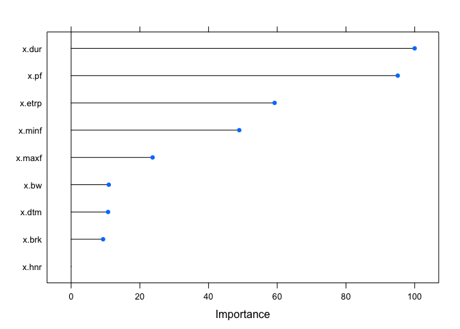<!-- -->

``` r
#1.3.3 SVM(Linear)
train_ctrl=trainControl(method="cv",number=10,classProbs=TRUE)
set.seed(123)
f.svml.cv=train(y~., data=ftraindat,trControl=train_ctrl,method="svmLinear")
print(f.svml.cv)
```

    ## Support Vector Machines with Linear Kernel 
    ## 
    ## 1047 samples
    ##    9 predictor
    ##   11 classes: 'AR2', 'C', 'ecabin', 'J', 'K', 'N', 'WAR', 'wburries', 'WCAMPING', 'wchuck', 'wdump' 
    ## 
    ## No pre-processing
    ## Resampling: Cross-Validated (10 fold) 
    ## Summary of sample sizes: 941, 943, 942, 943, 943, 943, ... 
    ## Resampling results:
    ## 
    ##   Accuracy   Kappa    
    ##   0.3161927  0.2378171
    ## 
    ## Tuning parameter 'C' was held constant at a value of 1

``` r
f.svml.pred=predict(f.svml.cv,ftestdat)
confusionMatrix(f.svml.pred,fy[ftest])
```

    ## Confusion Matrix and Statistics
    ## 
    ##           Reference
    ## Prediction AR2  C ecabin  J  K  N WAR wburries WCAMPING wchuck wdump
    ##   AR2       18  0      1  7  0  3  10        8        4      7     5
    ##   C          0 48      2  3 16  2  19        0       17      6    10
    ##   ecabin     4  0     18 11  0  2   3       15        3      4     2
    ##   J          0  0      1  1  0  1   3        0        5      2     1
    ##   K          0  0      0  0  7  1   0        0        0      0     1
    ##   N          8  0      6 10 19 35   3        2        6     16     1
    ##   WAR       10  3      6 11 13  3  70        7       34      7     2
    ##   wburries   0  0      0  0  0  0   0        0        0      0     0
    ##   WCAMPING   0  0      0  0  0  1   0        0        0      0     0
    ##   wchuck    11  1     16 25  0  0   8       22       15     18    21
    ##   wdump      3  0      1  0  0  1   1        0        1      9     1
    ## 
    ## Overall Statistics
    ##                                           
    ##                Accuracy : 0.3095          
    ##                  95% CI : (0.2753, 0.3452)
    ##     No Information Rate : 0.1676          
    ##     P-Value [Acc > NIR] : < 2.2e-16       
    ##                                           
    ##                   Kappa : 0.2317          
    ##                                           
    ##  Mcnemar's Test P-Value : NA              
    ## 
    ## Statistics by Class:
    ## 
    ##                      Class: AR2 Class: C Class: ecabin Class: J Class: K
    ## Sensitivity             0.33333  0.92308       0.35294 0.014706  0.12727
    ## Specificity             0.93012  0.88390       0.93199 0.979365  0.99689
    ## Pos Pred Value          0.28571  0.39024       0.29032 0.071429  0.77778
    ## Neg Pred Value          0.94331  0.99304       0.94811 0.902047  0.93033
    ## Prevalence              0.07736  0.07450       0.07307 0.097421  0.07880
    ## Detection Rate          0.02579  0.06877       0.02579 0.001433  0.01003
    ## Detection Prevalence    0.09026  0.17622       0.08883 0.020057  0.01289
    ## Balanced Accuracy       0.63173  0.90349       0.64247 0.497035  0.56208
    ##                      Class: N Class: WAR Class: wburries Class: WCAMPING
    ## Sensitivity           0.71429     0.5983         0.00000        0.000000
    ## Specificity           0.89060     0.8348         1.00000        0.998369
    ## Pos Pred Value        0.33019     0.4217             NaN        0.000000
    ## Neg Pred Value        0.97635     0.9117         0.92264        0.878049
    ## Prevalence            0.07020     0.1676         0.07736        0.121777
    ## Detection Rate        0.05014     0.1003         0.00000        0.000000
    ## Detection Prevalence  0.15186     0.2378         0.00000        0.001433
    ## Balanced Accuracy     0.80244     0.7165         0.50000        0.499184
    ##                      Class: wchuck Class: wdump
    ## Sensitivity                0.26087     0.022727
    ## Specificity                0.81081     0.975535
    ## Pos Pred Value             0.13139     0.058824
    ## Neg Pred Value             0.90909     0.936858
    ## Prevalence                 0.09885     0.063037
    ## Detection Rate             0.02579     0.001433
    ## Detection Prevalence       0.19628     0.024355
    ## Balanced Accuracy          0.53584     0.499131

``` r
#1.3.3 SVM(radial)
train_ctrl=trainControl(method="cv",number=10,classProbs=TRUE)
set.seed(123)
f.svmr.cv=train(y~., data=ftraindat,trControl=train_ctrl,method="svmRadial")
print(f.svmr.cv)
```

    ## Support Vector Machines with Radial Basis Function Kernel 
    ## 
    ## 1047 samples
    ##    9 predictor
    ##   11 classes: 'AR2', 'C', 'ecabin', 'J', 'K', 'N', 'WAR', 'wburries', 'WCAMPING', 'wchuck', 'wdump' 
    ## 
    ## No pre-processing
    ## Resampling: Cross-Validated (10 fold) 
    ## Summary of sample sizes: 941, 943, 942, 943, 943, 943, ... 
    ## Resampling results across tuning parameters:
    ## 
    ##   C     Accuracy   Kappa    
    ##   0.25  0.2788386  0.1990310
    ##   0.50  0.3085097  0.2304739
    ##   1.00  0.3161386  0.2405673
    ## 
    ## Tuning parameter 'sigma' was held constant at a value of 0.1063451
    ## Accuracy was used to select the optimal model using the largest value.
    ## The final values used for the model were sigma = 0.1063451 and C = 1.

``` r
f.svmr.pred=predict(f.svmr.cv,ftestdat)
confusionMatrix(f.svmr.pred,fy[ftest])
```

    ## Confusion Matrix and Statistics
    ## 
    ##           Reference
    ## Prediction AR2  C ecabin  J  K  N WAR wburries WCAMPING wchuck wdump
    ##   AR2       26  0      7 10  1  5  11        4        8      8     3
    ##   C          0 44      1  2 20  2  14        0        9      2     7
    ##   ecabin     5  0     16 13  1  4   0        7        3      6     1
    ##   J          0  0      0  5  0  0  12        0        6      1     1
    ##   K          0  2      0  0  6  2   2        0        3      0     2
    ##   N          8  0      5  8 15 31   6        3        3     18     2
    ##   WAR        4  4      3 10  7  0  51        8       29      8     5
    ##   wburries   0  0      0  0  0  0   0        0        0      0     0
    ##   WCAMPING   3  0      0  0  5  5   1        2        5      1     0
    ##   wchuck     8  2     19 20  0  0  20       30       18     20    21
    ##   wdump      0  0      0  0  0  0   0        0        1      5     2
    ## 
    ## Overall Statistics
    ##                                           
    ##                Accuracy : 0.2951          
    ##                  95% CI : (0.2615, 0.3305)
    ##     No Information Rate : 0.1676          
    ##     P-Value [Acc > NIR] : < 2.2e-16       
    ##                                           
    ##                   Kappa : 0.2176          
    ##                                           
    ##  Mcnemar's Test P-Value : NA              
    ## 
    ## Statistics by Class:
    ## 
    ##                      Class: AR2 Class: C Class: ecabin Class: J Class: K
    ## Sensitivity             0.48148  0.84615       0.31373 0.073529 0.109091
    ## Specificity             0.91149  0.91176       0.93818 0.968254 0.982893
    ## Pos Pred Value          0.31325  0.43564       0.28571 0.200000 0.352941
    ## Neg Pred Value          0.95447  0.98660       0.94548 0.906389 0.928047
    ## Prevalence              0.07736  0.07450       0.07307 0.097421 0.078797
    ## Detection Rate          0.03725  0.06304       0.02292 0.007163 0.008596
    ## Detection Prevalence    0.11891  0.14470       0.08023 0.035817 0.024355
    ## Balanced Accuracy       0.69649  0.87896       0.62595 0.520892 0.545992
    ##                      Class: N Class: WAR Class: wburries Class: WCAMPING
    ## Sensitivity           0.63265    0.43590         0.00000        0.058824
    ## Specificity           0.89522    0.86575         1.00000        0.972268
    ## Pos Pred Value        0.31313    0.39535             NaN        0.227273
    ## Neg Pred Value        0.96995    0.88401         0.92264        0.881657
    ## Prevalence            0.07020    0.16762         0.07736        0.121777
    ## Detection Rate        0.04441    0.07307         0.00000        0.007163
    ## Detection Prevalence  0.14183    0.18481         0.00000        0.031519
    ## Balanced Accuracy     0.76394    0.65082         0.50000        0.515546
    ##                      Class: wchuck Class: wdump
    ## Sensitivity                0.28986     0.045455
    ## Specificity                0.78060     0.990826
    ## Pos Pred Value             0.12658     0.250000
    ## Neg Pred Value             0.90926     0.939130
    ## Prevalence                 0.09885     0.063037
    ## Detection Rate             0.02865     0.002865
    ## Detection Prevalence       0.22636     0.011461
    ## Balanced Accuracy          0.53523     0.518140

``` r
#1.3.3 LDA
train_ctrl=trainControl(method="cv",number=10)
set.seed(123)
f.lda.cv=train(y~., data=ftraindat,trControl=train_ctrl,method="lda")
print(f.lda.cv)
```

    ## Linear Discriminant Analysis 
    ## 
    ## 1047 samples
    ##    9 predictor
    ##   11 classes: 'AR2', 'C', 'ecabin', 'J', 'K', 'N', 'WAR', 'wburries', 'WCAMPING', 'wchuck', 'wdump' 
    ## 
    ## No pre-processing
    ## Resampling: Cross-Validated (10 fold) 
    ## Summary of sample sizes: 941, 943, 942, 943, 943, 943, ... 
    ## Resampling results:
    ## 
    ##   Accuracy   Kappa    
    ##   0.4640836  0.4014252

``` r
f.lda.pred=predict(f.lda.cv,ftestdat)
confusionMatrix(f.lda.pred,fy[ftest])
```

    ## Confusion Matrix and Statistics
    ## 
    ##           Reference
    ## Prediction AR2  C ecabin  J  K  N WAR wburries WCAMPING wchuck wdump
    ##   AR2       14  0      0  6  0  2   1        3        1      6     5
    ##   C          0 30      2  3  9  1   4        0        1      2     8
    ##   ecabin     2  0     22  7  2  1   0        8        2     11     4
    ##   J          5  0     11 32  0  4   3        3        4     10     1
    ##   K          1  9      1  0 15  1   0        1        2      1     1
    ##   N          7  4      1  1 18 36   3        1        4      7     0
    ##   WAR        5  2      4 14  6  2  82       11       19      6     4
    ##   wburries   3  0      5  1  0  0   1       20        0      0     1
    ##   WCAMPING  11  5      0  2  3  1  21        1       46      2     1
    ##   wchuck     1  2      5  2  2  1   0        0        4     18     2
    ##   wdump      5  0      0  0  0  0   2        6        2      6    17
    ## 
    ## Overall Statistics
    ##                                          
    ##                Accuracy : 0.4756         
    ##                  95% CI : (0.438, 0.5134)
    ##     No Information Rate : 0.1676         
    ##     P-Value [Acc > NIR] : < 2.2e-16      
    ##                                          
    ##                   Kappa : 0.4145         
    ##                                          
    ##  Mcnemar's Test P-Value : NA             
    ## 
    ## Statistics by Class:
    ## 
    ##                      Class: AR2 Class: C Class: ecabin Class: J Class: K
    ## Sensitivity             0.25926  0.57692       0.43137  0.47059  0.27273
    ## Specificity             0.96273  0.95356       0.94281  0.93492  0.97356
    ## Pos Pred Value          0.36842  0.50000       0.37288  0.43836  0.46875
    ## Neg Pred Value          0.93939  0.96552       0.95462  0.94240  0.93994
    ## Prevalence              0.07736  0.07450       0.07307  0.09742  0.07880
    ## Detection Rate          0.02006  0.04298       0.03152  0.04585  0.02149
    ## Detection Prevalence    0.05444  0.08596       0.08453  0.10458  0.04585
    ## Balanced Accuracy       0.61100  0.76524       0.68709  0.70275  0.62314
    ##                      Class: N Class: WAR Class: wburries Class: WCAMPING
    ## Sensitivity           0.73469     0.7009         0.37037          0.5412
    ## Specificity           0.92912     0.8744         0.98292          0.9233
    ## Pos Pred Value        0.43902     0.5290         0.64516          0.4946
    ## Neg Pred Value        0.97890     0.9355         0.94903          0.9355
    ## Prevalence            0.07020     0.1676         0.07736          0.1218
    ## Detection Rate        0.05158     0.1175         0.02865          0.0659
    ## Detection Prevalence  0.11748     0.2221         0.04441          0.1332
    ## Balanced Accuracy     0.83191     0.7876         0.67664          0.7323
    ##                      Class: wchuck Class: wdump
    ## Sensitivity                0.26087      0.38636
    ## Specificity                0.96979      0.96789
    ## Pos Pred Value             0.48649      0.44737
    ## Neg Pred Value             0.92284      0.95909
    ## Prevalence                 0.09885      0.06304
    ## Detection Rate             0.02579      0.02436
    ## Detection Prevalence       0.05301      0.05444
    ## Balanced Accuracy          0.61533      0.67713

``` r
#1.3.3 QDA
train_ctrl=trainControl(method="cv",number=10)
set.seed(123)
f.qda.cv=train(y~., data=ftraindat,trControl=train_ctrl,method="qda")
print(f.qda.cv)
```

    ## Quadratic Discriminant Analysis 
    ## 
    ## 1047 samples
    ##    9 predictor
    ##   11 classes: 'AR2', 'C', 'ecabin', 'J', 'K', 'N', 'WAR', 'wburries', 'WCAMPING', 'wchuck', 'wdump' 
    ## 
    ## No pre-processing
    ## Resampling: Cross-Validated (10 fold) 
    ## Summary of sample sizes: 941, 943, 942, 943, 943, 943, ... 
    ## Resampling results:
    ## 
    ##   Accuracy   Kappa    
    ##   0.5147901  0.4583814

``` r
f.qda.pred=predict(f.qda.cv,ftestdat)
confusionMatrix(f.qda.pred,fy[ftest])
```

    ## Confusion Matrix and Statistics
    ## 
    ##           Reference
    ## Prediction AR2  C ecabin  J  K  N WAR wburries WCAMPING wchuck wdump
    ##   AR2       12  0      2  1  0  0   2        6        2      4     2
    ##   C          0 29      1  1  9  0   4        0        2      2     4
    ##   ecabin     3  0     11  1  1  2   1       17        0      7     0
    ##   J         11  1     12 52  0  3  19        5        4      5     0
    ##   K          0 11      0  0 19  0   1        0        1      1     2
    ##   N         10  3      3  8 17 41   6        1        4      7     1
    ##   WAR        7  3      4  5  3  3  66       13       22     10     7
    ##   wburries   4  0      5  0  1  0   1        7        0      2     0
    ##   WCAMPING   1  4      2  0  2  0  14        0       42      0     0
    ##   wchuck     6  1     10  0  3  0   1        1        5     30     7
    ##   wdump      0  0      1  0  0  0   2        4        3      1    21
    ## 
    ## Overall Statistics
    ##                                           
    ##                Accuracy : 0.4728          
    ##                  95% CI : (0.4352, 0.5106)
    ##     No Information Rate : 0.1676          
    ##     P-Value [Acc > NIR] : < 2.2e-16       
    ##                                           
    ##                   Kappa : 0.4122          
    ##                                           
    ##  Mcnemar's Test P-Value : NA              
    ## 
    ## Statistics by Class:
    ## 
    ##                      Class: AR2 Class: C Class: ecabin Class: J Class: K
    ## Sensitivity             0.22222  0.55769       0.21569  0.76471  0.34545
    ## Specificity             0.97050  0.96440       0.95054  0.90476  0.97512
    ## Pos Pred Value          0.38710  0.55769       0.25581  0.46429  0.54286
    ## Neg Pred Value          0.93703  0.96440       0.93893  0.97270  0.94570
    ## Prevalence              0.07736  0.07450       0.07307  0.09742  0.07880
    ## Detection Rate          0.01719  0.04155       0.01576  0.07450  0.02722
    ## Detection Prevalence    0.04441  0.07450       0.06160  0.16046  0.05014
    ## Balanced Accuracy       0.59636  0.76104       0.58311  0.83473  0.66029
    ##                      Class: N Class: WAR Class: wburries Class: WCAMPING
    ## Sensitivity           0.83673    0.56410         0.12963         0.49412
    ## Specificity           0.90755    0.86747         0.97981         0.96248
    ## Pos Pred Value        0.40594    0.46154         0.35000         0.64615
    ## Neg Pred Value        0.98660    0.90811         0.93068         0.93207
    ## Prevalence            0.07020    0.16762         0.07736         0.12178
    ## Detection Rate        0.05874    0.09456         0.01003         0.06017
    ## Detection Prevalence  0.14470    0.20487         0.02865         0.09312
    ## Balanced Accuracy     0.87214    0.71579         0.55472         0.72830
    ##                      Class: wchuck Class: wdump
    ## Sensitivity                0.43478      0.47727
    ## Specificity                0.94595      0.98318
    ## Pos Pred Value             0.46875      0.65625
    ## Neg Pred Value             0.93849      0.96547
    ## Prevalence                 0.09885      0.06304
    ## Detection Rate             0.04298      0.03009
    ## Detection Prevalence       0.09169      0.04585
    ## Balanced Accuracy          0.69036      0.73023

1.3.2 Flock (site) classification in “easo” context (owl predator) only

``` r
easo=easo[-which(easo$site=="AR1"),]
easo=easo[-which(easo$site=="AR2"),]
easo=easo[-which(easo$site=="C"),]
easo=easo[-which(easo$site=="edam"),]
easo=easo[-which(easo$site=="esam"),]
easo=easo[-which(easo$site=="F"),]
easo=easo[-which(easo$site=="I"),]
easo=easo[-which(easo$site=="J"),]
easo=easo[-which(easo$site=="K"),]
easo=easo[-which(easo$site=="N"),]
easo=easo[-which(easo$site=="UV1"),]
easo=easo[-which(easo$site=="UV2"),]
easo=easo[-which(easo$site=="UV3"),]
easo=easo[-which(easo$site=="W1"),]
easo=easo[-which(easo$site=="wburries"),]
easo=easo[-which(easo$site=="wcabin"),]
easo=easo[-which(easo$site=="wchuck"),]
easo=easo[-which(easo$site=="wdump"),]
easo=easo[-which(easo$site=="wexercise"),]


unique(easo$site)# check if these sites fallen out correctly
```

    ## [1] ecabin   etea     O        WAR      WCAMPING
    ## 25 Levels: AR1 AR2 C ecabin ecamping edam esam etea F I J K N O ... wexercise

``` r
easo$site=factor(easo$site)
seaso=scale(easo[,3:11], center=T, scale=T)
dim(seaso)
```

    ## [1] 843   9

``` r
#dividing training vs test data
set.seed(123)
etest=sample(1:nrow(seaso),0.4*nrow(seaso)) #making train index
etrain=(-etest)

ey=easo[,12]
etraindat=data.frame(x=seaso[etrain,],y=ey[etrain])
etestdat=data.frame(x=seaso[etest,],y=ey[etest])

#1.3.1 KNN
train_ctrl=trainControl(method="cv",number=10)
set.seed(123)
e.knn.cv=train(y~., data=etraindat,trControl=train_ctrl,method="knn")
print(e.knn.cv)
```

    ## k-Nearest Neighbors 
    ## 
    ## 506 samples
    ##   9 predictor
    ##   5 classes: 'ecabin', 'etea', 'O', 'WAR', 'WCAMPING' 
    ## 
    ## No pre-processing
    ## Resampling: Cross-Validated (10 fold) 
    ## Summary of sample sizes: 455, 455, 455, 457, 455, 456, ... 
    ## Resampling results across tuning parameters:
    ## 
    ##   k  Accuracy   Kappa    
    ##   5  0.7252599  0.6278514
    ##   7  0.7192567  0.6185828
    ##   9  0.7134906  0.6107711
    ## 
    ## Accuracy was used to select the optimal model using the largest value.
    ## The final value used for the model was k = 5.

``` r
e.knn.pred=predict(e.knn.cv,etestdat)
confusionMatrix(e.knn.pred,ey[etest])
```

    ## Confusion Matrix and Statistics
    ## 
    ##           Reference
    ## Prediction ecabin etea   O WAR WCAMPING
    ##   ecabin       18    4   8   0        4
    ##   etea          8   74  13   7        2
    ##   O             3    2  24   0        3
    ##   WAR          13    5   7 101        4
    ##   WCAMPING      0    0   1   6       30
    ## 
    ## Overall Statistics
    ##                                           
    ##                Accuracy : 0.7329          
    ##                  95% CI : (0.6823, 0.7794)
    ##     No Information Rate : 0.3383          
    ##     P-Value [Acc > NIR] : < 2.2e-16       
    ##                                           
    ##                   Kappa : 0.644           
    ##                                           
    ##  Mcnemar's Test P-Value : 2.155e-05       
    ## 
    ## Statistics by Class:
    ## 
    ##                      Class: ecabin Class: etea Class: O Class: WAR
    ## Sensitivity                0.42857      0.8706  0.45283     0.8860
    ## Specificity                0.94576      0.8810  0.97183     0.8700
    ## Pos Pred Value             0.52941      0.7115  0.75000     0.7769
    ## Neg Pred Value             0.92079      0.9528  0.90492     0.9372
    ## Prevalence                 0.12463      0.2522  0.15727     0.3383
    ## Detection Rate             0.05341      0.2196  0.07122     0.2997
    ## Detection Prevalence       0.10089      0.3086  0.09496     0.3858
    ## Balanced Accuracy          0.68717      0.8758  0.71233     0.8780
    ##                      Class: WCAMPING
    ## Sensitivity                  0.69767
    ## Specificity                  0.97619
    ## Pos Pred Value               0.81081
    ## Neg Pred Value               0.95667
    ## Prevalence                   0.12760
    ## Detection Rate               0.08902
    ## Detection Prevalence         0.10979
    ## Balanced Accuracy            0.83693

``` r
#1.3.2 Random Forest
train_ctrl=trainControl(method="cv",number=10)
set.seed(123)
e.rf.cv=train(y~., data=etraindat,trControl=train_ctrl,method="rf")
print(e.rf.cv)
```

    ## Random Forest 
    ## 
    ## 506 samples
    ##   9 predictor
    ##   5 classes: 'ecabin', 'etea', 'O', 'WAR', 'WCAMPING' 
    ## 
    ## No pre-processing
    ## Resampling: Cross-Validated (10 fold) 
    ## Summary of sample sizes: 455, 455, 455, 457, 455, 456, ... 
    ## Resampling results across tuning parameters:
    ## 
    ##   mtry  Accuracy   Kappa    
    ##   2     0.8222921  0.7597977
    ##   5     0.8261383  0.7652299
    ##   9     0.8183329  0.7561919
    ## 
    ## Accuracy was used to select the optimal model using the largest value.
    ## The final value used for the model was mtry = 5.

``` r
e.rf.pred=predict(e.rf.cv,etestdat)
confusionMatrix(e.rf.pred,ey[etest])
```

    ## Confusion Matrix and Statistics
    ## 
    ##           Reference
    ## Prediction ecabin etea   O WAR WCAMPING
    ##   ecabin       30    1   5   0        1
    ##   etea          1   73   6   3        0
    ##   O             3    3  37   0        1
    ##   WAR           8    7   5 110        7
    ##   WCAMPING      0    1   0   1       34
    ## 
    ## Overall Statistics
    ##                                           
    ##                Accuracy : 0.8427          
    ##                  95% CI : (0.7994, 0.8799)
    ##     No Information Rate : 0.3383          
    ##     P-Value [Acc > NIR] : < 2.2e-16       
    ##                                           
    ##                   Kappa : 0.791           
    ##                                           
    ##  Mcnemar's Test P-Value : 0.008736        
    ## 
    ## Statistics by Class:
    ## 
    ##                      Class: ecabin Class: etea Class: O Class: WAR
    ## Sensitivity                0.71429      0.8588   0.6981     0.9649
    ## Specificity                0.97627      0.9603   0.9754     0.8789
    ## Pos Pred Value             0.81081      0.8795   0.8409     0.8029
    ## Neg Pred Value             0.96000      0.9528   0.9454     0.9800
    ## Prevalence                 0.12463      0.2522   0.1573     0.3383
    ## Detection Rate             0.08902      0.2166   0.1098     0.3264
    ## Detection Prevalence       0.10979      0.2463   0.1306     0.4065
    ## Balanced Accuracy          0.84528      0.9096   0.8367     0.9219
    ##                      Class: WCAMPING
    ## Sensitivity                   0.7907
    ## Specificity                   0.9932
    ## Pos Pred Value                0.9444
    ## Neg Pred Value                0.9701
    ## Prevalence                    0.1276
    ## Detection Rate                0.1009
    ## Detection Prevalence          0.1068
    ## Balanced Accuracy             0.8919

``` r
plot(varImp(object=e.rf.cv))
```

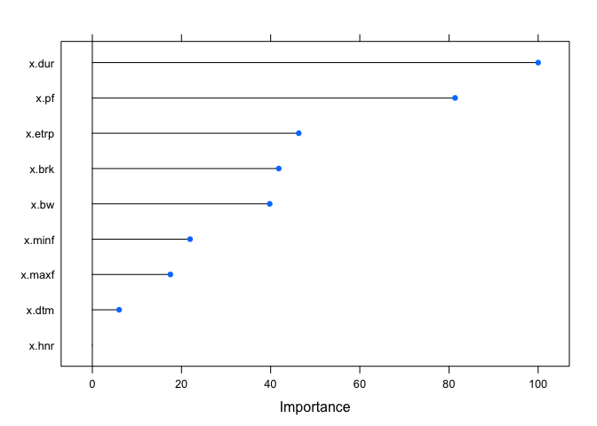<!-- -->

``` r
#1.3.3 SVM(Linear)
train_ctrl=trainControl(method="cv",number=10,classProbs=TRUE)
set.seed(123)
e.svml.cv=train(y~., data=etraindat,trControl=train_ctrl,method="svmLinear") 
print(e.svml.cv)
```

    ## Support Vector Machines with Linear Kernel 
    ## 
    ## 506 samples
    ##   9 predictor
    ##   5 classes: 'ecabin', 'etea', 'O', 'WAR', 'WCAMPING' 
    ## 
    ## No pre-processing
    ## Resampling: Cross-Validated (10 fold) 
    ## Summary of sample sizes: 455, 455, 455, 457, 455, 456, ... 
    ## Resampling results:
    ## 
    ##   Accuracy   Kappa 
    ##   0.5747598  0.4684
    ## 
    ## Tuning parameter 'C' was held constant at a value of 1

``` r
e.svml.pred=predict(e.svml.cv,etestdat)
confusionMatrix(e.svml.pred,ey[etest])
```

    ## Confusion Matrix and Statistics
    ## 
    ##           Reference
    ## Prediction ecabin etea  O WAR WCAMPING
    ##   ecabin       27    4  8  30        0
    ##   etea         12   74 20  15        2
    ##   O             2    7 18  18        3
    ##   WAR           0    0  4  36        2
    ##   WCAMPING      1    0  3  15       36
    ## 
    ## Overall Statistics
    ##                                          
    ##                Accuracy : 0.5668         
    ##                  95% CI : (0.512, 0.6204)
    ##     No Information Rate : 0.3383         
    ##     P-Value [Acc > NIR] : < 2.2e-16      
    ##                                          
    ##                   Kappa : 0.4564         
    ##                                          
    ##  Mcnemar's Test P-Value : 3.644e-13      
    ## 
    ## Statistics by Class:
    ## 
    ##                      Class: ecabin Class: etea Class: O Class: WAR
    ## Sensitivity                0.64286      0.8706  0.33962     0.3158
    ## Specificity                0.85763      0.8056  0.89437     0.9731
    ## Pos Pred Value             0.39130      0.6016  0.37500     0.8571
    ## Neg Pred Value             0.94403      0.9486  0.87889     0.7356
    ## Prevalence                 0.12463      0.2522  0.15727     0.3383
    ## Detection Rate             0.08012      0.2196  0.05341     0.1068
    ## Detection Prevalence       0.20475      0.3650  0.14243     0.1246
    ## Balanced Accuracy          0.75024      0.8381  0.61699     0.6444
    ##                      Class: WCAMPING
    ## Sensitivity                   0.8372
    ## Specificity                   0.9354
    ## Pos Pred Value                0.6545
    ## Neg Pred Value                0.9752
    ## Prevalence                    0.1276
    ## Detection Rate                0.1068
    ## Detection Prevalence          0.1632
    ## Balanced Accuracy             0.8863

``` r
#1.3.3 SVM(radial)
train_ctrl=trainControl(method="cv",number=10,classProbs=TRUE)
set.seed(123)
e.svmr.cv=train(y~., data=etraindat,trControl=train_ctrl,method="svmRadial") 
print(e.svmr.cv)
```

    ## Support Vector Machines with Radial Basis Function Kernel 
    ## 
    ## 506 samples
    ##   9 predictor
    ##   5 classes: 'ecabin', 'etea', 'O', 'WAR', 'WCAMPING' 
    ## 
    ## No pre-processing
    ## Resampling: Cross-Validated (10 fold) 
    ## Summary of sample sizes: 455, 455, 455, 457, 455, 456, ... 
    ## Resampling results across tuning parameters:
    ## 
    ##   C     Accuracy   Kappa    
    ##   0.25  0.6106438  0.5042714
    ##   0.50  0.6088039  0.5014222
    ##   1.00  0.6066830  0.4994248
    ## 
    ## Tuning parameter 'sigma' was held constant at a value of 0.09350262
    ## Accuracy was used to select the optimal model using the largest value.
    ## The final values used for the model were sigma = 0.09350262 and C = 0.25.

``` r
e.svmr.pred=predict(e.svmr.cv,etestdat)
confusionMatrix(e.svmr.pred,ey[etest])
```

    ## Confusion Matrix and Statistics
    ## 
    ##           Reference
    ## Prediction ecabin etea  O WAR WCAMPING
    ##   ecabin       32    5 13  36        1
    ##   etea          9   78 21  12        3
    ##   O             0    2 12   5        0
    ##   WAR           0    0  4  51        2
    ##   WCAMPING      1    0  3  10       37
    ## 
    ## Overall Statistics
    ##                                          
    ##                Accuracy : 0.6231         
    ##                  95% CI : (0.569, 0.6751)
    ##     No Information Rate : 0.3383         
    ##     P-Value [Acc > NIR] : < 2.2e-16      
    ##                                          
    ##                   Kappa : 0.5232         
    ##                                          
    ##  Mcnemar's Test P-Value : 7.43e-15       
    ## 
    ## Statistics by Class:
    ## 
    ##                      Class: ecabin Class: etea Class: O Class: WAR
    ## Sensitivity                0.76190      0.9176  0.22642     0.4474
    ## Specificity                0.81356      0.8214  0.97535     0.9731
    ## Pos Pred Value             0.36782      0.6341  0.63158     0.8947
    ## Neg Pred Value             0.96000      0.9673  0.87107     0.7750
    ## Prevalence                 0.12463      0.2522  0.15727     0.3383
    ## Detection Rate             0.09496      0.2315  0.03561     0.1513
    ## Detection Prevalence       0.25816      0.3650  0.05638     0.1691
    ## Balanced Accuracy          0.78773      0.8695  0.60088     0.7102
    ##                      Class: WCAMPING
    ## Sensitivity                   0.8605
    ## Specificity                   0.9524
    ## Pos Pred Value                0.7255
    ## Neg Pred Value                0.9790
    ## Prevalence                    0.1276
    ## Detection Rate                0.1098
    ## Detection Prevalence          0.1513
    ## Balanced Accuracy             0.9064

``` r
#1.3.3 LDA
train_ctrl=trainControl(method="cv",number=10)
set.seed(123)
e.lda.cv=train(y~., data=etraindat,trControl=train_ctrl,method="lda") 
print(e.lda.cv)
```

    ## Linear Discriminant Analysis 
    ## 
    ## 506 samples
    ##   9 predictor
    ##   5 classes: 'ecabin', 'etea', 'O', 'WAR', 'WCAMPING' 
    ## 
    ## No pre-processing
    ## Resampling: Cross-Validated (10 fold) 
    ## Summary of sample sizes: 455, 455, 455, 457, 455, 456, ... 
    ## Resampling results:
    ## 
    ##   Accuracy   Kappa    
    ##   0.7233304  0.6279639

``` r
e.lda.pred=predict(e.lda.cv,etestdat)
confusionMatrix(e.lda.pred,ey[etest])
```

    ## Confusion Matrix and Statistics
    ## 
    ##           Reference
    ## Prediction ecabin etea   O WAR WCAMPING
    ##   ecabin       23    3   5   3        2
    ##   etea          9   67  16   1        7
    ##   O             4    4  25   0        1
    ##   WAR           5   10   5 103        3
    ##   WCAMPING      1    1   2   7       30
    ## 
    ## Overall Statistics
    ##                                           
    ##                Accuracy : 0.7359          
    ##                  95% CI : (0.6854, 0.7822)
    ##     No Information Rate : 0.3383          
    ##     P-Value [Acc > NIR] : < 2.2e-16       
    ##                                           
    ##                   Kappa : 0.6497          
    ##                                           
    ##  Mcnemar's Test P-Value : 0.0008757       
    ## 
    ## Statistics by Class:
    ## 
    ##                      Class: ecabin Class: etea Class: O Class: WAR
    ## Sensitivity                0.54762      0.7882  0.47170     0.9035
    ## Specificity                0.95593      0.8690  0.96831     0.8969
    ## Pos Pred Value             0.63889      0.6700  0.73529     0.8175
    ## Neg Pred Value             0.93688      0.9241  0.90759     0.9479
    ## Prevalence                 0.12463      0.2522  0.15727     0.3383
    ## Detection Rate             0.06825      0.1988  0.07418     0.3056
    ## Detection Prevalence       0.10682      0.2967  0.10089     0.3739
    ## Balanced Accuracy          0.75178      0.8286  0.72000     0.9002
    ##                      Class: WCAMPING
    ## Sensitivity                  0.69767
    ## Specificity                  0.96259
    ## Pos Pred Value               0.73171
    ## Neg Pred Value               0.95608
    ## Prevalence                   0.12760
    ## Detection Rate               0.08902
    ## Detection Prevalence         0.12166
    ## Balanced Accuracy            0.83013

``` r
#1.3.3 QDA
train_ctrl=trainControl(method="cv",number=10)
set.seed(123)
e.qda.cv=train(y~., data=etraindat,trControl=train_ctrl,method="qda")
print(e.qda.cv)
```

    ## Quadratic Discriminant Analysis 
    ## 
    ## 506 samples
    ##   9 predictor
    ##   5 classes: 'ecabin', 'etea', 'O', 'WAR', 'WCAMPING' 
    ## 
    ## No pre-processing
    ## Resampling: Cross-Validated (10 fold) 
    ## Summary of sample sizes: 455, 455, 455, 457, 455, 456, ... 
    ## Resampling results:
    ## 
    ##   Accuracy   Kappa    
    ##   0.7510954  0.6683593

``` r
e.qda.pred=predict(e.qda.cv,etestdat)
confusionMatrix(e.qda.pred,ey[etest])
```

    ## Confusion Matrix and Statistics
    ## 
    ##           Reference
    ## Prediction ecabin etea  O WAR WCAMPING
    ##   ecabin       24    2  3   3        1
    ##   etea          4   72 11   3        0
    ##   O             8    3 34   2        1
    ##   WAR           5    6  4  96        2
    ##   WCAMPING      1    2  1  10       39
    ## 
    ## Overall Statistics
    ##                                           
    ##                Accuracy : 0.7864          
    ##                  95% CI : (0.7387, 0.8289)
    ##     No Information Rate : 0.3383          
    ##     P-Value [Acc > NIR] : < 2e-16         
    ##                                           
    ##                   Kappa : 0.7206          
    ##                                           
    ##  Mcnemar's Test P-Value : 0.07412         
    ## 
    ## Statistics by Class:
    ## 
    ##                      Class: ecabin Class: etea Class: O Class: WAR
    ## Sensitivity                0.57143      0.8471   0.6415     0.8421
    ## Specificity                0.96949      0.9286   0.9507     0.9238
    ## Pos Pred Value             0.72727      0.8000   0.7083     0.8496
    ## Neg Pred Value             0.94079      0.9474   0.9343     0.9196
    ## Prevalence                 0.12463      0.2522   0.1573     0.3383
    ## Detection Rate             0.07122      0.2136   0.1009     0.2849
    ## Detection Prevalence       0.09792      0.2671   0.1424     0.3353
    ## Balanced Accuracy          0.77046      0.8878   0.7961     0.8829
    ##                      Class: WCAMPING
    ## Sensitivity                   0.9070
    ## Specificity                   0.9524
    ## Pos Pred Value                0.7358
    ## Neg Pred Value                0.9859
    ## Prevalence                    0.1276
    ## Detection Rate                0.1157
    ## Detection Prevalence          0.1573
    ## Balanced Accuracy             0.9297

1.3.3 all contexts (food, easo, mask) mixed with 18 sites

``` r
dat18=dat
dat18=dat18[-which(dat18$site=="edam"),]
dat18=dat18[-which(dat18$site=="ecamping"),]
dat18=dat18[-which(dat18$site=="wexercise"),]
dat18=dat18[-which(dat18$site=="I"),]
dat18=dat18[-which(dat18$site=="UV3"),]
dat18=dat18[-which(dat18$site=="W1"),]
dat18=dat18[-which(dat18$site=="wcabin"),]


unique(dat18$site)# check if these sites fallen out correctly
```

    ##  [1] AR1      AR2      C        ecabin   esam     etea     F       
    ##  [8] J        K        N        O        UV1      UV2      WAR     
    ## [15] wburries WCAMPING wchuck   wdump   
    ## 25 Levels: AR1 AR2 C ecabin ecamping edam esam etea F I J K N O ... wexercise

``` r
dat18$site=factor(dat18$site)
levels(dat18$site)
```

    ##  [1] "AR1"      "AR2"      "C"        "ecabin"   "esam"     "etea"    
    ##  [7] "F"        "J"        "K"        "N"        "O"        "UV1"     
    ## [13] "UV2"      "WAR"      "wburries" "WCAMPING" "wchuck"   "wdump"

``` r
sdat18=scale(dat18[,3:11], center=T, scale=T)
dim(sdat18)
```

    ## [1] 4374    9

``` r
set.seed(123)
test=sample(1:nrow(sdat18),0.4*nrow(sdat18)) #making train index
train=(-test)

y=dat18[,12]
levels(y)
```

    ##  [1] "AR1"      "AR2"      "C"        "ecabin"   "esam"     "etea"    
    ##  [7] "F"        "J"        "K"        "N"        "O"        "UV1"     
    ## [13] "UV2"      "WAR"      "wburries" "WCAMPING" "wchuck"   "wdump"

``` r
traindat=data.frame(x=sdat18[train,],y=y[train])
testdat=data.frame(x=sdat18[test,],y=y[test])
levels(traindat$y)
```

    ##  [1] "AR1"      "AR2"      "C"        "ecabin"   "esam"     "etea"    
    ##  [7] "F"        "J"        "K"        "N"        "O"        "UV1"     
    ## [13] "UV2"      "WAR"      "wburries" "WCAMPING" "wchuck"   "wdump"

``` r
levels(testdat$y)
```

    ##  [1] "AR1"      "AR2"      "C"        "ecabin"   "esam"     "etea"    
    ##  [7] "F"        "J"        "K"        "N"        "O"        "UV1"     
    ## [13] "UV2"      "WAR"      "wburries" "WCAMPING" "wchuck"   "wdump"

``` r
#1.3.1 KNN
train_ctrl=trainControl(method="cv",number=10)
set.seed(123)
knn.cv=train(y~., data=traindat,trControl=train_ctrl,method="knn")
print(knn.cv)
```

    ## k-Nearest Neighbors 
    ## 
    ## 2625 samples
    ##    9 predictor
    ##   18 classes: 'AR1', 'AR2', 'C', 'ecabin', 'esam', 'etea', 'F', 'J', 'K', 'N', 'O', 'UV1', 'UV2', 'WAR', 'wburries', 'WCAMPING', 'wchuck', 'wdump' 
    ## 
    ## No pre-processing
    ## Resampling: Cross-Validated (10 fold) 
    ## Summary of sample sizes: 2363, 2363, 2364, 2365, 2362, 2361, ... 
    ## Resampling results across tuning parameters:
    ## 
    ##   k  Accuracy   Kappa    
    ##   5  0.4130724  0.3669877
    ##   7  0.4190859  0.3730006
    ##   9  0.4180854  0.3717550
    ## 
    ## Accuracy was used to select the optimal model using the largest value.
    ## The final value used for the model was k = 7.

``` r
knn.pred=predict(knn.cv,testdat)
confusionMatrix(knn.pred,y[test])
```

    ## Confusion Matrix and Statistics
    ## 
    ##           Reference
    ## Prediction AR1 AR2   C ecabin esam etea   F   J   K   N   O UV1 UV2 WAR
    ##   AR1       18   4   1      1    0    1   2   0   0   2   3   4   2   7
    ##   AR2        1  52   0      4    5    1   4   0   1  11   1   0   1  11
    ##   C          1   0  35      2    0    4   7   0  14   0   7   1   2   3
    ##   ecabin     2   4   2     44    5    5   1   7   1   4   2   5   5   6
    ##   esam       0   4   0      2    8    1   2   0   1   1   0   0   0   3
    ##   etea       2  14  10     18    1   72   2   7   5   5  10   3   4  11
    ##   F          0   2   1      1    3    4  11   3   4   3   0   5   2   6
    ##   J          2   4   0      6    0   11   4  51   3   2   3   1   2  12
    ##   K          1   3  10      9    1    1   6   2  59   3   6   6   6  12
    ##   N          2   8   3      4    8    4   3   0   3  26   0   3   2   5
    ##   O          1   0   2      4    1    3   1   1   1   0  27   0   4   7
    ##   UV1        0   0   0      0    0    4   0   1   3   1   3   6   5   3
    ##   UV2        0   3   1      0    0    0   1   0   0   2   2   1   1   7
    ##   WAR        7  14   2     17    3   11   3   8   6  10  12   9  14 140
    ##   wburries   2   3   0      7    0    3   1   2   0   0   1   0   1   8
    ##   WCAMPING   4   3   4      1    0    3   5   3   7   2   3   5   5  24
    ##   wchuck     0   2   0     17    3   11   2   5   2   2   3   5   5   9
    ##   wdump      0   5   1      0    0    1   0   4   1   0   0   0   1   4
    ##           Reference
    ## Prediction wburries WCAMPING wchuck wdump
    ##   AR1             0        4      0     1
    ##   AR2             0        2      6     8
    ##   C               0        3      2     0
    ##   ecabin          3        5     17     7
    ##   esam            2        0      3     2
    ##   etea            4        2      7     4
    ##   F               0        0      6     3
    ##   J               1        0      3     2
    ##   K               0        8      3     0
    ##   N               1        2      5     1
    ##   O               0        9      1     2
    ##   UV1             0        4      0     1
    ##   UV2             2        2      2     3
    ##   WAR            15       12     16     5
    ##   wburries       14        0      0     1
    ##   WCAMPING        2       83      6     1
    ##   wchuck          5        4     54     3
    ##   wdump           0        0      1    18
    ## 
    ## Overall Statistics
    ##                                           
    ##                Accuracy : 0.4111          
    ##                  95% CI : (0.3879, 0.4346)
    ##     No Information Rate : 0.1589          
    ##     P-Value [Acc > NIR] : < 2.2e-16       
    ##                                           
    ##                   Kappa : 0.3617          
    ##                                           
    ##  Mcnemar's Test P-Value : NA              
    ## 
    ## Statistics by Class:
    ## 
    ##                      Class: AR1 Class: AR2 Class: C Class: ecabin
    ## Sensitivity             0.41860    0.41600  0.48611       0.32117
    ## Specificity             0.98124    0.96552  0.97257       0.94975
    ## Pos Pred Value          0.36000    0.48148  0.43210       0.35200
    ## Neg Pred Value          0.98529    0.95551  0.97782       0.94273
    ## Prevalence              0.02459    0.07147  0.04117       0.07833
    ## Detection Rate          0.01029    0.02973  0.02001       0.02516
    ## Detection Prevalence    0.02859    0.06175  0.04631       0.07147
    ## Balanced Accuracy       0.69992    0.69076  0.72934       0.63546
    ##                      Class: esam Class: etea Class: F Class: J Class: K
    ## Sensitivity             0.210526     0.51429 0.200000  0.54255  0.53153
    ## Specificity             0.987726     0.93226 0.974616  0.96616  0.95299
    ## Pos Pred Value          0.275862     0.39779 0.203704  0.47664  0.43382
    ## Neg Pred Value          0.982558     0.95663 0.974041  0.97381  0.96776
    ## Prevalence              0.021727     0.08005 0.031447  0.05374  0.06346
    ## Detection Rate          0.004574     0.04117 0.006289  0.02916  0.03373
    ## Detection Prevalence    0.016581     0.10349 0.030875  0.06118  0.07776
    ## Balanced Accuracy       0.599126     0.72327 0.587308  0.75436  0.74226
    ##                      Class: N Class: O Class: UV1 Class: UV2 Class: WAR
    ## Sensitivity           0.35135  0.32530   0.111111  0.0161290    0.50360
    ## Specificity           0.96776  0.97779   0.985251  0.9845880    0.88851
    ## Pos Pred Value        0.32500  0.42188   0.193548  0.0370370    0.46053
    ## Neg Pred Value        0.97124  0.96677   0.972061  0.9645761    0.90450
    ## Prevalence            0.04231  0.04746   0.030875  0.0354488    0.15895
    ## Detection Rate        0.01487  0.01544   0.003431  0.0005718    0.08005
    ## Detection Prevalence  0.04574  0.03659   0.017724  0.0154374    0.17381
    ## Balanced Accuracy     0.65956  0.65155   0.548181  0.5003585    0.69605
    ##                      Class: wburries Class: WCAMPING Class: wchuck
    ## Sensitivity                 0.285714         0.59286       0.40909
    ## Specificity                 0.982941         0.95152       0.95176
    ## Pos Pred Value              0.325581         0.51553       0.40909
    ## Neg Pred Value              0.979484         0.96411       0.95176
    ## Prevalence                  0.028016         0.08005       0.07547
    ## Detection Rate              0.008005         0.04746       0.03087
    ## Detection Prevalence        0.024585         0.09205       0.07547
    ## Balanced Accuracy           0.634328         0.77219       0.68043
    ##                      Class: wdump
    ## Sensitivity               0.29032
    ## Specificity               0.98933
    ## Pos Pred Value            0.50000
    ## Neg Pred Value            0.97431
    ## Prevalence                0.03545
    ## Detection Rate            0.01029
    ## Detection Prevalence      0.02058
    ## Balanced Accuracy         0.63983

``` r
#1.3.2 Random Forest
train_ctrl=trainControl(method="cv",number=10)
set.seed(123)
rf.cv=train(y~., data=traindat,trControl=train_ctrl,method="rf")
print(rf.cv)
```

    ## Random Forest 
    ## 
    ## 2625 samples
    ##    9 predictor
    ##   18 classes: 'AR1', 'AR2', 'C', 'ecabin', 'esam', 'etea', 'F', 'J', 'K', 'N', 'O', 'UV1', 'UV2', 'WAR', 'wburries', 'WCAMPING', 'wchuck', 'wdump' 
    ## 
    ## No pre-processing
    ## Resampling: Cross-Validated (10 fold) 
    ## Summary of sample sizes: 2363, 2363, 2364, 2365, 2362, 2361, ... 
    ## Resampling results across tuning parameters:
    ## 
    ##   mtry  Accuracy   Kappa    
    ##   2     0.5147538  0.4737201
    ##   5     0.5029561  0.4621999
    ##   9     0.4938199  0.4525341
    ## 
    ## Accuracy was used to select the optimal model using the largest value.
    ## The final value used for the model was mtry = 2.

``` r
rf.pred=predict(rf.cv,testdat)
confusionMatrix(rf.pred,y[test])
```

    ## Confusion Matrix and Statistics
    ## 
    ##           Reference
    ## Prediction AR1 AR2   C ecabin esam etea   F   J   K   N   O UV1 UV2 WAR
    ##   AR1       25   0   0      0    0    0   1   0   0   1   1   3   1   3
    ##   AR2        0  61   0      8    1    3   4   1   3   7   0   0   3  13
    ##   C          1   0  42      4    0    4   5   1  10   0   4   0   2   2
    ##   ecabin     1   3   2     58    4    9   2   9   2   3   2   4   2   2
    ##   esam       0   2   0      1   13    0   4   0   0   1   0   1   0   0
    ##   etea       0   6   1     10    1   84   4   5   3   8   8   5   2   5
    ##   F          0   0   1      0    1    2   9   1   2   0   1   1   0   3
    ##   J          1   6   0      4    0    6   0  62   1   2   3   0   2   5
    ##   K          0   4  12      3    0    1   5   2  63   8   2   4   8   4
    ##   N          1   4   1      0    4    3   1   0   3  29   0   2   2   2
    ##   O          2   0   2      4    0    6   4   0   2   0  46   1   2   3
    ##   UV1        0   1   1      0    0    1   2   0   1   1   0   9   2   3
    ##   UV2        0   1   0      1    0    0   0   1   1   0   3   5   4   1
    ##   WAR        7  20   0     14    4   11   4   6   6   8   9   7  14 189
    ##   wburries   1   3   1     14    0    1   1   0   0   0   0   0   3   4
    ##   WCAMPING   4   6   8      0    0    0   4   0   8   0   2   7   5  26
    ##   wchuck     0   5   1     16    9    9   5   2   6   6   1   5   9  10
    ##   wdump      0   3   0      0    1    0   0   4   0   0   1   0   1   3
    ##           Reference
    ## Prediction wburries WCAMPING wchuck wdump
    ##   AR1             0        3      0     1
    ##   AR2             0        0      2     3
    ##   C               0        2      1     1
    ##   ecabin          4        2     12     1
    ##   esam            1        0      3     1
    ##   etea            2        1      3     3
    ##   F               0        0      0     1
    ##   J               2        2      4     0
    ##   K               0        6      3     0
    ##   N               0        1      1     0
    ##   O               0        4      0     3
    ##   UV1             0        1      0     0
    ##   UV2             0        1      1     2
    ##   WAR            13       11     15     8
    ##   wburries       25        0      1     0
    ##   WCAMPING        0      100      2     3
    ##   wchuck          2        6     83     9
    ##   wdump           0        0      1    26
    ## 
    ## Overall Statistics
    ##                                           
    ##                Accuracy : 0.5306          
    ##                  95% CI : (0.5069, 0.5542)
    ##     No Information Rate : 0.1589          
    ##     P-Value [Acc > NIR] : < 2.2e-16       
    ##                                           
    ##                   Kappa : 0.4893          
    ##                                           
    ##  Mcnemar's Test P-Value : NA              
    ## 
    ## Statistics by Class:
    ## 
    ##                      Class: AR1 Class: AR2 Class: C Class: ecabin
    ## Sensitivity             0.58140    0.48800  0.58333       0.42336
    ## Specificity             0.99179    0.97044  0.97794       0.96030
    ## Pos Pred Value          0.64103    0.55963  0.53165       0.47541
    ## Neg Pred Value          0.98947    0.96098  0.98204       0.95144
    ## Prevalence              0.02459    0.07147  0.04117       0.07833
    ## Detection Rate          0.01429    0.03488  0.02401       0.03316
    ## Detection Prevalence    0.02230    0.06232  0.04517       0.06975
    ## Balanced Accuracy       0.78659    0.72922  0.78064       0.69183
    ##                      Class: esam Class: etea Class: F Class: J Class: K
    ## Sensitivity             0.342105     0.60000 0.163636  0.65957  0.56757
    ## Specificity             0.991818     0.95836 0.992326  0.97704  0.96215
    ## Pos Pred Value          0.481481     0.55629 0.409091  0.62000  0.50400
    ## Neg Pred Value          0.985482     0.96496 0.973364  0.98059  0.97044
    ## Prevalence              0.021727     0.08005 0.031447  0.05374  0.06346
    ## Detection Rate          0.007433     0.04803 0.005146  0.03545  0.03602
    ## Detection Prevalence    0.015437     0.08634 0.012579  0.05718  0.07147
    ## Balanced Accuracy       0.666961     0.77918 0.577981  0.81831  0.76486
    ##                      Class: N Class: O Class: UV1 Class: UV2 Class: WAR
    ## Sensitivity           0.39189  0.55422   0.166667   0.064516     0.6799
    ## Specificity           0.98507  0.98019   0.992330   0.989923     0.8933
    ## Pos Pred Value        0.53704  0.58228   0.409091   0.190476     0.5462
    ## Neg Pred Value        0.97345  0.97784   0.973943   0.966435     0.9366
    ## Prevalence            0.04231  0.04746   0.030875   0.035449     0.1589
    ## Detection Rate        0.01658  0.02630   0.005146   0.002287     0.1081
    ## Detection Prevalence  0.03087  0.04517   0.012579   0.012007     0.1978
    ## Balanced Accuracy     0.68848  0.76720   0.579499   0.527220     0.7866
    ##                      Class: wburries Class: WCAMPING Class: wchuck
    ## Sensitivity                  0.51020         0.71429       0.62879
    ## Specificity                  0.98294         0.95339       0.93754
    ## Pos Pred Value               0.46296         0.57143       0.45109
    ## Neg Pred Value               0.98584         0.97459       0.96869
    ## Prevalence                   0.02802         0.08005       0.07547
    ## Detection Rate               0.01429         0.05718       0.04746
    ## Detection Prevalence         0.03087         0.10006       0.10520
    ## Balanced Accuracy            0.74657         0.83384       0.78316
    ##                      Class: wdump
    ## Sensitivity               0.41935
    ## Specificity               0.99170
    ## Pos Pred Value            0.65000
    ## Neg Pred Value            0.97894
    ## Prevalence                0.03545
    ## Detection Rate            0.01487
    ## Detection Prevalence      0.02287
    ## Balanced Accuracy         0.70553

``` r
plot(varImp(object=rf.cv))
```

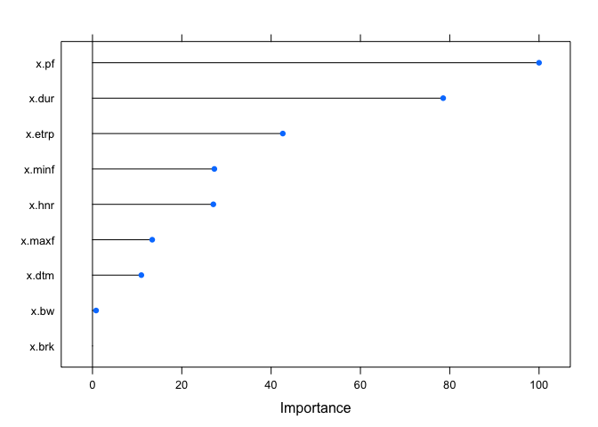<!-- -->

``` r
#1.3.3 SVM(Linear)
train_ctrl=trainControl(method="cv",number=10,classProbs=TRUE)
set.seed(123)
svml.cv=train(y~., data=traindat,trControl=train_ctrl,method="svmLinear") 
```

    ## maximum number of iterations reached 7.31059e-05 -7.291506e-05maximum number of iterations reached 0.004219909 -0.004028242maximum number of iterations reached 0.003587691 -0.003449307maximum number of iterations reached 0.0023876 -0.002318717

``` r
print(svml.cv)
```

    ## Support Vector Machines with Linear Kernel 
    ## 
    ## 2625 samples
    ##    9 predictor
    ##   18 classes: 'AR1', 'AR2', 'C', 'ecabin', 'esam', 'etea', 'F', 'J', 'K', 'N', 'O', 'UV1', 'UV2', 'WAR', 'wburries', 'WCAMPING', 'wchuck', 'wdump' 
    ## 
    ## No pre-processing
    ## Resampling: Cross-Validated (10 fold) 
    ## Summary of sample sizes: 2363, 2363, 2364, 2365, 2362, 2361, ... 
    ## Resampling results:
    ## 
    ##   Accuracy   Kappa    
    ##   0.1760951  0.1285421
    ## 
    ## Tuning parameter 'C' was held constant at a value of 1

``` r
svml.pred=predict(svml.cv,testdat)
confusionMatrix(svml.pred,y[test])
```

    ## Confusion Matrix and Statistics
    ## 
    ##           Reference
    ## Prediction AR1 AR2   C ecabin esam etea   F   J   K   N   O UV1 UV2 WAR
    ##   AR1       20   2   1      5    0    1   1   0   0   0   1   3   0  26
    ##   AR2        4  35   1      5    1   13   4  12   2  13   7   1   9 100
    ##   C          5   0  50     10    0   25   5   3  50   2  40   4   4  10
    ##   ecabin     0   7   1     39    3    8   0  26   1   9   0   7   6  15
    ##   esam       0  17   0      9   19    5   2  13   0   6   0   1   1   3
    ##   etea       2  23   3     25    2   70   4  17   4   9   5   5   3  14
    ##   F          1   2   2      6    0    0   7   2   4   0   2   2   1   2
    ##   J          0   0   0      1    0    1   0   1   0   0   0   0   0   2
    ##   K          0   0   0      0    0    0   0   0   0   0   0   0   0   0
    ##   N          2  16   0      4   12    4   9   2  11  22   1   0   1  26
    ##   O          0   0   0      0    0    0   0   0   0   0   0   0   0   0
    ##   UV1        0   0   0      0    0    0   0   0   2   0   1   0   2   2
    ##   UV2        8  15  12     18    0   12  21   4  36  12  21  30  29  67
    ##   WAR        0   3   0      6    0    0   0   1   0   0   0   0   2   0
    ##   wburries   0   0   0      0    0    0   0   0   0   0   0   0   0   0
    ##   WCAMPING   1   4   0      4    1    1   2   5   1   1   5   0   2   8
    ##   wchuck     0   1   2      5    0    0   0   8   0   0   0   1   2   3
    ##   wdump      0   0   0      0    0    0   0   0   0   0   0   0   0   0
    ##           Reference
    ## Prediction wburries WCAMPING wchuck wdump
    ##   AR1             5       12      0     2
    ##   AR2            17        4     31    23
    ##   C               0       18      2     7
    ##   ecabin          6        1     29     2
    ##   esam            0        3     18    15
    ##   etea            6        9     21     2
    ##   F               0        1      4     0
    ##   J               0        6      1     1
    ##   K               0        0      0     0
    ##   N               1        3     12     1
    ##   O               0        0      0     0
    ##   UV1             0        6      0     0
    ##   UV2             2       69      9     5
    ##   WAR             0        1      0     0
    ##   wburries        0        0      0     0
    ##   WCAMPING        5        7      3     2
    ##   wchuck          7        0      2     2
    ##   wdump           0        0      0     0
    ## 
    ## Overall Statistics
    ##                                           
    ##                Accuracy : 0.1721          
    ##                  95% CI : (0.1547, 0.1906)
    ##     No Information Rate : 0.1589          
    ##     P-Value [Acc > NIR] : 0.0717          
    ##                                           
    ##                   Kappa : 0.125           
    ##                                           
    ##  Mcnemar's Test P-Value : NA              
    ## 
    ## Statistics by Class:
    ## 
    ##                      Class: AR1 Class: AR2 Class: C Class: ecabin
    ## Sensitivity             0.46512    0.28000  0.69444       0.28467
    ## Specificity             0.96542    0.84791  0.88968       0.92494
    ## Pos Pred Value          0.25316    0.12411  0.21277       0.24375
    ## Neg Pred Value          0.98623    0.93865  0.98547       0.93833
    ## Prevalence              0.02459    0.07147  0.04117       0.07833
    ## Detection Rate          0.01144    0.02001  0.02859       0.02230
    ## Detection Prevalence    0.04517    0.16123  0.13436       0.09148
    ## Balanced Accuracy       0.71527    0.56395  0.79206       0.60480
    ##                      Class: esam Class: etea Class: F  Class: J Class: K
    ## Sensitivity              0.50000     0.50000 0.127273 0.0106383  0.00000
    ## Specificity              0.94565     0.90429 0.982881 0.9927492  1.00000
    ## Pos Pred Value           0.16964     0.31250 0.194444 0.0769231      NaN
    ## Neg Pred Value           0.98839     0.95410 0.971979 0.9464286  0.93654
    ## Prevalence               0.02173     0.08005 0.031447 0.0537450  0.06346
    ## Detection Rate           0.01086     0.04002 0.004002 0.0005718  0.00000
    ## Detection Prevalence     0.06404     0.12807 0.020583 0.0074328  0.00000
    ## Balanced Accuracy        0.72282     0.70214 0.555077 0.5016938  0.50000
    ##                      Class: N Class: O Class: UV1 Class: UV2 Class: WAR
    ## Sensitivity           0.29730  0.00000   0.000000    0.46774   0.000000
    ## Specificity           0.93731  1.00000   0.992330    0.79787   0.991162
    ## Pos Pred Value        0.17323      NaN   0.000000    0.07838   0.000000
    ## Neg Pred Value        0.96794  0.95254   0.968894    0.97607   0.839862
    ## Prevalence            0.04231  0.04746   0.030875    0.03545   0.158948
    ## Detection Rate        0.01258  0.00000   0.000000    0.01658   0.000000
    ## Detection Prevalence  0.07261  0.00000   0.007433    0.21155   0.007433
    ## Balanced Accuracy     0.61731  0.50000   0.496165    0.63280   0.495581
    ##                      Class: wburries Class: WCAMPING Class: wchuck
    ## Sensitivity                  0.00000        0.050000      0.015152
    ## Specificity                  1.00000        0.972032      0.980829
    ## Pos Pred Value                   NaN        0.134615      0.060606
    ## Neg Pred Value               0.97198        0.921626      0.924242
    ## Prevalence                   0.02802        0.080046      0.075472
    ## Detection Rate               0.00000        0.004002      0.001144
    ## Detection Prevalence         0.00000        0.029731      0.018868
    ## Balanced Accuracy            0.50000        0.511016      0.497990
    ##                      Class: wdump
    ## Sensitivity               0.00000
    ## Specificity               1.00000
    ## Pos Pred Value                NaN
    ## Neg Pred Value            0.96455
    ## Prevalence                0.03545
    ## Detection Rate            0.00000
    ## Detection Prevalence      0.00000
    ## Balanced Accuracy         0.50000

``` r
#1.3.3 SVM(radial)
train_ctrl=trainControl(method="cv",number=10,classProbs=TRUE)
set.seed(123)
svmr.cv=train(y~., data=traindat,trControl=train_ctrl,method="svmRadial")
print(svmr.cv)
```

    ## Support Vector Machines with Radial Basis Function Kernel 
    ## 
    ## 2625 samples
    ##    9 predictor
    ##   18 classes: 'AR1', 'AR2', 'C', 'ecabin', 'esam', 'etea', 'F', 'J', 'K', 'N', 'O', 'UV1', 'UV2', 'WAR', 'wburries', 'WCAMPING', 'wchuck', 'wdump' 
    ## 
    ## No pre-processing
    ## Resampling: Cross-Validated (10 fold) 
    ## Summary of sample sizes: 2363, 2363, 2364, 2365, 2362, 2361, ... 
    ## Resampling results across tuning parameters:
    ## 
    ##   C     Accuracy   Kappa    
    ##   0.25  0.2142192  0.1662143
    ##   0.50  0.2222029  0.1749283
    ##   1.00  0.2271374  0.1805270
    ## 
    ## Tuning parameter 'sigma' was held constant at a value of 0.09891184
    ## Accuracy was used to select the optimal model using the largest value.
    ## The final values used for the model were sigma = 0.09891184 and C = 1.

``` r
svmr.pred=predict(svmr.cv,testdat)
confusionMatrix(svmr.pred,y[test])
```

    ## Confusion Matrix and Statistics
    ## 
    ##           Reference
    ## Prediction AR1 AR2  C ecabin esam etea  F  J  K  N  O UV1 UV2 WAR wburries
    ##   AR1       19   4  0      2    0    1  1  0  3  0  4   5   3  18        0
    ##   AR2        3  65  0      8    2    2  6  8  9 22  2   2   7  66       13
    ##   C          5   1 59      6    0   14  6  4 54  4 26   2   4  10        0
    ##   ecabin     1   7  2     54    8    9  0 20  3  7  0   7   5  13        4
    ##   esam       0   7  0      5   22    4  4 15  0  9  1   1   2   6        1
    ##   etea       2  18  5     27    0   89  6 20  4  7 21   6   6  22        7
    ##   F          1   3  1      0    0    0  6  0  4  0  1   1   1   0        0
    ##   J          1   0  0      4    0    3  1  9  0  2  1   0   0   9        1
    ##   K          0   0  0      0    0    0  0  0  0  0  0   0   0   0        0
    ##   N          5   4  0      5    4    5  7  1  6 14  0   2   2  23        4
    ##   O          0   0  0      0    0    0  0  0  0  0  0   0   0   2        0
    ##   UV1        0   1  0      0    0    1  1  0  3  1  1   4   4   7        0
    ##   UV2        4  11  4     15    0   10 15  7 24  8 20  21  23  66        2
    ##   WAR        0   3  0      1    0    0  0  2  1  0  2   2   1  15        6
    ##   wburries   0   0  0      3    0    1  0  0  0  0  0   0   0   8        3
    ##   WCAMPING   2   0  0      5    1    1  2  1  0  0  4   1   0  12        5
    ##   wchuck     0   1  1      2    1    0  0  7  0  0  0   0   4   1        3
    ##   wdump      0   0  0      0    0    0  0  0  0  0  0   0   0   0        0
    ##           Reference
    ## Prediction WCAMPING wchuck wdump
    ##   AR1             5      0     2
    ##   AR2             2     22    18
    ##   C              26      1     6
    ##   ecabin          6     44     4
    ##   esam            2     14    13
    ##   etea            8     20     5
    ##   F               1      5     0
    ##   J               2      2     0
    ##   K               0      0     0
    ##   N               2      6     1
    ##   O               0      0     0
    ##   UV1            10      0     0
    ##   UV2            63     10     5
    ##   WAR             5      0     0
    ##   wburries        4      0     0
    ##   WCAMPING        3      7     2
    ##   wchuck          1      1     6
    ##   wdump           0      0     0
    ## 
    ## Overall Statistics
    ##                                           
    ##                Accuracy : 0.2207          
    ##                  95% CI : (0.2015, 0.2409)
    ##     No Information Rate : 0.1589          
    ##     P-Value [Acc > NIR] : 8.888e-12       
    ##                                           
    ##                   Kappa : 0.1736          
    ##                                           
    ##  Mcnemar's Test P-Value : NA              
    ## 
    ## Statistics by Class:
    ## 
    ##                      Class: AR1 Class: AR2 Class: C Class: ecabin
    ## Sensitivity             0.44186    0.52000  0.81944       0.39416
    ## Specificity             0.97186    0.88177  0.89922       0.91315
    ## Pos Pred Value          0.28358    0.25292  0.25877       0.27835
    ## Neg Pred Value          0.98573    0.95979  0.99145       0.94662
    ## Prevalence              0.02459    0.07147  0.04117       0.07833
    ## Detection Rate          0.01086    0.03716  0.03373       0.03087
    ## Detection Prevalence    0.03831    0.14694  0.13036       0.11092
    ## Balanced Accuracy       0.70686    0.70089  0.85933       0.65366
    ##                      Class: esam Class: etea Class: F Class: J Class: K
    ## Sensitivity              0.57895     0.63571 0.109091 0.095745  0.00000
    ## Specificity              0.95091     0.88564 0.989374 0.984290  1.00000
    ## Pos Pred Value           0.20755     0.32601 0.250000 0.257143      NaN
    ## Neg Pred Value           0.99026     0.96545 0.971594 0.950408  0.93654
    ## Prevalence               0.02173     0.08005 0.031447 0.053745  0.06346
    ## Detection Rate           0.01258     0.05089 0.003431 0.005146  0.00000
    ## Detection Prevalence     0.06061     0.15609 0.013722 0.020011  0.00000
    ## Balanced Accuracy        0.76493     0.76068 0.549233 0.540017  0.50000
    ##                      Class: N Class: O Class: UV1 Class: UV2 Class: WAR
    ## Sensitivity          0.189189 0.000000   0.074074    0.37097   0.053957
    ## Specificity          0.954030 0.998800   0.982891    0.83106   0.984364
    ## Pos Pred Value       0.153846 0.000000   0.121212    0.07468   0.394737
    ## Neg Pred Value       0.963812 0.952490   0.970862    0.97294   0.846289
    ## Prevalence           0.042310 0.047456   0.030875    0.03545   0.158948
    ## Detection Rate       0.008005 0.000000   0.002287    0.01315   0.008576
    ## Detection Prevalence 0.052030 0.001144   0.018868    0.17610   0.021727
    ## Balanced Accuracy    0.571610 0.499400   0.528482    0.60101   0.519161
    ##                      Class: wburries Class: WCAMPING Class: wchuck
    ## Sensitivity                 0.061224        0.021429     0.0075758
    ## Specificity                 0.990588        0.973275     0.9833024
    ## Pos Pred Value              0.157895        0.065217     0.0357143
    ## Neg Pred Value              0.973410        0.919554     0.9238815
    ## Prevalence                  0.028016        0.080046     0.0754717
    ## Detection Rate              0.001715        0.001715     0.0005718
    ## Detection Prevalence        0.010863        0.026301     0.0160091
    ## Balanced Accuracy           0.525906        0.497352     0.4954391
    ##                      Class: wdump
    ## Sensitivity               0.00000
    ## Specificity               1.00000
    ## Pos Pred Value                NaN
    ## Neg Pred Value            0.96455
    ## Prevalence                0.03545
    ## Detection Rate            0.00000
    ## Detection Prevalence      0.00000
    ## Balanced Accuracy         0.50000

``` r
#1.3.3 LDA
train_ctrl=trainControl(method="cv",number=10)
set.seed(123)
lda.cv=train(y~., data=traindat,trControl=train_ctrl,method="lda") 
print(lda.cv)
```

    ## Linear Discriminant Analysis 
    ## 
    ## 2625 samples
    ##    9 predictor
    ##   18 classes: 'AR1', 'AR2', 'C', 'ecabin', 'esam', 'etea', 'F', 'J', 'K', 'N', 'O', 'UV1', 'UV2', 'WAR', 'wburries', 'WCAMPING', 'wchuck', 'wdump' 
    ## 
    ## No pre-processing
    ## Resampling: Cross-Validated (10 fold) 
    ## Summary of sample sizes: 2363, 2363, 2364, 2365, 2362, 2361, ... 
    ## Resampling results:
    ## 
    ##   Accuracy   Kappa    
    ##   0.3681054  0.3121765

``` r
lda.pred=predict(lda.cv,testdat)
confusionMatrix(lda.pred,y[test])
```

    ## Confusion Matrix and Statistics
    ## 
    ##           Reference
    ## Prediction AR1 AR2   C ecabin esam etea   F   J   K   N   O UV1 UV2 WAR
    ##   AR1       14   4   0      1    0    2   1   0   2   1   1   1   0   4
    ##   AR2        0  25   0      1    4    5   1   0   0  11   0   0   3  19
    ##   C          5   0  25      7    0    9   1   1   8   0  15   0   2   4
    ##   ecabin     0   4   2     37    5    7   4  11   2   3   1   9   6  11
    ##   esam       0   7   0      2   13    3   1   0   0   0   0   0   0   0
    ##   etea       1  13   7     14    2   64   4   5   2   2  16   2   1   5
    ##   F          0   1   3      2    0    1   6   0   2   0   0   3   0   2
    ##   J          0   3   0     11    0    0   0  20   0   0   0   0   2   3
    ##   K          4  10  26      4    0    3  15   4  63  14   5   3  13   6
    ##   N          1   5   0      0    8    0   5   1   4  17   0   1   0   6
    ##   O          0   0   3      8    0    6   6   0   0   0  20   2   8   1
    ##   UV1        0   2   0      0    0    1   1   0   0   0   2   5   4   0
    ##   UV2        0   0   0      0    0    0   0   0   0   0   0   0   0   0
    ##   WAR       12  31   0     13    2   22   8  25  13  24  15  17  17 158
    ##   wburries   0   4   0     13    0    0   0   0   0   0   0   0   3  10
    ##   WCAMPING   6   5   6      2    0    4   1   2  10   0   6   5   2  38
    ##   wchuck     0   6   0     19    4   12   1   8   5   2   2   6   1   6
    ##   wdump      0   5   0      3    0    1   0  17   0   0   0   0   0   5
    ##           Reference
    ## Prediction wburries WCAMPING wchuck wdump
    ##   AR1             1        4      0     0
    ##   AR2             1        1      5     8
    ##   C               0        2      0     5
    ##   ecabin          6        3     31     6
    ##   esam            0        1      4     3
    ##   etea            4       11      5     1
    ##   F               0        1      2     0
    ##   J               3        1      5     0
    ##   K               0       10      3     1
    ##   N               1        0      6     0
    ##   O               0        1      1     6
    ##   UV1             0        2      1     0
    ##   UV2             0        0      0     0
    ##   WAR            17       25     18     3
    ##   wburries       13        0      0     2
    ##   WCAMPING        1       74      3     0
    ##   wchuck          2        4     47     6
    ##   wdump           0        0      1    21
    ## 
    ## Overall Statistics
    ##                                           
    ##                Accuracy : 0.3556          
    ##                  95% CI : (0.3332, 0.3786)
    ##     No Information Rate : 0.1589          
    ##     P-Value [Acc > NIR] : < 2.2e-16       
    ##                                           
    ##                   Kappa : 0.2955          
    ##                                           
    ##  Mcnemar's Test P-Value : NA              
    ## 
    ## Statistics by Class:
    ## 
    ##                      Class: AR1 Class: AR2 Class: C Class: ecabin
    ## Sensitivity            0.325581    0.20000  0.34722       0.27007
    ## Specificity            0.987104    0.96367  0.96482       0.93114
    ## Pos Pred Value         0.388889    0.29762  0.29762       0.25000
    ## Neg Pred Value         0.983071    0.93994  0.97177       0.93754
    ## Prevalence             0.024585    0.07147  0.04117       0.07833
    ## Detection Rate         0.008005    0.01429  0.01429       0.02115
    ## Detection Prevalence   0.020583    0.04803  0.04803       0.08462
    ## Balanced Accuracy      0.656343    0.58183  0.65602       0.60061
    ##                      Class: esam Class: etea Class: F Class: J Class: K
    ## Sensitivity             0.342105     0.45714 0.109091  0.21277  0.56757
    ## Specificity             0.987726     0.94096 0.989965  0.98308  0.92613
    ## Pos Pred Value          0.382353     0.40252 0.260870  0.41667  0.34239
    ## Neg Pred Value          0.985423     0.95220 0.971611  0.95650  0.96933
    ## Prevalence              0.021727     0.08005 0.031447  0.05374  0.06346
    ## Detection Rate          0.007433     0.03659 0.003431  0.01144  0.03602
    ## Detection Prevalence    0.019440     0.09091 0.013150  0.02744  0.10520
    ## Balanced Accuracy       0.664916     0.69905 0.549528  0.59792  0.74685
    ##                      Class: N Class: O Class: UV1 Class: UV2 Class: WAR
    ## Sensitivity           0.22973  0.24096   0.092593    0.00000    0.56835
    ## Specificity           0.97731  0.97479   0.992330    1.00000    0.82189
    ## Pos Pred Value        0.30909  0.32258   0.277778        NaN    0.37619
    ## Neg Pred Value        0.96635  0.96266   0.971693    0.96455    0.90971
    ## Prevalence            0.04231  0.04746   0.030875    0.03545    0.15895
    ## Detection Rate        0.00972  0.01144   0.002859    0.00000    0.09034
    ## Detection Prevalence  0.03145  0.03545   0.010292    0.00000    0.24014
    ## Balanced Accuracy     0.60352  0.60788   0.542461    0.50000    0.69512
    ##                      Class: wburries Class: WCAMPING Class: wchuck
    ## Sensitivity                 0.265306         0.52857       0.35606
    ## Specificity                 0.981176         0.94344       0.94805
    ## Pos Pred Value              0.288889         0.44848       0.35878
    ## Neg Pred Value              0.978873         0.95833       0.94747
    ## Prevalence                  0.028016         0.08005       0.07547
    ## Detection Rate              0.007433         0.04231       0.02687
    ## Detection Prevalence        0.025729         0.09434       0.07490
    ## Balanced Accuracy           0.623241         0.73601       0.65206
    ##                      Class: wdump
    ## Sensitivity               0.33871
    ## Specificity               0.98103
    ## Pos Pred Value            0.39623
    ## Neg Pred Value            0.97583
    ## Prevalence                0.03545
    ## Detection Rate            0.01201
    ## Detection Prevalence      0.03030
    ## Balanced Accuracy         0.65987

``` r
#1.3.3 QDA
train_ctrl=trainControl(method="cv",number=10)
set.seed(123)
qda.cv=train(y~., data=traindat,trControl=train_ctrl,method="qda") 
print(qda.cv)
```

    ## Quadratic Discriminant Analysis 
    ## 
    ## 2625 samples
    ##    9 predictor
    ##   18 classes: 'AR1', 'AR2', 'C', 'ecabin', 'esam', 'etea', 'F', 'J', 'K', 'N', 'O', 'UV1', 'UV2', 'WAR', 'wburries', 'WCAMPING', 'wchuck', 'wdump' 
    ## 
    ## No pre-processing
    ## Resampling: Cross-Validated (10 fold) 
    ## Summary of sample sizes: 2363, 2363, 2364, 2365, 2362, 2361, ... 
    ## Resampling results:
    ## 
    ##   Accuracy   Kappa    
    ##   0.3886656  0.3452345

``` r
qda.pred=predict(qda.cv,testdat)
confusionMatrix(qda.pred,y[test])
```

    ## Confusion Matrix and Statistics
    ## 
    ##           Reference
    ## Prediction AR1 AR2  C ecabin esam etea  F  J  K  N  O UV1 UV2 WAR wburries
    ##   AR1       23   4  4      0    0    1  2  2  2  1  3   4   0  22        1
    ##   AR2        0  27  0      2    3    0  0  0  1  0  2   0   1   6        1
    ##   C          0   1 34      3    0    6  1  1 11  1 13   2   5   2        0
    ##   ecabin     0   2  1     28    3    5  0  2  2  2  0   8   4   5        2
    ##   esam       0   3  0      1   13    1  2  0  0  0  0   1   0   2        0
    ##   etea       1  12  6     11    0   65  5  3  1  0 13   5   2   7        2
    ##   F          0   0  2      6    1    4  9  0  1  0  3   2   1   4        0
    ##   J          3  12  1     26    2   22  0 75  5 16  5   0   8  44        8
    ##   K          0   4 14      3    0    1  8  3 53  2  3   1   3   4        0
    ##   N          5  26  2      3    5    8 12  5 21 46  3   8   7  34        2
    ##   O          2   0  2      9    0    4  7  0  0  0 22   2   5   2        0
    ##   UV1        0   7  0      2    0    1  2  0  4  0  2   6   5   3        0
    ##   UV2        0   0  1      2    1    0  0  1  0  0  4   2   2   4        0
    ##   WAR        2  12  0      5    4   11  3  1  3  5  5   7   8  94       15
    ##   wburries   1   6  1     15    1    0  0  1  0  0  0   1   3  10       14
    ##   WCAMPING   6   2  4      1    0    4  1  0  6  0  2   1   4  23        0
    ##   wchuck     0   4  0     19    5    6  1  0  1  0  2   4   3   9        4
    ##   wdump      0   3  0      1    0    1  2  0  0  1  1   0   1   3        0
    ##           Reference
    ## Prediction WCAMPING wchuck wdump
    ##   AR1            12      0     0
    ##   AR2             1      3     5
    ##   C               2      0     6
    ##   ecabin          6      8     3
    ##   esam            1      3     2
    ##   etea            4      8     3
    ##   F               1     13     2
    ##   J               4     13     6
    ##   K               3      1     0
    ##   N              10     11     1
    ##   O               2      1     4
    ##   UV1             3      2     0
    ##   UV2             2      3     0
    ##   WAR            14      9     4
    ##   wburries        0      3     1
    ##   WCAMPING       75      3     1
    ##   wchuck          0     50     5
    ##   wdump           0      1    19
    ## 
    ## Overall Statistics
    ##                                           
    ##                Accuracy : 0.3745          
    ##                  95% CI : (0.3518, 0.3977)
    ##     No Information Rate : 0.1589          
    ##     P-Value [Acc > NIR] : < 2.2e-16       
    ##                                           
    ##                   Kappa : 0.3295          
    ##                                           
    ##  Mcnemar's Test P-Value : NA              
    ## 
    ## Statistics by Class:
    ## 
    ##                      Class: AR1 Class: AR2 Class: C Class: ecabin
    ## Sensitivity             0.53488    0.21600  0.47222       0.20438
    ## Specificity             0.96600    0.98461  0.96780       0.96712
    ## Pos Pred Value          0.28395    0.51923  0.38636       0.34568
    ## Neg Pred Value          0.98801    0.94225  0.97712       0.93465
    ## Prevalence              0.02459    0.07147  0.04117       0.07833
    ## Detection Rate          0.01315    0.01544  0.01944       0.01601
    ## Detection Prevalence    0.04631    0.02973  0.05031       0.04631
    ## Balanced Accuracy       0.75044    0.60030  0.72001       0.58575
    ##                      Class: esam Class: etea Class: F Class: J Class: K
    ## Sensitivity             0.342105     0.46429 0.163636  0.79787  0.47748
    ## Specificity             0.990649     0.94842 0.976387  0.89426  0.96947
    ## Pos Pred Value          0.448276     0.43919 0.183673  0.30000  0.51456
    ## Neg Pred Value          0.985465     0.95315 0.972941  0.98732  0.96476
    ## Prevalence              0.021727     0.08005 0.031447  0.05374  0.06346
    ## Detection Rate          0.007433     0.03716 0.005146  0.04288  0.03030
    ## Detection Prevalence    0.016581     0.08462 0.028016  0.14294  0.05889
    ## Balanced Accuracy       0.666377     0.70635 0.570012  0.84607  0.72348
    ##                      Class: N Class: O Class: UV1 Class: UV2 Class: WAR
    ## Sensitivity           0.62162  0.26506   0.111111   0.032258    0.33813
    ## Specificity           0.90269  0.97599   0.981711   0.988145    0.92658
    ## Pos Pred Value        0.22010  0.35484   0.162162   0.090909    0.46535
    ## Neg Pred Value        0.98182  0.96384   0.971963   0.965258    0.88106
    ## Prevalence            0.04231  0.04746   0.030875   0.035449    0.15895
    ## Detection Rate        0.02630  0.01258   0.003431   0.001144    0.05374
    ## Detection Prevalence  0.11950  0.03545   0.021155   0.012579    0.11549
    ## Balanced Accuracy     0.76215  0.62053   0.546411   0.510201    0.63236
    ##                      Class: wburries Class: WCAMPING Class: wchuck
    ## Sensitivity                 0.285714         0.53571       0.37879
    ## Specificity                 0.974706         0.96395       0.96104
    ## Pos Pred Value              0.245614         0.56391       0.44248
    ## Neg Pred Value              0.979314         0.95978       0.94988
    ## Prevalence                  0.028016         0.08005       0.07547
    ## Detection Rate              0.008005         0.04288       0.02859
    ## Detection Prevalence        0.032590         0.07604       0.06461
    ## Balanced Accuracy           0.630210         0.74983       0.66991
    ##                      Class: wdump
    ## Sensitivity               0.30645
    ## Specificity               0.99170
    ## Pos Pred Value            0.57576
    ## Neg Pred Value            0.97494
    ## Prevalence                0.03545
    ## Detection Rate            0.01086
    ## Detection Prevalence      0.01887
    ## Balanced Accuracy         0.64908

1.4 9 acoustic variable differences across locations and all contexts

``` r
library(lmerTest)
```

    ## Loading required package: lme4

    ## Loading required package: Matrix

    ## 
    ## Attaching package: 'lmerTest'

    ## The following object is masked from 'package:lme4':
    ## 
    ##     lmer

    ## The following object is masked from 'package:stats':
    ## 
    ##     step

``` r
m1_1 = lmer(dur~Location*context+(1|site/context),data=dat)
m2_1 = lmer(brk~Location*context+(1|site/context),data=dat)
m3_1 = lmer(dtm~Location*context+(1|site/context),data=dat)
m4_1 = lmer(pf~Location*context+(1|site/context),data=dat)
m5_1 = lmer(minf~Location*context+(1|site/context),data=dat)
m6_1 = lmer(maxf~Location*context+(1|site/context),data=dat)
m7_1 = lmer(bw~Location*context+(1|site/context),data=dat)
m8_1 = lmer(etrp~Location*context+(1|site/context),data=dat,control = lmerControl(optimizer = "Nelder_Mead"))
m9_1 = lmer(hnr~Location*context+(1|site/context),data=dat)

shapiro.test(resid(m1_1))
```

    ## 
    ##  Shapiro-Wilk normality test
    ## 
    ## data:  resid(m1_1)
    ## W = 0.9731, p-value < 2.2e-16

``` r
shapiro.test(resid(m2_1))
```

    ## 
    ##  Shapiro-Wilk normality test
    ## 
    ## data:  resid(m2_1)
    ## W = 0.94073, p-value < 2.2e-16

``` r
shapiro.test(resid(m3_1))
```

    ## 
    ##  Shapiro-Wilk normality test
    ## 
    ## data:  resid(m3_1)
    ## W = 0.99322, p-value = 2.005e-14

``` r
shapiro.test(resid(m4_1))#only this is <0.9
```

    ## 
    ##  Shapiro-Wilk normality test
    ## 
    ## data:  resid(m4_1)
    ## W = 0.87225, p-value < 2.2e-16

``` r
shapiro.test(resid(m5_1))
```

    ## 
    ##  Shapiro-Wilk normality test
    ## 
    ## data:  resid(m5_1)
    ## W = 0.94464, p-value < 2.2e-16

``` r
shapiro.test(resid(m6_1))
```

    ## 
    ##  Shapiro-Wilk normality test
    ## 
    ## data:  resid(m6_1)
    ## W = 0.95429, p-value < 2.2e-16

``` r
shapiro.test(resid(m7_1))
```

    ## 
    ##  Shapiro-Wilk normality test
    ## 
    ## data:  resid(m7_1)
    ## W = 0.97756, p-value < 2.2e-16

``` r
shapiro.test(resid(m8_1))
```

    ## 
    ##  Shapiro-Wilk normality test
    ## 
    ## data:  resid(m8_1)
    ## W = 0.99044, p-value < 2.2e-16

``` r
shapiro.test(resid(m9_1))
```

    ## 
    ##  Shapiro-Wilk normality test
    ## 
    ## data:  resid(m9_1)
    ## W = 0.95554, p-value < 2.2e-16

``` r
#Except m4 all exceed 0.9

m4_1 <- lmer(log(pf)~Location*context+(1|site/context),data=dat)
shapiro.test(resid(m4_1))#now the m4 W>0.9
```

    ## 
    ##  Shapiro-Wilk normality test
    ## 
    ## data:  resid(m4_1)
    ## W = 0.93211, p-value < 2.2e-16

``` r
anova(m1_1)
```

    ## Type III Analysis of Variance Table with Satterthwaite's method
    ##                      Sum Sq    Mean Sq NumDF  DenDF F value Pr(>F)
    ## Location         0.00018484 1.8484e-04     1 23.837  2.1260 0.1579
    ## context          0.00028765 1.4382e-04     2 38.578  1.6542 0.2045
    ## Location:context 0.00015043 7.5213e-05     2 38.578  0.8651 0.4290

``` r
anova(m2_1)
```

    ## Type III Analysis of Variance Table with Satterthwaite's method
    ##                      Sum Sq    Mean Sq NumDF  DenDF F value Pr(>F)
    ## Location         0.00002759 2.7588e-05     1 23.658  0.3118 0.5818
    ## context          0.00003332 1.6659e-05     2 36.243  0.1883 0.8292
    ## Location:context 0.00033196 1.6598e-04     2 36.243  1.8760 0.1678

``` r
anova(m3_1)
```

    ## Type III Analysis of Variance Table with Satterthwaite's method
    ##                      Sum Sq    Mean Sq NumDF  DenDF F value Pr(>F)
    ## Location         0.00000006 0.00000006     1 22.367  0.0002 0.9897
    ## context          0.00003035 0.00001518     2 35.900  0.0405 0.9604
    ## Location:context 0.00094399 0.00047199     2 35.900  1.2591 0.2961

``` r
anova(m4_1)
```

    ## Type III Analysis of Variance Table with Satterthwaite's method
    ##                     Sum Sq   Mean Sq NumDF  DenDF F value  Pr(>F)  
    ## Location         0.0020620 0.0020620     1 23.517  0.3761 0.54556  
    ## context          0.0310885 0.0155442     2 38.864  2.8356 0.07088 .
    ## Location:context 0.0070242 0.0035121     2 38.864  0.6407 0.53241  
    ## ---
    ## Signif. codes:  0 '***' 0.001 '**' 0.01 '*' 0.05 '.' 0.1 ' ' 1

``` r
anova(m5_1)
```

    ## Type III Analysis of Variance Table with Satterthwaite's method
    ##                  Sum Sq Mean Sq NumDF  DenDF F value Pr(>F)
    ## Location           7595    7595     1 23.678  0.1197 0.7324
    ## context           92869   46434     2 39.766  0.7317 0.4874
    ## Location:context  36070   18035     2 39.766  0.2842 0.7541

``` r
anova(m6_1)#context
```

    ## Type III Analysis of Variance Table with Satterthwaite's method
    ##                   Sum Sq Mean Sq NumDF  DenDF F value   Pr(>F)   
    ## Location           96179   96179     1 22.582  0.3871 0.540057   
    ## context          3088533 1544266     2 33.276  6.2154 0.005087 **
    ## Location:context  389820  194910     2 33.276  0.7845 0.464613   
    ## ---
    ## Signif. codes:  0 '***' 0.001 '**' 0.01 '*' 0.05 '.' 0.1 ' ' 1

``` r
anova(m7_1)#context
```

    ## Type III Analysis of Variance Table with Satterthwaite's method
    ##                   Sum Sq Mean Sq NumDF  DenDF F value   Pr(>F)   
    ## Location           57866   57866     1 22.502  0.1790 0.676223   
    ## context          3680974 1840487     2 33.983  5.6943 0.007365 **
    ## Location:context  618789  309395     2 33.983  0.9572 0.394062   
    ## ---
    ## Signif. codes:  0 '***' 0.001 '**' 0.01 '*' 0.05 '.' 0.1 ' ' 1

``` r
anova(m8_1)#context
```

    ## Type III Analysis of Variance Table with Satterthwaite's method
    ##                     Sum Sq   Mean Sq NumDF  DenDF F value Pr(>F)  
    ## Location         0.0000087 0.0000087     1 23.551  0.0044 0.9475  
    ## context          0.0100672 0.0050336     2 41.023  2.5650 0.0892 .
    ## Location:context 0.0045557 0.0022779     2 41.023  1.1608 0.3233  
    ## ---
    ## Signif. codes:  0 '***' 0.001 '**' 0.01 '*' 0.05 '.' 0.1 ' ' 1

``` r
anova(m9_1)
```

    ## Type III Analysis of Variance Table with Satterthwaite's method
    ##                  Sum Sq Mean Sq NumDF  DenDF F value Pr(>F)
    ## Location         6.1462  6.1462     1 23.893  1.5422 0.2263
    ## context          0.7816  0.3908     2 43.213  0.0981 0.9068
    ## Location:context 3.2100  1.6050     2 43.213  0.4027 0.6710

``` r
step(m1_1,direction="both")#dur ~ (1 | site/context)
```

    ## Backward reduced random-effect table:
    ## 
    ##                    Eliminated npar logLik    AIC    LRT Df Pr(>Chisq)    
    ## <none>                           9  15643 -31268                         
    ## (1 | context:site)          0    8  15156 -30295 974.37  1  < 2.2e-16 ***
    ## (1 | site)                  0    8  15632 -31249  20.79  1  5.113e-06 ***
    ## ---
    ## Signif. codes:  0 '***' 0.001 '**' 0.01 '*' 0.05 '.' 0.1 ' ' 1
    ## 
    ## Backward reduced fixed-effect table:
    ## Degrees of freedom method: Satterthwaite 
    ## 
    ##                  Eliminated     Sum Sq    Mean Sq NumDF  DenDF F value
    ## Location:context          1 0.00015043 7.5213e-05     2 38.578  0.8651
    ## context                   2 0.00034195 1.7097e-04     2 40.374  1.9665
    ## Location                  3 0.00021210 2.1210e-04     1 23.717  2.4395
    ##                  Pr(>F)
    ## Location:context 0.4290
    ## context          0.1531
    ## Location         0.1316
    ## 
    ## Model found:
    ## dur ~ (1 | site/context)

``` r
step(m2_1,direction="both")#brk ~ (1 | site/context)
```

    ## Backward reduced random-effect table:
    ## 
    ##                    Eliminated npar logLik    AIC    LRT Df Pr(>Chisq)    
    ## <none>                           9  15640 -31262                         
    ## (1 | context:site)          0    8  15548 -31080 184.50  1  < 2.2e-16 ***
    ## (1 | site)                  0    8  15636 -31257   7.68  1   0.005582 ** 
    ## ---
    ## Signif. codes:  0 '***' 0.001 '**' 0.01 '*' 0.05 '.' 0.1 ' ' 1
    ## 
    ## Backward reduced fixed-effect table:
    ## Degrees of freedom method: Satterthwaite 
    ## 
    ##                  Eliminated     Sum Sq    Mean Sq NumDF  DenDF F value
    ## Location:context          1 0.00033196 1.6598e-04     2 36.243  1.8760
    ## context                   2 0.00004257 2.1284e-05     2 38.047  0.2406
    ## Location                  3 0.00001275 1.2746e-05     1 23.541  0.1441
    ##                  Pr(>F)
    ## Location:context 0.1678
    ## context          0.7874
    ## Location         0.7077
    ## 
    ## Model found:
    ## brk ~ (1 | site/context)

``` r
step(m3_1,direction="both")#dtm ~ (1 | site/context)
```

    ## Backward reduced random-effect table:
    ## 
    ##                    Eliminated npar logLik    AIC    LRT Df Pr(>Chisq)    
    ## <none>                           9  12144 -24270                         
    ## (1 | context:site)          0    8  12067 -24117 154.56  1  < 2.2e-16 ***
    ## (1 | site)                  0    8  12139 -24262  10.22  1   0.001389 ** 
    ## ---
    ## Signif. codes:  0 '***' 0.001 '**' 0.01 '*' 0.05 '.' 0.1 ' ' 1
    ## 
    ## Backward reduced fixed-effect table:
    ## Degrees of freedom method: Satterthwaite 
    ## 
    ##                  Eliminated     Sum Sq    Mean Sq NumDF  DenDF F value
    ## Location:context          1 0.00094399 0.00047199     2 35.900  1.2591
    ## context                   2 0.00002361 0.00001180     2 37.721  0.0315
    ## Location                  3 0.00000985 0.00000985     1 21.880  0.0263
    ##                  Pr(>F)
    ## Location:context 0.2961
    ## context          0.9690
    ## Location         0.8727
    ## 
    ## Model found:
    ## dtm ~ (1 | site/context)

``` r
step(m4_1,direction="both")#pf ~ (1 | site/context)
```

    ## Backward reduced random-effect table:
    ## 
    ##                    Eliminated npar logLik    AIC     LRT Df Pr(>Chisq)    
    ## <none>                           9 5638.3 -11259                          
    ## (1 | context:site)          0    8 5512.7 -11010 251.205  1  < 2.2e-16 ***
    ## (1 | site)                  0    8 5633.2 -11250  10.268  1   0.001354 ** 
    ## ---
    ## Signif. codes:  0 '***' 0.001 '**' 0.01 '*' 0.05 '.' 0.1 ' ' 1
    ## 
    ## Backward reduced fixed-effect table:
    ## Degrees of freedom method: Satterthwaite 
    ## 
    ##                  Eliminated    Sum Sq   Mean Sq NumDF  DenDF F value
    ## Location:context          1 0.0070242 0.0035121     2 38.864  0.6407
    ## Location                  2 0.0030148 0.0030148     1 23.094  0.5500
    ## context                   3 0.0291590 0.0145795     2 40.252  2.6596
    ##                   Pr(>F)  
    ## Location:context 0.53241  
    ## Location         0.46581  
    ## context          0.08225 .
    ## ---
    ## Signif. codes:  0 '***' 0.001 '**' 0.01 '*' 0.05 '.' 0.1 ' ' 1
    ## 
    ## Model found:
    ## log(pf) ~ (1 | site/context)

``` r
step(m5_1,direction="both")#minf ~ (1 | site/context)
```

    ## Backward reduced random-effect table:
    ## 
    ##                    Eliminated npar logLik   AIC    LRT Df Pr(>Chisq)    
    ## <none>                           9 -33762 67542                         
    ## (1 | context:site)          0    8 -33921 67859 319.24  1    < 2e-16 ***
    ## (1 | site)                  0    8 -33765 67546   5.94  1    0.01479 *  
    ## ---
    ## Signif. codes:  0 '***' 0.001 '**' 0.01 '*' 0.05 '.' 0.1 ' ' 1
    ## 
    ## Backward reduced fixed-effect table:
    ## Degrees of freedom method: Satterthwaite 
    ## 
    ##                  Eliminated Sum Sq Mean Sq NumDF  DenDF F value Pr(>F)
    ## Location:context          1  36070   18035     2 39.766  0.2842 0.7541
    ## Location                  2  12586   12586     1 23.308  0.1983 0.6602
    ## context                   3  91905   45953     2 41.324  0.7241 0.4908
    ## 
    ## Model found:
    ## minf ~ (1 | site/context)

``` r
step(m6_1,direction="both")#**maxf ~ context + (1 | site/context)
```

    ## Warning in checkConv(attr(opt, "derivs"), opt$par, ctrl =
    ## control$checkConv, : Model failed to converge with max|grad| = 0.00267033
    ## (tol = 0.002, component 1)

    ## Warning in checkConv(attr(opt, "derivs"), opt$par, ctrl =
    ## control$checkConv, : Model failed to converge with max|grad| = 0.00256562
    ## (tol = 0.002, component 1)

    ## Backward reduced random-effect table:
    ## 
    ##                    Eliminated npar logLik   AIC     LRT Df Pr(>Chisq)    
    ## <none>                           9 -37064 74146                          
    ## (1 | context:site)          0    8 -37127 74269 125.645  1  < 2.2e-16 ***
    ## (1 | site)                  0    8 -37073 74161  17.802  1  2.451e-05 ***
    ## ---
    ## Signif. codes:  0 '***' 0.001 '**' 0.01 '*' 0.05 '.' 0.1 ' ' 1
    ## 
    ## Backward reduced fixed-effect table:
    ## Degrees of freedom method: Satterthwaite 
    ## 
    ##                  Eliminated  Sum Sq Mean Sq NumDF  DenDF F value   Pr(>F)
    ## Location:context          1  389820  194910     2 33.276  0.7845 0.464613
    ## Location                  2   88709   88709     1 21.996  0.3570 0.556275
    ## context                   0 2998532 1499266     2 34.246  6.0338 0.005691
    ##                    
    ## Location:context   
    ## Location           
    ## context          **
    ## ---
    ## Signif. codes:  0 '***' 0.001 '**' 0.01 '*' 0.05 '.' 0.1 ' ' 1
    ## 
    ## Model found:
    ## maxf ~ context + (1 | site/context)

``` r
step(m7_1,direction="both")#**bw ~ context + (1 | site/context)
```

    ## Backward reduced random-effect table:
    ## 
    ##                    Eliminated npar logLik   AIC     LRT Df Pr(>Chisq)    
    ## <none>                           9 -37700 75418                          
    ## (1 | context:site)          0    8 -37784 75584 168.397  1  < 2.2e-16 ***
    ## (1 | site)                  0    8 -37705 75425   9.557  1   0.001992 ** 
    ## ---
    ## Signif. codes:  0 '***' 0.001 '**' 0.01 '*' 0.05 '.' 0.1 ' ' 1
    ## 
    ## Backward reduced fixed-effect table:
    ## Degrees of freedom method: Satterthwaite 
    ## 
    ##                  Eliminated  Sum Sq Mean Sq NumDF  DenDF F value   Pr(>F)
    ## Location:context          1  618789  309395     2 33.983  0.9572 0.394062
    ## Location                  2   42546   42546     1 21.680  0.1316 0.720273
    ## context                   0 3571757 1785879     2 34.545  5.5248 0.008283
    ##                    
    ## Location:context   
    ## Location           
    ## context          **
    ## ---
    ## Signif. codes:  0 '***' 0.001 '**' 0.01 '*' 0.05 '.' 0.1 ' ' 1
    ## 
    ## Model found:
    ## bw ~ context + (1 | site/context)

``` r
step(m8_1,direction="both")#etrp ~ (1 | site/context)
```

    ## Backward reduced random-effect table:
    ## 
    ##                    Eliminated npar logLik    AIC    LRT Df Pr(>Chisq)    
    ## <none>                           9 8126.9 -16236                         
    ## (1 | context:site)          0    8 7921.8 -15828 410.06  1    < 2e-16 ***
    ## (1 | site)                  0    8 8123.0 -16230   7.79  1    0.00525 ** 
    ## ---
    ## Signif. codes:  0 '***' 0.001 '**' 0.01 '*' 0.05 '.' 0.1 ' ' 1
    ## 
    ## Backward reduced fixed-effect table:
    ## Degrees of freedom method: Satterthwaite 
    ## 
    ##                  Eliminated    Sum Sq   Mean Sq NumDF  DenDF F value
    ## Location:context          1 0.0045557 0.0022779     2 41.023  1.1608
    ## Location                  2 0.0000936 0.0000936     1 22.900  0.0477
    ## context                   3 0.0094615 0.0047307     2 42.446  2.4106
    ##                  Pr(>F)
    ## Location:context 0.3233
    ## Location         0.8291
    ## context          0.1019
    ## 
    ## Model found:
    ## etrp ~ (1 | site/context)

``` r
step(m9_1,direction="both")#hnr ~ (1 | context:site)
```

    ## Backward reduced random-effect table:
    ## 
    ##                    Eliminated npar logLik   AIC     LRT Df Pr(>Chisq)    
    ## <none>                           9 -10337 20691                          
    ## (1 | site)                  1    8 -10337 20690    0.75  1     0.3851    
    ## (1 | context:site)          0    7 -11106 22226 1537.94  1     <2e-16 ***
    ## ---
    ## Signif. codes:  0 '***' 0.001 '**' 0.01 '*' 0.05 '.' 0.1 ' ' 1
    ## 
    ## Backward reduced fixed-effect table:
    ## Degrees of freedom method: Satterthwaite 
    ## 
    ##                  Eliminated Sum Sq Mean Sq NumDF  DenDF F value Pr(>F)
    ## Location:context          1 2.5501  1.2750     2 60.258  0.3199 0.7274
    ## context                   2 1.0934  0.5467     2 62.680  0.1372 0.8721
    ## Location                  3 9.8507  9.8507     1 64.279  2.4719 0.1208
    ## 
    ## Model found:
    ## hnr ~ (1 | context:site)

``` r
library(emmeans)
```

    ## Welcome to emmeans.
    ## NOTE -- Important change from versions <= 1.41:
    ##     Indicator predictors are now treated as 2-level factors by default.
    ##     To revert to old behavior, use emm_options(cov.keep = character(0))

``` r
red_m6_1=lmer(maxf ~ context + (1 | site/context),data=dat,control = lmerControl(optimizer = "Nelder_Mead"))
anova(red_m6_1)
```

    ## Type III Analysis of Variance Table with Satterthwaite's method
    ##          Sum Sq Mean Sq NumDF  DenDF F value   Pr(>F)   
    ## context 2997437 1498719     2 34.233  6.0317 0.005702 **
    ## ---
    ## Signif. codes:  0 '***' 0.001 '**' 0.01 '*' 0.05 '.' 0.1 ' ' 1

``` r
emmeans(red_m6_1,specs=pairwise~context,adjust="none")
```

    ## Note: D.f. calculations have been disabled because the number of observations exceeds 3000.
    ## To enable adjustments, add the argument 'pbkrtest.limit = 4851' (or larger)
    ## [or, globally, 'set emm_options(pbkrtest.limit = 4851)' or larger];
    ## but be warned that this may result in large computation time and memory use.

    ## Note: D.f. calculations have been disabled because the number of observations exceeds 3000.
    ## To enable adjustments, add the argument 'lmerTest.limit = 4851' (or larger)
    ## [or, globally, 'set emm_options(lmerTest.limit = 4851)' or larger];
    ## but be warned that this may result in large computation time and memory use.

    ## $emmeans
    ##  context emmean   SE  df asymp.LCL asymp.UCL
    ##  easo      5051 59.3 Inf      4935      5167
    ##  food      5231 60.0 Inf      5114      5349
    ##  mask      5180 66.1 Inf      5051      5310
    ## 
    ## Degrees-of-freedom method: asymptotic 
    ## Confidence level used: 0.95 
    ## 
    ## $contrasts
    ##  contrast    estimate   SE  df z.ratio p.value
    ##  easo - food   -180.0 53.1 Inf -3.390  0.0007 
    ##  easo - mask   -129.1 59.2 Inf -2.181  0.0292 
    ##  food - mask     50.9 59.4 Inf  0.856  0.3919 
    ## 
    ## Degrees-of-freedom method: asymptotic

``` r
red_m7_1=lmer(bw ~ context + (1 | site/context),data=dat)
anova(red_m7_1)
```

    ## Type III Analysis of Variance Table with Satterthwaite's method
    ##          Sum Sq Mean Sq NumDF  DenDF F value   Pr(>F)   
    ## context 3571757 1785879     2 34.545  5.5248 0.008283 **
    ## ---
    ## Signif. codes:  0 '***' 0.001 '**' 0.01 '*' 0.05 '.' 0.1 ' ' 1

``` r
emmeans(red_m7_1,specs=pairwise~context,adjust="none")
```

    ## Note: D.f. calculations have been disabled because the number of observations exceeds 3000.
    ## To enable adjustments, add the argument 'pbkrtest.limit = 4851' (or larger)
    ## [or, globally, 'set emm_options(pbkrtest.limit = 4851)' or larger];
    ## but be warned that this may result in large computation time and memory use.
    ## Note: D.f. calculations have been disabled because the number of observations exceeds 3000.
    ## To enable adjustments, add the argument 'lmerTest.limit = 4851' (or larger)
    ## [or, globally, 'set emm_options(lmerTest.limit = 4851)' or larger];
    ## but be warned that this may result in large computation time and memory use.

    ## $emmeans
    ##  context emmean   SE  df asymp.LCL asymp.UCL
    ##  easo      1405 61.4 Inf      1285      1526
    ##  food      1606 62.5 Inf      1484      1729
    ##  mask      1581 70.5 Inf      1443      1719
    ## 
    ## Degrees-of-freedom method: asymptotic 
    ## Confidence level used: 0.95 
    ## 
    ## $contrasts
    ##  contrast    estimate   SE  df z.ratio p.value
    ##  easo - food   -201.0 64.7 Inf -3.105  0.0019 
    ##  easo - mask   -175.4 71.9 Inf -2.441  0.0147 
    ##  food - mask     25.7 72.3 Inf  0.355  0.7226 
    ## 
    ## Degrees-of-freedom method: asymptotic

2.  structural variation 2.1 predicting position of D notes within a
    call-only in
\[9D\]

<!-- end list -->

``` r
str_dat=read.csv("~/Google Drive/UT/papers/Dissertation/study 3/structure_position.csv",header=T)
str_dat=str_dat[,c(7,10:18,31,2,3)]
head(str_dat)
```

    ##   position duration break. disttomax peak.freq.max. min.freq.max.
    ## 1        2    0.094  0.033      0.05           4130          3610
    ## 2        9    0.095  0.069      0.06           4040          3570
    ## 3        8    0.084  0.049      0.05           4430          3480
    ## 4        7    0.087  0.044      0.04           4470          3440
    ## 5        6    0.092  0.036      0.05           4470          3570
    ## 6        5    0.089  0.039      0.05           4470          3530
    ##   max.freq.max. bandw.max. entropy.max. hnr.max. Location   site context
    ## 1          5160       1550        0.474    13.10     NDSP ecabin    food
    ## 2          5080       1500        0.458    13.85     NDSP  wdump    food
    ## 3          4990       1500        0.482    12.99     NDSP  wdump    food
    ## 4          5420       1980        0.510    13.66     NDSP  wdump    food
    ## 5          5080       1500        0.480    10.44     NDSP  wdump    food
    ## 6          5030       1500        0.457    12.61     NDSP  wdump    food

``` r
scaled_var=scale(str_dat[,2:10], center=T, scale=T)
str_dat=cbind(str_dat[,1],scaled_var,str_dat[,11:13])
head(str_dat)
```

    ##   str_dat[, 1]    duration     break.   disttomax peak.freq.max.
    ## 1            2  0.32096063 -1.1818234  0.38091565     -0.3389204
    ## 2            9  0.37943394  2.2889551  0.84902266     -0.6172756
    ## 3            8 -0.26377245  0.3607448  0.38091565      0.5889302
    ## 4            7 -0.08835253 -0.1213077 -0.08719136      0.7126436
    ## 5            6  0.20401401 -0.8925918  0.38091565      0.7126436
    ## 6            5  0.02859409 -0.6033603  0.38091565      0.7126436
    ##   min.freq.max. max.freq.max. bandw.max. entropy.max.   hnr.max. Location
    ## 1  -0.003479147   0.340638979  0.2818003   -0.4820104  0.8320014     NDSP
    ## 2  -0.134713289   0.177972415  0.1999104   -0.8079775  1.1945032     NDSP
    ## 3  -0.429990108  -0.005027469  0.1999104   -0.3190269  0.7788345     NDSP
    ## 4  -0.561224249   0.869305313  0.9860535    0.2514156  1.1026694     NDSP
    ## 5  -0.134713289   0.177972415  0.1999104   -0.3597727 -0.4536717     NDSP
    ## 6  -0.265947430   0.076305813  0.1999104   -0.8283504  0.5951669     NDSP
    ##     site context
    ## 1 ecabin    food
    ## 2  wdump    food
    ## 3  wdump    food
    ## 4  wdump    food
    ## 5  wdump    food
    ## 6  wdump    food

``` r
dim(str_dat)
```

    ## [1] 182  13

``` r
#changing column names
names(str_dat)[1]="position"
names(str_dat)[2]="dur"
names(str_dat)[3]="brk"
names(str_dat)[4]="dtm"
names(str_dat)[5]="pf"
names(str_dat)[6]="minf"
names(str_dat)[7]="maxf"
names(str_dat)[8]="bw"
names(str_dat)[9]="etrp"
names(str_dat)[10]="hnr"
head(str_dat)
```

    ##   position         dur        brk         dtm         pf         minf
    ## 1        2  0.32096063 -1.1818234  0.38091565 -0.3389204 -0.003479147
    ## 2        9  0.37943394  2.2889551  0.84902266 -0.6172756 -0.134713289
    ## 3        8 -0.26377245  0.3607448  0.38091565  0.5889302 -0.429990108
    ## 4        7 -0.08835253 -0.1213077 -0.08719136  0.7126436 -0.561224249
    ## 5        6  0.20401401 -0.8925918  0.38091565  0.7126436 -0.134713289
    ## 6        5  0.02859409 -0.6033603  0.38091565  0.7126436 -0.265947430
    ##           maxf        bw       etrp        hnr Location   site context
    ## 1  0.340638979 0.2818003 -0.4820104  0.8320014     NDSP ecabin    food
    ## 2  0.177972415 0.1999104 -0.8079775  1.1945032     NDSP  wdump    food
    ## 3 -0.005027469 0.1999104 -0.3190269  0.7788345     NDSP  wdump    food
    ## 4  0.869305313 0.9860535  0.2514156  1.1026694     NDSP  wdump    food
    ## 5  0.177972415 0.1999104 -0.3597727 -0.4536717     NDSP  wdump    food
    ## 6  0.076305813 0.1999104 -0.8283504  0.5951669     NDSP  wdump    food

\#step 1. Choosing which model should be the full model comparing AIC by
differing random effect \#Below two models x converge str\_m1 \<-
lmer(position~dur+brk+dtm+pf+minf+maxf+bw+etrp+hnr+context*Location+(dur+brk+dtm+pf+minf+maxf+bw+etrp+hnr|site/context),data=str\_dat)\#Random
slope model. x converge str\_m2 \<-
lmer(position~dur+brk+dtm+pf+minf+maxf+bw+etrp+hnr+context*Location+(1+dur+brk+dtm+pf+minf+maxf+bw+etrp+hnr|site/context),data=str\_dat)\#both
Random intercept and random slope model. didn’t converge. str\_m \<-
lmer(position~dur+brk+dtm+pf+minf+maxf+bw+etrp+hnr+context\*Location+(1|site/context),data=str\_dat)\#Random
intercept model. Easiest model. Converged. but later on, the reduced
model didn’t converge so chose the one
below

``` r
str_m3 <- lmer(position~dur+brk+dtm+pf+minf+maxf+bw+etrp+hnr+context*Location+(1|site:context),data=str_dat)# site:context means nested structure. Chose this model as the full model.

summary(str_m3)
```

    ## Linear mixed model fit by REML. t-tests use Satterthwaite's method [
    ## lmerModLmerTest]
    ## Formula: 
    ## position ~ dur + brk + dtm + pf + minf + maxf + bw + etrp + hnr +  
    ##     context * Location + (1 | site:context)
    ##    Data: str_dat
    ## 
    ## REML criterion at convergence: 734.6
    ## 
    ## Scaled residuals: 
    ##     Min      1Q  Median      3Q     Max 
    ## -3.6998 -0.6118 -0.0053  0.7084  2.2445 
    ## 
    ## Random effects:
    ##  Groups       Name        Variance Std.Dev.
    ##  site:context (Intercept) 1.294    1.138   
    ##  Residual                 3.199    1.789   
    ## Number of obs: 182, groups:  site:context, 15
    ## 
    ## Fixed effects:
    ##                             Estimate Std. Error       df t value Pr(>|t|)
    ## (Intercept)                   6.4946     0.7952   7.3104   8.167 6.28e-05
    ## dur                           0.3038     0.2343 111.6057   1.297   0.1973
    ## brk                           1.5350     0.1582 166.5427   9.703  < 2e-16
    ## dtm                           0.1359     0.1645 165.2491   0.826   0.4099
    ## pf                            0.3104     0.1648 166.7004   1.883   0.0614
    ## minf                        -13.5042     9.8252 165.0858  -1.374   0.1712
    ## maxf                         22.6205    15.8659 165.2630   1.426   0.1558
    ## bw                          -27.8475    19.7212 165.2633  -1.412   0.1598
    ## etrp                         -0.5074     0.2235 166.1460  -2.270   0.0245
    ## hnr                          -0.3646     0.1633 163.7210  -2.232   0.0270
    ## contextfood                  -0.3917     1.0686   5.9004  -0.367   0.7267
    ## contextmask                  -0.9646     1.4495   5.0693  -0.665   0.5349
    ## LocationUTFRREC              -1.9421     1.2327   6.6705  -1.575   0.1613
    ## contextfood:LocationUTFRREC   1.2694     1.5451   5.7462   0.822   0.4441
    ## contextmask:LocationUTFRREC   3.7624     2.0003   5.9350   1.881   0.1095
    ##                                
    ## (Intercept)                 ***
    ## dur                            
    ## brk                         ***
    ## dtm                            
    ## pf                          .  
    ## minf                           
    ## maxf                           
    ## bw                             
    ## etrp                        *  
    ## hnr                         *  
    ## contextfood                    
    ## contextmask                    
    ## LocationUTFRREC                
    ## contextfood:LocationUTFRREC    
    ## contextmask:LocationUTFRREC    
    ## ---
    ## Signif. codes:  0 '***' 0.001 '**' 0.01 '*' 0.05 '.' 0.1 ' ' 1

    ## 
    ## Correlation matrix not shown by default, as p = 15 > 12.
    ## Use print(x, correlation=TRUE)  or
    ##     vcov(x)        if you need it

``` r
str_m3_red=lmer(position~brk+pf+etrp+hnr+(1|site:context),dat=str_dat)
shapiro.test(resid(str_m3_red))# W>0.9
```

    ## 
    ##  Shapiro-Wilk normality test
    ## 
    ## data:  resid(str_m3_red)
    ## W = 0.98716, p-value = 0.09674

``` r
summary(str_m3_red)
```

    ## Linear mixed model fit by REML. t-tests use Satterthwaite's method [
    ## lmerModLmerTest]
    ## Formula: position ~ brk + pf + etrp + hnr + (1 | site:context)
    ##    Data: str_dat
    ## 
    ## REML criterion at convergence: 755.5
    ## 
    ## Scaled residuals: 
    ##     Min      1Q  Median      3Q     Max 
    ## -3.6666 -0.6565 -0.0211  0.6755  1.9908 
    ## 
    ## Random effects:
    ##  Groups       Name        Variance Std.Dev.
    ##  site:context (Intercept) 0.2939   0.5421  
    ##  Residual                 3.4410   1.8550  
    ## Number of obs: 182, groups:  site:context, 15
    ## 
    ## Fixed effects:
    ##             Estimate Std. Error       df t value Pr(>|t|)    
    ## (Intercept)   5.7529     0.2054   7.9783  28.013 2.96e-09 ***
    ## brk           1.3581     0.1492 155.8656   9.100 4.06e-16 ***
    ## pf            0.3863     0.1486 153.9160   2.600   0.0102 *  
    ## etrp         -0.4416     0.1616 140.1651  -2.732   0.0071 ** 
    ## hnr          -0.3309     0.1551 175.5849  -2.133   0.0343 *  
    ## ---
    ## Signif. codes:  0 '***' 0.001 '**' 0.01 '*' 0.05 '.' 0.1 ' ' 1
    ## 
    ## Correlation of Fixed Effects:
    ##      (Intr) brk    pf     etrp  
    ## brk  -0.020                     
    ## pf    0.039  0.091              
    ## etrp -0.044 -0.031 -0.034       
    ## hnr   0.012  0.025  0.041  0.347

``` r
library(ggplot2)
  ggplot(str_dat,aes(x=as.factor(position),y=brk))+
  geom_boxplot()+
  theme_classic()+
  labs(title="",x="Position", y = "Inter-note interval") +
  theme(legend.position="none")+
  theme(text = element_text(size=20))+
    coord_flip()
```

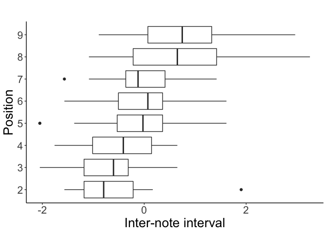<!-- -->

``` r
  ggplot(str_dat,aes(x=as.factor(position),y=pf))+
  geom_boxplot()+
  theme_classic()+
  labs(title="",x="Position", y = "Peak frequency") +
  theme(legend.position="none")+
  theme(text = element_text(size=20))+
    coord_flip()
```

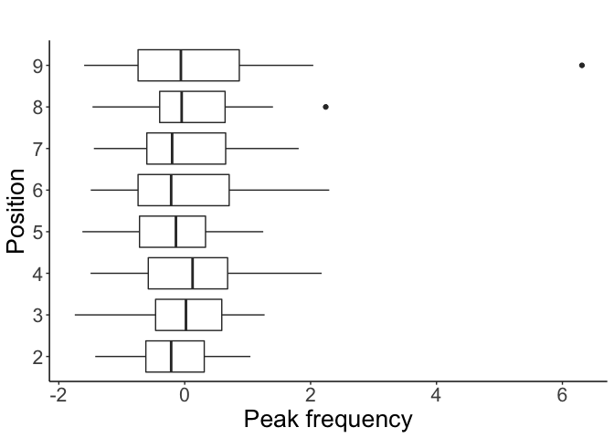<!-- -->

``` r
  ggplot(str_dat,aes(x=as.factor(position),y=etrp))+
  geom_boxplot()+
  theme_classic()+
  labs(title="",x="Position", y = "Entropy") +
  theme(legend.position="none")+
  theme(text = element_text(size=20))+
    coord_flip()
```

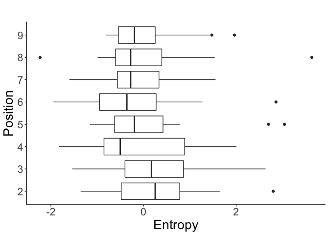<!-- -->

``` r
  ggplot(str_dat,aes(x=as.factor(position),y=hnr))+
  geom_boxplot()+
  theme_classic()+
  labs(title="",x="Position", y = "hnr") +
  theme(legend.position="none")+
  theme(text = element_text(size=20))+
    coord_flip()
```

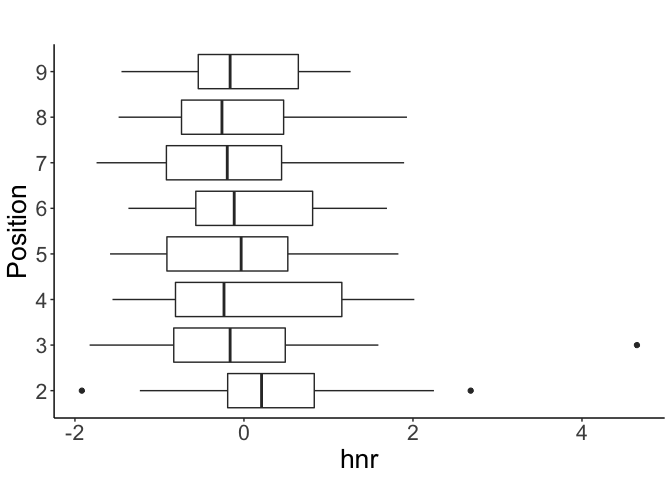<!-- --> 2.2
Predicting call length only in
\[D\]

``` r
#don't use cbind to combine data. Only returns matrix that can't hold both numeric and non-numeric values
ldat=cbind(sdat,dat$length)
colnames(ldat)[10]="length"

#use data.frame() instead
ldat=data.frame(sdat,dat$length,dat$site,dat$context,dat$Location,dat$calltype)
dim(sdat)
```

    ## [1] 4851    9

``` r
length(dat$length)
```

    ## [1] 4851

``` r
length(dat$site)
```

    ## [1] 4851

``` r
length(dat$context)
```

    ## [1] 4851

``` r
length(dat$Location)
```

    ## [1] 4851

``` r
length(dat$calltype)
```

    ## [1] 4851

``` r
levels(ldat$dat.length)
```

    ##  [1] "1"       "10"      "11"      "12"      "13"      "14"      "15"     
    ##  [8] "16"      "17"      "18"      "19"      "2"       "20"      "21"     
    ## [15] "22"      "23"      "24"      "25"      "29"      "3"       "30"     
    ## [22] "31"      "4"       "40"      "5"       "6"       "7"       "8"      
    ## [29] "9"       "overlap"

``` r
#changing non-numeric values into NAs
ldat$dat.length=as.numeric(as.character(ldat$dat.length))
```

    ## Warning: NAs introduced by coercion

``` r
#write.csv(dat,"4851_simplifiedcalltype")
#dat[,3]=as.numeric(as.character(dat[,3]))
library(na.tools)
ldat=na.rm(ldat)
dim(ldat)
```

    ## [1] 4371   14

``` r
#within ldat, choose only rows that call type is D.
#after this, the sample size should be 1051. (now it is 4371)

lddat=ldat[ldat$dat.calltype=="d",]
dim(lddat)#1051. correct.
```

    ## [1] 1051   14

``` r
hist(lddat$dat.length)#seems like poisson or nb
```

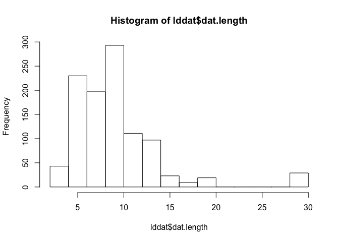<!-- -->

``` r
mean(lddat$dat.length)#9.52
```

    ## [1] 9.516651

``` r
var(lddat$dat.length)#22.56
```

    ## [1] 22.56806

``` r
#Maybe overdispersed. Negative binomial.

head(lddat)
```

    ##           dur        brk        dtm          pf       minf       maxf
    ## 50 -0.4900231 -0.1831486  0.1166459  1.03304384  1.7227355 1.85843239
    ## 51  0.1889118  1.7324485  1.7551598 -0.05551789  1.8740715 0.04875714
    ## 52  0.0380374  0.9662097 -1.6154974 -0.44210991 -0.2481523 1.55711182
    ## 53  0.8678468  1.0619895  1.6147157  1.44506954  1.8740715 1.85843239
    ## 54  0.4152235  0.1041910  1.7551598  1.60021502  0.5085279 2.15975295
    ## 55  0.0380374 -0.3747083 -0.8664625  1.04576068  3.3909512 1.10337911
    ##            bw       etrp         hnr dat.length dat.site dat.context
    ## 50  0.9030523  0.2514137 -0.05332751         12      AR1        easo
    ## 51 -0.7896249  0.6044231 -0.50517271         12      AR1        easo
    ## 52  1.5112845  2.1733534 -1.24304835         12      AR1        easo
    ## 53  0.8354709  0.3690835 -0.87411053         12      AR1        easo
    ## 54  1.7156002  1.5850046 -0.69171430         12      AR1        easo
    ## 55 -0.5192995 -0.6507212 -0.08649046         12      AR1        easo
    ##    dat.Location dat.calltype
    ## 50      UTFRREC            d
    ## 51      UTFRREC            d
    ## 52      UTFRREC            d
    ## 53      UTFRREC            d
    ## 54      UTFRREC            d
    ## 55      UTFRREC            d

``` r
# Location and context should be added in order to control the confounding effect
library(lmerTest)
lddat.fit1=lmer(dat.length~dur+brk+dtm+pf+minf+maxf+bw+etrp+hnr+dat.Location*dat.context+(1|dat.site/dat.context),data=ldat)#chose the wrong dataset. it's not ldat but lddat
lddat.fit1=lmer(dat.length~dur+brk+dtm+pf+minf+maxf+bw+etrp+hnr+dat.Location*dat.context+(1|dat.site/dat.context),data=lddat)#try this model.

lddat.fit2=lmer(dat.length~dur+brk+dtm+pf+minf+maxf+bw+etrp+hnr+dat.Location*dat.context+(1|dat.site/dat.context),data=lddat)#try this model.

#lddat.fit2=lmer(log(dat.length)~dur+brk+dtm+pf+minf+maxf+bw+etrp+hnr+dat.Location*dat.context+(1|dat.site/dat.context),data=lddat) # even though the log transformation, still outliers exist. not meaningful to use this model
shapiro.test(resid(lddat.fit1))#W>0.9
```

    ## 
    ##  Shapiro-Wilk normality test
    ## 
    ## data:  resid(lddat.fit1)
    ## W = 0.91215, p-value < 2.2e-16

``` r
summary(lddat.fit1)
```

    ## Linear mixed model fit by REML. t-tests use Satterthwaite's method [
    ## lmerModLmerTest]
    ## Formula: dat.length ~ dur + brk + dtm + pf + minf + maxf + bw + etrp +  
    ##     hnr + dat.Location * dat.context + (1 | dat.site/dat.context)
    ##    Data: lddat
    ## 
    ## REML criterion at convergence: 5739.2
    ## 
    ## Scaled residuals: 
    ##     Min      1Q  Median      3Q     Max 
    ## -3.8157 -0.4307 -0.0196  0.4153  3.5366 
    ## 
    ## Random effects:
    ##  Groups               Name        Variance Std.Dev.
    ##  dat.context:dat.site (Intercept)  1.723   1.313   
    ##  dat.site             (Intercept)  6.819   2.611   
    ##  Residual                         12.835   3.583   
    ## Number of obs: 1051, groups:  dat.context:dat.site, 43; dat.site, 23
    ## 
    ## Fixed effects:
    ##                                       Estimate Std. Error         df
    ## (Intercept)                          9.472e+00  1.067e+00  3.491e+01
    ## dur                                 -9.954e-02  1.561e-01  9.770e+02
    ## brk                                  1.043e-01  1.306e-01  1.021e+03
    ## dtm                                  1.104e-01  1.404e-01  1.026e+03
    ## pf                                  -3.006e-01  1.481e-01  1.028e+03
    ## minf                                -9.879e+00  8.103e+00  1.028e+03
    ## maxf                                 2.021e+01  1.627e+01  1.028e+03
    ## bw                                  -2.230e+01  1.815e+01  1.028e+03
    ## etrp                                -4.249e-01  1.804e-01  1.025e+03
    ## hnr                                 -3.265e-01  1.595e-01  1.019e+03
    ## dat.LocationUTFRREC                 -1.120e+00  1.461e+00  3.284e+01
    ## dat.contextfood                     -4.870e-01  9.295e-01  1.873e+01
    ## dat.contextmask                     -1.490e+00  1.420e+00  2.335e+01
    ## dat.LocationUTFRREC:dat.contextfood  9.262e-03  1.251e+00  1.629e+01
    ## dat.LocationUTFRREC:dat.contextmask  2.358e+00  1.779e+00  2.212e+01
    ##                                     t value Pr(>|t|)    
    ## (Intercept)                           8.875 1.79e-10 ***
    ## dur                                  -0.638   0.5239    
    ## brk                                   0.799   0.4247    
    ## dtm                                   0.786   0.4320    
    ## pf                                   -2.029   0.0427 *  
    ## minf                                 -1.219   0.2231    
    ## maxf                                  1.242   0.2146    
    ## bw                                   -1.229   0.2194    
    ## etrp                                 -2.355   0.0187 *  
    ## hnr                                  -2.047   0.0409 *  
    ## dat.LocationUTFRREC                  -0.767   0.4488    
    ## dat.contextfood                      -0.524   0.6065    
    ## dat.contextmask                      -1.049   0.3049    
    ## dat.LocationUTFRREC:dat.contextfood   0.007   0.9942    
    ## dat.LocationUTFRREC:dat.contextmask   1.325   0.1986    
    ## ---
    ## Signif. codes:  0 '***' 0.001 '**' 0.01 '*' 0.05 '.' 0.1 ' ' 1

    ## 
    ## Correlation matrix not shown by default, as p = 15 > 12.
    ## Use print(x, correlation=TRUE)  or
    ##     vcov(x)        if you need it

``` r
#summary(lddat.fit2)

red_lddat.fit1=lmer(dat.length ~ etrp + hnr + (1 | dat.site/dat.context),data=lddat)
summary(red_lddat.fit1)
```

    ## Linear mixed model fit by REML. t-tests use Satterthwaite's method [
    ## lmerModLmerTest]
    ## Formula: dat.length ~ etrp + hnr + (1 | dat.site/dat.context)
    ##    Data: lddat
    ## 
    ## REML criterion at convergence: 5755.2
    ## 
    ## Scaled residuals: 
    ##     Min      1Q  Median      3Q     Max 
    ## -3.7400 -0.4304  0.0008  0.4272  3.5719 
    ## 
    ## Random effects:
    ##  Groups               Name        Variance Std.Dev.
    ##  dat.context:dat.site (Intercept)  1.862   1.365   
    ##  dat.site             (Intercept)  6.301   2.510   
    ##  Residual                         12.827   3.581   
    ## Number of obs: 1051, groups:  dat.context:dat.site, 43; dat.site, 23
    ## 
    ## Fixed effects:
    ##              Estimate Std. Error        df t value Pr(>|t|)    
    ## (Intercept)    8.7358     0.5998   21.8910  14.566 9.61e-13 ***
    ## etrp          -0.3613     0.1376 1039.4360  -2.625  0.00878 ** 
    ## hnr           -0.2934     0.1480 1035.5904  -1.982  0.04777 *  
    ## ---
    ## Signif. codes:  0 '***' 0.001 '**' 0.01 '*' 0.05 '.' 0.1 ' ' 1
    ## 
    ## Correlation of Fixed Effects:
    ##      (Intr) etrp  
    ## etrp -0.036       
    ## hnr   0.032  0.289

``` r
ggplot(lddat,aes(x=etrp,y=dat.length))+
  geom_smooth(method="lm")+
 # geom_point()+
  theme_classic()+
  labs(title="",x="Entropy (Z score)", y = "Call length") +
 # ylim(0,30)+
#  xlim(-5,5)+
  theme(legend.position="none")+
  theme(text = element_text(size=20))
```

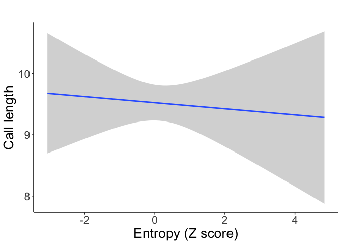<!-- -->

``` r
ggplot(lddat,aes(x=hnr,y=dat.length))+
  geom_smooth(method="lm")+
  theme_classic()+
  labs(title="",x="HNR (Z score)", y = "Call length") +
  theme(legend.position="none")+
  theme(text = element_text(size=20))
```

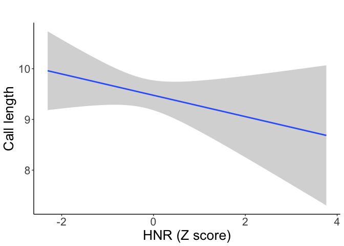<!-- -->
